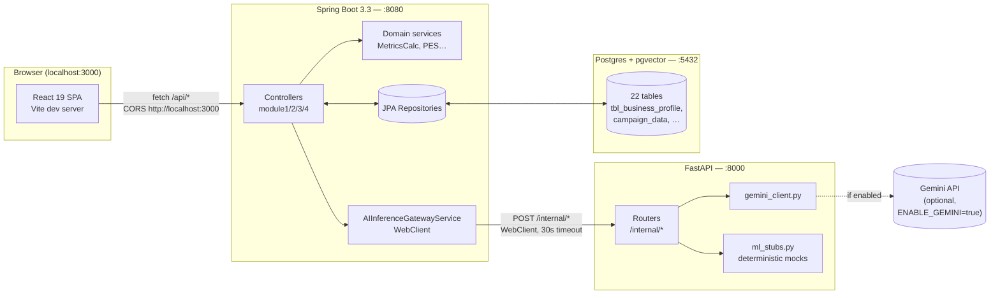
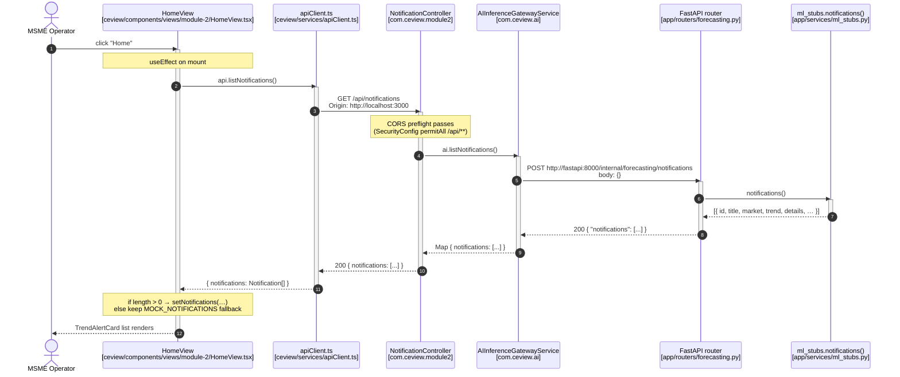
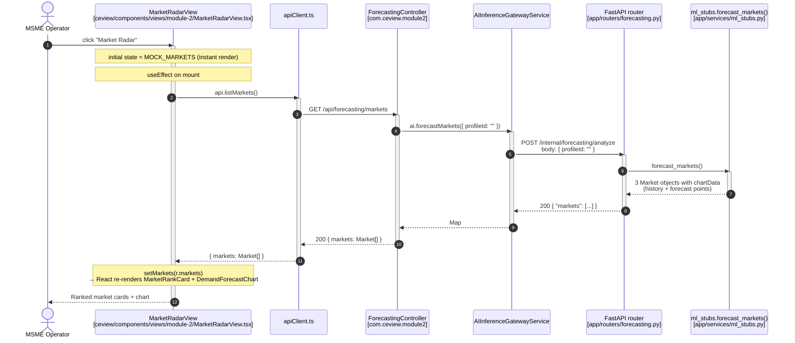
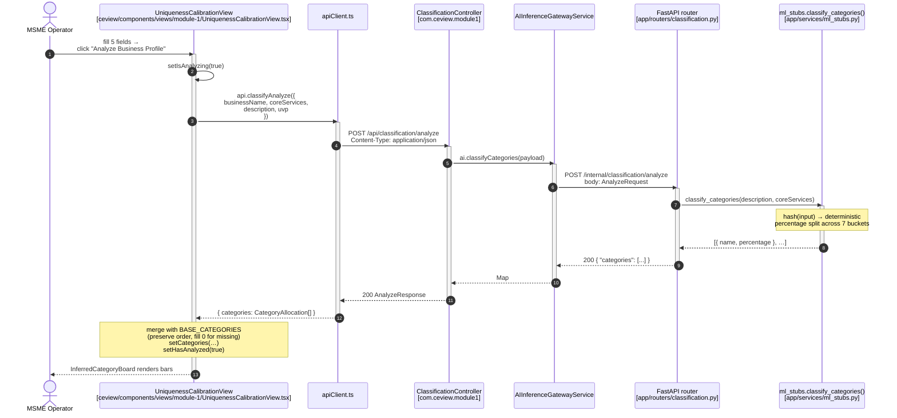
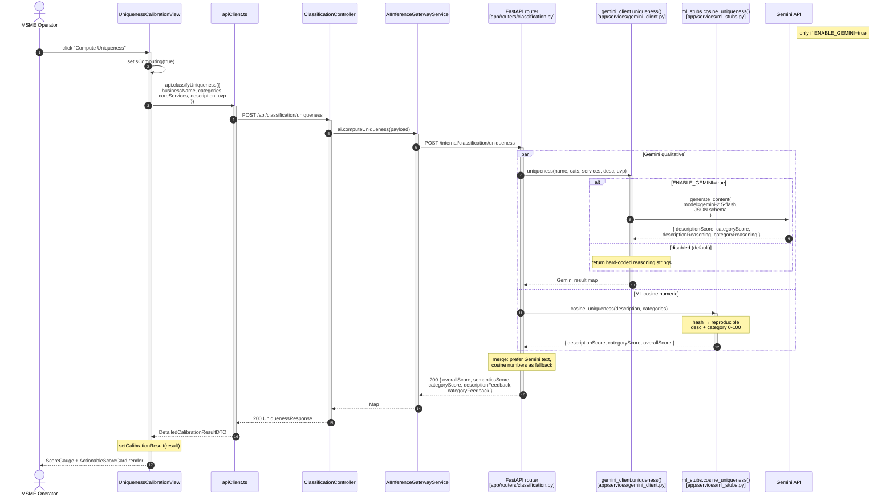
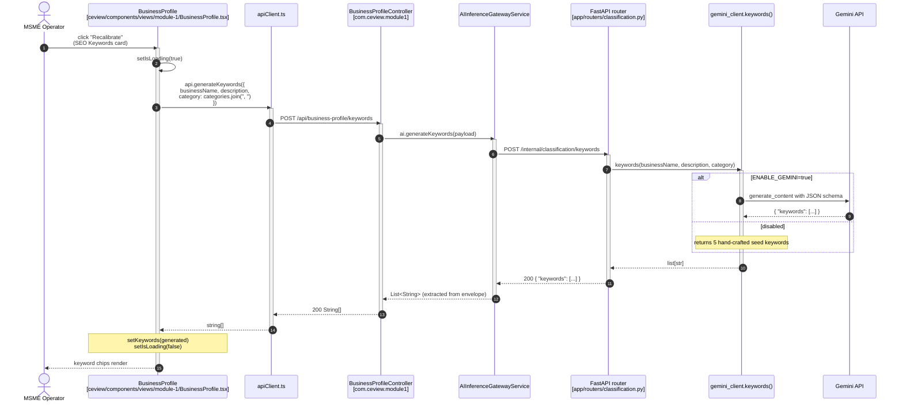
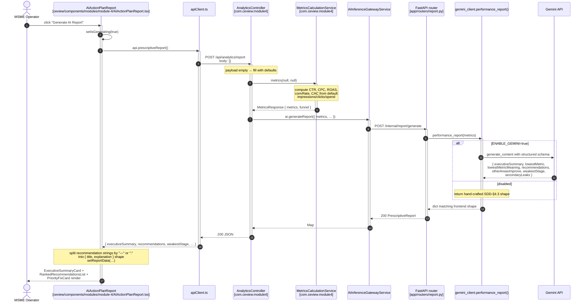
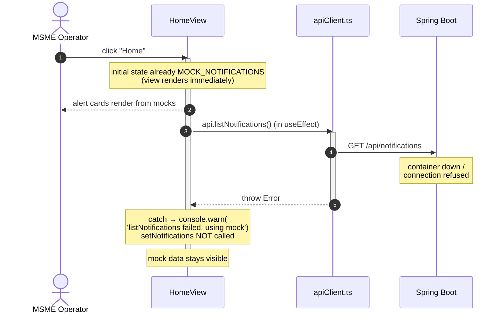
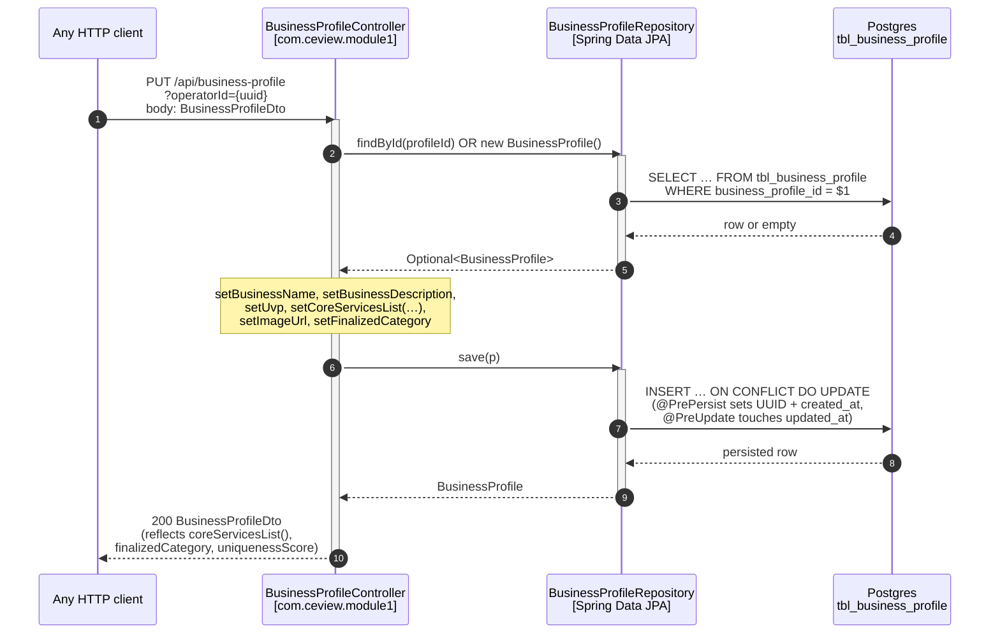

# CeView — Frontend ↔ Backend Sequence Diagrams

Status as of the current integration pass. Six React→Spring Boot→FastAPI flows are wired end-to-end; the remaining views still render local mock data. Every diagram below traces a real code path — file references in brackets.

---

## 1. System overview

---

## 2. Page load: Home → notifications

User clicks the **Home** sidebar tab. `HomeView` mounts and pulls the alert list.

---

## 3. Page load: Market Radar → forecast

User clicks **Market Radar**. The view hydrates three market cards (Korea/Japan/USA) plus a demand chart.

---

## 4. Uniqueness Score → "Analyze Business Profile" button

User fills the form and clicks **Analyze**. Categories get auto-allocated by the backend stub.

---

## 5. Uniqueness Score → "Compute Uniqueness" button

After analyzing, user clicks **Compute Uniqueness**. This is the only flow that combines a Gemini call with an ML stub.

---

## 6. Business Profile → "Recalibrate" keywords

---

## 7. Campaign Analytics → "Generate AI Report"

End-to-end with the heaviest payload. Spring computes metrics locally and only delegates the *narrative* to FastAPI.

---

## 8. Error path — backend unavailable

What happens when Docker is stopped or the request fails.

The same fallback applies to `MarketRadarView`. Form-driven flows (Uniqueness, Keywords, Report) do *not* have silent fallback — failures log to console and the UI stays in its loading-cleared state.

---

## 9. Persistence — Business Profile save (currently invokable only via direct API call)

The frontend's `BusinessProfile` view exposes a Save modal but doesn't yet PUT to the backend. The endpoint exists and persists end-to-end:

To wire this to the React Save button: add `api.saveProfile(...)` to `apiClient.ts` and call it from `BusinessProfile.handleSaveProfile()`.

---

## 10. What is NOT yet wired

These flows still render from frontend mocks. The endpoints exist and have been verified with curl — they're waiting for a follow-up wiring pass.

| Frontend view | Endpoint sitting unused |
|---|---|
| `ContentStudioView` (Module 3) | `POST /api/content/generate` |
| `CreativeDirectionBoard` | `POST /api/creative-direction/generate/{profileId}` |
| `SmartOptimizationBoard` | `POST /api/compliance/evaluate-json` |
| `EngagementMetricsBoard` (funnel cards) | `GET /api/analytics/metrics` |
| `PESComputationBoard` (gauge + breakdown) | `GET /api/analytics/pes/{campaignId}` |
| PDF download button | `GET /api/analytics/report/{id}/pdf` |
| Auth screen (doesn't exist yet) | `POST /api/auth/{register,login}` |

---

## Quick legend

- **Solid arrow** = synchronous HTTP call awaited
- **Dashed arrow** = response
- **Dotted line to Gemini** = optional, only when `ENABLE_GEMINI=true`
- **`par … and …`** block (diagram §5) = parallel composition inside the same FastAPI request handler
- File paths in `[brackets]` reference the actual source so you can jump to any participant
