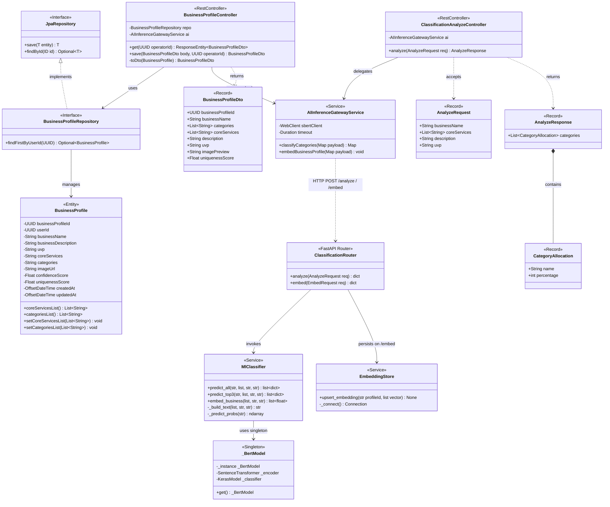
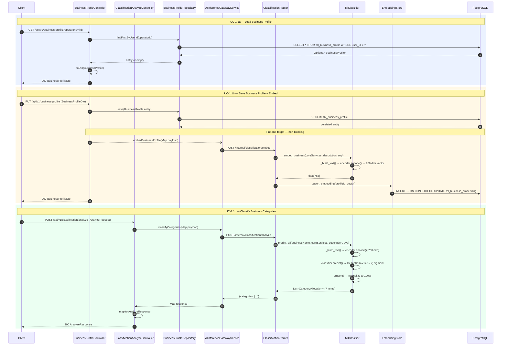
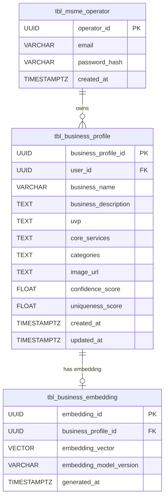
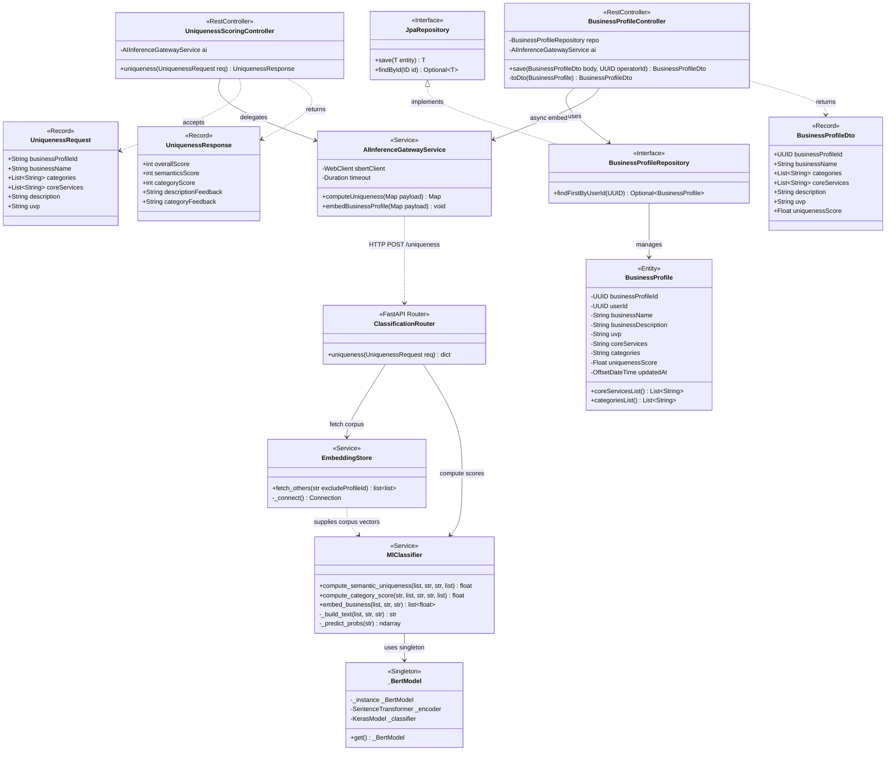
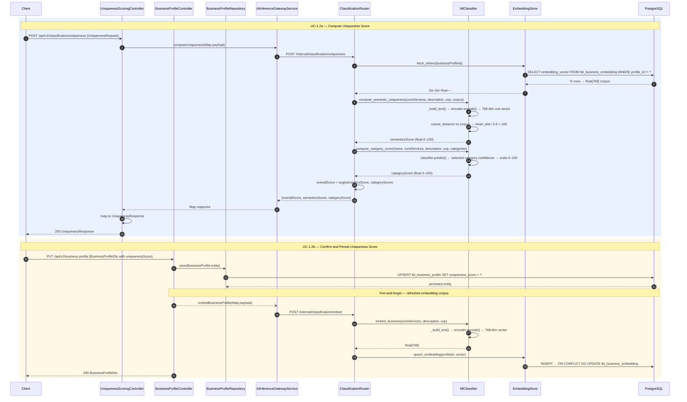

# Module 1 — Architecture Diagrams

> Scope: Backend only (Spring Boot + FastAPI-SBERT).
> Designed for OOP — covers database schema, business logic, and AI data models.

---

## 1.1 Business Input and Categorization

### Class Diagram

---

### Sequence Diagram

---

### Entity Relationship Diagram

---
---

## 1.2 Uniqueness Scoring Dashboard

### Class Diagram

---

### Sequence Diagram

---

### Entity Relationship Diagram

