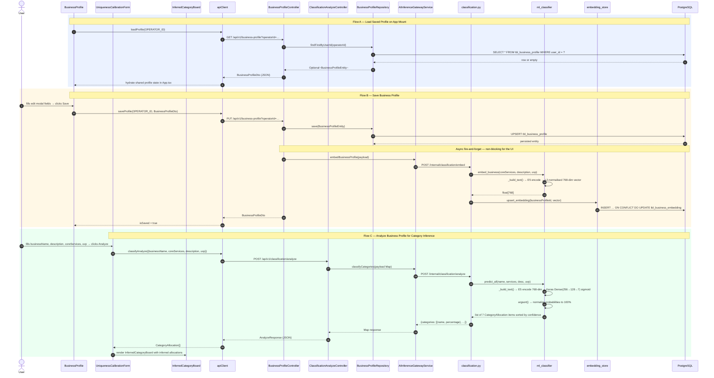
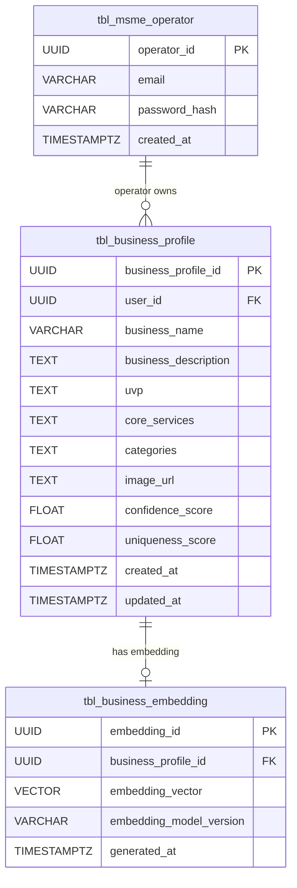
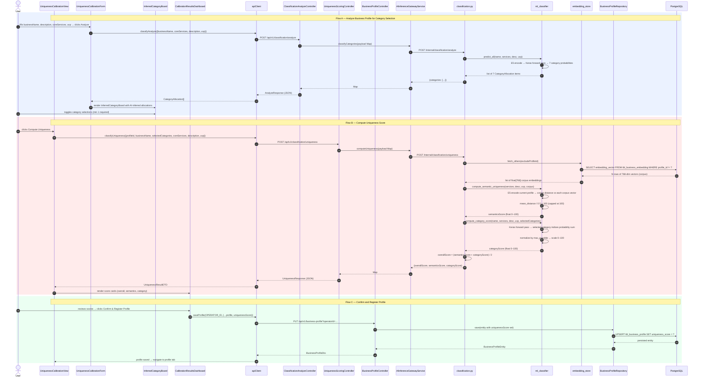
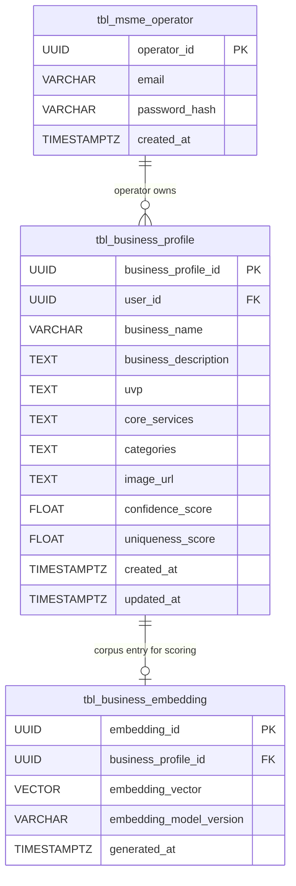

```mermaid
classDiagram
    direction TB

    %% ── Frontend (React / TypeScript) ──────────────────────────────────────────
    class BusinessProfile {
        <<React Component>>
        +ProfileData profile
        +ProfileSetters setters
        -bool isEditModalOpen
        -string tempBusinessName
        -string[] tempCategories
        -string[] tempCoreServices
        -string tempDescription
        -string tempUvp
        -string tempImagePreview
        +handleSave() void
        +openEditModal() void
        +handleImageUpload(file File) void
    }

    class UniquenessCalibrationForm {
        <<React Component>>
        +UniquenessPayloadDTO payload
        +CategoryAllocation[] categories
        +bool isAnalyzing
        +bool hasAnalyzed
        +string[] selectedCategories
        +onAnalyzeRequest() void
        +onPayloadChange(dto UniquenessPayloadDTO) void
        +onToggleCategory(name string) void
    }

    class InferredCategoryBoard {
        <<React Component>>
        +CategoryAllocation[] categories
        +string[] selectedCategories
        +number minSelected
        +onToggle(name string) void
    }

    class AdjustableCategoryItem {
        <<React Component>>
        +string name
        +number percentage
        +bool isSelected
        +onAdd() void
        +onRemove() void
    }

    class DynamicListManager {
        <<React Component>>
        +string[] items
        +string draft
        +onAdd(item string) void
        +onRemove(idx number) void
    }

    class TextField {
        <<React Component>>
        +string label
        +string value
        +string placeholder
        +onChange(val string) void
    }

    class TextAreaField {
        <<React Component>>
        +string label
        +string value
        +number minWords
        +onChange(val string) void
    }

    class ValidationBanner {
        <<React Component>>
        +string[] errors
    }

    class ActionTag {
        <<React Component>>
        +string label
        +bool isActive
        +onRemove() void
    }

    class apiClient {
        <<TypeScript Service>>
        +loadProfile(operatorId string) BusinessProfileDTO
        +saveProfile(operatorId string, dto BusinessProfileDTO) BusinessProfileDTO
        +classifyAnalyze(body object) CategoryAllocation[]
    }

    %% ── Spring Boot ──────────────────────────────────────────────────────────
    class BusinessProfileController {
        <<RestController>>
        -BusinessProfileRepository repo
        -AIInferenceGatewayService ai
        +get(operatorId UUID) BusinessProfileDto
        +save(body BusinessProfileDto, operatorId UUID) BusinessProfileDto
    }

    class ClassificationAnalyzeController {
        <<RestController>>
        -AIInferenceGatewayService ai
        +analyze(req AnalyzeRequest) AnalyzeResponse
    }

    class BusinessProfileEntity {
        <<Entity – tbl_business_profile>>
        UUID businessProfileId
        UUID userId
        String businessName
        String businessDescription
        String uvp
        String coreServices
        String categories
        String imageUrl
        Float confidenceScore
        Float uniquenessScore
        OffsetDateTime createdAt
        OffsetDateTime updatedAt
        +coreServicesList() List~String~
        +categoriesList() List~String~
        +setCoreServicesList(List~String~) void
        +setCategoriesList(List~String~) void
    }

    class BusinessProfileRepository {
        <<JpaRepository>>
        +findFirstByUserId(userId UUID) Optional~BusinessProfileEntity~
        +save(entity BusinessProfileEntity) BusinessProfileEntity
        +findById(id UUID) Optional~BusinessProfileEntity~
    }

    class BusinessProfileDto {
        <<Record>>
        UUID businessProfileId
        String businessName
        List~String~ categories
        List~String~ coreServices
        String description
        String uvp
        String imagePreview
        Float uniquenessScore
    }

    class AnalyzeRequest {
        <<Record>>
        String businessName
        List~String~ coreServices
        String description
        String uvp
    }

    class CategoryAllocation {
        <<Record>>
        String name
        int percentage
    }

    class AnalyzeResponse {
        <<Record>>
        List~CategoryAllocation~ categories
    }

    class AIInferenceGatewayService {
        <<Spring Service>>
        -WebClient sbertClient
        -Duration timeout
        +classifyCategories(payload Map) Map
        +embedBusinessProfile(payload Map) void
    }

    %% ── FastAPI – fastapi-sbert ──────────────────────────────────────────────
    class ClassificationRouter {
        <<FastAPI Router – classification.py>>
        +POST_analyze(req AnalyzeRequest) dict
        +POST_embed(req EmbedRequest) dict
    }

    class MlClassifier {
        <<ML Service – ml_classifier.py>>
        +predict_all(name str, services list, desc str, uvp str) list
        +predict_top3(name str, services list, desc str, uvp str) list
        +embed_business(services list, desc str, uvp str) list~float~
        -_build_text(services list, uvp str, desc str) str
        -_predict_probs(text str) ndarray
    }

    class BertModel {
        <<Singleton – BertModel.py>>
        -SentenceTransformer encoder
        -KerasModel classifier
        +get() BertModel
    }

    class EmbeddingStore {
        <<DB Service – embedding_store.py>>
        +upsert_embedding(profileId str, vector list) None
    }

    %% ── Relationships ────────────────────────────────────────────────────────
    BusinessProfile *-- UniquenessCalibrationForm : contains
    BusinessProfile --> DynamicListManager : uses
    BusinessProfile --> TextField : uses
    BusinessProfile --> TextAreaField : uses
    BusinessProfile --> ValidationBanner : uses
    BusinessProfile --> ActionTag : uses
    UniquenessCalibrationForm *-- InferredCategoryBoard : renders
    InferredCategoryBoard *-- AdjustableCategoryItem : renders per category

    BusinessProfile ..> apiClient : loadProfile · saveProfile
    UniquenessCalibrationForm ..> apiClient : classifyAnalyze

    BusinessProfileController --> BusinessProfileRepository : uses
    BusinessProfileController ..> AIInferenceGatewayService : async embedBusinessProfile
    ClassificationAnalyzeController --> AIInferenceGatewayService : classifyCategories
    BusinessProfileRepository --> BusinessProfileEntity : manages
    BusinessProfileController ..> BusinessProfileDto : returns
    ClassificationAnalyzeController ..> AnalyzeRequest : accepts
    ClassificationAnalyzeController ..> AnalyzeResponse : returns
    AnalyzeResponse *-- CategoryAllocation : contains

    AIInferenceGatewayService ..> ClassificationRouter : HTTP POST /analyze · /embed
    ClassificationRouter --> MlClassifier : invokes
    MlClassifier --> BertModel : uses singleton
    ClassificationRouter --> EmbeddingStore : upserts on /embed
```

```mermaid
classDiagram
    direction TB

    %% ── Frontend (React / TypeScript) ──────────────────────────────────────────
    class UniquenessCalibrationView {
        <<React Component>>
        +ProfileData profile
        +ProfileSetters setters
        -UniquenessPayloadDTO payload
        -bool isAnalyzing
        -bool hasAnalyzed
        -CategoryAllocation[] categories
        -string[] selectedCategories
        -bool isComputing
        -DetailedCalibrationResultDTO calibrationResult
        +handleAnalyzeRequest() void
        +handleComputeRequest() void
        +toggleCategory(name string) void
    }

    class UniquenessCalibrationForm {
        <<React Component – shared from 1.1>>
        +UniquenessPayloadDTO payload
        +CategoryAllocation[] categories
        +bool isAnalyzing
        +bool hasAnalyzed
        +string[] selectedCategories
        +onAnalyzeRequest() void
        +onPayloadChange(dto UniquenessPayloadDTO) void
        +onToggleCategory(name string) void
    }

    class InferredCategoryBoard {
        <<React Component – shared from 1.1>>
        +CategoryAllocation[] categories
        +string[] selectedCategories
        +onToggle(name string) void
    }

    class CalibrationResultsDashboard {
        <<React Component>>
        +DetailedCalibrationResultDTO result
        +bool isComputing
        +onConfirm() void
    }

    class DetailedCalibrationResultDTO {
        <<TypeScript Interface>>
        +number overallScore
        +number semanticsScore
        +number categoryScore
        +string descriptionFeedback
        +string categoryFeedback
    }

    class OverallScoreCard {
        <<React Component>>
        +number score
    }

    class ActionableScoreCard {
        <<React Component>>
        +string title
        +number score
        +string description
        +string color
    }

    class StatTypography {
        <<React Component>>
        +number value
    }

    class ComputeUniquenessButton {
        <<React Component>>
        +bool isLoading
        +bool disabled
        +onClick() void
    }

    class apiClient {
        <<TypeScript Service>>
        +classifyAnalyze(body object) CategoryAllocation[]
        +classifyUniqueness(body object) UniquenessResultDTO
        +saveProfile(operatorId string, dto BusinessProfileDTO) BusinessProfileDTO
    }

    %% ── Spring Boot ──────────────────────────────────────────────────────────
    class UniquenessScoringController {
        <<RestController>>
        -AIInferenceGatewayService ai
        +uniqueness(req UniquenessRequest) UniquenessResponse
    }

    class UniquenessRequest {
        <<Record>>
        String businessProfileId
        String businessName
        List~String~ categories
        List~String~ coreServices
        String description
        String uvp
    }

    class UniquenessResponse {
        <<Record>>
        int overallScore
        int semanticsScore
        int categoryScore
        String descriptionFeedback
        String categoryFeedback
    }

    class AIInferenceGatewayService {
        <<Spring Service>>
        -WebClient sbertClient
        -Duration timeout
        +computeUniqueness(payload Map) Map
    }

    class BusinessProfileController {
        <<RestController – shared from 1.1>>
        -BusinessProfileRepository repo
        -AIInferenceGatewayService ai
        +save(body BusinessProfileDto, operatorId UUID) BusinessProfileDto
    }

    class BusinessProfileRepository {
        <<JpaRepository – shared from 1.1>>
        +save(entity BusinessProfileEntity) BusinessProfileEntity
    }

    %% ── FastAPI – fastapi-sbert ──────────────────────────────────────────────
    class ClassificationRouter {
        <<FastAPI Router – classification.py>>
        +POST_uniqueness(req UniquenessRequest) dict
    }

    class MlClassifier {
        <<ML Service – ml_classifier.py>>
        +compute_semantic_uniqueness(services list, desc str, uvp str, corpus list) float
        +compute_category_score(name str, services list, desc str, uvp str, selected list) float
        -_build_text(services list, uvp str, desc str) str
        -_predict_probs(text str) ndarray
    }

    class BertModel {
        <<Singleton – BertModel.py>>
        -SentenceTransformer encoder
        -KerasModel classifier
        +get() BertModel
    }

    class EmbeddingStore {
        <<DB Service – embedding_store.py>>
        +fetch_others(excludeProfileId str) list~list~
    }

    %% ── Relationships ────────────────────────────────────────────────────────
    UniquenessCalibrationView *-- UniquenessCalibrationForm : renders
    UniquenessCalibrationView *-- CalibrationResultsDashboard : renders
    UniquenessCalibrationView --> ComputeUniquenessButton : uses
    UniquenessCalibrationForm *-- InferredCategoryBoard : renders
    CalibrationResultsDashboard *-- OverallScoreCard : renders
    CalibrationResultsDashboard *-- ActionableScoreCard : renders 2x
    CalibrationResultsDashboard ..> DetailedCalibrationResultDTO : receives
    OverallScoreCard --> StatTypography : uses
    ActionableScoreCard --> StatTypography : uses

    UniquenessCalibrationView ..> apiClient : classifyAnalyze · classifyUniqueness · saveProfile

    UniquenessScoringController --> AIInferenceGatewayService : computeUniqueness
    UniquenessScoringController ..> UniquenessRequest : accepts
    UniquenessScoringController ..> UniquenessResponse : returns
    BusinessProfileController --> BusinessProfileRepository : uses

    AIInferenceGatewayService ..> ClassificationRouter : HTTP POST /uniqueness
    ClassificationRouter --> EmbeddingStore : fetch_others
    ClassificationRouter --> MlClassifier : compute_semantic_uniqueness · compute_category_score
    MlClassifier --> BertModel : uses singleton
    EmbeddingStore ..> MlClassifier : provides corpus vectors
```

# Module 1 — Architecture Diagrams

---

## 1.1 Business Input and Categorization

### Class Diagram

---

### Sequence Diagram

---

### Entity Relationship Diagram

---
---

## 1.2 Uniqueness Scoring Dashboard

### Class Diagram

---

### Sequence Diagram

---

### Entity Relationship Diagram

