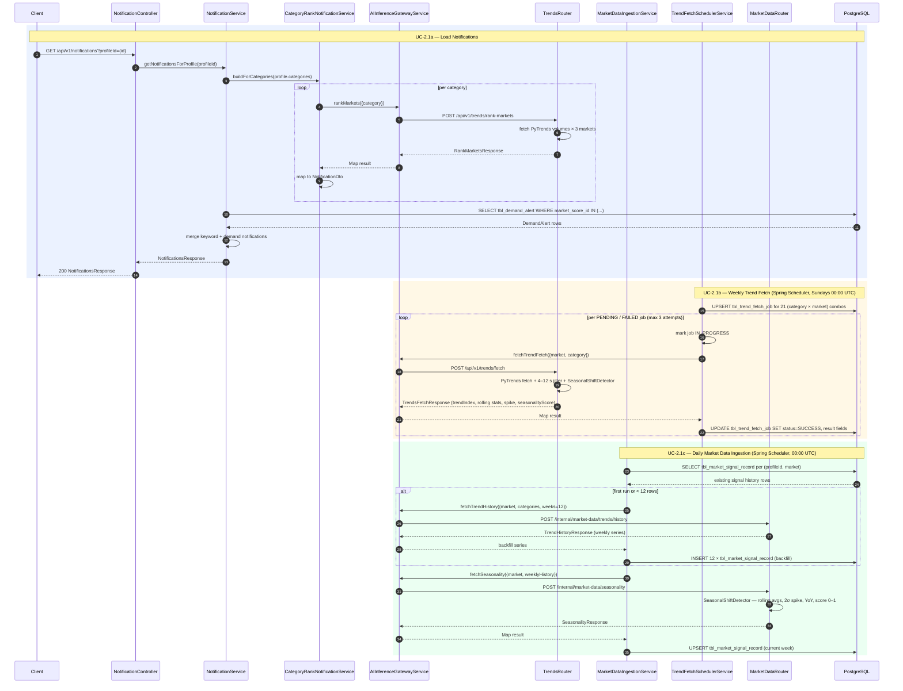
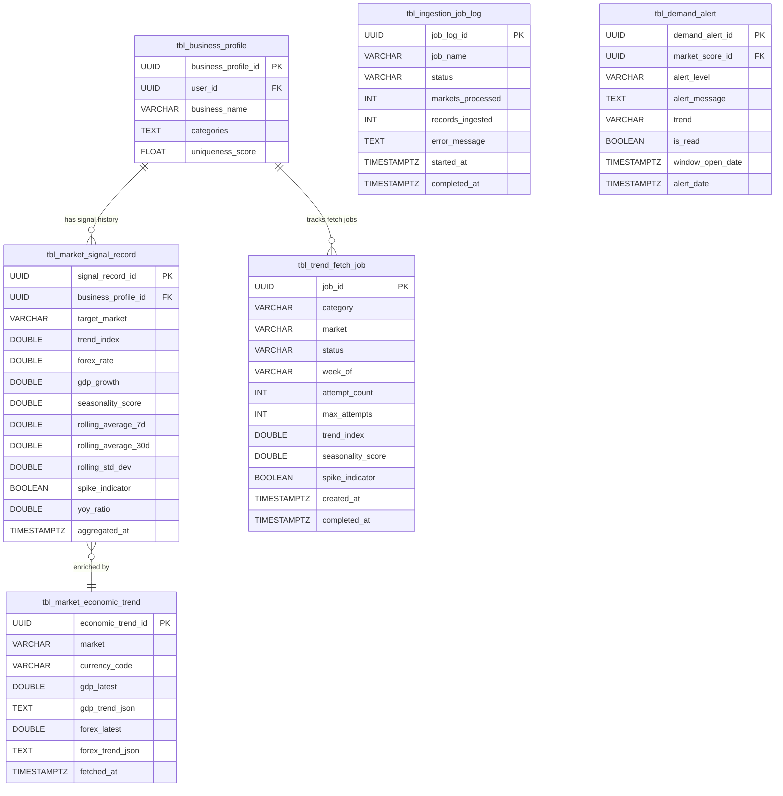
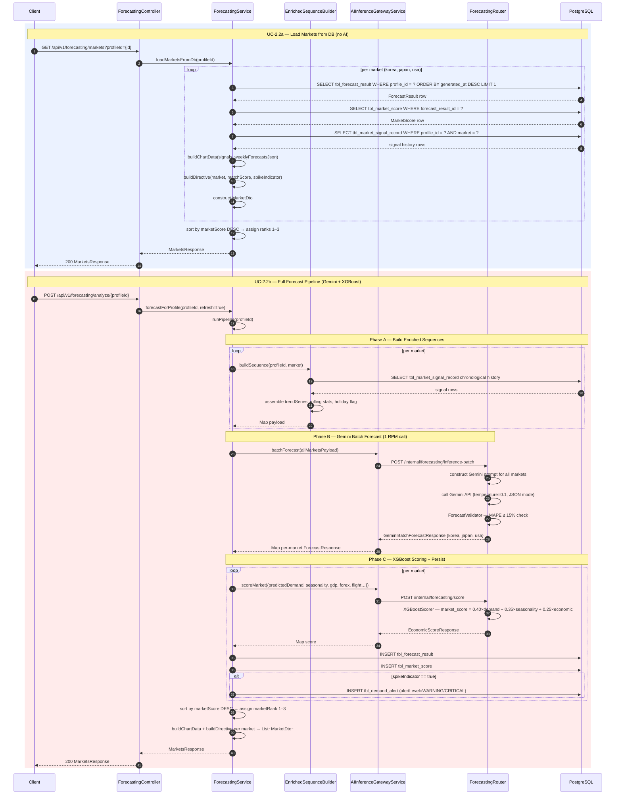
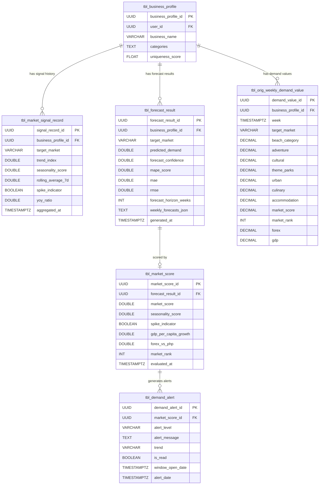

```mermaid
classDiagram
    direction TB

    %% ── DTOs ──────────────────────────────────────────────────────────────────

    class NotificationDto {
        <<Record>>
        +String id
        +String date
        +String title
        +String market
        +String marketId
        +String trend
        +boolean isRead
        +DetailsDto details
    }

    class NotificationsResponse {
        <<Record>>
        +List~NotificationDto~ notifications
    }

    class KeywordTrendDto {
        <<Record>>
        +String keyword
        +int volume
        +int growth
        +String market
    }

    %% ── Entities ──────────────────────────────────────────────────────────────

    class MarketSignalRecord {
        <<Entity>>
        -UUID signalRecordId
        -UUID businessProfileId
        -String targetMarket
        -Double trendIndex
        -Double forexRate
        -Double gdpGrowth
        -Double seasonalityScore
        -Double rollingAverage7d
        -Double rollingAverage30d
        -Double rollingStdDev
        -Boolean spikeIndicator
        -Double yoyRatio
        -OffsetDateTime aggregatedAt
    }

    class TrendFetchJob {
        <<Entity>>
        -UUID jobId
        -String category
        -String market
        -String status
        -String weekOf
        -int attemptCount
        -int maxAttempts
        -Double trendIndex
        -Double seasonalityScore
        -Boolean spikeIndicator
        -OffsetDateTime createdAt
    }

    class IngestionJobLog {
        <<Entity>>
        -UUID jobLogId
        -String jobName
        -String status
        -Integer marketsProcessed
        -Integer recordsIngested
        -String errorMessage
        -OffsetDateTime startedAt
        -OffsetDateTime completedAt
    }

    class DemandAlert {
        <<Entity>>
        -UUID demandAlertId
        -UUID marketScoreId
        -String alertLevel
        -String alertMessage
        -String trend
        -Boolean isRead
        -OffsetDateTime windowOpenDate
        -OffsetDateTime alertDate
    }

    %% ── Repositories ──────────────────────────────────────────────────────────

    class JpaRepository {
        <<Interface>>
        +save(T entity) T
        +findById(ID id) Optional~T~
    }

    class MarketSignalRecordRepository {
        <<Interface>>
        +findByBusinessProfileIdAndTargetMarket(UUID, String) List~MarketSignalRecord~
    }

    class TrendFetchJobRepository {
        <<Interface>>
        +findByStatusInAndAttemptCountLessThan(List, int) List~TrendFetchJob~
    }

    class IngestionJobLogRepository {
        <<Interface>>
        +save(IngestionJobLog) IngestionJobLog
    }

    class DemandAlertRepository {
        <<Interface>>
        +findByMarketScoreId(UUID) List~DemandAlert~
    }

    %% ── Controllers ───────────────────────────────────────────────────────────

    class NotificationController {
        <<RestController>>
        -NotificationService notificationService
        +list(UUID profileId) NotificationsResponse
    }

    %% ── Spring Services ───────────────────────────────────────────────────────

    class NotificationService {
        <<Service>>
        -CategoryRankNotificationService categoryRankService
        -DemandAlertRepository alertRepo
        +getNotificationsForProfile(UUID profileId) NotificationsResponse
    }

    class CategoryRankNotificationService {
        <<Service>>
        -AIInferenceGatewayService ai
        +buildForCategories(List~String~ categories) List~NotificationDto~
    }

    class MarketDataIngestionJob {
        <<Component>>
        -MarketDataIngestionService ingestionService
        -IngestionJobLogRepository logRepo
        +runDailyIngestion() void
    }

    class MarketDataIngestionService {
        <<Service>>
        -MarketSignalRecordRepository signalRepo
        -ExternalMarketDataClient extClient
        -AIInferenceGatewayService ai
        +ingestForProfile(BusinessProfile profile) int
        -ingestMarket(BusinessProfile, String market) void
    }

    class TrendFetchSchedulerService {
        <<Service>>
        -TrendFetchJobRepository jobRepo
        -AIInferenceGatewayService ai
        +runWeeklyTrendFetch() void
    }

    class ExternalMarketDataClient {
        <<Service>>
        +fetchGdpGrowth(String marketId) GdpDataDto
        +fetchForexRate(String marketId) ForexDataDto
        +fetchGdpTrend(String marketId) GdpTrendDto
        +fetchForexTrend(String marketId) ForexTrendDto
        +getFlightReference(String marketId) FlightReferenceDto
    }

    class AIInferenceGatewayService {
        <<Service>>
        -WebClient transformerClient
        -Duration timeout
        +fetchTrends(Map payload) Map
        +fetchSeasonality(Map payload) Map
        +fetchTrendFetch(Map payload) Map
        +rankMarkets(Map payload) Map
    }

    %% ── FastAPI: Routers ──────────────────────────────────────────────────────

    class MarketDataRouter {
        <<FastAPI Router – market_data.py>>
        +POST_trends(req TrendsRequest) TrendsResponse
        +POST_trends_history(req TrendHistoryRequest) TrendHistoryResponse
        +POST_seasonality(req SeasonalityRequest) SeasonalityResponse
    }

    class TrendsRouter {
        <<FastAPI Router – trends_router.py>>
        +POST_fetch(req TrendsFetchRequest) TrendsFetchResponse
        +POST_rank_markets(req RankMarketsRequest) RankMarketsResponse
    }

    %% ── Relationships ─────────────────────────────────────────────────────────

    JpaRepository <|.. MarketSignalRecordRepository : implements
    JpaRepository <|.. TrendFetchJobRepository : implements
    JpaRepository <|.. IngestionJobLogRepository : implements
    JpaRepository <|.. DemandAlertRepository : implements

    NotificationController --> NotificationService : delegates
    NotificationController ..> NotificationsResponse : returns

    NotificationService --> CategoryRankNotificationService : calls
    NotificationService --> DemandAlertRepository : queries
    NotificationService ..> NotificationDto : assembles

    CategoryRankNotificationService --> AIInferenceGatewayService : rankMarkets
    NotificationsResponse *-- NotificationDto : contains
    NotificationDto *-- KeywordTrendDto : nested in details

    MarketDataIngestionJob --> MarketDataIngestionService : calls
    MarketDataIngestionJob --> IngestionJobLogRepository : persists log

    MarketDataIngestionService --> MarketSignalRecordRepository : persists
    MarketDataIngestionService --> ExternalMarketDataClient : fetches GDP/Forex
    MarketDataIngestionService --> AIInferenceGatewayService : fetchSeasonality
    MarketSignalRecordRepository --> MarketSignalRecord : manages

    TrendFetchSchedulerService --> TrendFetchJobRepository : reads/updates
    TrendFetchSchedulerService --> AIInferenceGatewayService : fetchTrendFetch
    TrendFetchJobRepository --> TrendFetchJob : manages

    AIInferenceGatewayService ..> MarketDataRouter : HTTP POST /seasonality
    AIInferenceGatewayService ..> TrendsRouter : HTTP POST /fetch · /rank-markets
```

```mermaid
classDiagram
    direction TB

    %% ── DTOs ──────────────────────────────────────────────────────────────────

    class MarketDto {
        <<Record>>
        +String id
        +int rank
        +String name
        +String city
        +int matchScore
        +String directive
        +boolean directFlight
        +int distanceKm
        +List~ChartDataPointDto~ chartData
        +List~GdpTrendPointDto~ gdpTrend
        +List~ForexTrendPointDto~ forexTrend
        +List~AirlineDto~ airlines
    }

    class MarketsResponse {
        <<Record>>
        +List~MarketDto~ markets
    }

    class GeminiForecastRequest {
        <<Pydantic Model>>
        +String profileId
        +String market
        +List~float~ trendSeries
        +float rolling7dAvg
        +float rolling30dAvg
        +float rollingStd7d
        +boolean spikeIndicator
        +float seasonalityScore
        +float forexRate
        +float gdpGrowth
        +boolean holidayFlag
    }

    class EconomicScoreRequest {
        <<Pydantic Model>>
        +String market
        +float predicted_demand
        +float seasonality_score
        +boolean spike_indicator
        +float gdp_growth
        +float forex_vs_php
        +boolean direct_flight
        +int distance_km
        +int flight_frequency
    }

    %% ── Entities ──────────────────────────────────────────────────────────────

    class ForecastResult {
        <<Entity>>
        -UUID forecastResultId
        -UUID businessProfileId
        -String targetMarket
        -Double predictedDemand
        -Double forecastConfidence
        -Double mapeScore
        -Double mae
        -Double rmse
        -Integer forecastHorizonWeeks
        -String weeklyForecastsJson
        -OffsetDateTime generatedAt
    }

    class MarketScore {
        <<Entity>>
        -UUID marketScoreId
        -UUID forecastResultId
        -Double marketScore
        -Double seasonalityScore
        -Boolean spikeIndicator
        -Double gdpPerCapitaGrowth
        -Double forexVsPhp
        -Integer marketRank
        -OffsetDateTime evaluatedAt
    }

    %% ── Repositories ──────────────────────────────────────────────────────────

    class JpaRepository {
        <<Interface>>
        +save(T entity) T
        +findById(ID id) Optional~T~
    }

    class ForecastResultRepository {
        <<Interface>>
        +findTopByBusinessProfileIdAndTargetMarketOrderByGeneratedAtDesc(UUID, String) Optional~ForecastResult~
    }

    class MarketScoreRepository {
        <<Interface>>
        +findTopByForecastResultIdOrderByEvaluatedAtDesc(UUID) Optional~MarketScore~
    }

    %% ── Controllers ───────────────────────────────────────────────────────────

    class ForecastingController {
        <<RestController>>
        -ForecastingService forecastingService
        +markets(UUID profileId) ResponseEntity~MarketsResponse~
        +analyze(UUID profileId) ResponseEntity~MarketsResponse~
    }

    %% ── Spring Services ───────────────────────────────────────────────────────

    class ForecastingService {
        <<Service>>
        -EnrichedSequenceBuilder seqBuilder
        -AIInferenceGatewayService ai
        -ForecastResultRepository forecastRepo
        -MarketScoreRepository scoreRepo
        +forecastForProfile(UUID profileId, boolean refresh) MarketsResponse
        +loadMarketsFromDb(UUID profileId) MarketsResponse
        #runPipeline(UUID profileId) MarketsResponse
        -buildChartData(List~MarketSignalRecord~, List~float~) List~ChartDataPointDto~
        -buildDirective(String market, int matchScore, boolean spike) String
    }

    class EnrichedSequenceBuilder {
        <<Service>>
        -MarketSignalRecordRepository signalRepo
        +buildSequence(UUID profileId, String market) Map
    }

    class AIInferenceGatewayService {
        <<Service>>
        -WebClient transformerClient
        -Duration timeout
        -Duration rankMarketsTimeout
        +batchForecast(Map payload) Map
        +scoreMarket(Map payload) Map
    }

    %% ── FastAPI: Router ───────────────────────────────────────────────────────

    class ForecastingRouter {
        <<FastAPI Router – forecasting.py>>
        +POST_inference(req GeminiForecastRequest) ForecastResponse
        +POST_inference_batch(req GeminiBatchForecastRequest) GeminiBatchForecastResponse
        +POST_score(req EconomicScoreRequest) EconomicScoreResponse
    }

    %% ── FastAPI: Services ─────────────────────────────────────────────────────

    class GeminiForecaster {
        <<Service – gemini_forecaster.py>>
        +forecast(market, trend_series, ...) dict
        +forecast_batch(markets_data list) dict
    }

    class XGBoostScorer {
        <<Service – xgboost_scorer.py>>
        -XGBModel model
        +score(payload dict) dict
    }

    class ForecastValidator {
        <<Service – forecast_validator.py>>
        +validate(result dict) dict
    }

    %% ── Relationships ─────────────────────────────────────────────────────────

    JpaRepository <|.. ForecastResultRepository : implements
    JpaRepository <|.. MarketScoreRepository : implements

    ForecastingController --> ForecastingService : delegates
    ForecastingController ..> MarketsResponse : returns

    ForecastingService --> EnrichedSequenceBuilder : builds sequence
    ForecastingService --> AIInferenceGatewayService : batch forecast + score
    ForecastingService --> ForecastResultRepository : persists/reads
    ForecastingService --> MarketScoreRepository : persists/reads
    ForecastingService ..> MarketDto : constructs
    ForecastingService ..> MarketsResponse : returns

    ForecastResultRepository --> ForecastResult : manages
    MarketScoreRepository --> MarketScore : manages
    MarketScore ..> ForecastResult : FK forecastResultId

    MarketsResponse *-- MarketDto : contains

    AIInferenceGatewayService ..> ForecastingRouter : HTTP POST /inference-batch · /score

    ForecastingRouter --> GeminiForecaster : forecast_batch
    ForecastingRouter --> XGBoostScorer : score
    ForecastingRouter --> ForecastValidator : validate
```

# Module 2 — Architecture Diagrams

> Scope: Backend only (Spring Boot + FastAPI-Transformer).
> Designed for OOP — covers database schema, business logic, and AI data models.

---

## 2.1 Market Data Aggregation Service

### Class Diagram

---

### Sequence Diagram

---

### Entity Relationship Diagram

---
---

## 2.2 Market Radar & Demand Forecasting

### Class Diagram

---

### Sequence Diagram

---

### Entity Relationship Diagram

