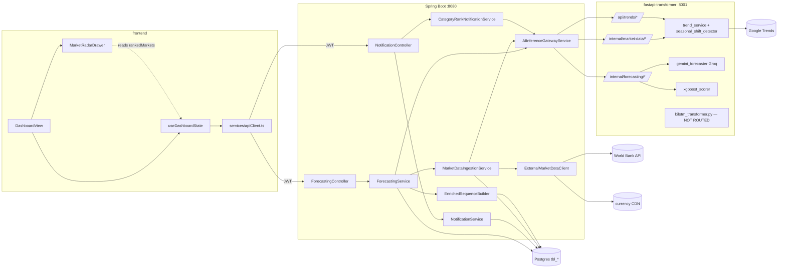

# Module 2 — E2E Status Audit & UI Data-Source Mapping

> **Scope:** Module 2 (Market Radar & Notifications) across `frontend/`, `backend/spring-boot/`,
> `backend/fastapi-transformer/`, the Flyway schema/seed, tests, and docs.
> **Branch audited:** `feat/module-2-e2e` (clean, HEAD `a74b9c41`). **Audit date:** 2026-09-10.
> **Method:** every claim below was traced through source code, not inferred from file names. File
> references are repo-root paths with line numbers (`path:line`). Where the code cannot answer a
> question, the item is marked ❓ and says why.
>
> The frozen `ceview/` build is out of scope (it is not developed further — see `.claude/CLAUDE.md`).

## Status legend

| Mark | Meaning |
|---|---|
| ✅ | Complete — implemented **and** connected end to end in code |
| 🟡 | Partially complete — connected, but wrong/incomplete in a way documented here |
| 🔴 | Not implemented / not connected |
| ⚠️ | Mock or hardcoded (live code path, but the value is a constant or template, not data) |
| 🔵 | Ready for (or directly affected by) BiLSTM + Transformer integration |
| ❓ | Cannot be verified from the codebase |

---

## Table of contents

1. [Executive summary](#1-executive-summary)
2. [What Module 2 is for](#2-what-module-2-is-for)
3. [The actual workflow (as implemented)](#3-the-actual-workflow-as-implemented)
4. [Feature status audit](#4-feature-status-audit)
5. [API / endpoint audit](#5-api--endpoint-audit)
6. [Database audit](#6-database-audit)
7. [Complete UI text inventory (static strings)](#7-complete-ui-text-inventory-static-strings)
8. [UI output → data-source mapping table (dynamic values)](#8-ui-output--data-source-mapping-table-dynamic-values)
9. [Surge Alerts — detailed audit](#9-surge-alerts--detailed-audit)
10. [Charts and visualizations audit](#10-charts-and-visualizations-audit)
11. [Mock, placeholder, and hardcoded data inventory](#11-mock-placeholder-and-hardcoded-data-inventory)
12. [Schema / type mismatches between layers](#12-schema--type-mismatches-between-layers)
13. [BiLSTM + Transformer integration readiness](#13-bilstm--transformer-integration-readiness)
14. [Missing E2E Connections](#14-missing-e2e-connections)
15. [Final expected E2E architecture](#15-final-expected-e2e-architecture)
16. [Source-of-truth UI output registry](#16-source-of-truth-ui-output-registry)
17. [Final Module 2 completion checklist](#17-final-module-2-completion-checklist)
18. [Verification notes & open questions](#18-verification-notes--open-questions)

---

## 1. Executive summary

**The plumbing is real; several of the values flowing through it are not.** Frontend → Spring →
Postgres → FastAPI is genuinely wired for every Module 2 screen (no frontend fixture is used unless
`VITE_USE_FIXTURES=true`). But the audit found these load-bearing problems:

1. **The BiLSTM + Transformer model is not integrated anywhere.** The live demand forecaster is a
   **Groq-hosted LLM prompt** (`backend/fastapi-transformer/app/services/gemini_forecaster.py`, default
   model `openai/gpt-oss-120b`, line 35) — not Gemini (despite the filename) and not a trained
   network. `app/services/bilstm_transformer.py` exists but **no router imports it**, its "forward
   pass" is a linear-projection approximation that falls back to `np.random` weights (lines 89–103),
   and **no trained weights, scaler, or model artifact exists in the repo** (`models/` contains only
   `.gitkeep`; the only model file in the repo is Module 1's `fastapi-sbert/models/complete_classifier_head.keras`).
2. **Forecast "accuracy" metrics are synthetic.** MAPE/MAE/RMSE/confidence are formulas of the
   forecast's own deviation (`gemini_forecaster.py:291–301`), with MAPE capped at 14.9 — so the
   15% validation gate (`forecast_validator.py`) can never fail. `ARCHITECTURE_SPEC.md` §4.6 admits this.
3. **Every surge-alert message states the same number.** `ForecastingService.persistDemandAlert`
   writes `"predicted demand 20.0% above baseline"` for every alert — the `20.0` is
   `(DEMAND_WINDOW_MULTIPLIER − 1) × 100`, a constant, not the measured uplift
   (`ForecastingService.java:748–750`).
4. **Alert title and trend chip ignore persisted data.** Title is always `"Demand Surge Detected — {market}"`
   and the trend chip is derived from `alert_level`, ignoring the persisted `tbl_demand_alert.trend`
   column (`NotificationService.java:141–143`). The pipeline only ever writes `alert_level = 'WARNING'`;
   `CRITICAL` exists only in seed data.
5. **Alerts for all but one category are silently dropped.** The pipeline writes one forecast/score/alert
   per *(category, market)*, but `NotificationService` reads only the **single newest** 4-week forecast
   per market (`NotificationService.java:60–63`), so alerts attached to other categories' score rows
   never reach the UI.
6. **Forex unit inversion.** Live ingestion stores *foreign units per 1 PHP* (e.g. ~23.8 KRW)
   (`ExternalMarketDataClient.java:140–154`) but the API labels it `"PHP per 1 KRW"`
   (`ForecastingService.java:839`); the V18 seed stores the *opposite* unit (0.0416 PHP per KRW). The
   XGBoost/linear scorer normalises forex as PHP-per-unit (`xgboost_scorer.py:139–155`), so live USD
   (~0.0175) scores as near-zero purchasing power.
7. **Daily and weekly samples are mixed.** First ingestion backfills 12 *weekly* PyTrends points; the
   *daily* cron (`MarketDataIngestionJob`, `0 0 0 * * *`) and every Refresh then append one more row,
   and the seasonal-shift math treats every row as one *week*. Rolling 7/30 "week" windows and the
   52-"week" YoY therefore run over mixed cadences.
8. **The 21-job weekly trend scheduler does not feed the dashboard.** `TrendFetchSchedulerService`
   writes only `tbl_trend_fetch_job` result columns — it never writes `tbl_market_signal_record`, which
   is what forecasting reads.
9. **Keyword-trend alerts are ephemeral.** They get a fresh `UUID.randomUUID()` on every load, are
   never persisted, `isRead` is always `false`, and `alertMessage` is `null`
   (`CategoryRankNotificationService.java:156–168`) — so read state can never stick.
10. **The FastAPI service cannot start without `GROQ_API_KEY`.** `gemini_forecaster.py` raises at
    import time (lines 49–53); `main.py` imports it via the forecasting router, so the whole service
    (including PyTrends ingestion and `/healthz`) is down, and the dashboard shows `ai-down`.
11. **The UI renders many values that are static templates** (directive, economy insight, seasonality
    insight, flight data, price range, accessibility score, peak months) — see §11.
12. **E2E tests do not exist yet.** `e2e/tests/dashboard.spec.ts` and `market-radar-drawer.spec.ts` are
    entirely `test.describe.skip` + `test.fixme()`. The live contract test
    (`frontend/tests/contract/module2.contract.test.ts`) checks shapes only.
13. **There is no Module 2 "agent".** No LangGraph/LLM agent generates any Module 2 text. All
    narrative strings are Java `String.format` templates. (The LangGraph agents in `fastapi-sbert`
    belong to Modules 3/4.)
14. **Docs claim work that isn't in code.** `docs/module-2/backend/category-scoped-ranking.md`
    says M2-B2 "embeds `categoryMarketRanks` on the keyword-trend `NotificationDto`" — that field does
    not exist in any Java or TS file. `ARCHITECTURE_SPEC.md` §2.2 says page load calls
    `POST /api/forecasting/ensure/{profileId}` — the frontend never calls `ensure`.

**Bottom line for model integration:** Spring already speaks a stable forecast contract
(`predicted_demand_4w`, `predicted_demand_12w`, `weekly_forecasts[12]`, `mape`, `mae`, `rmse`,
`confidence`). The cleanest path is to make the BiLSTM + Transformer serve **that same contract** behind
`POST /internal/forecasting/inference-batch`. But the model's input side is **not** ready: Spring no
longer sends per-week feature vectors (only a trend-value list plus scalar latest stats), and the
input-data problems in items 6–8 would feed the model mis-scaled, mixed-cadence features. Fix those
first (§13, §14).

---

## 2. What Module 2 is for

### 2.1 Purpose and problem

Cebu tourism MSMEs (dive shops, cafés, tour operators) cannot see *when* a specific foreign market is
about to start searching for Cebu, so their promotions land late. Module 2 watches three source
markets — **South Korea, Japan, United States** (hardcoded, `ForecastingService.java:62`) — per
business category, forecasts inbound interest, ranks the markets for the operator's category, and
raises **surge alerts**. It is the hand-off point into Module 3: "Target this market" carries the
chosen alert + market into Content Studio.

### 2.2 User-facing / business workflow

1. Operator signs in; `/dashboard` is the landing screen (`App.tsx:201–203`).
2. They see a greeting, their Module 1 uniqueness score, three summary tiles (unread, confirmed
   surges, top market now), and a **Surge Alerts** feed filtered to *their own* categories.
3. They click an alert → it is marked read, and the right column ranks all three markets **for that
   alert's category** ("Top Target Markets").
4. They click a market → the **Market Radar drawer** opens (`?market=<id>`): surge status, a strategic
   directive, a 12-week history + 4/12-week forecast chart, purchasing-power and seasonality tabs, and
   the route/carrier list.
5. **Target this market** → closes the drawer, stores `{alert, market}`, navigates to `/content`
   (Module 3).
6. **Refresh forecast** → re-runs ingestion + forecasting for their profile and reloads the alerts.

### 2.3 Technical workflow (actual)

| Stage | What really happens | Where |
|---|---|---|
| Inputs | Business profile categories (Module 1); Google Trends via PyTrends; World Bank GDP growth; fawazahmed0 currency CDN forex; static flight reference data | `MarketDataIngestionService`, `ExternalMarketDataClient`, `trend_service.py` |
| Signal processing | Rolling 7/30-period means, population σ, 2σ spike, YoY ratio, seasonality score 0–1 | `seasonal_shift_detector.py` (FastAPI) |
| Demand forecast | **Groq LLM prompt** → 12 weekly values; 4w/12w means; synthetic error metrics | `gemini_forecaster.py` |
| Economic viability | XGBoost booster if `/app/models/xgboost_market.json` exists, else weighted linear formula (the file is not in the repo → linear in practice) | `xgboost_scorer.py` |
| Composite score | `0.40·demand/100 + 0.35·seasonality + 0.25·economic` | `xgboost_scorer.py:95–99` |
| Alert rule | `demand_4w > rolling_avg_7d × 1.2` → `WARNING` alert | `ForecastingService.java:632–638` |
| Presentation | 24-point chart assembly, rule-based directive/insight text, static flight data | `ForecastingService.buildMarketDto` / `buildChartData` |
| Outputs | `MarketsResponse`, `NotificationsResponse` → React dashboard + drawer | controllers |

### 2.4 How the BiLSTM + Transformer fits (intended)

It replaces **only the demand-forecast step** — the thing that today produces `weekly_forecasts`
and `predicted_demand_4w/12w`. Everything the operator sees that is *numerically* forecast-driven
flows from it:

- the dashed **Forecast** line in the drawer chart (`chartData[].forecast`),
- the **market score / "Potential"** figure and therefore every **rank** (40% weight),
- **whether a surge alert exists at all** (`demand_4w > 1.2 × rolling_7d`),
- the **uplift % in the alert message** — once item 3 of §1 is fixed.

Details in §13.

---

## 3. The actual workflow (as implemented)

### 3.1 Component map



### 3.2 Flow F1 — Dashboard load (`/dashboard` mount)

| # | Layer | File / function | Input | Output |
|---|---|---|---|---|
| 1 | Frontend | `useDashboardState` effect 1 (`useDashboardState.ts:77–112`) | — | `Promise.allSettled([notifications.list(), forecast.status()])` |
| 2 | Frontend | `apiClient.notifications.list` (`apiClient.ts:166–171`) | JWT | `GET /api/notifications` → unwraps `.notifications` |
| 3 | Spring | `NotificationController.list` → `CurrentBusinessProfile.resolveOrValidate` | JWT | profileId |
| 4 | Spring | `NotificationService.getNotificationsForProfile` (`:53–95`) | profileId | newest 4-week `ForecastResult` per market → `MarketScore` → `DemandAlert` rows |
| 5 | DB | `tbl_forecast_result`, `tbl_market_score`, `tbl_demand_alert` | — | rows |
| 6 | Spring | `toNotificationDto` (`:130–162`) | rows | `NotificationDto` (title/trend templated here) |
| 7 | Frontend | `apiClient.forecast.status` → `GET /api/forecasting/status` → `ForecastingController.status` → FastAPI `GET /healthz` (3 s) | — | `{available}` → `aiServiceDown` |
| 8 | Frontend | effect 2 (`:127–142`) `notifications.keywordTrends()` → `GET /api/notifications/keyword-trends` → `CategoryRankNotificationService.buildForCategories` → FastAPI `POST /api/trends/rank-markets` per category (PyTrends, up to ~75 s each) | profile categories | extra INFO alerts, merged client-side, errors swallowed |
| 9 | Frontend | effect 4 (`:229–268`) — for **each** profile category `markets.forCategory(c)` → `GET /api/forecasting/markets?category=c` | categories | leader of each → `topMarket` |
| 10 | Spring | `ForecastingController.markets` → `ForecastingService.loadMarketsFromDb(profileId, category)` (`:252–364`) — **pure DB read, no AI** | profile, category | `MarketsResponse` (rank, matchScore, chartData, insights…) |
| 11 | Frontend | derived memos: `myAlerts` (category filter), `unreadCount`, `surgeCount`, `surgeMarkets`, `mode` | — | UI state |
| 12 | Frontend | `setUnreadCount` → `unreadAlertsStore` → `Sidebar.tsx:97` badge | — | badge |

### 3.3 Flow F2 — Select an alert

`selectAlert(id)` (`useDashboardState.ts:293–310`) → toggles selection → optimistic read-mark
`PATCH /api/notifications/{id}/read` → `NotificationService.markRead` → `DemandAlertRepository.findOwnedBy`
(3-table ownership join, silent no-op if not owned) → `is_read = true`.
Effect 3 (`:192–209`) → `markets.forCategory(selectedAlert.category)` → `rankedMarkets` → `MarketsRevealPanel` / `RankCard`.

### 3.4 Flow F3 — Open the Market Radar drawer

`RankCard` click → `setSearchParams({market: id})` (`DashboardView.tsx:47–49`) → `MarketRadarDrawer`
looks the market up in the **already-loaded** `state.rankedMarkets` (`MarketRadarDrawer.tsx:55`). No
fetch. Note: the Signal Summary's "Top market now" tile also opens `?market=<id>`, but if no alert is
selected `rankedMarkets` is empty, so the drawer treats the id as unknown and **stays closed**
(`MarketRadarDrawer.tsx:54–56, 72`). 🟡

### 3.5 Flow F4 — Refresh forecast (the only path that produces forecasts/alerts)

| # | Layer | File / function | Notes |
|---|---|---|---|
| 1 | FE | `RefreshForecastButton.handleClick` → `state.refresh` (`useDashboardState.ts:312–321`) | `try/finally` with **no catch** |
| 2 | FE | `apiClient.forecast.analyze` → `POST /api/forecasting/analyze` (JWT-derived) | returned `markets` are **discarded** |
| 3 | Spring | `ForecastingService.forecastForProfile(profileId, refresh=true)` (`:137–173`) | 409-style `IllegalArgumentException` if no categories |
| 4 | Spring | `MarketDataIngestionService.ingestForProfile` — for each market × category (`:61–84`) | failures per pair logged + skipped |
| 5 | Spring→ext | `ExternalMarketDataClient.fetchGdpGrowth` (World Bank) + `fetchForexRate` (currency CDN) | **silent static defaults on failure** (`GDP_DEFAULTS`, `FOREX_DEFAULTS`) |
| 6 | Spring→Py | first time: `POST /internal/market-data/trends/history` (12 weeks backfill); else `POST /internal/market-data/trends` (3-month mean of last 4 points) | PyTrends; 503 `MOD21_TRENDS_UNAVAILABLE` on failure |
| 7 | Spring→Py | `POST /internal/market-data/seasonality` with full history | rolling stats, spike, YoY, seasonality |
| 8 | DB | insert `tbl_market_signal_record` (source=`pytrends`) | backfilled rows get `seasonality 0.5`, `spike false`, `rolling = trend` |
| 9 | Spring | `runPipeline` Phase A: `fetchGdpTrend`, `fetchForexTrend`, `EnrichedSequenceBuilder.buildSequence(profile, market, primaryCategory)` | needs ≥4 `pytrends` rows else **503 `MOD22_NO_MARKET_DATA`** |
| 10 | Spring→Py | Phase B: `POST /internal/forecasting/inference-batch` → `gemini_forecaster.forecast_batch` (**Groq**) | one call for 3 markets; **🔵 model swap point** |
| 11 | Spring→Py | Phase C per (market × category): `POST /internal/forecasting/score` → `xgboost_scorer.score` | linear fallback in practice |
| 12 | DB | insert `tbl_forecast_result` (4w with `weekly_forecasts_json`, and 12w), `tbl_market_score`, maybe `tbl_demand_alert`, `tbl_market_economic_trend` | `@Transactional` |
| 13 | Spring | best category per market → rank → `MarketsResponse` | |
| 14 | FE | re-fetch `notifications.list()` only | **topMarket, keyword alerts not refreshed**; `rankedMarkets` refetch only incidentally (new `selectedAlert` object reference) |
| 15 | FE | toast `'Forecast refreshed — 3 markets re-ranked'` | "3" hardcoded; on error, **no toast and no error UI** (unhandled rejection) |

### 3.6 Flow F5 — Target this market (Module 2 → Module 3)

`DashboardView.tsx:156–168` → `setTarget(selectedAlert, market)` (`targetSelectionStore.tsx`) →
`navigate('/content')`. Content Studio reads `target.market.id` and derives
`trend = target.market.spikeIndicator ? 'surging' : 'steady'` (`ContentStudioView.tsx:143–160`) for
`POST /api/content/generate`. If no target is set, `ContentTargetPicker` re-runs the same
alerts → `markets.forCategory` two-step pick with the same data sources. ✅ connected.

### 3.7 Flow F6 — Scheduled jobs (Submodule 2.1)

| Job | Schedule | Writes | Consumed by the UI? |
|---|---|---|---|
| `MarketDataIngestionJob.runDailyIngestion` | daily 00:00 UTC (`ceview.ingestion.enabled`, default true) | `tbl_market_signal_record`, `tbl_ingestion_job_log` | Indirectly (chart history, latest stats) — **but does not forecast or generate alerts** |
| `TrendFetchSchedulerService.runWeeklyTrendFetch` | Sunday 00:00 UTC | `tbl_trend_fetch_job` only (21 rows/week) | Only `last_error` is read, as the `cause` of `MOD22_NO_MARKET_DATA`. **Never becomes a signal record.** 🔴 |

**Consequence:** new alerts exist only after an operator presses Refresh (or someone calls the
unused `ensure` endpoint). A new operator lands on the `empty` state until they refresh.

---

## 4. Feature status audit

| # | Feature | Purpose | Status | Frontend | Spring | FastAPI | DB | Agent | Model | What's missing for E2E | Model-ready? |
|---|---|---|---|---|---|---|---|---|---|---|---|
| F-01 | Dashboard shell & state machine (`loading/empty/normal/ai-down`) | Command-center layout | ✅ | `DashboardView.tsx`, `useDashboardState.ts` | — | — | — | — | — | — | n/a |
| F-02 | Surge alert feed (demand alerts) | Show alerts for operator's categories | 🟡 | `AlertFeed.tsx`, `AlertCard.tsx` | `NotificationController.list`, `NotificationService` | — | `tbl_demand_alert` ⟵ `tbl_market_score` ⟵ `tbl_forecast_result` | none | indirect | Read all categories' alerts; real title/trend/message; CRITICAL rule | 🔵 (alert existence depends on forecast) |
| F-03 | Keyword-trend alerts | Top market per category from keyword volume | 🟡 | merged in `useDashboardState` | `CategoryRankNotificationService` | `POST /api/trends/rank-markets` | none (not persisted) | none | none | Persist, stable ids, message text, caching (75 s) | n/a |
| F-04 | Mark alert read | Persist read state | 🟡 | `selectAlert` | `markRead`, `findOwnedBy` | — | `tbl_demand_alert.is_read` | — | — | Works for demand alerts; no-op for keyword alerts | n/a |
| F-05 | Feed filter All/Unread/Surges | Client filter | ✅ | `FeedFilter.tsx` | — | — | — | — | — | — | n/a |
| F-06 | Signal Summary tiles | At-a-glance counts / top market | 🟡 | `SignalSummary.tsx` | via markets endpoint | — | — | — | indirect | Top-market tile cannot open drawer without a selected alert; N calls per load | 🔵 |
| F-07 | Category-scoped market ranking | Re-rank markets per alert category | 🟡 | `MarketsRevealPanel`, `RankCard` | `ForecastingService.loadMarketsFromDb(profile, category)` | — | `tbl_forecast_result.category`, `tbl_market_score` | — | indirect | Demand term is identical across categories (one forecast from primary category); `categoryMarketRanks` doc claim false; no formula footer card from screen doc | 🔵 |
| F-08 | Market Radar drawer shell | Drill-in on one market | ✅ | `MarketRadarDrawer.tsx`, `Drawer.tsx` | — (reuses list) | — | — | — | — | — | n/a |
| F-09 | Surge/no-surge banner | Market surge state | 🟡 | `DrawerChartPanel.tsx:33–59` | `MarketDto.spikeIndicator` | seasonality | `tbl_market_score.spike_indicator` | — | — | Static copy asserts YoY confirmation even when `yoyRatio` null | n/a |
| F-10 | Strategic directive | Action advice | ⚠️ | `DrawerChartPanel.tsx:61–69` | `buildDirective` template | — | — | none | — | Template only; decide template-with-real-values vs new generator | 🔵 (inputs) |
| F-11 | Demand forecast chart (4WK/12WK) | History vs forecast | 🟡 | `DemandForecastChart.tsx` | `buildChartData` | Groq forecaster | `tbl_market_signal_record.trend_index`, `tbl_forecast_result.weekly_forecasts_json` | — | **Groq LLM (not BiLSTM)** | Model swap; remove synthetic pads; mixed cadence | 🔵 |
| F-12 | Purchasing Power tab | Economic context | 🟡 | `PurchasingPowerTab.tsx` | `buildMarketDto`, `buildEconomyInsight` | XGBoost/linear | `tbl_market_score`, `tbl_market_economic_trend` | none | XGBoost file absent | Forex unit bug; hardcoded price/accessibility; crash on empty trend; insight claims XGBoost | n/a |
| F-13 | Seasonal Patterns tab | Seasonality context | 🟡 | `SeasonalPatternsTab.tsx` | `buildSeasonalityInsight` | `seasonal_shift_detector` | `tbl_market_score.seasonality_score/yoy_ratio` | none | — | Static peak months; insight bands contradict UI bands; YoY effectively always null | n/a |
| F-14 | Route & Carriers | Access info | ⚠️ | `RouteCarriers.tsx` | `FLIGHT_REFS` static | — | — | — | — | Static reference data (acceptable if documented) | n/a |
| F-15 | Refresh forecast | Re-run pipeline | 🟡 | `RefreshForecastButton.tsx` | `POST /api/forecasting/analyze` | all | all | — | Groq | Error handling, real count, refresh dependents | 🔵 |
| F-16 | AI availability banner | Degraded mode | 🟡 | `AiStatusBanner.tsx` | `ForecastingController.status` | `/healthz` | — | — | — | `/healthz` doesn't reflect model/Groq/XGBoost readiness | 🔵 |
| F-17 | Stale data banner | Old data warning | 🟡 | `StaleDataBanner.tsx` | `MarketDto.dataAsOf/dataStale` | — | `tbl_market_signal_record.aggregated_at` | — | — | Only shows after an alert is selected; `cause` never passed | n/a |
| F-18 | Error panel | Surface backend errors | ✅ | `ApiErrorPanel.tsx` | `AiDependencyException` contract | `DependencyUnavailable` | — | — | — | "Retry" calls `refresh` (a full pipeline run), not a reload | n/a |
| F-19 | Sidebar unread badge | Global count | ✅ | `Sidebar.tsx:97`, `unreadAlertsStore.tsx` | — | — | — | — | — | — | n/a |
| F-20 | Target this market → Module 3 | Hand-off | ✅ | `DashboardView.tsx:156–168`, `targetSelectionStore.tsx` | — | — | — | — | — | — | n/a |
| F-21 | Daily ingestion job | Keep signals fresh | 🟡 | — | `MarketDataIngestionJob` | market-data | `tbl_market_signal_record` | — | — | Daily rows mixed into weekly series; no forecast/alert step | 🔵 (feeds model input) |
| F-22 | Weekly 21-job trend grid | Resilient trend fetching | 🔴 (for the UI) | — | `TrendFetchSchedulerService` | `/api/trends/fetch` | `tbl_trend_fetch_job` | — | — | Output never reaches `tbl_market_signal_record` | 🔵 (would be the right model input source) |
| F-23 | Staleness-gated `ensure` | Auto forecast on load | 🔴 (unused) | none | `POST /api/forecasting/ensure[/{id}]` | all | all | — | — | Frontend never calls it | 🔵 |
| F-24 | BiLSTM + Transformer forecaster | Trained demand model | 🔴 | — | — | `bilstm_transformer.py` (unrouted placeholder) | — | — | **absent** | Everything in §13 | 🔵 |
| F-25 | XGBoost economic scorer | Economic viability | 🟡 | — | `runMarketScoring` | `xgboost_scorer.py` | — | — | model file absent → linear | Ship trained model or rename honestly | n/a |
| F-26 | Frontend fixture mode | Dev without backend | ⚠️ | `apiClient.ts`, `fixtures/markets.ts`, `fixtures/notifications.ts` | — | — | — | — | — | Dev-only; must stay off in prod | n/a |
| F-27 | E2E tests (Playwright) | Verify flows | 🔴 | `e2e/tests/dashboard.spec.ts`, `market-radar-drawer.spec.ts` (all skipped/fixme) | — | — | — | — | — | Write them | — |
| F-28 | Unit/contract tests | Guard behaviour | 🟡 | 6 M2 frontend test files; `module2.contract.test.ts` (shape-only) | 15 JUnit classes under `module2/` | 3 pytest unit files (no forecasting/scoring tests) | — | — | — | Forecast/score unit tests; alert-content tests | — |

---

## 5. API / endpoint audit

### 5.1 Public Spring endpoints (all JWT-gated, profile resolved via `CurrentBusinessProfile`)

| Method & route | Purpose | Params / body | Validation | Backend fn | DB ops | AI calls | Response | Frontend consumer | Status |
|---|---|---|---|---|---|---|---|---|---|
| `GET /api/notifications` | Demand alerts | `profileId?` (validated against JWT) | `resolveOrValidate` | `NotificationService.getNotificationsForProfile` | read FR→MS→DA | none | `{notifications: NotificationDto[]}` | `apiClient.notifications.list` → `useDashboardState`, `ContentTargetPicker` | 🟡 connected; content issues §9 |
| `PATCH /api/notifications/{id}/read` | Persist read | path `id` | ownership join; silent no-op | `NotificationService.markRead` | update `is_read` | none | 204 | `apiClient.notifications.markRead` | ✅ (demand) / no-op (keyword) |
| `GET /api/notifications/keyword-trends` | Keyword-trend alerts | — | — | `NotificationService.getKeywordTrendNotifications` → `CategoryRankNotificationService` | read profile | FastAPI `/api/trends/rank-markets` ×N categories (90 s timeout each) | `{notifications}` | `apiClient.notifications.keywordTrends` | 🟡 |
| `GET /api/forecasting/status` | AI availability | — | none (not tenant-scoped, by design) | inline `transformerClient GET /healthz` | none | FastAPI `/healthz` | `{available, reason?}` | `apiClient.forecast.status` | 🟡 (liveness only) |
| `GET /api/forecasting/markets` | Ranked markets | `profileId?`, `category?` | category must be on profile else `[]` | `ForecastingService.loadMarketsFromDb` | read FR, MS, MSR, MET | none | `{markets: MarketDto[]}`; 503 `MOD22_MARKETS_FAILED` | `apiClient.markets.forCategory` (UI), `markets.list`/`chartData` (**unused by UI**) | ✅ connected |
| `POST /api/forecasting/analyze` | Refresh (JWT) | — | categories required | `forecastForProfile(id, true)` | writes all M2 tables | trends, seasonality, inference-batch, score | `{markets}` or structured error | `apiClient.forecast.analyze` | 🟡 (response ignored) |
| `POST /api/forecasting/analyze/{profileId}` | Refresh (path) | path id validated | same | same | same | same | same | **unused** (CONTRACT.md still lists it) | ⚠️ unused |
| `POST /api/forecasting/ensure` / `ensure/{profileId}` | Staleness-gated forecast | `maxAgeHours=12` | 409 if profile not ready | `ensureFreshForecast` | read/write | conditional pipeline | `{markets}` | **unused** | 🔴 unused |

### 5.2 Internal FastAPI endpoints (`backend/fastapi-transformer`)

| Method & route | Purpose | Request | Response | Called by | Status |
|---|---|---|---|---|---|
| `GET /healthz` | liveness | — | `{status:"ok"}` | `ForecastingController.status` | ✅ |
| `GET /healthz/models` | model availability | — | `{groq, xgboost, status}` | **nobody** | ⚠️ unused |
| `POST /internal/market-data/trends` | current trend index | `{market, categories[]}` | `{market, trend_index, keywords_used, fetched_at, source}` | `AIInferenceGatewayService.fetchTrends` | ✅ |
| `POST /internal/market-data/trends/history` | N-week backfill | `{market, categories[], weeks}` | `{weekly_series[{date,trend_index}], …}` | `fetchTrendHistory` | ✅ |
| `POST /internal/market-data/seasonality` | seasonal shift math | `{profile_id, market, weekly_history[]}` | `{seasonality_score, rolling_7d_avg, rolling_30d_avg, rolling_7d_std, spike_indicator, yoy_ratio, computed_at}` | `computeSeasonality` | ✅ (input cadence issue) |
| `POST /internal/forecasting/inference` | single-market forecast | `GeminiForecastRequest` | `ForecastResponse` | `runForecastInference` — **no Java caller** | ⚠️ unused |
| `POST /internal/forecasting/inference-batch` | 3-market forecast | `{markets: GeminiForecastRequest[]}` | `{results: {market: ForecastResponse}}` | `runForecastInferenceBatch` | ✅ connected, **🔵 BiLSTM swap point** |
| `POST /internal/forecasting/score` | economic + composite score | `EconomicScoreRequest` | `{market_score, economic_viability_score, components}` | `runMarketScoring` | 🟡 (linear fallback; forex units) |
| `POST /api/trends/fetch` | one (market, category) fetch | `{market, category}` | full SeasonalShift metrics | `TrendFetchSchedulerService` | 🟡 (result not turned into signal rows) |
| `POST /api/trends/rank-markets` | keyword-volume ranking | `{category}` | `{ranked_markets, top_market, top_keyword, top_market_keywords, …}` | `CategoryRankNotificationService` | ✅ (slow) |

Error contract: FastAPI `DependencyUnavailable` (`app/unavailable.py`) → `{code,message,dependency,cause,stage}`;
Spring `AiDependencyException` passes it through; the frontend's `ApiErrorPanel` renders it verbatim. ✅

---

## 6. Database audit

| Table | Created / altered | Written by | Read by | Notes |
|---|---|---|---|---|
| `tbl_market_signal_record` | V1, V4, V7, V8, V20 (`category`), V22 (`source`, `source_fetched_at`), V24 | `MarketDataIngestionService.ingestMarket` / `backfillHistory` | `EnrichedSequenceBuilder` (`source='pytrends'` only), `ForecastingService.loadCategoryScopedHistory` (**no source filter** — chart), `runPipeline` | Mixed daily/weekly cadence. Backfilled rows carry synthetic stats (`seasonality 0.5`, `spike false`). Seed rows are `source='unknown'` (V22 default) |
| `tbl_forecast_result` | V1, V4 (`mae`,`rmse`,`forecast_horizon_weeks`), V13 (`weekly_forecasts_json`), V20 (`category`,`yoy_ratio`) | `persistForecastResult` (4w + 12w per market × category) | `loadMarketsFromDb`, `ensureFreshForecast`, `NotificationService` | 12w rows never displayed; `forecast_confidence`, `mape_score` never displayed |
| `tbl_market_score` | V1, V4, V20 (`yoy_ratio`) | `persistMarketScore`; rank saved after sort | `loadMarketsFromDb`, `NotificationService` | `historical_arrivals` always hardcoded `80_000` |
| `tbl_demand_alert` | V1, V4 (`window_open_date`), V7 (`is_read`,`trend`) | `persistDemandAlert` | `NotificationService`, `findOwnedBy` | **No `category` / `business_profile_id` column** — both reached via joins. `trend` persisted but ignored on read. `window_open_date` never exposed |
| `tbl_market_economic_trend` | V11 | `persistEconomicTrend` (each pipeline run) | `loadMarketsFromDb`, last-known-good fallback | Global (not per tenant) — correct for public macro data |
| `tbl_trend_fetch_job` | V10 | `TrendFetchSchedulerService` | `runPipeline` (last error only), V23 | Isolated from forecasting |
| `tbl_ingestion_job_log` | V4 | `MarketDataIngestionJob` | nobody | audit only |
| `tbl_orig_weekly_demand_value` | V1, V4 | **nobody** (`WeeklyDemandValue` entity + repo exist, no reader/writer) | nobody | ⚠️ dead table/entity; possibly the original training-data layout for the model (per-category weekly columns) — ❓ confirm with the model owner |

**Seed data (V18):** 9 demo operators, one market each. Operators 2, 4, 6, 8 have
`forecast_horizon_weeks = 8`, but every reader queries horizon **4** → those four operators see an
**empty dashboard and no markets**. Seeded forecasts have no `weekly_forecasts_json` → the forecast
line renders **flat at `predicted_demand`**. Only 2 seeded signal rows per operator → **10 of 12
history points are synthetic pads**. Seeded alert texts ("…31% above the 30-day baseline…") are
hand-written demo copy.

**Multi-tenant isolation:** every per-operator read is scoped by `business_profile_id` (directly or via
the FR join), and `markRead` uses an ownership join. ✅ No cross-tenant path found.

---

## 7. Complete UI text inventory (static strings)

Static strings reproduced **exactly** as in source. JSX line breaks collapse to a single space when
rendered. IDs `M2-ST-###` are for reference; dynamic values are in §8/§16.

### 7.1 Dashboard (`DashboardView.tsx`, `PageHead.tsx`)

| ID | Location | Exact text | Keep static? |
|---|---|---|---|
| M2-ST-001 | Page title prefix | `Good morning` (not time-of-day aware) | Should become time-aware (client clock) — minor |
| M2-ST-002 | Subtitle (loading) | `Loading your latest surge alerts…` | Yes |
| M2-ST-003 | Subtitle (empty) | `No forecast data yet — run your first analysis to start receiving alerts.` | Yes |
| M2-ST-004 | Subtitle (no match) | `No surge alerts match your business categories right now.` | Yes |
| M2-ST-005 | Subtitle (normal) | `Select an alert to see the markets ranked for its category.` | Yes |
| M2-ST-006 | Score badge label | `Uniqueness` | Yes |
| M2-ST-007 | No-score chip | `Demo profile — scores not computed` | Yes |

### 7.2 Refresh button & toast (`RefreshForecastButton.tsx`)

| ID | Exact text | Keep static? |
|---|---|---|
| M2-ST-008 | `Refresh forecast` | Yes |
| M2-ST-009 | `Running pipeline…` | Yes |
| M2-ST-010 | `Forecast refreshed — 3 markets re-ranked` | **No** — `3` must be the response's market count (M2-UI-006) |
| M2-ST-011 | `Forecast service still unavailable — showing cached rankings` | Yes |

### 7.3 Banners & error panel

| ID | Component | Exact text |
|---|---|---|
| M2-ST-012 | `AiStatusBanner` | **`AI Forecast Service Unavailable.`** `The alerts and rankings below are read from your last successful forecast run. Refreshing will not produce new predictions until the service recovers.` |
| M2-ST-013 | `StaleDataBanner` | `Data is {days} {day\|days} old.` / `Last successful fetch: {YYYY-MM-DD}. The numbers below are real measurements — they have simply not refreshed.` / `Latest attempt failed — {cause}` |
| M2-ST-014 | `ApiErrorPanel` headings | `{dependency} is unavailable` · `Complete onboarding first` · `Something went wrong` |
| M2-ST-015 | `ApiErrorPanel` label | `Dashboard` |
| M2-ST-016 | `ApiErrorPanel` bodies | `This screen needs a dependency that is not answering. Nothing below is simulated — the data is simply not available.` · `This screen needs a saved business profile before it can load data.` · `The request to the backend did not succeed.` |
| M2-ST-017 | `ApiErrorPanel` labels/button | `Cause` · `Stage` · `Retry` |

### 7.4 Signal Summary (`SignalSummary.tsx`)

| ID | Exact text |
|---|---|
| M2-ST-018 | `Unread alerts` |
| M2-ST-019 | `You are all caught up` · `Across your categories` |
| M2-ST-020 | `Confirmed surges` |
| M2-ST-021 | `Nothing above threshold` |
| M2-ST-022 | `Top market now` · chip `cached` |
| M2-ST-023 | `—` (no top market) · `No markets ranked yet` |

### 7.5 Surge Alerts feed (`AlertFeed.tsx`, `FeedFilter.tsx`, `AlertCard.tsx`)

| ID | Exact text |
|---|---|
| M2-ST-024 | Section heading / aria-label: `Surge Alerts` |
| M2-ST-025 | Empty (no forecast ever): `No notifications yet` / `Market trend data will appear here once your profile has been analysed and the first forecast run completes.` |
| M2-ST-026 | Zero-match: `No surge alerts for your categories yet` / `Nothing is currently trending for {categories}. Add another category to widen your coverage.` (fallback `your business categories`) / link `Edit business categories` → `/settings/profile` |
| M2-ST-027 | Filter: `All` · `Unread` + ` ({n})` · `Surges` + ` ({n})`; aria `Filter alerts` |
| M2-ST-028 | Filtered-empty headings: `Nothing unread` · `No confirmed surges right now` |
| M2-ST-029 | Filtered-empty bodies: `You've read every alert for your categories.` · `None of your current alerts have broken the surge threshold.` + ` Switch back to All to see them.` |
| M2-ST-030 | AlertCard screen-reader text: `Unread` |
| M2-ST-031 | AlertCard chip: `Surge` |
| M2-ST-032 | AlertCard CTA: `View target markets` · `Hide target markets` |

### 7.6 Markets reveal (`MarketsRevealPanel.tsx`, `RankCard.tsx`)

| ID | Exact text |
|---|---|
| M2-ST-033 | Heading / aria: `Top Target Markets` |
| M2-ST-034 | Resting state: `Select a surge alert` / `Markets are ranked for the category of whichever alert you open, so this list changes with your selection.` |
| M2-ST-035 | RankCard: ` km to Cebu` suffix · `Potential` · `Market potential` · `/100` suffix · `Direct` / `Via Manila` · `x / week` suffix · chip `Surge active` |
| M2-ST-036 | **Missing vs. screen doc:** the formula footer card (`market_score = 0.40·demand₄w + 0.35·seasonality + 0.25·economic_viability`, `docs/module-2/screens/dashboard.md:54–55`) is **not rendered** by any component. 🔴 |

### 7.7 Market Radar drawer

| ID | Component | Exact text |
|---|---|---|
| M2-ST-037 | `Drawer` | close button aria `Close` |
| M2-ST-038 | `MarketRadarDrawer` | aria `{name} market radar` · switcher aria `Switch market` · footer CTA `Target this market` · suffixes ` direct` / ` via Manila` · separator `→` |
| M2-ST-039 | `DrawerChartPanel` surge | tab `Surge confirmed` / `Demand has broken the 2σ threshold and the pattern repeats year on year — this is a seasonal inflection, not a one-off.` |
| M2-ST-040 | `DrawerChartPanel` calm | tab `No active surge` / `Demand is tracking its normal range for this market. Treat the forecast below as a planning signal rather than a deadline.` |
| M2-ST-041 | `DrawerChartPanel` | tab `Strategic directive` · heading `Demand Forecast` · toggle `4WK` `12WK` · aria `Forecast timeframe` |
| M2-ST-042 | Zone key | `Low` `0–30` `Discount to fill` · `Moderate` `31–70` `Hold rates` · `High peak` `71–100` `Raise rates early` |
| M2-ST-043 | `InsightsTabs` | `Purchasing Power` · `Seasonal Patterns` |
| M2-ST-044 | `PurchasingPowerTab` | `GDP growth` · `Year on year` · `Avg flight price` · `Round trip` · `Accessibility` · `x weekly` suffix · tab `What this means` · `{forexLabel} · 12 months` · `GDP growth · 5 years` · `▲` / `▼` |
| M2-ST-045 | `SeasonalPatternsTab` | `Seasonality` · `Year on year` · `N/A` · `Under 59 weeks of history — not yet comparable` · `Pattern repeated last year` · `Softer than last year` · `Peak months` · `Jan`…`Dec` · `What this means` · `Seasonality index · 24 weeks` · bands `Strong` / `Moderate` / `Weak — emerging` / `No seasonal basis` |
| M2-ST-046 | `RouteCarriers` | `Route & Carriers` · `Direct` / `Via Manila` |

---

## 8. UI output → data-source mapping table (dynamic values)

Columns follow the requested format. "Current source" is the **live** (non-fixture) path. In fixture
mode (`VITE_USE_FIXTURES=true`) every value comes from `frontend/services/fixtures/*` instead (§11).
**Agent column:** Module 2 has no agent; "—" throughout is literal, not a placeholder.

### 8.1 Dashboard header, tiles, banners

| UI Location | Exact UI Text / Template | Dynamic? | Current Source | Intended Source | Database | Agent | Model | Backend Logic | API Field | Frontend Component | Status |
|---|---|---|---|---|---|---|---|---|---|---|---|
| Page title | `` `Good morning${businessName ? `, ${businessName}` : ''}` `` | Yes | DB (Module 1 profile) | DB | `tbl_business_profile.business_name` | — | — | — | `BusinessProfileDto.businessName` (`GET /api/business-profile`) | `DashboardView.tsx:70` | ✅ |
| Score badge | `{Math.round(uniquenessScore * 100)}` | Yes | DB (Module 1) | DB | `tbl_business_profile.uniqueness_score` | — | — | ×100 at display | `BusinessProfileDto.uniquenessScore` | `DashboardView.tsx:84` | ✅ |
| Refresh toast | `Forecast refreshed — 3 markets re-ranked` | Should be | Hardcoded `3` | Backend response count | — | — | — | `markets.length` of analyze response | `MarketsResponse.markets` | `RefreshForecastButton.tsx:32` | 🔴 |
| Sidebar badge | `{unreadCount}` | Yes | Client derived from notifications | same | via `is_read` | — | — | — | — | `Sidebar.tsx:97` | ✅ |
| AI banner visibility | M2-ST-012 | Yes (visibility) | Backend health probe | Backend health **incl. model readiness** | — | — | 🔵 | `ForecastingController.status` | `available` | `AiStatusBanner.tsx` | 🟡 |
| Stale banner | `Data is {days} … old.` / `Last successful fetch: {date}.` | Yes | DB | DB | `tbl_market_signal_record.aggregated_at` (newest behind market) | — | — | `EnrichedSequenceBuilder.isStale` (48 h) | `MarketDto.dataAsOf`, `dataStale` | `DashboardView.tsx:121–126`, `StaleDataBanner.tsx` | 🟡 (only after alert selected) |
| Stale banner cause | `Latest attempt failed — {cause}` | Yes | **Not passed** | DB | `tbl_trend_fetch_job.last_error` / ingestion error | — | — | new field | none | `StaleDataBanner.tsx:41` | 🔴 |
| Error panel | `{method} {path}` · `{status} · {code}` · `{message}` · `{cause}` · `{stage}` | Yes | Backend error contract | same | — | — | — | `AiDependencyException.toBody` / controller maps | error body | `ApiErrorPanel.tsx` | ✅ |
| Unread tile | `{unreadCount}` | Yes | Client derived | same | `tbl_demand_alert.is_read` | — | — | — | `NotificationDto.isRead` | `SignalSummary.tsx:51` | ✅ |
| Surge tile | `{surgeCount}` | Yes | Client count of `alertLevel ∈ {WARNING, CRITICAL}` | same, over correct alert set | `tbl_demand_alert.alert_level` | — | 🔵 (alert creation) | `isSurge()` | `alertLevel` | `SignalSummary.tsx:64` | 🟡 |
| Surge tile foot | `{surgeMarkets.join(', ')}` | Yes | Client derived | same | via FR join | — | — | — | `market` | `SignalSummary.tsx:67` | 🟡 |
| Top market tile | `{topMarket?.name ?? '—'}` | Yes | Client max over per-category `/markets` leaders | same (or one server call) | `tbl_market_score.market_score` | — | 🔵 | `loadMarketsFromDb` | `MarketDto.name` | `SignalSummary.tsx:87` | 🟡 |
| Top market foot | `` `${matchScore}/100 · ${category}` `` | Yes | as above | as above | as above | — | 🔵 | `round(market_score×100)` | `matchScore` | `SignalSummary.tsx:91` | 🟡 🔵 |

### 8.2 Surge alert card — see §9 for the field-by-field deep dive

| UI Location | Exact UI Text / Template | Dynamic? | Current Source | Intended Source | Database | Agent | Model | Backend Logic | API Field | Frontend Component | Status |
|---|---|---|---|---|---|---|---|---|---|---|---|
| Date | `{alert.date}` e.g. `Jul 27, 2026` | Yes | DB (demand) / `LocalDate.now()` (keyword) | DB | `tbl_demand_alert.alert_date` | — | — | `MMM d, yyyy` format | `date` | `AlertCard.tsx:44` | ✅ / ⚠️ |
| Surge chip | `Surge` | Yes (visibility) | DB level | DB level set by a real rule | `alert_level` | — | 🔵 | `isSurge` | `alertLevel` | `AlertCard.tsx:46–50` | 🟡 |
| Title | `Demand Surge Detected — {marketName}` / `Keyword Trend Alert — {category}` | Yes | Backend template | Backend template (add category) | — | — | — | `NotificationService:141`, `CategoryRank…:159` | `title` | `AlertCard.tsx:53` | 🟡 |
| Message | `Demand window opening for {marketName} — predicted demand 20.0% above baseline. Target within 4 weeks for maximum reach.` | Yes | Backend template **with constant 20.0** | Backend calc from model output | `tbl_demand_alert.alert_message` | — (optional new generator) | 🔵 `predicted_demand_4w` | `persistDemandAlert` | `alertMessage` | `AlertCard.tsx:54` | 🔴 |
| Market chip | `{alert.market}` | Yes | Backend map of `target_market` | same | `tbl_forecast_result.target_market` | — | — | `MARKET_NAMES` | `market` | `AlertCard.tsx:58` | ✅ |
| Category chip | `{alert.category}` | Yes | DB via join | same, across all categories | `tbl_forecast_result.category` | — | — | join | `category` | `AlertCard.tsx:61` | 🟡 |
| Trend chip | `{alert.trend}` → `Rising demand window` / `Demand spike` / `Top keyword: {kw}` | Yes | Derived from level (demand) | DB `trend` column | `tbl_demand_alert.trend` | — | — | `NotificationService:142` | `trend` | `AlertCard.tsx:64` | 🟡 |
| Unread dot | (dot + sr `Unread`) | Yes | DB `is_read` + local | same | `tbl_demand_alert.is_read` | — | — | — | `isRead` | `AlertCard.tsx:43–45` | ✅ / 🔴 keyword |

### 8.3 Markets reveal & rank card

| UI Location | Exact UI Text / Template | Dynamic? | Current Source | Intended Source | Database | Agent | Model | Backend Logic | API Field | Frontend Component | Status |
|---|---|---|---|---|---|---|---|---|---|---|---|
| Category chip | `{selectedAlert.category}` | Yes | alert | same | FR.category | — | — | — | `category` | `MarketsRevealPanel.tsx:30` | ✅ |
| Rank | `{market.rank}` | Yes | Backend sort | same | `tbl_market_score.market_rank` (pipeline) / recomputed on read | — | 🔵 | sort by market_score | `rank` | `RankCard.tsx:27` | ✅ 🔵 |
| Name | `{market.name}` | Yes | Static map | Static config | — | — | — | `MARKET_META` | `name` | `RankCard.tsx:30` | ⚠️ (acceptable) |
| City · distance | `{city} · {distanceKm.toLocaleString()} km to Cebu` | Yes | Static maps | Static config | — | — | — | `MARKET_META`, `FLIGHT_REFS` | `city`, `distanceKm` | `RankCard.tsx:32` | ⚠️ |
| Potential | `{matchScore}` / `{matchScore}/100` + bar width | Yes | DB composite | DB composite with model demand | `tbl_market_score.market_score` | — | 🔵 demand 40% | `round(×100)` | `matchScore` | `RankCard.tsx:36,44,47` | 🟡 🔵 |
| Flight fact | `{Direct\|Via Manila} · {flightHours}` | Yes | Static | Static config | — | — | — | `FLIGHT_REFS` | `directFlight`, `flightHours` | `RankCard.tsx:54` | ⚠️ |
| Frequency | `{flightFrequency}x / week` | Yes | Static | Static config | — | — | — | `FLIGHT_REFS` | `flightFrequency` | `RankCard.tsx:58` | ⚠️ |
| Surge active chip | `Surge active` | Yes (visibility) | any `chartData[].spike === 1` (real history rows only) | should equal `spikeIndicator` | `tbl_market_signal_record.spike_indicator` | — | — | `buildChartData` | `chartData[].spike` | `RankCard.tsx:21,60–64` | 🟡 (inconsistent with drawer banner) |

### 8.4 Market Radar drawer

| UI Location | Exact UI Text / Template | Dynamic? | Current Source | Intended Source | Database | Agent | Model | Backend Logic | API Field | Frontend Component | Status |
|---|---|---|---|---|---|---|---|---|---|---|---|
| Switcher | `{m.name}` per market | Yes | static names | same | — | — | — | — | `name` | `MarketRadarDrawer.tsx:106` | ✅ |
| Header line | `{city} · {distanceKm} km · {flightHours}{' direct'\|' via Manila'}` | Yes | Static | Static | — | — | — | — | `city`,`distanceKm`,`flightHours`,`directFlight` | `MarketRadarDrawer.tsx:118–119` | ⚠️ (USA renders `16h+ (via MNL) via Manila`) |
| Route | `{nearestAirport} → {destinationAirport}` | Yes | Static | Static | — | — | — | `MARKET_META` | `nearestAirport`,`destinationAirport` | `MarketRadarDrawer.tsx:126` | ⚠️ |
| Surge banner | M2-ST-039 / M2-ST-040 | Visibility | DB | DB; copy conditional on `yoyRatio` | `tbl_market_score.spike_indicator` | — | — | — | `spikeIndicator` | `DrawerChartPanel.tsx:33` | 🟡 |
| Directive | `{market.directive}` (3 templates, see §11) | Yes | Backend template | Backend template driven by model outputs (or new generator) | — | — (none exists) | 🔵 inputs | `buildDirective` | `directive` | `DrawerChartPanel.tsx:67` | ⚠️ |
| Forecast chart | see §10 | Yes | DB + model | DB + BiLSTM | MSR, FR | — | 🔵 | `buildChartData` | `chartData` | `DemandForecastChart.tsx` | 🟡 🔵 |
| Forex tile label | `{forexLabel}` = `PHP per 1 {currency}` | Yes | Backend template | Correct-unit template | — | — | — | `ForecastingService:839` | `forexLabel` | `PurchasingPowerTab.tsx:76` | 🔴 unit |
| Forex tile value | `{forexValue.toFixed(2)}` | Yes | DB | DB, correct unit | `tbl_market_score.forex_vs_php` | — | — | 30-period avg | `forexValue` | `PurchasingPowerTab.tsx:77` | 🔴 unit |
| Forex tile foot | `{currency}` | Yes | DB | DB | `tbl_market_economic_trend.currency_code` | — | — | — | `currency` | `PurchasingPowerTab.tsx:78` | ✅ |
| GDP tile | `` `${gdpValue}%` `` | Yes | DB ← World Bank (silent default on failure) | DB, formatted, provenance-flagged | `tbl_market_score.gdp_per_capita_growth` | — | — | — | `gdpValue` | `PurchasingPowerTab.tsx:80` | 🟡 (unformatted) |
| Flight price | `{avgFlightPrice}` | Yes | **Hardcoded** by direct flag | External/config data | — | — | — | `ForecastingService:791` | `avgFlightPrice` | `PurchasingPowerTab.tsx:81` | ⚠️ |
| Accessibility | `` `${accessibilityScore}/10` `` / `` `${flightFrequency}x weekly` `` | Yes | **Hardcoded** 9/6 | Backend calc from flight data | — | — | — | `ForecastingService:788` | `accessibilityScore` | `PurchasingPowerTab.tsx:85–86` | ⚠️ |
| Economy insight | `{economyInsight}` | Yes | Backend template | Template with honest wording / new generator | — | — | — | `buildEconomyInsight` | `economyInsight` | `PurchasingPowerTab.tsx:113` | ⚠️ |
| Mini trends | forex 12m / GDP 5y | Yes | DB ← external APIs | same | `tbl_market_economic_trend.*_trend_json` | — | — | — | `forexTrend`, `gdpTrend` | `PurchasingPowerTab.tsx:117–128` | 🟡 |
| Seasonality tile | `{seasonalityScore.toFixed(2)}` / `{band}` | Yes | DB ← FastAPI detector | same (weekly cadence) | `tbl_market_score.seasonality_score` | — | — | `seasonal_shift_detector` | `seasonalityScore` | `SeasonalPatternsTab.tsx:34–36` | 🟡 |
| YoY tile | `{yoyRatio?.toFixed(2) ?? 'N/A'}` + foot | Yes | DB (null in practice) | DB | `tbl_market_score.yoy_ratio` | — | — | ≥59 samples | `yoyRatio` | `SeasonalPatternsTab.tsx:48–58` | 🟡 |
| Peak months | highlighted `Jan…Dec` | Yes | **Static map** | Derived from seasonal history | — | — | 🔵 (could come from model/seasonality) | `PEAK_MONTHS` | `peakMonths` | `SeasonalPatternsTab.tsx:64–70` | ⚠️ |
| Seasonality insight | `{seasonalityInsight}` | Yes | Backend template (3 bands) | Template aligned to 4 UI bands | — | — | — | `buildSeasonalityInsight` | `seasonalityInsight` | `SeasonalPatternsTab.tsx:79` | 🔴 contradiction |
| Route line | `{nearestAirport} → {destinationAirport} · {flightFrequency}x / week · {avgFlightPrice}` | Yes | Static | Static | — | — | — | — | several | `RouteCarriers.tsx:18–19` | ⚠️ |
| Carrier rows | `{code}` `{name}` `{frequency}` + `Direct\|Via Manila` | Yes | Static | Static | — | — | — | `FLIGHT_REFS` | `airlines[]` | `RouteCarriers.tsx:23–33` | ⚠️ |

---

## 9. Surge Alerts — detailed audit

### 9.1 Where alerts come from

There are **two unrelated alert producers**, merged client-side:

| Producer | Trigger | Persisted? | Level | Rule |
|---|---|---|---|---|
| **Demand alert** (`ForecastingService.persistDemandAlert`) | Only during `runPipeline` (Refresh / unused `ensure`) | Yes, `tbl_demand_alert` | always `WARNING` | `demand_4w > rolling_7d × 1.2`, per (category, market) score row |
| **Keyword-trend alert** (`CategoryRankNotificationService`) | Every dashboard load | **No** | always `INFO` (not a "surge") | Market with the highest summed PyTrends keyword volume for a category |

Local-dev seeds add 5 demand alerts (operators 1, 3, 5, 7, 9), 2 of them `CRITICAL`.

### 9.2 Surge alert card — field by field

Rendered by `frontend/components/module-2/2.1-dashboard/AlertCard.tsx`. Example below uses the
pipeline's own output for a Korea alert.

| Card element | Exact rendered text (pipeline) | Exact (keyword alert) | Current origin | Intended origin | Notes |
|---|---|---|---|---|---|
| Unread marker | coral dot + sr `Unread` | always shown (never persists) | `is_read` | DB `is_read` | keyword read state lost on reload (new UUID) |
| Date / period | `Sep 10, 2026` (`alert_date`, `MMM d, yyyy`) | today | DB / server clock | DB | `window_open_date` (the actual window, now+1 week) is persisted but **never shown**; fixture shows `Week of Aug 3, 2026` style — live does not |
| Badge | `Surge` (`WARNING`/`CRITICAL`) | none (`INFO`) | DB `alert_level` | DB, set by a real threshold rule (e.g. WARNING = demand uplift, CRITICAL = 2σ spike + YoY) | pipeline never emits `CRITICAL` |
| Title | `Demand Surge Detected — South Korea` | `Keyword Trend Alert — Coastal & Island` | Backend template | Backend template including category | "Surge Detected" is used even for the 1.2× demand rule, which is not the 2σ surge |
| Description | `Demand window opening for South Korea — predicted demand 20.0% above baseline. Target within 4 weeks for maximum reach.` | *(empty — `alertMessage` is `null`)* | Backend template, constant `20.0` | `uplift% = (demand_4w / rolling_7d − 1) × 100` from **BiLSTM** output + observed rolling avg | 🔴 every alert reads 20.0% |
| Market chip | `South Korea` | top market name | `MARKET_NAMES[target_market]` | same | ✅ |
| Category chip | `{fr.category}` | the requested category | DB join | DB — must reach alerts from **every** category | 🟡 only the newest forecast per market is scanned |
| Trend chip | `Rising demand window` (`WARNING`) / `Demand spike` (other levels) | `Top keyword: {keyword}` | derived from level | DB `tbl_demand_alert.trend` (seed: `Sudden interest spike`, pipeline: `Rising demand window`) | persisted `trend` ignored |
| Recommendation | *(none on the card — the directive lives in the drawer)* | — | — | — | the "Target within 4 weeks…" clause is the only recommendation on the card |
| Chart data | none on the card | — | — | — | |
| CTA | `View target markets` / `Hide target markets` | same | static | static | ✅ |

### 9.3 Surge definitions currently disagree (three different "surges")

| Surface | Definition in code |
|---|---|
| Alert `Surge` chip, "Confirmed surges" tile, `Surges` filter | `alertLevel ∈ {WARNING, CRITICAL}` — pipeline WARNING means **demand_4w > 1.2 × rolling_7d** |
| RankCard `Surge active` chip | any real history point with `spike_indicator = true` (2σ test on a past row) |
| Drawer `Surge confirmed` banner | `tbl_market_score.spike_indicator` (latest row, 2σ) — copy additionally claims YoY confirmation |

These can show "Surge" on the alert and "No active surge" in the drawer for the same market. The final
E2E needs one documented rule (recommendation in §14 C-12).

---

## 10. Charts and visualizations audit

### 10.1 Demand Forecast chart (`DemandForecastChart.tsx`, inside `DrawerChartPanel`)

| Aspect | Current implementation |
|---|---|
| Title | `Demand Forecast` (h3 in `DrawerChartPanel.tsx:72`) |
| Subtitle | none |
| X-axis | `dataKey="week"`, labels `Wk -11 … Wk -1`, `Current`, `Wk +1 … Wk +12`; no axis title |
| Y-axis | domain `[0, 100]`, ticks `0, 30, 70, 100`, no axis title, no unit |
| Reference lines | dashed at `y=30` and `y=70` (zone bounds) |
| Legend | no Recharts `<Legend>`; the zone key below (M2-ST-042) acts as legend for bands only; series names `Observed` / `Forecast` are never displayed |
| Tooltip | header = week label; every series row formatted `[Math.round(value), 'Demand']` → both history and forecast display as `Demand` |
| Series 1 | `history` — Area, "Observed" |
| Series 2 | `forecast` — dashed Line, "Forecast"; at `Current` the forecast value is overwritten with `history` so lines join (`DemandForecastChart.tsx:40–43`) |
| Timeframe | `4WK` → all history + first 4 forecast points; `12WK` → all history + 12 |
| Unit | Google-Trends-style relative interest index 0–100 (unlabelled) |
| Data source today | history: `tbl_market_signal_record.trend_index` (12 newest rows, **any source incl. `unknown`**) + synthetic pads `max(10, base − k·3)`; forecast: `tbl_forecast_result.weekly_forecasts_json` (Groq), padded with `predicted_demand` when fewer than 12 |
| API field | `MarketDto.chartData[].week/history/forecast` |
| Status | 🟡 🔵 |

**What the BiLSTM + Transformer must provide for this chart:** 12 weekly point forecasts
(`Wk +1 … Wk +12`) on the **same 0–100 scale as `trend_index`**, as `weekly_forecasts` (list of 12
floats). `weekly_forecasts[0]` is also placed on the `Current` point (then overwritten visually by the
join). If the model natively predicts only 4w/12w aggregates, the 12WK view will render a flat line
(Spring pads with `predicted_demand`) — see §13.3.

### 10.2 Seasonality index chart (`SeasonalPatternsTab.tsx:83–128`)

| Aspect | Current |
|---|---|
| Title | `Seasonality index · 24 weeks` (eyebrow) |
| X-axis | `week` labels (same 24 points); Y `[0,100]`; no axis titles |
| Tooltip | default: week header + `Seasonality : {value}` |
| Series | `seasonality` Area |
| Data | history points: `tbl_market_signal_record.seasonality_score × 100` (backfilled rows are all **50**); pads **50**; all 12 forecast points = latest value carried forward (flat) |
| Status | 🟡 — half the chart is a constant by construction; the model does not currently project seasonality |

### 10.3 Forex and GDP mini trends (`PurchasingPowerTab.tsx` `MiniTrend`)

| Aspect | Forex | GDP |
|---|---|---|
| Label | `{forexLabel} · 12 months` | `GDP growth · 5 years` |
| Headline | latest `toFixed(2)` | `` `${latest}%` `` |
| Range line | `▲\|▼ {min}–{max}` (rising if latest ≥ first) | same with `%` |
| Axes | Y hidden, domain `dataMin–dataMax`; **no X axis** (tooltip header is the point index ❓ not browser-verified) | same |
| Data | `tbl_market_economic_trend.forex_trend_json` ← currency CDN (12 monthly calls); seed has only **4** points | `gdp_trend_json` ← World Bank (5 years) |
| Failure mode | empty array → `latest` is `undefined` → `undefined.toFixed` **throws** during render (when no trend row exists and the fetch fails) | renders `undefined%` |
| Status | 🟡 (unit issue §1 item 6) | 🟡 |

### 10.4 Other visual indicators

- Rank-card potential **bar** width = `matchScore%` (model-dependent 🔵).
- **Peak months** grid — static per market (`PEAK_MONTHS`).
- Zone key — static bands; `Discount to fill / Hold rates / Raise rates early` are static pricing
  advice keyed on the 0–100 index.

---

## 11. Mock, placeholder, and hardcoded data inventory

### 11.1 Frontend

| # | Location | Used by | Temporary? | Replace with |
|---|---|---|---|---|
| H-01 | `services/fixtures/markets.ts` `MOCK_MARKETS` (3 markets, directives, insights, flight data) | all market UI when `VITE_USE_FIXTURES=true` | Dev-only | Live `MarketDto` (already wired) |
| H-02 | `fixtures/markets.ts` `buildChartData` (sine-wave synthetic series) | chart in fixture mode | Dev-only | live `chartData` |
| H-03 | `fixtures/markets.ts` `CATEGORY_MARKET_SCORES` + `marketsForCategory` | ranking in fixture mode | Dev-only | `GET /markets?category=` (wired) |
| H-04 | `fixtures/notifications.ts` `MOCK_NOTIFICATIONS` (8 alerts, `Week of …` dates, localized messages) | feed in fixture mode | Dev-only | live notifications |
| H-05 | `apiClient.ts:206` analyze fixture `{rerankedMarkets: 3}` + 2100 ms | refresh in fixture mode | Dev-only | — |
| H-06 | `apiClient.ts:211` status fixture `{available: true}`; `:193` keyword trends `[]` | fixture mode | Dev-only | — |
| H-07 | `RefreshForecastButton.tsx:32` `3 markets re-ranked` | **live** toast | Should be removed | response count |
| H-08 | `DrawerChartPanel.tsx:17–21` `ZONES` + surge/calm copy | **live** | Static by design, but surge copy must be conditional | keep bands; condition copy on `yoyRatio` |
| H-09 | `SeasonalPatternsTab.tsx:12–20` `MONTHS`, `seasonalityBand` thresholds | **live** | Static by design | keep; align backend insight |
| H-10 | `DashboardView.tsx:70` `Good morning` | **live** | Minor | time-of-day |
| H-11 | `PurchasingPowerTab.tsx` foot labels `Year on year`, `Round trip`, labels `· 12 months`, `· 5 years` | **live** | `· 12 months` is false for seed (4 points) | derive from data length |
| H-12 | `fixtures/profile.ts` `DEMO_PROFILE` (4 categories, score 0.82) | `/preview/dashboard/*` dev routes only | Dev-only | — |
| H-13 | `App.tsx:139` `FORCEABLE_MODES` preview state forcing | dev routes | Dev-only | — |

Fixture mode is enabled **only** by `VITE_USE_FIXTURES === 'true'` (`apiClient.ts:38`); the header
comment claiming it also triggers when the base URL is unset is not what the code does (base URL
defaults to `http://localhost:8080`).

### 11.2 Spring Boot

| # | Location | Feeds UI element | Replace with |
|---|---|---|---|
| H-14 | `ForecastingService.java:62` `MARKETS = korea, japan, usa` (also duplicated in `NotificationService:60`, `MarketDataIngestionService:38`, `TrendFetchSchedulerService:70`) | every market | single config source |
| H-15 | `ForecastingService.java:65–69` `MARKET_META` (name, city, airports) | names, cities, route | config/DB reference table (static OK) |
| H-16 | `ForecastingService.java:70–74` `PEAK_MONTHS` | Peak months grid | derived from seasonal history |
| H-17 | `ExternalMarketDataClient.java:61–71` `FLIGHT_REFS` (direct, hours, km, frequency, airlines) | rank facts, drawer header, route & carriers, accessibility, **XGBoost features** | reference table / external flight data |
| H-18 | `ExternalMarketDataClient.java:74–79` `GDP_DEFAULTS`, `FOREX_DEFAULTS` — **silently used when World Bank / currency fetch fails in ingestion** | GDP tile, forex tile, model/score inputs | fail loudly or flag provenance (as done for trends) |
| H-19 | `ForecastingService.java:788` `accessibilityScore = direct ? 9 : 6` | Accessibility tile | computed score |
| H-20 | `ForecastingService.java:791` `avgFlightPrice = direct ? "₱8,000 – ₱15,000" : "₱25,000 – ₱40,000"` | Avg flight price, route line | real fares / reference table |
| H-21 | `ForecastingService.java:770` airline `tier` (`Full-Service`/`Budget` by matchScore) | not rendered | drop or real data |
| H-22 | `ForecastingService.java:945–957` `buildDirective` (3 templates) | Strategic directive | see §14 C-15 |
| H-23 | `ForecastingService.java:959–984` `buildEconomyInsight` (claims "an XGBoost economic viability score was used" even on linear fallback) | "What this means" (economy) | honest template |
| H-24 | `ForecastingService.java:993–1003` `buildSeasonalityInsight` (3 bands at 0.70/0.40, contradicts UI's 4 bands) | "What this means" (seasonality) | 4-band template |
| H-25 | `ForecastingService.java:740–758` `persistDemandAlert` — constant `20.0%`, fixed `trend`, `WARNING` only, window = now+1 week | Alert message, level, trend | computed values |
| H-26 | `NotificationService.java:141–143` title/trend templates | Alert title/trend | DB `trend`, category-aware title |
| H-27 | `NotificationService.java:164–196` `buildDetails` — hardcoded interests `Beach & Resort`/`Cultural Tours`/`Adventure`, segments, `projectedArrivals` | **not rendered** (`details` unused by frontend) | remove or make real |
| H-28 | `ForecastingService.java:649,735` `historicalArrivals = 80_000` | not rendered (feeds `details`) | real arrivals data or drop |
| H-29 | `ForecastingService.java:550–562, 581–586` numeric fallbacks (demand 50, mape 10, mae 6, rmse 9, confidence 0.8, seasonality 0.5, gdp 2.0, forex 1.0) | every score if a field is missing | fail loudly |
| H-30 | `ForecastingService.java:895–901` synthetic history pads; seasonality 50 | chart history | real weekly history |
| H-31 | `EnrichedSequenceBuilder.java:39–43` `HOLIDAY_WEEKS` (and ISO week computed as `dayOfYear/7+1`) | model input (currently ignored by FastAPI) | proper ISO week + holiday calendar |
| H-32 | `CategoryRankNotificationService.java:156–168` random UUID, `isRead=false`, `alertMessage=null` | keyword alert cards | persisted rows + message |
| H-33 | `MarketDataIngestionService.java:239–251` backfilled rows' synthetic stats (seasonality 0.5, spike false, rolling = value, std 0) | chart seasonality line, model inputs | compute stats over the backfilled series |
| H-34 | `V18__module2_module3_seed_data.sql` 9-operator demo data | local dev dashboard | dev-only; fix horizon 8 rows, units |

### 11.3 FastAPI

| # | Location | Effect |
|---|---|---|
| H-35 | `gemini_forecaster.py:291–301` synthetic MAPE/MAE/RMSE/confidence | persisted as if real; gate always passes |
| H-36 | `gemini_forecaster.py:261–285` flat-line / ceiling guards rewrite model output | chart forecast shape partly deterministic |
| H-37 | `xgboost_scorer.py:114–118` linear fallback (model file absent) | economic 25% of every score |
| H-38 | `bilstm_transformer.py:89–103` `np.random` fallback weights, averaging "attention", proxy metrics | unrouted; must **not** be wired as-is |
| H-39 | `config/keyword_mapping.py` static keyword lists (`MACRO_TREND_MAPPING`, `CATEGORY_KEYWORDS`) | which searches are measured — static by design |
| H-40 | `Dockerfile` `ENV GEMINI_MODEL=gemini-2.0-flash` + "stub mode" comment | stale; service actually needs `GROQ_API_KEY` |

---

## 12. Schema / type mismatches between layers

| # | Field | Backend | Frontend (`types.ts`) | Impact |
|---|---|---|---|---|
| T-01 | `NotificationDto.alertMessage` | `null` for keyword alerts | `string` | empty `<p>` rendered |
| T-02 | `NotificationDto.category` | nullable (pre-V20 rows) | `string` | null-category alerts silently filtered out |
| T-03 | `NotificationDto.details` | populated (hardcoded) | not in type | dead payload |
| T-04 | `NotificationDto.alertLevel` doc comment | says "INFO or WARNING" | `'INFO'\|'WARNING'\|'CRITICAL'` | backend comment stale |
| T-05 | `ChartDataPointDto.spike` | `double` (0.0/1.0) | `0 \| 1` | works (JSON number) |
| T-06 | `MarketDto.flag`, `AirlineDto.duration/tier`, `chartData[].forex/gdp` | sent | typed, **never rendered** | unused |
| T-07 | `forexValue` / `forexTrend` / `forexLabel` | live = foreign per PHP; seed = PHP per foreign; label says PHP per foreign | — | wrong labels, wrong scoring |
| T-08 | `apiClient.forecast.analyze` | returns `{markets}` | fixture returns `{rerankedMarkets}`; caller ignores both | toast can't use it without a type |
| T-09 | `GeminiForecastRequest` floats (`rolling7dAvg`, etc.) | non-optional `float` with defaults | Spring may send JSON `null` (`EnrichedSequenceBuilder.java:120–127`) | ❓ likely 422 when a latest-row stat is null (Pydantic rejects `None` for `float`); not exercised by current data |
| T-10 | `holidayFlag`, `category`, `dataAsOf`, `dataStale`, `profileId` in sequence payload | sent by Spring | dropped by `inference-batch` mapping (`forecasting.py:199–215`) | unused model context |
| T-11 | `backend/CONTRACT.md` | lists `/analyze/{profileId}` + `HomeView`/`MarketRadarView` consumers | frontend uses `/analyze`, `DashboardView` | doc drift |
| T-12 | Forecast model docs | `ARCHITECTURE_SPEC`/M2 docs say Groq `llama-3.3-70b-versatile` | code default `openai/gpt-oss-120b` | doc drift |

---

## 13. BiLSTM + Transformer integration readiness

### 13.1 What exists in code

`backend/fastapi-transformer/app/services/bilstm_transformer.py` is the **only** in-repo description of
the model:

- Input `(1, seq_len, 6)`, feature order
  `[trend_index, forex_rate, gdp_growth, seasonality_score, spike_indicator, holiday_flag]`.
- BiLSTM hidden 64 bidirectional → Transformer encoder `d_model=128, nhead=4, ff=256` → global average
  pool → Dense 128→64 ReLU → output 64→**2** (`[predicted_demand_4w, predicted_demand_12w]`).
- Loads `.npz` from `BILSTM_WEIGHTS_PATH` (default `/app/models/bilstm_weights.npz`).
- `_numpy_forward` is **not** a BiLSTM/Transformer forward pass; it is an approximation with random
  fallback weights. It must be replaced, not wired.

**❓ Cannot be verified from the repo:** the trained model's framework (PyTorch/Keras/…), actual
architecture, window length, feature set/order, scaler/normalisation parameters, output shape (2
aggregates vs 12 weekly values), and training data. No artifact, notebook, or training script is in the
repository. The `tbl_orig_weekly_demand_value` table (per-category weekly demand columns, forex, gdp,
rank) looks like it may mirror the original training layout — confirm with the model owner.

### 13.2 Model inputs — what Spring can supply today vs. what the model needs

| Requirement | Available today? | Where | Gap |
|---|---|---|---|
| Per-timestep trend index | ✅ list only (`trendSeries`) | `EnrichedSequenceBuilder.java:99` | fine |
| Per-timestep forex, GDP, seasonality, spike, holiday | 🔴 only the **latest** scalar values are sent | `EnrichedSequenceBuilder.java:120–131` | send per-week feature rows (they exist per `MarketSignalRecord`) |
| Consistent weekly cadence | 🔴 mixed daily + weekly rows | `MarketDataIngestionJob` daily cron + Refresh | aggregate to one row per ISO week before building the sequence |
| Correct forex unit | 🔴 inverted vs. label/seed | §1 item 6 | pick one unit (recommend PHP per 1 foreign unit), migrate data |
| Real (non-default) GDP/forex | 🟡 silent defaults on API failure | H-18 | flag or fail |
| Real per-week seasonality/spike for backfilled weeks | 🔴 hardcoded 0.5 / false | H-33 | compute over the backfilled series |
| Minimum window | 🟡 `MIN_RECORDS = 4` | `EnrichedSequenceBuilder.java:29` | set to the model's window length (❓) |
| Normalisation / scaler | 🔴 none in repo | — | ship scaler params with the model |
| Holiday flag | 🟡 computed with an approximate week number | `EnrichedSequenceBuilder.java:105–108` | real ISO week |
| Category | ✅ sent, ignored | payload `category` | decide if model is per-category |

### 13.3 Model execution — where it plugs in

| Item | Recommendation (keeps existing architecture) |
|---|---|
| Load | Module-level load in a new/rewritten `app/services/bilstm_transformer.py` (same pattern as `xgboost_scorer._load`), path via `BILSTM_WEIGHTS_PATH`; copy into image via existing `COPY models ./models` |
| Call site | `app/routers/forecasting.py` `run_inference_batch` (and `run_inference`) — select engine by env (e.g. `FORECAST_ENGINE=bilstm\|groq`) so Spring is untouched |
| Spring caller | unchanged: `AIInferenceGatewayService.runForecastInferenceBatch` ← `ForecastingService.runPipeline` Phase B |
| Import-time coupling | `gemini_forecaster.py` must not `raise` at import when BiLSTM is the engine (today the whole service dies without `GROQ_API_KEY`) |
| Health | extend `/healthz/models` with `bilstm: loaded\|missing`, and have `/api/forecasting/status` consult it so `ai-down` reflects model readiness |

### 13.4 Model outputs — the contract Spring already consumes

`ForecastResponse` (`forecasting.py:60–74`), read in `ForecastingService.java:550–562`:

| Field | Type | Used for | UI reached |
|---|---|---|---|
| `weekly_forecasts` | `list[float]` length **12**, 0–100 | `tbl_forecast_result.weekly_forecasts_json` → `chartData[Wk+1..Wk+12].forecast` | Demand Forecast chart dashed line (4WK = first 4) |
| `predicted_demand_4w` | float 0–100 | market_score demand term (×0.40/100); alert rule `> 1.2 × rolling_7d`; `tbl_forecast_result.predicted_demand` (4w) | rank, `Potential`, `/100`, bar, Top market tile, alert existence, (after fix) alert uplift % |
| `predicted_demand_12w` | float 0–100 | `tbl_forecast_result` (12w row) | **not displayed** |
| `mape`, `mae`, `rmse` | float | persisted; MAPE > 15 logs warning | **not displayed** |
| `confidence` | float 0–1 | persisted | **not displayed** |
| `passed`, `low_confidence_disclaimer`, `message`, `source` | | ignored by Spring | **not displayed** |

**Required decisions:**
- If the trained model outputs only 2 aggregates, either (a) retrain/extend the head to 12 weekly
  outputs, or (b) add a documented deterministic interpolation to produce `weekly_forecasts` —
  otherwise the chart's forecast half is flat.
- MAPE/MAE/RMSE/confidence should come from the model's **validation/backtest**, not formulas; consider
  exposing `confidence` + `low_confidence_disclaimer` in `MarketDto` so the UI can caveat forecasts
  (ARCHITECTURE_SPEC §5.6 promises this surfacing; the UI does not do it today).

### 13.5 Model output → UI mapping

```text
BiLSTM+Transformer.weekly_forecasts[12] ─┐
BiLSTM+Transformer.predicted_demand_4w ──┤
                                          ▼
FastAPI POST /internal/forecasting/inference-batch  → {results: {korea|japan|usa: ForecastResponse}}
                                          ▼
Spring ForecastingService.runPipeline (Phase C)
   ├─ persistForecastResult → tbl_forecast_result.weekly_forecasts_json / predicted_demand
   ├─ xgboost score(predicted_demand, seasonality, econ) → tbl_market_score.market_score
   └─ demand_4w > 1.2·rolling_7d → tbl_demand_alert (message should carry real uplift %)
                                          ▼
GET /api/forecasting/markets?category=  → MarketDto.{chartData[].forecast, matchScore, rank}
GET /api/notifications                  → NotificationDto.{alertLevel, alertMessage, …}
                                          ▼
useDashboardState.{rankedMarkets, topMarket, myAlerts}
                                          ▼
DemandForecastChart (dashed "Forecast" line) · RankCard ({matchScore}, {matchScore}/100, bar, rank)
SignalSummary (`${matchScore}/100 · ${category}`, surge count) · AlertCard (Surge chip, message)
MarketRadarDrawer (rank badge)
```

### 13.6 Readiness verdict

| Layer | Ready? |
|---|---|
| Spring ↔ FastAPI forecast contract | 🔵 Ready (swap behind the same endpoint) |
| Persistence of forecasts | 🔵 Ready |
| Frontend rendering of forecasts | 🔵 Ready (needs 12 weekly values) |
| Model input feature assembly | 🔴 Not ready (scalar-only payload, cadence, units, synthetic backfill stats) |
| Model artifact / loader | 🔴 Absent (❓ artifact location) |
| Accuracy metrics | 🔴 Synthetic |
| Health/degraded signalling | 🟡 Liveness only |

---

## 14. Missing E2E Connections

| ID | Category | Missing connection | What to do |
|---|---|---|---|
| C-01 | Backend → model | No BiLSTM inference behind `/internal/forecasting/inference-batch` | Implement loader + inference with the `ForecastResponse` contract; engine switch by env |
| C-02 | Missing preprocessing | Per-week multivariate feature rows not sent | Extend `EnrichedSequenceBuilder` to emit `sequence: [{week, trendIndex, forexRate, gdpGrowth, seasonalityScore, spikeIndicator, holidayFlag}]` (order per model spec) and add it to `GeminiForecastRequest` |
| C-03 | Missing preprocessing | Mixed daily/weekly signal rows | Aggregate to ISO weeks (or make daily cron upsert the current week's row) before seasonality + model |
| C-04 | Mock → real data | Backfilled rows carry synthetic seasonality/spike/rolling stats | Compute rolling/seasonality/spike over the backfilled weekly series |
| C-05 | Missing DB/unit fix | Forex unit inversion (live vs seed vs label vs scorer) | Standardise on one unit, migrate rows, fix `forexLabel`, `buildEconomyInsight` thresholds, scorer normalisation |
| C-06 | Mock → real data | GDP/forex silent defaults during ingestion | Fail loudly or persist provenance like `source` |
| C-07 | Ingestion → DB | `TrendFetchSchedulerService` results never become signal rows | Either write per-profile signal rows from the weekly grid, or retire it and rely on per-profile ingestion (decide; the grid is profile-agnostic) |
| C-08 | Scheduler → backend | No automatic forecast/alert generation | After daily/weekly ingestion, run the forecast pipeline (or have the frontend call `ensure` on load) |
| C-09 | Frontend → API | `POST /api/forecasting/ensure` unused | Call it on dashboard mount (then reload notifications/markets), or document manual-refresh-only |
| C-10 | Backend → DB (read) | `NotificationService` reads only the newest forecast per market | Read the newest forecast per **(market, category)** for all profile categories (or add `business_profile_id`/`category` to `tbl_demand_alert`) |
| C-11 | Hardcoded → dynamic | Alert message constant `20.0%` | Compute `(demand_4w / rolling_7d − 1) × 100`; persist the numbers |
| C-12 | Backend logic | Three surge definitions; no CRITICAL rule | Define WARNING/CRITICAL (e.g. CRITICAL = 2σ spike confirmed by YoY) and align RankCard chip + drawer banner to `spikeIndicator` |
| C-13 | Backend → frontend | Persisted `trend` ignored; title ignores category | Return `tbl_demand_alert.trend`; include category in title |
| C-14 | Missing API field | `window_open_date`, forecast confidence not exposed | Add `windowOpenDate` to `NotificationDto`; `forecastConfidence`/`lowConfidence` to `MarketDto` and render a caveat |
| C-15 | Hardcoded → dynamic | Directive / economy / seasonality insights are rule templates | Minimum: make templates truthful (no XGBoost claim on fallback, 4 bands, YoY-conditional copy). Optional: a narrative generator (none exists in Module 2 — this would be **new** work, e.g. reusing the fastapi-sbert LLM stack) fed with model outputs |
| C-16 | Hardcoded → dynamic | `avgFlightPrice`, `accessibilityScore`, `peakMonths` | Reference table or computation; peak months from ≥1 year of weekly history |
| C-17 | Backend → frontend | Keyword-trend alerts not persisted; random ids; null message | Persist (or cache) per profile/category/week with stable ids and a message; make `markRead` work |
| C-18 | Performance | Keyword trends: up to ~75 s × categories per load; top market: N requests | Cache `rank-markets` results (weekly grid could provide them); single `topMarket` endpoint or reuse |
| C-19 | Missing error handling | `refresh()` has no catch; toast count hardcoded; response discarded | Catch → `ApiErrorPanel`; toast with `markets.length`; refresh `topMarket` + keyword alerts |
| C-20 | Missing error handling | "Retry" on load error triggers a full pipeline run | Retry should re-run the initial load |
| C-21 | Missing error handling | `MiniTrend` throws on empty series | Empty state for missing trend data |
| C-22 | Frontend state | "Top market now" tile opens a drawer that cannot find the market when no alert is selected | Pass that category's market list to the drawer, or select the leader's category |
| C-23 | Frontend state | Stale banner only after an alert is selected; `cause` never passed | Evaluate over `topMarket` data too; pass last ingestion error |
| C-24 | Health | `/healthz` does not reflect model/Groq/XGBoost readiness; service dies without `GROQ_API_KEY` | Lazy Groq init; `/healthz/models` incl. BiLSTM; status endpoint consults it |
| C-25 | Seed data | V18 operators 2/4/6/8 have horizon 8 (invisible); no `weekly_forecasts_json`; 2 history rows | New seed migration fixing horizons, weekly forecasts, 12 weeks of history, consistent forex unit |
| C-26 | Tests | Playwright specs are skipped/fixme; no FastAPI forecasting/scoring tests | Implement `dashboard.spec.ts`, `market-radar-drawer.spec.ts`; pytest for inference contract, scorer |
| C-27 | Docs | `categoryMarketRanks` claimed; `ensure` claimed on page load; model name; CONTRACT consumers | Correct `category-scoped-ranking.md`, `ARCHITECTURE_SPEC.md` §2.2/§3.2, `CONTRACT.md` M2 rows |
| C-28 | Dead code | `tbl_orig_weekly_demand_value`/`WeeklyDemandValue`, `/internal/forecasting/inference`, `markets.list`/`chartData`, `details` payload | Remove or adopt (confirm training-data role first) |

---

## 15. Final expected E2E architecture

Keeps every existing component; only the connections from §14 are added.

```text
DATA SOURCES
  Google Trends (PyTrends, localized keywords)   World Bank GDP   Currency CDN forex   Flight reference data
        │                                             │                 │                    │
        ▼                                             ▼                 ▼                    ▼
SUBMODULE 2.1 — INGESTION (Spring: MarketDataIngestionService + FastAPI /internal/market-data/*)
  • one row per (profile, category, market, ISO WEEK)                         [C-03]
  • real rolling/σ/spike/YoY/seasonality for every row, incl. backfill        [C-04]
  • provenance on trend, GDP and forex                                        [C-06]
  • one forex unit                                                            [C-05]
        │  tbl_market_signal_record · tbl_market_economic_trend
        ▼
FEATURE PROCESSING (Spring: EnrichedSequenceBuilder)
  • per-week feature matrix in the model's feature order + window length      [C-02]
        │
        ▼
BiLSTM + TRANSFORMER (FastAPI /internal/forecasting/inference-batch, engine=bilstm)   [C-01]
  → weekly_forecasts[12], predicted_demand_4w/12w, validated error metrics, confidence
        │
        ▼
SCORING (FastAPI /internal/forecasting/score — XGBoost or documented linear)
  market_score = 0.40·demand + 0.35·seasonality + 0.25·economic
        │
        ▼
BACKEND SERVICES (Spring: ForecastingService, NotificationService)
  • persist forecast/score per (category, market)
  • alert rules: WARNING (demand uplift) / CRITICAL (confirmed 2σ spike) with real uplift %   [C-11, C-12]
  • truthful templated directive/insights (optional new narrative generator)                 [C-15]
  • triggered after scheduled ingestion and/or by `ensure` on dashboard load                 [C-08, C-09]
        │  tbl_forecast_result · tbl_market_score · tbl_demand_alert (+ persisted keyword alerts [C-17])
        ▼
SPRING PUBLIC API (JWT, tenant-scoped)
  GET /api/notifications · PATCH /{id}/read · GET /keyword-trends (cached)
  GET /api/forecasting/markets?category= · POST /analyze · POST /ensure · GET /status (model-aware)
        │
        ▼
FRONTEND (useDashboardState → DashboardView / MarketRadarDrawer)
        │
        ▼
MODULE 2 UI → "Target this market" → targetSelectionStore → Module 3 Content Studio
```

---

## 16. Source-of-truth UI output registry

Every **dynamic** output in the Module 2 UI. Source types: **DB**, **Model** (BiLSTM+Transformer
target; Groq today), **Backend** (calculation/template), **External**, **Static** (config constant
rendered through a dynamic slot), **Client** (derived in the browser), **Agent** (none exist).

| ID | UI Section | Exact UI Text | Value/Variable | Source Type | Source | API Field | Status | Required Action |
|---|---|---|---|---|---|---|---|---|
| M2-UI-001 | Page head | `Good morning, {businessName}` | `profile.businessName` | DB | `tbl_business_profile.business_name` | `BusinessProfileDto.businessName` | ✅ | — |
| M2-UI-002 | Page head | M2-ST-002…005 | `state.mode`, `myAlerts.length` | Client | `useDashboardState` | — | ✅ | — |
| M2-UI-003 | Page head | `{uniquenessScore×100}` + `Uniqueness` | `profile.uniquenessScore` | DB | `tbl_business_profile.uniqueness_score` (Module 1) | `uniquenessScore` | ✅ | — |
| M2-UI-004 | Page head | `Demo profile — scores not computed` (visibility) | `uniquenessScore == null` | Client | profile | `uniquenessScore` | ✅ | — |
| M2-UI-005 | Refresh | `Refresh forecast` / `Running pipeline…` | `isRefreshing` | Client | state | — | ✅ | — |
| M2-UI-006 | Refresh toast | `Forecast refreshed — 3 markets re-ranked` | hardcoded `3` | Static → Backend | should be `analyze` response | `MarketsResponse.markets.length` | 🔴 | C-19 |
| M2-UI-007 | Sidebar | badge `{unreadCount}` | `unreadAlertsStore` | Client | notifications | `isRead` | ✅ | — |
| M2-UI-008 | Error panel | `{dependency} is unavailable` | `ApiError.dependency` | Backend | `AiDependencyException` / `DependencyUnavailable` | error `dependency` | ✅ | — |
| M2-UI-009 | Error panel | `{method} {path}` | `ApiError.method/path` | Client | request | — | ✅ | — |
| M2-UI-010 | Error panel | `{status} · {code}` | `ApiError.status/code` | Backend | controllers | error `code` | ✅ | — |
| M2-UI-011 | Error panel | `{message}` | `ApiError.message` | Backend | controllers / FastAPI | error `message` | ✅ | — |
| M2-UI-012 | Error panel | `Cause` `{cause}` | `ApiError.cause` | Backend | origin site | error `cause` | ✅ | — |
| M2-UI-013 | Error panel | `Stage` `{stage}` | `ApiError.stage` | Backend | origin site | error `stage` | ✅ | — |
| M2-UI-014 | AI banner | M2-ST-012 (visibility) | `aiServiceDown` | Backend | `/api/forecasting/status` → `/healthz` | `available` | 🟡 🔵 | C-24 |
| M2-UI-015 | Stale banner | `Data is {days} {day\|days} old.` | `dataAsOf` | DB | `tbl_market_signal_record.aggregated_at` | `MarketDto.dataAsOf` | 🟡 | C-23 |
| M2-UI-016 | Stale banner | `Last successful fetch: {YYYY-MM-DD}.` | `dataAsOf` | DB | same | `dataAsOf` | 🟡 | C-23 |
| M2-UI-017 | Stale banner | `Latest attempt failed — {cause}` | `cause` | DB | not wired | none | 🔴 | C-23 |
| M2-UI-018 | Summary | `Unread alerts` `{unreadCount}` | `unreadCount` | Client | `is_read` | `isRead` | ✅ | — |
| M2-UI-019 | Summary | `You are all caught up` / `Across your categories` | `unreadCount === 0` | Client | — | — | ✅ | — |
| M2-UI-020 | Summary | `Confirmed surges` `{surgeCount}` | `surgeCount` | DB→Client | `alert_level` | `alertLevel` | 🟡 🔵 | C-10, C-12 |
| M2-UI-021 | Summary | `{surgeMarkets.join(', ')}` / `Nothing above threshold` | `surgeMarkets` | DB→Client | FR join | `market` | 🟡 | C-10 |
| M2-UI-022 | Summary | chip `cached` | `degraded` | Backend | status | `available` | ✅ | — |
| M2-UI-023 | Summary | `{topMarket.name}` / `—` | `topMarket` | Client over DB | per-category `/markets` leaders | `name` | 🟡 🔵 | C-18, C-22 |
| M2-UI-024 | Summary | `{matchScore}/100 · {category}` / `No markets ranked yet` | `topMarket` | DB (+Model) | `tbl_market_score.market_score` | `matchScore` | 🟡 🔵 | C-01 |
| M2-UI-025 | Feed empty | `Nothing is currently trending for {categories}.` | `profile.categories` | DB | `tbl_business_profile.categories` | `categories` | ✅ | — |
| M2-UI-026 | Filter | `Unread ({n})` | `unreadCount` | Client | — | — | ✅ | — |
| M2-UI-027 | Filter | `Surges ({n})` | `surgeCount` | Client | — | — | 🟡 | C-12 |
| M2-UI-028 | Filter empty | M2-ST-028/029 variant | `filter` | Client | — | — | ✅ | — |
| M2-UI-029 | Alert card | unread dot / sr `Unread` | `isRead(id)` | DB + Client | `tbl_demand_alert.is_read` | `isRead` | ✅ / 🔴 keyword | C-17 |
| M2-UI-030 | Alert card | `{date}` | `alert.date` | DB | `tbl_demand_alert.alert_date` | `date` | ✅ | show `windowOpenDate` (C-14) |
| M2-UI-031 | Alert card | `Surge` chip | `alertLevel` | DB (+Model via rule) | `tbl_demand_alert.alert_level` | `alertLevel` | 🟡 🔵 | C-12 |
| M2-UI-032 | Alert card | `Demand Surge Detected — {market}` / `Keyword Trend Alert — {category}` | `title` | Backend | `NotificationService:141`, `CategoryRank…:159` | `title` | 🟡 | C-13 |
| M2-UI-033 | Alert card | `Demand window opening for {market} — predicted demand 20.0% above baseline. Target within 4 weeks for maximum reach.` | `alertMessage` | Backend (+Model) | `tbl_demand_alert.alert_message` | `alertMessage` | 🔴 🔵 | C-11, C-17 |
| M2-UI-034 | Alert card | `{market}` | `alert.market` | Backend map of DB | `tbl_forecast_result.target_market` | `market` | ✅ | — |
| M2-UI-035 | Alert card | `{category}` | `alert.category` | DB | `tbl_forecast_result.category` | `category` | 🟡 | C-10 |
| M2-UI-036 | Alert card | `{trend}` | `alert.trend` | Backend (should be DB) | derived from `alert_level` | `trend` | 🟡 | C-13 |
| M2-UI-037 | Alert card | `View target markets` / `Hide target markets` | `isSelected` | Client | — | — | ✅ | — |
| M2-UI-038 | Markets reveal | `{selectedAlert.category}` chip | `selectedAlert.category` | DB | FR.category | `category` | ✅ | — |
| M2-UI-039 | Rank card | `{rank}` | `market.rank` | Backend (+Model) | sort by `market_score` | `rank` | ✅ 🔵 | — |
| M2-UI-040 | Rank card | `{name}` | `market.name` | Static | `MARKET_META` | `name` | ⚠️ | keep (config) |
| M2-UI-041 | Rank card | `{city}` | `market.city` | Static | `MARKET_META` | `city` | ⚠️ | keep (config) |
| M2-UI-042 | Rank card | `{distanceKm.toLocaleString()} km to Cebu` | `distanceKm` | Static | `FLIGHT_REFS` | `distanceKm` | ⚠️ | keep (config) |
| M2-UI-043 | Rank card | `{matchScore}` `Potential` | `matchScore` | DB (+Model) | `round(market_score×100)` | `matchScore` | 🟡 🔵 | C-01…C-05 |
| M2-UI-044 | Rank card | `{matchScore}/100` + bar | `matchScore` | DB (+Model) | same | `matchScore` | 🟡 🔵 | C-01…C-05 |
| M2-UI-045 | Rank card | `Direct` / `Via Manila` | `directFlight` | Static | `FLIGHT_REFS` | `directFlight` | ⚠️ | keep (config) |
| M2-UI-046 | Rank card | `· {flightHours}` | `flightHours` | Static | `FLIGHT_REFS` | `flightHours` | ⚠️ | keep (config) |
| M2-UI-047 | Rank card | `{flightFrequency}x / week` | `flightFrequency` | Static | `FLIGHT_REFS` | `flightFrequency` | ⚠️ | keep (config) |
| M2-UI-048 | Rank card | `Surge active` | any `chartData[].spike===1` | DB | `tbl_market_signal_record.spike_indicator` | `chartData[].spike` | 🟡 | C-12 |
| M2-UI-049 | Drawer | aria `{name} market radar` | `market.name` | Static | `MARKET_META` | `name` | ✅ | — |
| M2-UI-050 | Drawer | switcher `{m.name}` | `markets[]` | Static | `MARKET_META` | `name` | ✅ | — |
| M2-UI-051 | Drawer | rank badge `{rank}` | `market.rank` | Backend (+Model) | sort | `rank` | ✅ 🔵 | — |
| M2-UI-052 | Drawer | `{name}` (h2) | `market.name` | Static | `MARKET_META` | `name` | ⚠️ | keep |
| M2-UI-053 | Drawer | `{city} · {km} km · {flightHours}{ direct\| via Manila}` | several | Static | `MARKET_META`, `FLIGHT_REFS` | `city`, `distanceKm`, `flightHours`, `directFlight` | ⚠️ | fix duplicate "via" for USA |
| M2-UI-054 | Drawer | `{nearestAirport} → {destinationAirport}` | airports | Static | `MARKET_META` | `nearestAirport`, `destinationAirport` | ⚠️ | keep |
| M2-UI-055 | Drawer | `Surge confirmed` / `No active surge` panel | `spikeIndicator` | DB | `tbl_market_score.spike_indicator` | `spikeIndicator` | 🟡 | C-12; YoY-conditional copy |
| M2-UI-056 | Drawer | `{directive}` | `market.directive` | Backend template | `buildDirective` | `directive` | ⚠️ 🔵 | C-15 |
| M2-UI-057 | Chart | X labels `Wk -11…Current…Wk +12` | `chartData[].week` | Backend | `buildChartData` | `chartData[].week` | ✅ | — |
| M2-UI-058 | Chart | Observed area | `chartData[].history` | DB (+synthetic pads) | `tbl_market_signal_record.trend_index` | `chartData[].history` | 🟡 | C-03, C-25 |
| M2-UI-059 | Chart | Forecast dashed line | `chartData[].forecast` | **Model** | `tbl_forecast_result.weekly_forecasts_json` (Groq today) | `chartData[].forecast` | 🔴 🔵 | C-01 |
| M2-UI-060 | Chart | tooltip `{round(value)}` `Demand` | series value | Client | — | — | 🟡 | distinguish Observed vs Forecast |
| M2-UI-061 | Chart | `4WK` / `12WK` window | `timeframe` | Client | — | — | ✅ 🔵 | needs 12 model values |
| M2-UI-062 | Purchasing | `{forexLabel}` | `forexLabel` | Backend template | `"PHP per 1 " + currency` | `forexLabel` | 🔴 | C-05 |
| M2-UI-063 | Purchasing | `{forexValue.toFixed(2)}` | `forexValue` | DB ← External | `tbl_market_score.forex_vs_php` | `forexValue` | 🔴 | C-05 |
| M2-UI-064 | Purchasing | `{currency}` | `currency` | DB | `tbl_market_economic_trend.currency_code` | `currency` | ✅ | — |
| M2-UI-065 | Purchasing | `{gdpValue}%` | `gdpValue` | DB ← External | `tbl_market_score.gdp_per_capita_growth` | `gdpValue` | 🟡 | C-06; format to 1 dp |
| M2-UI-066 | Purchasing | `{avgFlightPrice}` | `avgFlightPrice` | Static (hardcoded) | `ForecastingService:791` | `avgFlightPrice` | ⚠️ | C-16 |
| M2-UI-067 | Purchasing | `{accessibilityScore}/10` | `accessibilityScore` | Static (hardcoded) | `ForecastingService:788` | `accessibilityScore` | ⚠️ | C-16 |
| M2-UI-068 | Purchasing | `{flightFrequency}x weekly` | `flightFrequency` | Static | `FLIGHT_REFS` | `flightFrequency` | ⚠️ | keep |
| M2-UI-069 | Purchasing | `{economyInsight}` | `economyInsight` | Backend template | `buildEconomyInsight` | `economyInsight` | ⚠️ | C-15 |
| M2-UI-070 | Purchasing | `{forexLabel} · 12 months` | `forexLabel` | Backend + Static | as 062 | `forexLabel` | 🔴 | C-05, H-11 |
| M2-UI-071 | Purchasing | forex latest `{v.toFixed(2)}` | `forexTrend[-1]` | DB ← External | `forex_trend_json` | `forexTrend` | 🟡 | C-05, C-21 |
| M2-UI-072 | Purchasing | forex `▲\|▼ {min}–{max}` | `forexTrend` | DB ← External | same | `forexTrend` | 🟡 | C-21 |
| M2-UI-073 | Purchasing | forex sparkline | `forexTrend[].value` | DB ← External | same | `forexTrend` | 🟡 | C-05 |
| M2-UI-074 | Purchasing | GDP latest `{v}%` | `gdpTrend[-1]` | DB ← External | `gdp_trend_json` | `gdpTrend` | 🟡 | C-21 |
| M2-UI-075 | Purchasing | GDP `▲\|▼ {min}%–{max}%` | `gdpTrend` | DB ← External | same | `gdpTrend` | 🟡 | C-21 |
| M2-UI-076 | Purchasing | GDP sparkline | `gdpTrend[].value` | DB ← External | same | `gdpTrend` | ✅ | — |
| M2-UI-077 | Seasonal | `{seasonalityScore.toFixed(2)}` | `seasonalityScore` | DB ← FastAPI calc | `tbl_market_score.seasonality_score` | `seasonalityScore` | 🟡 | C-03, C-04 |
| M2-UI-078 | Seasonal | band `Strong`/`Moderate`/`Weak — emerging`/`No seasonal basis` | `seasonalityBand()` | Client | thresholds 0.85/0.70/0.40 | — | ✅ | align C-15 |
| M2-UI-079 | Seasonal | `{yoyRatio.toFixed(2)}` / `N/A` | `yoyRatio` | DB ← FastAPI calc | `tbl_market_score.yoy_ratio` | `yoyRatio` | 🟡 | C-03 |
| M2-UI-080 | Seasonal | YoY foot (3 variants) | `yoyRatio` | Client | — | — | ✅ | — |
| M2-UI-081 | Seasonal | peak-month highlights | `peakMonths` | Static | `PEAK_MONTHS` | `peakMonths` | ⚠️ | C-16 |
| M2-UI-082 | Seasonal | `{seasonalityInsight}` | `seasonalityInsight` | Backend template | `buildSeasonalityInsight` | `seasonalityInsight` | 🔴 | C-15 (band contradiction) |
| M2-UI-083 | Seasonal | seasonality index area | `chartData[].seasonality` | DB (+constants) | `seasonality_score × 100`; pads/forecast = constant | `chartData[].seasonality` | 🟡 | C-04 |
| M2-UI-084 | Route | `{nearestAirport} → {destinationAirport} · {freq}x / week · {avgFlightPrice}` | several | Static | `MARKET_META`, `FLIGHT_REFS`, hardcoded price | several | ⚠️ | C-16 |
| M2-UI-085 | Route | `{airline.code}` | `airlines[].code` | Static | `FLIGHT_REFS` | `airlines[].code` | ⚠️ | keep |
| M2-UI-086 | Route | `{airline.name}` | `airlines[].name` | Static | `FLIGHT_REFS` | `airlines[].name` | ⚠️ | keep |
| M2-UI-087 | Route | `{airline.frequency}` | `airlines[].frequency` | Static | `FLIGHT_REFS` | `airlines[].frequency` | ⚠️ | keep |
| M2-UI-088 | Route | `Direct` / `Via Manila` chip | `airlines[].direct` (market-level flag) | Static | `FLIGHT_REFS.directFlight` | `airlines[].direct` | ⚠️ | per-airline flag |
| M2-UI-089 | Drawer CTA | `Target this market` → `{alert, market}` to Module 3 | `setTarget` | Client | `targetSelectionStore` | whole `DemandAlert` + `Market` | ✅ | — |

---

## 17. Final Module 2 completion checklist

### Frontend
- [x] Refresh errors, retry semantics, response-count toast, and dependent reloads (C-19, C-20)
- [x] Cold-dashboard drawer, stale cause, and empty/single-point trend states (C-21…C-23)
- [x] Unified surge surfaces, truthful YoY copy, confidence/source caveat, tooltip legend, and ranking formula (C-12, C-14, M2-ST-036)
- [x] Nullable alert fields, category-scoped reads, and Module 3 target hand-off (T-01…T-06)

### FastAPI
- [x] Lazy Groq startup, engine registry, strict 12-week request schema, and `/healthz/models` (C-01, C-02, C-24)
- [x] Only `/internal/forecasting/inference-batch` remains; its schema, batch parsing, scorer, and seasonality paths are covered (C-26)
- [x] Random BiLSTM fallback removed; the unavailable adapter fails explicitly (H-38)

### Backend (Spring)
- [x] ISO-week feature matrix, real weekly stats, canonical forex, macro provenance, and scheduler/ensure flow (C-02…C-09)
- [x] Profile/category-scoped notifications; measured WARNING/CRITICAL alerts and persisted trend/window/uplift values (C-10…C-14)
- [x] Truthful templates, persisted keyword alerts, data-driven route facts, and status readiness (C-15…C-18, C-24)

### Database
- [x] Canonical forex, ISO identity, alert scope, keyword alerts, route references, and provenance migrations (C-03…C-06, C-10, C-11, C-16, C-17)
- [x] V40 normalizes all nine demos to horizon 4, persists twelve-week forecasts, and supplies twelve ISO weeks each (C-25)
- [x] `tbl_orig_weekly_demand_value` is retained and documented as the offline raw/training-layout boundary, not a runtime UI source (C-28)

### Agent
- [x] No Module 2 narrative agent is required; truthful Java templates are the production source (C-15)

### BiLSTM + Transformer
- [ ] Obtain trained artifact + scaler + feature spec + window length (❓ not in repo)
- [ ] Confirm output shape; provide 12 weekly forecasts or a documented interpolation (§13.4)
- [ ] Loader + inference in FastAPI returning `ForecastResponse` (C-01)
- [ ] Real validation metrics (MAPE/MAE/RMSE) and confidence from the model (H-35)
- [ ] Copy weights into the image (`models/`) and set `BILSTM_WEIGHTS_PATH`

### E2E Connections
- [x] All application, database, FastAPI, and frontend connections in C-01…C-28 are closed.
- [x] Dashboard and drawer Playwright specs run unskipped; frontend contract tests assert measured alert and twelve-week chart semantics (C-26)

### UI Dynamic Outputs
- [x] Every previously blocking dynamic output is supplied by its persisted, calculated, or explicitly-provenanced source.

### Mock/Hardcoded Data Removal
- [x] Runtime placeholders are removed or surfaced as explicit provenance; fixtures remain development-only and production guarded.
- [x] Dead single-inference and client read paths are removed; the raw weekly-demand layout is documented rather than ambiguously unused (C-28).
- [x] Category-ranking, architecture, API-contract, engine, and Docker documentation reflect the active stub engine and batch path (C-27).

---

## 18. Verification notes & open questions

**Second pass performed.** After drafting, each registry row, each mapping row, and each endpoint row was
re-checked against the source files read in this audit (frontend components/hooks/types/apiClient,
Spring controllers/services/entities/repositories/DTOs, FastAPI routers/services, Flyway V1–V24 and the
V18 seed, e2e/contract tests). Specific re-checks:

- `categoryMarketRanks`: zero occurrences in `backend/`, `frontend/components`, `frontend/services`, `frontend/types.ts`.
- `ensure`: no occurrence in `frontend/services/apiClient.ts`.
- `markets.list`, `markets.chartData`, `flag`, `details`, `duration`, `tier`, `chartData[].forex/gdp`: not referenced by any non-test Module 2 component.
- `TrendFetchSchedulerService.processJob` only saves `TrendFetchJob` — no `MarketSignalRecord` write.
- `MarketDataIngestionJob` only calls `ingestForProfile` — no forecast/alert step.
- Model artifacts: repo-wide search for `*.pt, *.pth, *.h5, *.keras, *.npz, *.onnx, *.pkl, *.joblib, *.safetensors, *.ipynb, xgboost_market.json` found only Module 1's `.keras` head.

**Could not be verified (❓):**

1. Anything about the trained BiLSTM + Transformer (location, framework, features, window, scaler, outputs).
2. Whether Pydantic rejects the `null` rolling stats Spring can send (T-09) — reasoned from Pydantic v2 semantics, not executed.
3. Exact tooltip header of the MiniTrend sparklines (no X axis declared) — not rendered in a browser.
4. Live PyTrends/World Bank/currency-CDN behaviour and rate limits — no network calls were made; no tests were run for this audit.
5. The semantic intent of `tbl_orig_weekly_demand_value`.

**No code was changed** in producing this document.
