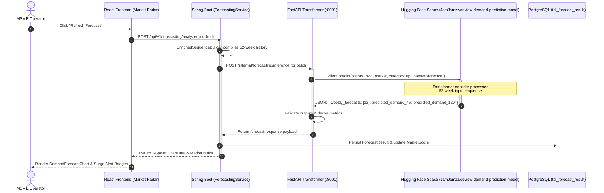

# Module 2 — Transformer Demand Prediction Model Integration

This document specifies the integration of the CeView Demand Prediction Transformer Model hosted as an inference service on **Hugging Face Spaces**.

---

## 1. Overview & Service Metadata

The demand forecasting engine for Module 2.2 (Market Radar) utilizes a dedicated Transformer-based time-series model deployed on Hugging Face Spaces. It receives 52 weeks of historical market data, the target origin market, and the business tourism category, and outputs a 12-week weekly demand forecast trajectory along with 4-week and 12-week demand means.

| Property                 | Value                                                                                                              |
| ------------------------ | ------------------------------------------------------------------------------------------------------------------ |
| **Hugging Face Space**   | [`JamJamzz/ceview-demand-prediction-model`](https://huggingface.co/spaces/JamJamzz/ceview-demand-prediction-model) |
| **API Endpoint / Route** | `/forecast`                                                                                                        |
| **Interface Protocol**   | Gradio Client (`gradio_client`) / Gradio REST API                                                                  |
| **Primary Consumer**     | `fastapi-transformer` microservice (orchestrated by Spring Boot `ForecastingService`)                              |
| **Prediction Horizon**   | 12 weeks ($Wk+1$ through $Wk+12$)                                                                                  |
| **Lookback Context**     | 52 weeks of weekly history                                                                                         |

---

## 2. API Specification (`/forecast`)

### 2.1 Endpoint Summary

- **API Name**: `/forecast`
- **Method**: Predict call via `gradio_client.Client` or HTTP POST via the Gradio API route.
- **Authentication**: Public Space (default). For private Spaces or high-throughput enterprise tiers, pass `hf_token`.

### 2.2 Input Parameters

The `/forecast` endpoint accepts **3 parameters**:

| Parameter          | Type                        | Required | Default                      | Description & Allowed Values                                                                                                                                                                                                                                                                |
| ------------------ | --------------------------- | -------- | ---------------------------- | ------------------------------------------------------------------------------------------------------------------------------------------------------------------------------------------------------------------------------------------------------------------------------------------- |
| **`history_json`** | `str`                       | **Yes**  | —                            | A serialized JSON string representing the **52-week historical series** for the market/category. Contains historical search interest trend indices and exogenous variables.                                                                                                                 |
| **`market`**       | `Literal['JP', 'KR', 'US']` | No       | `"KR"`                       | The target source tourist market code in ISO 3166-1 alpha-2 uppercase format: <br>• `'KR'` (South Korea)<br>• `'JP'` (Japan)<br>• `'US'` (United States)                                                                                                                                    |
| **`category`**     | `Literal[...]`              | No       | `"accommodation_staycation"` | Standardized snake_case tourism category identifier. Must be one of the 7 valid labels: <br>• `'accommodation_staycation'`<br>• `'adventure_nature'`<br>• `'coastal_island'`<br>• `'culinary_gastronomy'`<br>• `'cultural_heritage'`<br>• `'theme_parks_entertainment'`<br>• `'urban_city'` |

### 2.3 Return Structure

The endpoint returns **1 JSON element** (`dict` / structured object) containing:

- **`weekly_forecasts`**: Ordered array of 12 predicted weekly search demand indices (scale 0–100) for weeks $t+1$ to $t+12$.
- **`predicted_demand_4w`**: Arithmetic average of predictions for weeks 1–4 (used for short-term scoring and alerts).
- **`predicted_demand_12w`**: Arithmetic average of all 12 forecast weeks (medium-term outlook).
- **`model_version`**: Metadata identifying the model checkpoint and architecture release.

---

## 3. Integration Code Examples

### 3.1 Python Client (`gradio_client`)

Install the client:

```bash
pip install gradio_client
```

Execute a forecast request:

```python
import json
from gradio_client import Client

# Initialize client pointing to the Hugging Face Space
client = Client("JamJamzz/ceview-demand-prediction-model")

# Example 52-week historical payload
sample_history = {
    "weeks": [f"W{i:02d}" for i in range(1, 53)],
    "trend_indices": [45.2 + (i % 8) * 2.1 for i in range(52)],
    "forex_rates": [55.8] * 52,
    "gdp_growth": [2.4] * 52,
}
history_str = json.dumps(sample_history)

# Execute inference
result = client.predict(
    history_json=history_str,
    market="KR",
    category="coastal_island",
    api_name="/forecast",
)

print("Forecast Output:", result)
```

### 3.2 Direct REST / cURL Integration

Gradio Spaces also expose standard REST endpoints. Calls can be made directly over HTTPS:

```bash
curl -X POST "https://jamjamzz-ceview-demand-prediction-model.hf.space/api/predict" \
  -H "Content-Type: application/json" \
  -d '{
    "data": [
      "{\"trend_indices\": [...52 points...]}",
      "KR",
      "coastal_island"
    ],
    "fn_index": 0
  }'
```

---

## 4. CeView Domain Mapping

To ensure seamless compatibility between CeView's internal naming conventions and the Hugging Face model API, the backend applies the following mappings:

### 4.1 Market Mapping

| CeView Internal Key | Spring Boot / DB Market | Hugging Face Parameter (`market`) |
| ------------------- | ----------------------- | --------------------------------- |
| `korea`             | `"korea"`               | `'KR'`                            |
| `japan`             | `"japan"`               | `'JP'`                            |
| `usa`               | `"usa"`                 | `'US'`                            |

### 4.2 Category Mapping

| CeView UI Category          | SBERT Category Label          | Hugging Face Parameter (`category`) |
| --------------------------- | ----------------------------- | ----------------------------------- |
| Accommodation & Staycation  | `Accommodation & Staycation`  | `accommodation_staycation`          |
| Adventure & Nature          | `Adventure & Nature`          | `adventure_nature`                  |
| Coastal & Island            | `Coastal & Island`            | `coastal_island`                    |
| Culinary & Gastronomy       | `Culinary & Gastronomy`       | `culinary_gastronomy`               |
| Cultural & Heritage         | `Cultural & Heritage`         | `cultural_heritage`                 |
| Theme Parks / Entertainment | `Theme Parks / Entertainment` | `theme_parks_entertainment`         |
| Urban & City                | `Urban & City`                | `urban_city`                        |

---

## 5. Architectural Pipeline & Data Flow



---

## 6. Resilience & Fallback Handling

1. **Cold-Start Latency**: Free-tier Hugging Face Spaces sleep after inactivity. The `fastapi-transformer` client implements a configurable timeout (30–60s) with exponential retry.
2. **Offline Fallback**: If the Hugging Face Space is unreachable or returns a 5xx/429 error, `fastapi-transformer` falls back to the deterministic local linear regression stub (`_stub_forecast`), preventing pipeline failure and returning a valid payload with degraded confidence indicators.
3. **Validation**: All returned 12-week values are clamped to $[0.0, 100.0]$ and verified against CeView's quality gate ($\text{MAPE} \le 15\%$).
