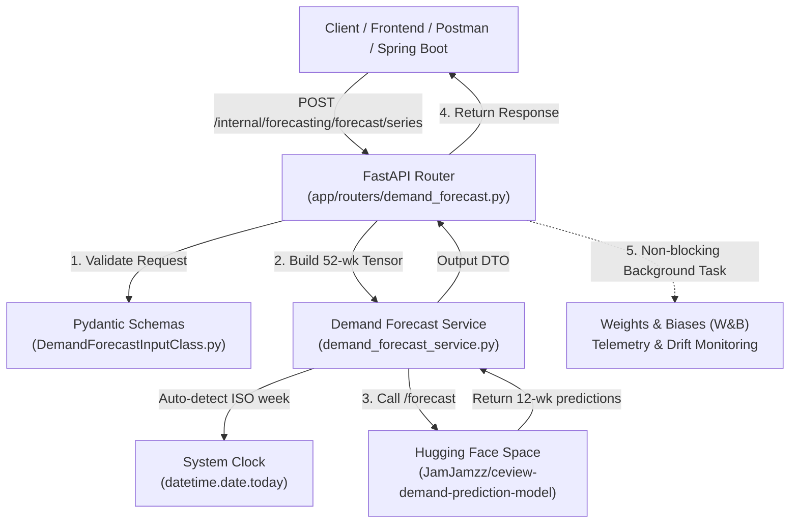

# Module 2 — Transformer Demand Prediction Model Integration & API Reference

This document provides complete technical documentation for the CeView Tourism Demand Forecasting system powered by the Transformer model hosted on **Hugging Face Spaces**, integrated into the `fastapi-sbert` microservice.

---

## 1. Architecture Overview

The demand prediction engine forecasts weekly Google Trends search interest for Cebu tourism across three primary source markets (South Korea, Japan, United States) and seven accommodation/tourism categories.



### Component Registry

| Component | Path | Role & Description |
|---|---|---|
| **AI Model** | [`JamJamzz/ceview-demand-prediction-model`](https://huggingface.co/spaces/JamJamzz/ceview-demand-prediction-model) | Transformer time-series checkpoint deployed on Hugging Face Spaces. Ingests a 52×3 history tensor and predicts a 12-week trajectory. |
| **Pydantic Models** | [`app/model/DemandForecastInputClass.py`](file:///C:/Dev/CeView/backend/fastapi-sbert/app/model/DemandForecastInputClass.py) | Defines `DemandForecastInputClass`, `DemandForecastOutputClass`, `WeeklyForecastPoint`, and literal constraints. |
| **Service Layer** | [`app/services/demand_forecast_service.py`](file:///C:/Dev/CeView/backend/fastapi-sbert/app/services/demand_forecast_service.py) | Singleton Gradio client, input normalization, 52-week calendar sin/cos tensor construction, auto-calendar week inference, and HF Space communication. |
| **Controller / Router** | [`app/routers/demand_forecast.py`](file:///C:/Dev/CeView/backend/fastapi-sbert/app/routers/demand_forecast.py) | Exposes `/forecast`, `/forecast/series`, and `/status`. Dispatches asynchronous Weights & Biases telemetry via `BackgroundTasks`. |
| **FastAPI Root** | [`app/main.py`](file:///C:/Dev/CeView/backend/fastapi-sbert/app/main.py) | Mounts router at `/internal/forecasting` prefix. |

---

## 2. The AI Model Contract (`Hugging Face Spaces`)

### 2.1 Model Specifications
- **Space ID**: `JamJamzz/ceview-demand-prediction-model`
- **Inference Route**: `/forecast`
- **Lookback Window**: Exactly 52 consecutive weeks ($t-51$ to $t$).
- **Forecast Horizon**: 12 future weeks ($t+1$ to $t+12$).
- **Underlying Architecture**: Multi-head self-attention Transformer encoder-decoder trained on historical Google Trends search volume paired with seasonal calendar encodings.

### 2.2 Input Tensor Specification
The model's `history_json` parameter requires a serialized JSON string containing an **exact 52 × 3 matrix**:

$$\mathbf{X} = \begin{bmatrix}
\text{trend\_scaled}_0 & \sin(\theta_0) & \cos(\theta_0) \\
\text{trend\_scaled}_1 & \sin(\theta_1) & \cos(\theta_1) \\
\vdots & \vdots & \vdots \\
\text{trend\_scaled}_{51} & \sin(\theta_{51}) & \cos(\theta_{51})
\end{bmatrix}$$

Where:
1. **`trend_scaled` $\in [0.0, 1.0]$**: Normalized search interest index calculated as $\text{raw\_trend} / 100.0$.
2. **$\sin(\theta)$ and $\cos(\theta)$ $\in [-1.0, 1.0]$**: Cyclical week-of-year encoding where:
   $$\theta = \frac{2 \pi \cdot \text{week\_number}}{52}$$
   with $\text{week\_number} \in [1, 52]$.

### 2.3 Supported Markets & Categories

#### Markets (`market`)
| Allowed Model Key | Normalized Aliases Accepted by Service | Country |
|---|---|---|
| `'KR'` | `'KR'`, `'korea'`, `'south korea'`, `'south_korea'` | South Korea |
| `'JP'` | `'JP'`, `'japan'` | Japan |
| `'US'` | `'US'`, `'usa'`, `'united states'`, `'united_states'` | United States |

#### Categories (`category`)
| Model Category ID | Supported Display / Aliases |
|---|---|
| `accommodation_staycation` | `Accommodation & Staycation`, `accommodation`, `staycation` |
| `adventure_nature` | `Adventure & Nature`, `adventure`, `nature` |
| `coastal_island` | `Coastal & Island`, `coastal`, `island`, `beach` |
| `culinary_gastronomy` | `Culinary & Gastronomy`, `food`, `culinary`, `gastronomy` |
| `cultural_heritage` | `Cultural & Heritage`, `cultural`, `heritage` |
| `theme_parks_entertainment` | `Theme Parks / Entertainment`, `theme_parks`, `entertainment` |
| `urban_city` | `Urban & City`, `urban`, `city` |

---

## 3. Automated Week Deduction (Zero Client-Side Math)

### Why Calendar Encodings Matter
Because demand patterns are highly seasonal (e.g. summer beach travel, winter holiday peaks), the model requires the calendar cycle $(\sin \theta, \cos \theta)$ for every point.

### How the Server Automatically Handles It
Clients do **not** need to compute week numbers or trigonometric angles. When `start_iso_week` is omitted in the request:
1. The server reads the current week using Python's standard library:
   ```python
   from datetime import date
   current_iso_week = date.today().isocalendar().week  # e.g., 37
   ```
2. It anchors the 52nd point (the newest observation, $t$) to `current_iso_week`.
3. It derives the earliest point ($t-51$, 51 weeks ago) via modular arithmetic:
   ```python
   start_iso_week = (current_iso_week % 52) + 1
   ```
4. It iterates from index $0 \dots 51$ computing:
   ```python
   week_num = ((start_iso_week - 1 + index) % 52) + 1
   angle = 2.0 * math.pi * float(week_num) / 52.0
   sin_val = math.sin(angle)
   cos_val = math.cos(angle)
   ```
5. If the client provides fewer than 52 points, the oldest observation is smoothly backfilled; if more than 52 are provided, the most recent 52 are sliced.

---

## 4. FastAPI Endpoints Reference

Base URL: `http://127.0.0.1:8000/internal/forecasting`

### 4.1 Check Status & Configuration
`GET /internal/forecasting/status`

Returns Hugging Face Space connectivity metadata, supported taxonomy, and Weights & Biases tracking status.

**Sample Response**:
```json
{
  "status": "configured",
  "huggingface_space": "JamJamzz/ceview-demand-prediction-model",
  "endpoint": "/forecast",
  "weights_and_biases": {
    "enabled": true,
    "api_key_configured": true,
    "project": "ceview-demand-forecast",
    "entity": null
  },
  "supported_markets": ["JP", "KR", "US"],
  "supported_categories": [
    "accommodation_staycation",
    "adventure_nature",
    "coastal_island",
    "culinary_gastronomy",
    "cultural_heritage",
    "theme_parks_entertainment",
    "urban_city"
  ]
}
```

---

### 4.2 High-Level Raw Trend Forecast (Recommended)
`POST /internal/forecasting/forecast/series`

Takes a simple array of raw 0–100 weekly trend numbers. Automatically encodes the 52-week tensor and runs inference.

**Request Body**:
```json
{
  "trend_series": [
    35.2, 38.0, 42.1, 45.3, 44.0, 47.5, 50.2, 52.0, 49.8, 53.4,
    55.1, 58.0, 60.2, 59.5, 62.0, 64.3, 61.8, 63.5, 65.0, 67.2,
    64.0, 66.5, 69.1, 71.0, 70.2, 68.4, 65.0, 62.5, 60.1, 58.7,
    56.2, 54.0, 52.8, 50.1, 48.5, 47.0, 49.2, 51.5, 53.0, 55.4,
    57.1, 59.0, 58.2, 60.5, 62.1, 64.0, 61.5, 63.2, 65.4, 67.0,
    69.2, 72.0
  ],
  "market": "korea",
  "category": "Accommodation & Staycation"
}
```

*Note: `start_iso_week` can be completely omitted.*

**Response Body**:
```json
{
  "market": "KR",
  "category": "accommodation_staycation",
  "weekly_forecasts": [
    { "week_ahead": 1, "google_trends": 73.15 },
    { "week_ahead": 2, "google_trends": 74.02 },
    { "week_ahead": 3, "google_trends": 72.88 },
    { "week_ahead": 4, "google_trends": 71.50 },
    { "week_ahead": 5, "google_trends": 69.80 },
    { "week_ahead": 6, "google_trends": 68.45 },
    { "week_ahead": 7, "google_trends": 67.20 },
    { "week_ahead": 8, "google_trends": 66.10 },
    { "week_ahead": 9, "google_trends": 65.40 },
    { "week_ahead": 10, "google_trends": 64.95 },
    { "week_ahead": 11, "google_trends": 64.30 },
    { "week_ahead": 12, "google_trends": 63.80 }
  ],
  "mean_demand_4_weeks": 72.89,
  "mean_demand_12_weeks": 68.46,
  "model": {
    "model_version": "1.0.0",
    "architecture": "Transformer",
    "horizon_weeks": 12
  }
}
```

---

### 4.3 Low-Level Tensor Forecast
`POST /internal/forecasting/forecast`

Direct low-level route consuming an already formatted 52×3 JSON string.

**Request Body**:
```json
{
  "history_json": "[[0.50, -0.992709, -0.120537], ...52 rows...]",
  "market": "KR",
  "category": "accommodation_staycation"
}
```

---

## 5. Weights & Biases (W&B) Telemetry Layer

To monitor model performance, drift, and latency during testing and production deployment, the router includes an asynchronous telemetry layer.

### 5.1 Architecture & Performance Guarantee
- **Zero API Latency Overhead**: Logging is queued via FastAPI `BackgroundTasks`. The client receives the forecast response immediately without waiting for W&B network calls.
- **Fail-Safe**: If W&B is unconfigured, network times out, or quota is exceeded, errors are caught and logged at `warning` level without disrupting application responses.

### 5.2 Environment Configuration
Add the following keys to `backend/.env`:

```env
# Weights & Biases Telemetry
WANDB_API_KEY=your_wandb_api_key_here
WANDB_PROJECT=ceview-demand-forecast
ENABLE_WANDB=true
```

### 5.3 Logged Metrics & Telemetry Schema
Every forecast call logs a record with:

| Telemetry Group | Metric Keys | Description |
|---|---|---|
| **System & Latency** | `inference_latency_seconds`, `status`, `request_type` | Model latency, success/failure status, and entrypoint. |
| **Input Profiling** | `input/market`, `input/category`, `input/trend_mean`, `input/trend_latest`, `input/trend_min`, `input/trend_max` | Search index characteristics to detect input distribution shifts. |
| **Predictions** | `forecast/mean_4_weeks`, `forecast/mean_12_weeks`, `forecast/week_1` ... `forecast/week_12` | Aggregated windows and individual predicted trajectory values. |
| **Model Metadata** | `model_version`, `architecture`, `best_epoch` | Checkpoint identity from the Hugging Face Space. |

---

## 6. How to Run & Test

### 6.1 Install Dependencies
From `backend/fastapi-sbert`:
```bash
pip install -r requirements.txt
```

### 6.2 Start the Server
```bash
cd backend\fastapi-sbert
python -m uvicorn app.main:app --reload --port 8000
```

### 6.3 cURL Verification
```bash
curl -X POST "http://127.0.0.1:8000/internal/forecasting/forecast/series" \
  -H "Content-Type: application/json" \
  -d '{
    "trend_series": [45.0, 48.0, 52.0, 55.0],
    "market": "korea",
    "category": "Accommodation & Staycation"
  }'
```
