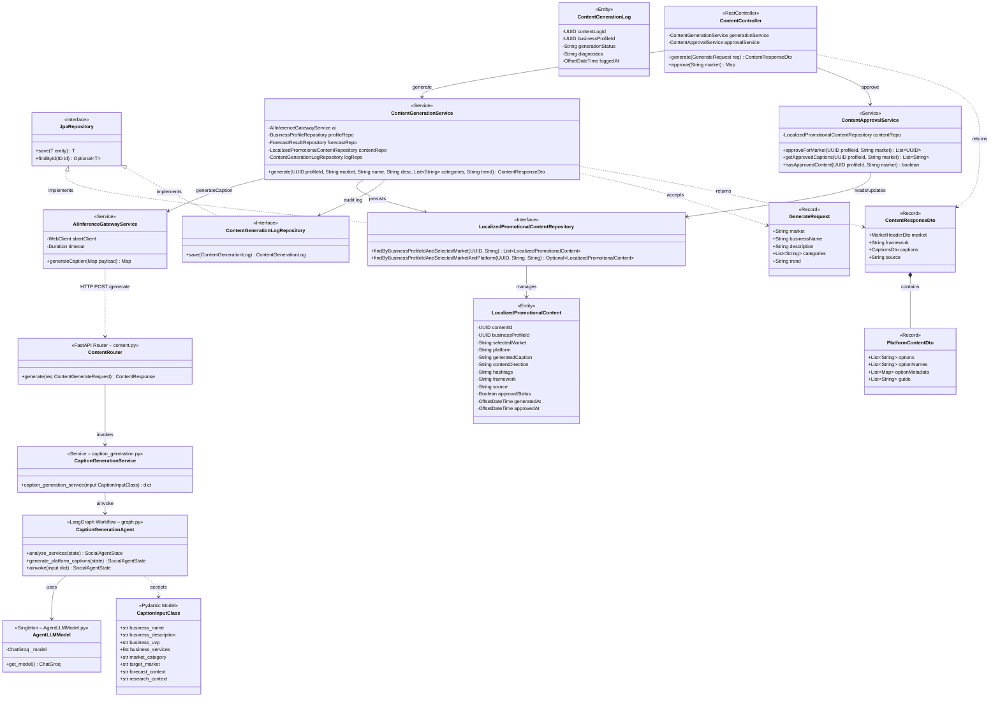
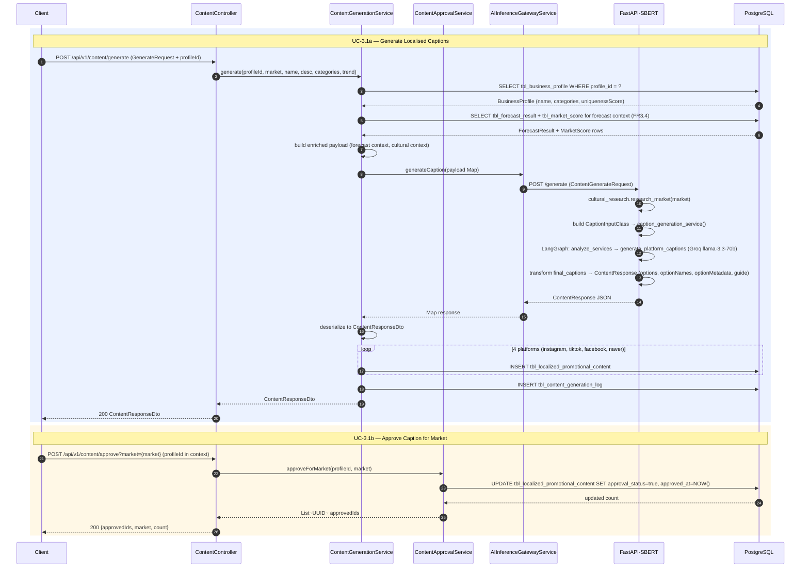
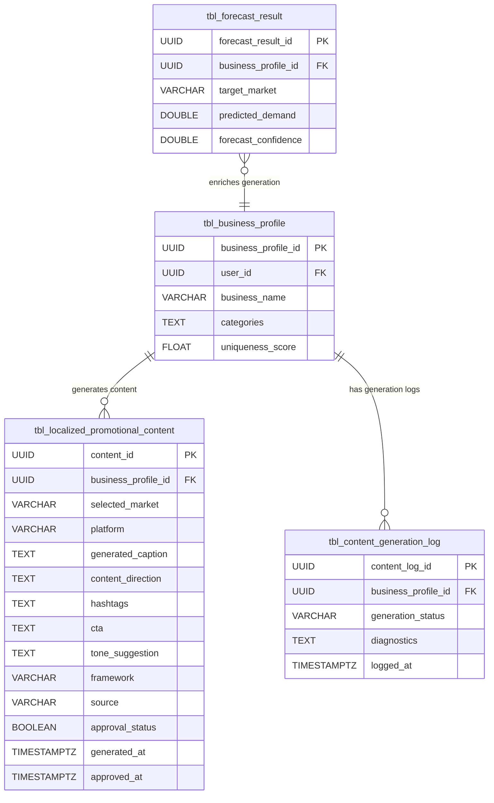
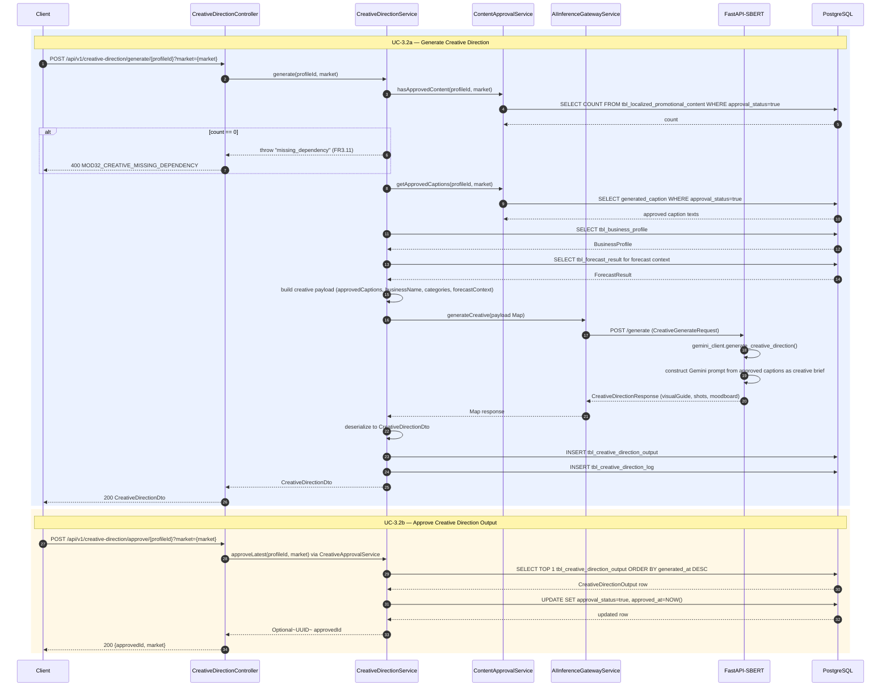
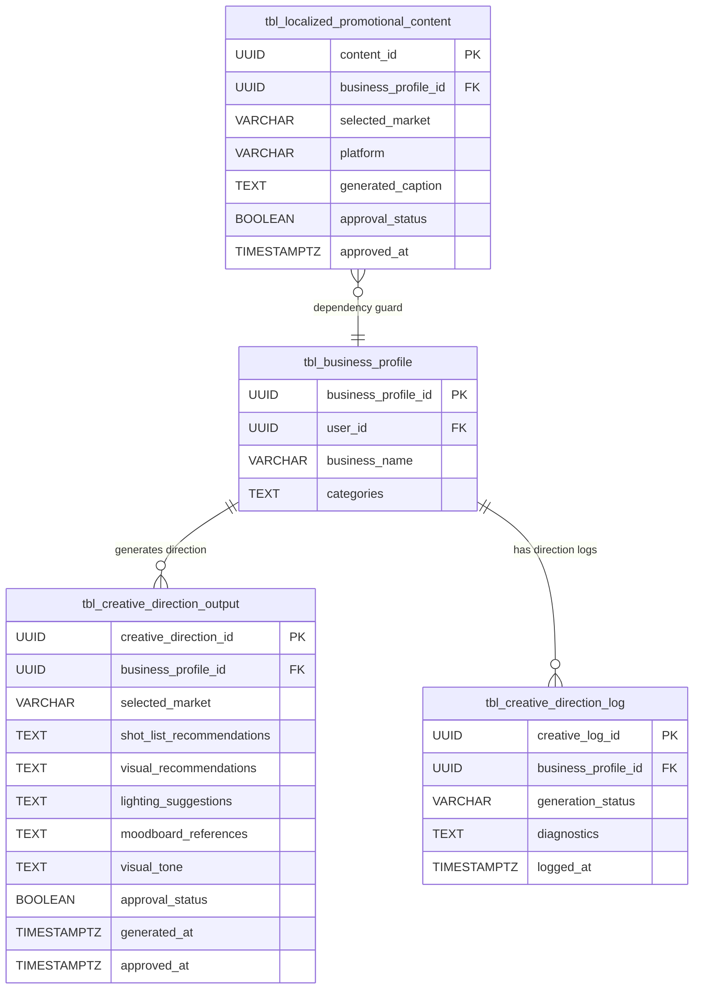
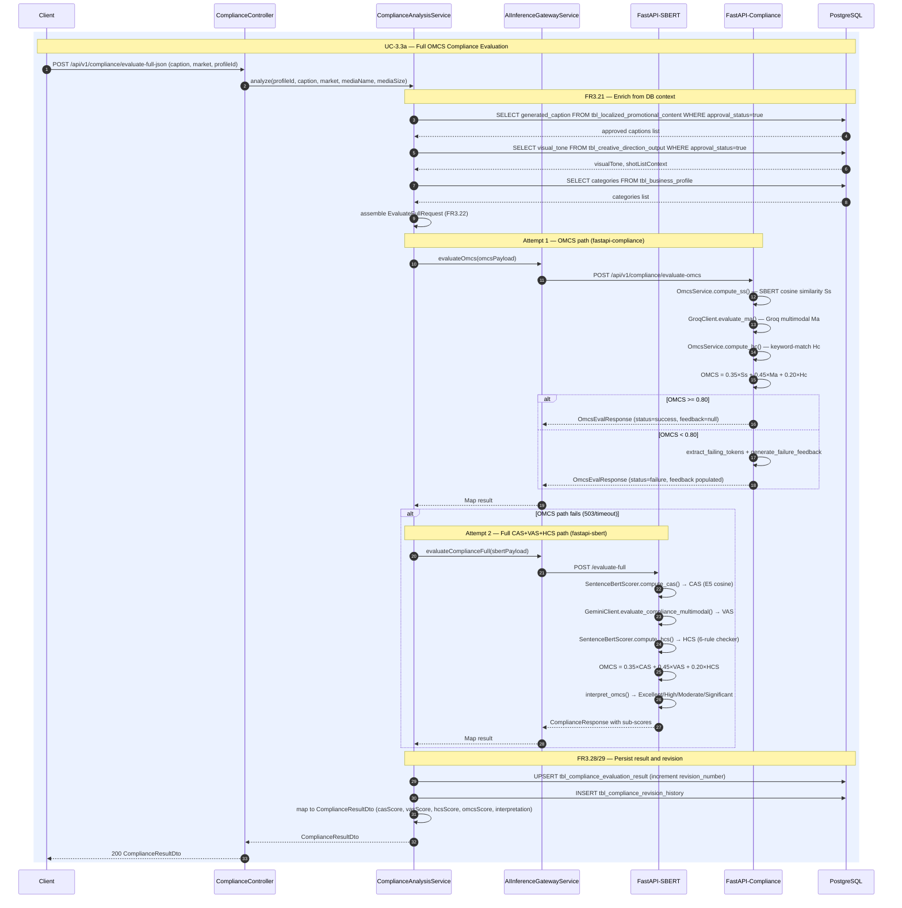
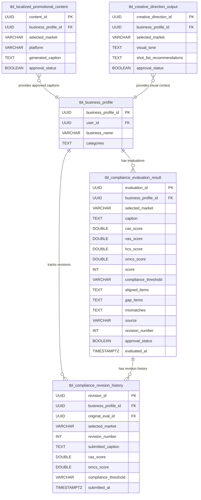

```mermaid
classDiagram
    direction TB

    %% ── DTOs ──────────────────────────────────────────────────────────────────

    class CreativeDirectionDto {
        <<Record>>
        +List~String~ visualGuide
        +List~ShotDto~ shots
        +MoodboardDto moodboard
    }

    class ShotDto {
        <<Record>>
        +String label
        +String description
        +String lighting
    }

    class MoodboardDto {
        <<Record>>
        +String palette
        +List~String~ references
    }

    %% ── Entities ──────────────────────────────────────────────────────────────

    class CreativeDirectionOutput {
        <<Entity>>
        -UUID creativeDirectionId
        -UUID businessProfileId
        -String selectedMarket
        -String shotListRecommendations
        -String visualRecommendations
        -String lightingSuggestions
        -String moodboardReferences
        -String platformRecommendations
        -String visualTone
        -Boolean approvalStatus
        -OffsetDateTime generatedAt
        -OffsetDateTime approvedAt
    }

    class CreativeDirectionLog {
        <<Entity>>
        -UUID creativeLogId
        -UUID businessProfileId
        -String generationStatus
        -String diagnostics
        -OffsetDateTime loggedAt
    }

    %% ── Repositories ──────────────────────────────────────────────────────────

    class JpaRepository {
        <<Interface>>
        +save(T entity) T
        +findById(ID id) Optional~T~
    }

    class CreativeDirectionOutputRepository {
        <<Interface>>
        +findTopByBusinessProfileIdAndSelectedMarketOrderByGeneratedAtDesc(UUID, String) Optional~CreativeDirectionOutput~
    }

    class CreativeDirectionLogRepository {
        <<Interface>>
        +save(CreativeDirectionLog) CreativeDirectionLog
    }

    %% ── Controllers ───────────────────────────────────────────────────────────

    class CreativeDirectionController {
        <<RestController>>
        -CreativeDirectionService generationService
        -CreativeApprovalService approvalService
        +generate(UUID profileId, String market) CreativeDirectionDto
        +approve(UUID profileId, String market) Map
    }

    %% ── Spring Services ───────────────────────────────────────────────────────

    class CreativeDirectionService {
        <<Service>>
        -ContentApprovalService contentApproval
        -AIInferenceGatewayService ai
        -BusinessProfileRepository profileRepo
        -ForecastResultRepository forecastRepo
        -CreativeDirectionOutputRepository outputRepo
        -CreativeDirectionLogRepository logRepo
        +generate(UUID profileId, String market) CreativeDirectionDto
    }

    class CreativeApprovalService {
        <<Service>>
        -CreativeDirectionOutputRepository outputRepo
        +approveLatest(UUID profileId, String market) Optional~UUID~
    }

    class ContentApprovalService {
        <<Service>>
        +hasApprovedContent(UUID profileId, String market) boolean
        +getApprovedCaptions(UUID profileId, String market) List~String~
    }

    class AIInferenceGatewayService {
        <<Service>>
        -WebClient sbertClient
        -Duration timeout
        +generateCreative(Map payload) Map
    }

    %% ── FastAPI: Router ───────────────────────────────────────────────────────

    class CreativeRouter {
        <<FastAPI Router – creative.py>>
        +generate(req CreativeGenerateRequest) CreativeDirectionResponse
    }

    class GeminiClient {
        <<Service – gemini_client.py>>
        +generate_creative_direction(market, businessName, categories, approvedCaptions, uniquenessScore, forecastContext) dict
    }

    %% ── Relationships ─────────────────────────────────────────────────────────

    JpaRepository <|.. CreativeDirectionOutputRepository : implements
    JpaRepository <|.. CreativeDirectionLogRepository : implements

    CreativeDirectionController --> CreativeDirectionService : generate
    CreativeDirectionController --> CreativeApprovalService : approve
    CreativeDirectionController ..> CreativeDirectionDto : returns

    CreativeDirectionService --> ContentApprovalService : dependency guard
    CreativeDirectionService --> AIInferenceGatewayService : generateCreative
    CreativeDirectionService --> CreativeDirectionOutputRepository : persists
    CreativeDirectionService --> CreativeDirectionLogRepository : audit log
    CreativeDirectionService ..> CreativeDirectionDto : returns

    CreativeApprovalService --> CreativeDirectionOutputRepository : updates

    CreativeDirectionOutputRepository --> CreativeDirectionOutput : manages

    CreativeDirectionDto *-- ShotDto : contains
    CreativeDirectionDto *-- MoodboardDto : contains

    AIInferenceGatewayService ..> CreativeRouter : HTTP POST /generate

    CreativeRouter --> GeminiClient : generate_creative_direction
```

```mermaid
classDiagram
    direction TB

    %% ── DTOs ──────────────────────────────────────────────────────────────────

    class EvaluateFullRequest {
        <<Record>>
        +String caption
        +String market
        +String mediaName
        +Long mediaSize
        +List~String~ approvedCaptions
        +List~String~ categories
        +String visualTone
        +String shotListContext
    }

    class ComplianceResultDto {
        <<Record>>
        +int score
        +List~String~ aligned
        +List~String~ gaps
        +String source
        +Double casScore
        +Double vasScore
        +Double hcsScore
        +Double omcsScore
        +String interpretation
        +List~String~ mismatches
    }

    %% ── Entities ──────────────────────────────────────────────────────────────

    class ComplianceEvaluationResult {
        <<Entity>>
        -UUID evaluationId
        -UUID businessProfileId
        -String selectedMarket
        -String caption
        -Double casScore
        -Double vasScore
        -Double hcsScore
        -Double omcsScore
        -Integer score
        -String complianceThreshold
        -String alignedItems
        -String gapItems
        -String mismatches
        -String source
        -Integer revisionNumber
        -Boolean approvalStatus
        -OffsetDateTime evaluatedAt
    }

    class ComplianceRevisionHistory {
        <<Entity>>
        -UUID revisionId
        -UUID businessProfileId
        -UUID originalEvalId
        -String selectedMarket
        -Integer revisionNumber
        -String submittedCaption
        -Double casScore
        -Double omcsScore
        -String complianceThreshold
        -OffsetDateTime submittedAt
    }

    %% ── Repositories ──────────────────────────────────────────────────────────

    class JpaRepository {
        <<Interface>>
        +save(T entity) T
        +findById(ID id) Optional~T~
    }

    class ComplianceEvaluationResultRepository {
        <<Interface>>
        +findTopByBusinessProfileIdAndSelectedMarketOrderByEvaluatedAtDesc(UUID, String) Optional~ComplianceEvaluationResult~
    }

    class ComplianceRevisionHistoryRepository {
        <<Interface>>
        +save(ComplianceRevisionHistory) ComplianceRevisionHistory
    }

    %% ── Controllers ───────────────────────────────────────────────────────────

    class ComplianceController {
        <<RestController>>
        -ComplianceAnalysisService analysisService
        -AIInferenceGatewayService ai
        +evaluateJson(EvaluateRequest req) ComplianceResultDto
        +evaluateFullJson(EvaluateFullRequest req, UUID profileId) ComplianceResultDto
    }

    %% ── Spring Services ───────────────────────────────────────────────────────

    class ComplianceAnalysisService {
        <<Service>>
        -ContentApprovalService contentApproval
        -CreativeDirectionOutputRepository creativeRepo
        -ComplianceEvaluationResultRepository evalRepo
        -ComplianceRevisionHistoryRepository revisionRepo
        -AIInferenceGatewayService ai
        +analyze(UUID profileId, String caption, String market, String mediaName, Long mediaSize) ComplianceResultDto
        -persistResult(ComplianceResultDto, UUID, String, String) void
    }

    class AIInferenceGatewayService {
        <<Service>>
        -WebClient sbertClient
        -WebClient complianceClient
        -Duration timeout
        +evaluateCompliance(Map payload) Map
        +evaluateComplianceFull(Map payload) Map
        +evaluateOmcs(Map payload) Map
    }

    %% ── FastAPI-SBERT: Router + Services ──────────────────────────────────────

    class SbertComplianceRouter {
        <<FastAPI Router – compliance.py (fastapi-sbert)>>
        +POST_evaluate(req EvaluateRequest) ComplianceResponse
        +POST_evaluate_full(req EvaluateFullRequest) ComplianceResponse
    }

    class SentenceBertScorer {
        <<Service – sentence_bert_scorer.py>>
        +compute_cas(submitted str, approved list) float
        +compute_hcs(caption, market, categories, approved, visual_tone, media_name) float
        +interpret_omcs(score float) str
    }

    class SbertGeminiClient {
        <<Service – gemini_client.py (fastapi-sbert)>>
        +evaluate_compliance(caption, market) dict
        +evaluate_compliance_multimodal(caption, approved, visual_tone, market) dict
    }

    %% ── FastAPI-Compliance: Router + Services ─────────────────────────────────

    class OmcsComplianceRouter {
        <<FastAPI Router – compliance.py (fastapi-compliance)>>
        +POST_evaluate_omcs(req OmcsEvalRequest) OmcsEvalResponse
    }

    class OmcsService {
        <<Service – omcs_service.py>>
        +compute_ss(submission str, recommendation str) float
        +compute_hc(submission str, rules list) float
        +extract_failing_tokens(submission str, recommendation str) list
    }

    class GroqClient {
        <<Service – groq_client.py>>
        +evaluate_ma(ai_recommendation, submission_text, media_name, media_size) tuple
        +generate_failure_feedback(ai_recommendation, submission_text, failing_tokens, visual_mismatches, rules, market) dict
    }

    %% ── Relationships ─────────────────────────────────────────────────────────

    JpaRepository <|.. ComplianceEvaluationResultRepository : implements
    JpaRepository <|.. ComplianceRevisionHistoryRepository : implements

    ComplianceController --> ComplianceAnalysisService : delegates
    ComplianceController --> AIInferenceGatewayService : basic path
    ComplianceController ..> ComplianceResultDto : returns
    ComplianceController ..> EvaluateFullRequest : accepts

    ComplianceAnalysisService --> AIInferenceGatewayService : evaluate OMCS / full / basic
    ComplianceAnalysisService --> ComplianceEvaluationResultRepository : persists
    ComplianceAnalysisService --> ComplianceRevisionHistoryRepository : appends revision
    ComplianceAnalysisService ..> ComplianceResultDto : returns

    ComplianceEvaluationResultRepository --> ComplianceEvaluationResult : manages
    ComplianceRevisionHistoryRepository --> ComplianceRevisionHistory : manages
    ComplianceRevisionHistory ..> ComplianceEvaluationResult : FK originalEvalId

    AIInferenceGatewayService ..> SbertComplianceRouter : HTTP POST /evaluate-full
    AIInferenceGatewayService ..> OmcsComplianceRouter : HTTP POST /evaluate-omcs

    SbertComplianceRouter --> SentenceBertScorer : compute CAS + HCS
    SbertComplianceRouter --> SbertGeminiClient : compute VAS

    OmcsComplianceRouter --> OmcsService : compute Ss + Hc
    OmcsComplianceRouter --> GroqClient : compute Ma
```

# Module 3 — Architecture Diagrams

> Scope: Backend only (Spring Boot + FastAPI-SBERT + FastAPI-Compliance).
> Designed for OOP — covers database schema, business logic, and AI data models.

---

## 3.1 AI Caption Generation

### Class Diagram

---

### Sequence Diagram

---

### Entity Relationship Diagram

---
---

## 3.2 Creative Direction

### Class Diagram

---

### Sequence Diagram

---

### Entity Relationship Diagram

---
---

## 3.3 OMCS Compliance Evaluation

### Class Diagram

---

### Sequence Diagram

---

### Entity Relationship Diagram

