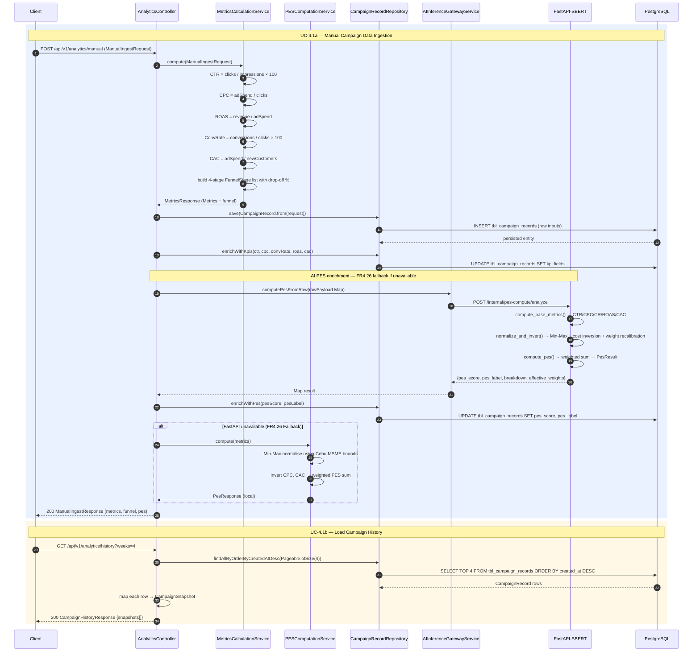
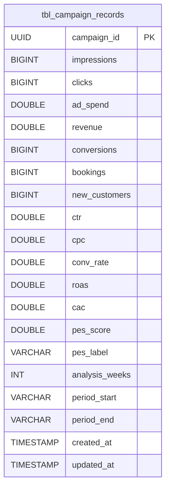
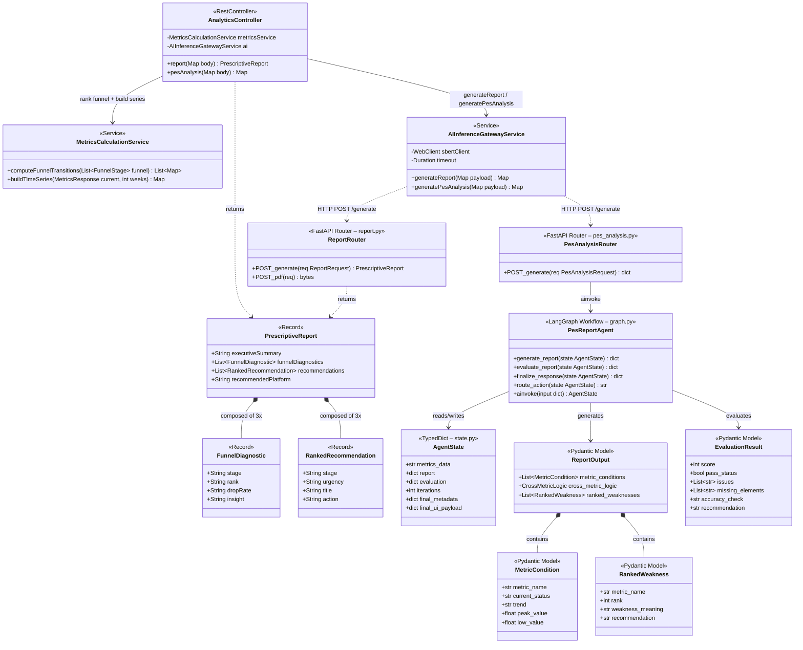

```mermaid
classDiagram
    direction TB

    %% ── DTOs ──────────────────────────────────────────────────────────────────

    class ManualIngestRequest {
        <<Record>>
        +Integer impressions
        +Integer clicks
        +Double adSpend
        +Double revenue
        +Integer conversions
        +Integer bookings
        +Integer newCustomers
        +String periodStart
        +String periodEnd
    }

    class MetricCard {
        <<Record>>
        +double value
        +String unit
        +double trend
        +boolean isPositive
    }

    class Metrics {
        <<Record>>
        +MetricCard ctr
        +MetricCard cpc
        +MetricCard roas
        +MetricCard convRate
        +MetricCard cac
    }

    class FunnelStage {
        <<Record>>
        +String stage
        +long value
        +String dropoff
    }

    class PesBreakdownItem {
        <<Record>>
        +String metric
        +String weight
        +double contribution
    }

    class PesResponse {
        <<Record>>
        +double overallScore
        +String label
        +List~PesBreakdownItem~ breakdown
    }

    class CampaignSnapshot {
        <<Record>>
        +String periodStart
        +String periodEnd
        +double pesScore
        +String pesLabel
        +Double ctr
        +Double cpc
        +Double roas
        +Double convRate
        +Double cac
    }

    class ManualIngestResponse {
        <<Record>>
        +Metrics metrics
        +List~FunnelStage~ funnel
        +PesResponse pes
    }

    class CampaignHistoryResponse {
        <<Record>>
        +List~CampaignSnapshot~ snapshots
    }

    %% ── Entity ────────────────────────────────────────────────────────────────

    class CampaignRecord {
        <<Entity>>
        -UUID campaignId
        -Long impressions
        -Long clicks
        -Double adSpend
        -Double revenue
        -Long conversions
        -Long bookings
        -Long newCustomers
        -Double ctr
        -Double cpc
        -Double convRate
        -Double roas
        -Double cac
        -Double pesScore
        -String pesLabel
        -Integer analysisWeeks
        -String periodStart
        -String periodEnd
        -Instant createdAt
        -Instant updatedAt
        +from(ManualIngestRequest) CampaignRecord
        +enrichWithKpis(double, double, double, double, double) void
        +enrichWithPes(double, String) void
    }

    %% ── Repository ────────────────────────────────────────────────────────────

    class JpaRepository {
        <<Interface>>
        +save(T entity) T
        +findById(ID id) Optional~T~
    }

    class CampaignRecordRepository {
        <<Interface>>
        +findByCreatedAtAfterOrderByCreatedAtDesc(Instant after) List~CampaignRecord~
        +findTop10ByOrderByCreatedAtDesc() List~CampaignRecord~
        +findAllByOrderByCreatedAtDesc(Pageable pageable) List~CampaignRecord~
    }

    %% ── Controllers ───────────────────────────────────────────────────────────

    class AnalyticsController {
        <<RestController>>
        -MetricsCalculationService metricsService
        -PESComputationService pesService
        -CampaignRecordRepository recordRepo
        -AIInferenceGatewayService ai
        +manual(ManualIngestRequest body) ManualIngestResponse
        +metrics(int weeks) MetricsResponse
        +history(int weeks) CampaignHistoryResponse
        +pes(String campaignId, int weeks) PesResponse
    }

    %% ── Spring Services ───────────────────────────────────────────────────────

    class MetricsCalculationService {
        <<Service>>
        +compute(ManualIngestRequest in) MetricsResponse
    }

    class PESComputationService {
        <<Service>>
        +compute(Metrics m) PesResponse
    }

    class AIInferenceGatewayService {
        <<Service>>
        -WebClient sbertClient
        -Duration timeout
        +computePesFromRaw(Map payload) Map
    }

    %% ── FastAPI: Router + Service ─────────────────────────────────────────────

    class PesComputeRouter {
        <<FastAPI Router – pes_compute.py>>
        +POST_analyze(req CampaignRawRequest) dict
    }

    class PesComputeService {
        <<Service – pes_compute_service.py>>
        +compute_base_metrics(impressions, clicks, adSpend, revenue, conversions, bookings, newCustomers) tuple
        +normalize_and_invert(metrics dict, flagged list) tuple
        +compute_pes(normalized dict, effective_weights dict) PesResult
    }

    %% ── Relationships ─────────────────────────────────────────────────────────

    JpaRepository <|.. CampaignRecordRepository : implements

    AnalyticsController --> MetricsCalculationService : compute KPIs
    AnalyticsController --> PESComputationService : fallback PES
    AnalyticsController --> CampaignRecordRepository : persist/read
    AnalyticsController --> AIInferenceGatewayService : AI PES enrichment
    AnalyticsController ..> ManualIngestRequest : accepts
    AnalyticsController ..> ManualIngestResponse : returns
    AnalyticsController ..> CampaignHistoryResponse : returns

    CampaignRecordRepository --> CampaignRecord : manages

    ManualIngestResponse *-- Metrics : contains
    ManualIngestResponse *-- FunnelStage : contains
    ManualIngestResponse *-- PesResponse : contains
    Metrics *-- MetricCard : contains 5x
    PesResponse *-- PesBreakdownItem : contains
    CampaignHistoryResponse *-- CampaignSnapshot : contains

    AIInferenceGatewayService ..> PesComputeRouter : HTTP POST /analyze

    PesComputeRouter --> PesComputeService : delegates
```

# Module 4 — Architecture Diagrams

> Scope: Backend only (Spring Boot + FastAPI-SBERT).
> Designed for OOP — covers database schema, business logic, and AI data models.

---

## 4.1 Campaign Data Ingestion & KPI Computation

### Class Diagram



---

### Sequence Diagram



---

### Entity Relationship Diagram



---
---

## 4.2 AI Prescriptive Report Generation

### Class Diagram



---

### Sequence Diagram

```mermaid
sequenceDiagram
    autonumber
    participant Client
    participant AC as AnalyticsController
    participant MCS as MetricsCalculationService
    participant GW as AIInferenceGatewayService
    participant RR as ReportRouter
    participant PAR as PesAnalysisRouter
    participant PRA as PesReportAgent
    participant DB as PostgreSQL

    rect rgb(235, 242, 255)
        Note over Client,DB: UC-4.2a — Generate Prescriptive Report
        Client->>AC: POST /api/v1/analytics/report (optional {weeks})
        AC->>DB: SELECT recent CampaignRecord rows
        DB-->>AC: CampaignRecord list
        AC->>MCS: computeFunnelTransitions(funnel)
        MCS->>MCS: rank transitions by business impact
        MCS->>MCS: Clicks→Conversions (Weakest), Conversions→Bookings (Moderate), Impressions→Clicks (Alright)
        MCS-->>AC: List~Map~ ranked funnel transitions

        AC->>GW: generateReport(payload: metrics + transitions + weeks + market)
        GW->>RR: POST /internal/report/generate (ReportRequest)
        RR->>RR: map rank index 0/1/2 → Most Urgent/Urgent/Not Very Urgent
        RR->>RR: call Gemini for AI insights per stage
        RR->>RR: select recommendedPlatform via _PLATFORM_MAP[market]
        RR-->>GW: PrescriptiveReport JSON

        alt FastAPI unavailable (FR4.26 Fallback)
            AC->>AC: identify weakest funnel metric from ranking
            AC->>AC: return hardcoded Cebu-specific recommendations
        end

        GW-->>AC: Map result
        AC->>AC: map to PrescriptiveReport
        AC-->>Client: 200 PrescriptiveReport (executiveSummary, diagnostics, recommendations, platform)
    end

    rect rgb(255, 235, 235)
        Note over Client,PRA: UC-4.2b — PES Deep Analysis via LangGraph Agent
        Client->>AC: POST /api/v1/analytics/pes-analysis (optional {weeks})
        AC->>DB: SELECT recent CampaignRecord for current metrics
        DB-->>AC: CampaignRecord
        AC->>MCS: buildTimeSeries(metricsResponse, weeks)
        MCS->>MCS: linear interpolation: index [0] = current, index [N] = 75–78% baseline
        MCS->>MCS: cost metrics (CPC, CAC) baseline = 130% of current
        MCS-->>AC: time-series Map {CTR:[...], CPC:[...], ROAS:[...], CR:[...], CAC:[...]}

        AC->>GW: generatePesAnalysis({metrics_data, weeks})
        GW->>PAR: POST /internal/pes-analysis/generate

        PAR->>PRA: ainvoke({metrics_data, iterations: 0})
        loop until score ≥ 85 or iterations ≥ 3
            PRA->>PRA: generate_report(state) → Gemini → ReportOutput
            PRA->>PRA: evaluate_report(state) → Gemini → EvaluationResult (score 0–100)
            PRA->>PRA: route_action: score < 85 AND iterations < 3 → retry with feedback
        end
        PRA->>PRA: finalize_response → final_ui_payload + metadata
        PRA-->>PAR: AgentState (final_ui_payload, final_score, needs_human_review)
        PAR-->>GW: {report_data: {metric_conditions, cross_metric_logic, ranked_weaknesses}, metadata}
        GW-->>AC: Map result
        AC-->>Client: 200 PES analysis report
    end
```

---

### Entity Relationship Diagram


