# Split Card Pseudocode and Flowcharts into Independent Files — Implementation Plan

> **For agentic workers:** REQUIRED SUB-SKILL: Use superpowers:subagent-driven-development (recommended) or superpowers:executing-plans to implement this plan task-by-task. Steps use checkbox (`- [ ]`) syntax for tracking.

**Goal:** Pull each of the 28 cards' pseudocode and flowchart out of the plan markdown into
independent per-card files (`pseudocode/<module>/<slug>.ts`, `diagrams/cards/<module>/<slug>.mmd`),
replace the current inline runnable-TS code blocks with a typed-outline pseudocode register, and
link both new files from a short **Flow**/**Steps (pseudocode)** pair in each card.

**Architecture:** Mirrored per-card file trees under
`docs/superpowers/plans/2026-08-10-ui-ux-overhaul-frontend/{pseudocode,diagrams/cards}/<module>/`.
Each card's markdown entry shrinks to two link lines; all pseudocode/flowchart detail moves into the
dedicated files. Module-level `diagrams/*.mmd` (dependency diagrams) are untouched.

**Tech Stack:** Markdown, Mermaid (`flowchart TD`), TypeScript-flavored typed-outline pseudocode
(not runnable), `@mermaid-js/mermaid-cli` for syntax verification.

---

## Spec

`docs/superpowers/specs/2026-08-13-frontend-plan-pseudocode-flowchart-split-design.md`

## File Structure

```
docs/superpowers/plans/2026-08-10-ui-ux-overhaul-frontend/
  00-index.md                         (Modify — template)
  01-foundation.md                    (Modify — 4 cards)
  02-module-1.md                      (Modify — 6 cards)
  03-module-2.md                      (Modify — 5 cards)
  04-module-3.md                      (Modify — 9 cards)
  05-module-4.md                      (Modify — 4 cards)
  pseudocode/
    foundation/{project-scaffold,design-system,shell-and-routing,fixture-data-layer}.ts       (Create x4)
    module-1/{wizard-shell-step-1,brand-identity-step-2,structured-inputs-step-3,
              assets-links-step-4,analysis-step-5,settings-business-profile}.ts                (Create x6)
    module-2/{alert-feed-category-filtering,markets-reveal,states-refresh-forecast,
              market-radar-shell-directive-chart,market-radar-insights-tabs}.ts                (Create x5)
    module-3/{ai-copywriting-matrix,visual-direction-board,publish-composer,
              compliance-audit-panel,content-board-publish-action,
              calendar-month-grid-navigation,calendar-list-view-day-click-modal,
              settings-platforms,settings-workspace}.ts                                        (Create x9)
    module-4/{ingestion-form-entry-state,kpi-cards-pes-gauge-funnel,
              trend-charts-ai-action-plan,previously-published-post-analytics-modal}.ts         (Create x4)
  diagrams/
    cards/foundation/{project-scaffold,design-system,shell-and-routing,fixture-data-layer}.mmd  (Create x4)
    cards/module-1/{wizard-shell-step-1,brand-identity-step-2,structured-inputs-step-3,
                    assets-links-step-4,analysis-step-5,settings-business-profile}.mmd          (Create x6)
    cards/module-2/{alert-feed-category-filtering,markets-reveal,states-refresh-forecast,
                    market-radar-shell-directive-chart,market-radar-insights-tabs}.mmd          (Create x5)
    cards/module-3/{ai-copywriting-matrix,visual-direction-board,publish-composer,
                    compliance-audit-panel,content-board-publish-action,
                    calendar-month-grid-navigation,calendar-list-view-day-click-modal,
                    settings-platforms,settings-workspace}.mmd                                  (Create x9)
    cards/module-4/{ingestion-form-entry-state,kpi-cards-pes-gauge-funnel,
                    trend-charts-ai-action-plan,previously-published-post-analytics-modal}.mmd  (Create x4)
```

56 new files, 6 modified files, 29 tasks (1 template task + 28 card tasks).

## Conventions used in every task below

**Typed-outline pseudocode register** (`pseudocode/<module>/<slug>.ts`): real import paths/type
names for grounding; no function bodies — event handlers collapse to `on X → Y`, functions are
signatures without implementations, JSX collapses to one-line `render:` descriptions. If a card
spans multiple real project files, one `// ---- <path> ----` section per file, in build order.

**Card flowchart** (`diagrams/cards/<module>/<slug>.mmd`): one `flowchart TD` depicting that card's
own control-flow (states, decision diamonds, gates, terminal actions) — not file-level dependencies.

**Card markdown edit pattern** (identical for every task): replace the existing fenced-code "Steps
(pseudocode)" block with:

```
**Flow:** [`diagrams/cards/<module>/<slug>.mmd`](diagrams/cards/<module>/<slug>.mmd)

**Steps (pseudocode):** [`pseudocode/<module>/<slug>.ts`](pseudocode/<module>/<slug>.ts)
```

placed immediately after the card's existing **Related files** section and before **Milestone**.

---

### Task 0: Template update — `00-index.md`

**Files:**
- Modify: `docs/superpowers/plans/2026-08-10-ui-ux-overhaul-frontend/00-index.md`

- [ ] **Step 1: Update the card template's example block**

Find the card template's fenced example (the ` ```markdown ` block containing `### CARD —
<Screen>: <Chunk name>` … `**Steps (pseudocode):**`). Replace its **Flow**/**Steps (pseudocode)**
portion with:

```markdown
**Flow:** [`diagrams/cards/<module>/<slug>.mmd`](diagrams/cards/<module>/<slug>.mmd)

**Steps (pseudocode):** [`pseudocode/<module>/<slug>.ts`](pseudocode/<module>/<slug>.ts)
```

- [ ] **Step 2: Update the field guide**

Replace the current "Steps (pseudocode)" field-guide bullet (the one describing a fenced TS block
with real imports and full component bodies) with:

```markdown
- **Flow** — a link to `diagrams/cards/<module>/<slug>.mmd`, a `flowchart TD` depicting this card's
  own control-flow (states, decision branches, gates, terminal actions) — distinct from the
  module-level `diagrams/<module>.mmd`, which shows component *dependencies*, not logic.
- **Steps (pseudocode)** — a link to `pseudocode/<module>/<slug>.ts`: typed-outline pseudocode (real
  import paths/type names for grounding, `on X → Y` event bullets, bare function signatures, no
  runnable bodies) — not copy-pasteable code. If a card spans multiple real project files, the one
  pseudocode file holds one `// ---- <path> ----` section per file, in build order.
```

- [ ] **Step 3: Verify no other section references the old inline-code pseudocode format**

Run:
```
grep -n "Steps (pseudocode)" docs/superpowers/plans/2026-08-10-ui-ux-overhaul-frontend/00-index.md
```
Expected: only the two edited spots (template block, field guide) match.

- [ ] **Step 4: Commit**

Do not run `git commit` — per this repo's `.claude/CLAUDE.md`, commits are the user's action, not
an agentic worker's. Leave the change staged/unstaged and move to the next task.

---

### Task 1: Foundation — Project Scaffold

**Files:**
- Create: `docs/superpowers/plans/2026-08-10-ui-ux-overhaul-frontend/pseudocode/foundation/project-scaffold.ts`
- Create: `docs/superpowers/plans/2026-08-10-ui-ux-overhaul-frontend/diagrams/cards/foundation/project-scaffold.mmd`
- Modify: `docs/superpowers/plans/2026-08-10-ui-ux-overhaul-frontend/01-foundation.md` (Project Scaffold card)

- [ ] **Step 1: Write the pseudocode file**

```ts
// ---- vite.config.ts ----
imports: defineConfig from 'vite', react from '@vitejs/plugin-react',
         tailwindcss from '@tailwindcss/vite', path from 'node:path'

config:
  plugins: [react(), tailwindcss()]
  resolve.alias: '@' → project root (matches tsconfig.json's "@/*")
  server: port 3001, host 0.0.0.0
  test: environment 'jsdom', globals true, setupFiles ['./vitest.setup.ts']

// ---- index.tsx ----
imports: createRoot from 'react-dom/client', AuthProvider from './services/auth',
         App from './App', './styles/index.css'

on load:
  root ← #root element
  render: <AuthProvider><App/></AuthProvider> into root
  // AuthProvider wraps App, not the reverse — App's router components can call useAuth()

// ---- package.json ----
name: 'frontend'
scripts: dev→vite, build→"vite build", preview→"vite preview", test→"vitest run",
         test:unit→"vitest run" (excl. tests/integration/**), test:integration→"vitest run tests/integration"
deps: react, react-dom, react-router-dom, recharts, lucide-react
devDeps: @vitejs/plugin-react, @tailwindcss/vite, tailwindcss, typescript, vite, vitest, jsdom,
         @testing-library/react, @testing-library/jest-dom, @types/react, @types/react-dom, @types/node

// ---- tsconfig.json ----
compilerOptions: strict true, jsx "react-jsx", moduleResolution "bundler", paths "@/*" → same as Vite alias

// ---- index.html ----
no Tailwind CDN script, no CDN import map (everything is a real npm dep, bundled by Vite)
contains: font <link> tags, <div id="root">, <script type="module" src="/index.tsx">

// ---- .gitignore ----
node_modules/

// ---- vitest.setup.ts ----
imports: jest-dom's Vitest matchers

// ---- README.md ----
note: frontend/ is the active app under development; ceview/ remains deployed until cutover
```

- [ ] **Step 2: Write the flowchart file**

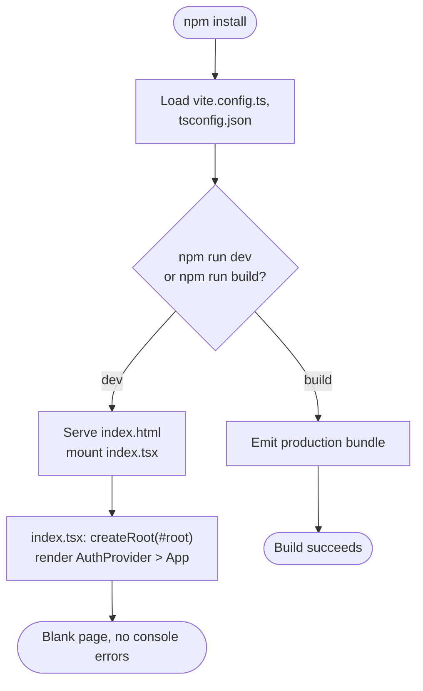
```mermaid
flowchart TD
  Start([npm install]) --> Config["Load vite.config.ts,\ntsconfig.json"]
  Config --> Dev{"npm run dev\nor npm run build?"}
  Dev -->|dev| DevServer["Serve index.html\nmount index.tsx"]
  Dev -->|build| BuildOutput["Emit production bundle"]
  DevServer --> MountApp["index.tsx: createRoot(#root)\nrender AuthProvider > App"]
  MountApp --> Done([Blank page, no console errors])
  BuildOutput --> Done2([Build succeeds])
```

- [ ] **Step 3: Edit the card in `01-foundation.md`**

Replace the Project Scaffold card's entire "Steps (pseudocode):" section (from the `**Steps
(pseudocode):**` line through the closing ` ``` ` of its last fenced block and the trailing bullet
list of config notes) with:

```markdown
**Flow:** [`diagrams/cards/foundation/project-scaffold.mmd`](diagrams/cards/foundation/project-scaffold.mmd)

**Steps (pseudocode):** [`pseudocode/foundation/project-scaffold.ts`](pseudocode/foundation/project-scaffold.ts)
```

- [ ] **Step 4: Verify the new .mmd renders**

Run:
```
npx --yes @mermaid-js/mermaid-cli -i docs/superpowers/plans/2026-08-10-ui-ux-overhaul-frontend/diagrams/cards/foundation/project-scaffold.mmd -o /tmp/project-scaffold.svg
```
Expected: `Generating single mermaid chart` with no error output.

- [ ] **Step 5: Verify links resolve**

Run:
```
ls docs/superpowers/plans/2026-08-10-ui-ux-overhaul-frontend/pseudocode/foundation/project-scaffold.ts docs/superpowers/plans/2026-08-10-ui-ux-overhaul-frontend/diagrams/cards/foundation/project-scaffold.mmd
```
Expected: both files listed, no "No such file" error.

---

### Task 2: Foundation — Design System

**Files:**
- Create: `docs/superpowers/plans/2026-08-10-ui-ux-overhaul-frontend/pseudocode/foundation/design-system.ts`
- Create: `docs/superpowers/plans/2026-08-10-ui-ux-overhaul-frontend/diagrams/cards/foundation/design-system.mmd`
- Modify: `docs/superpowers/plans/2026-08-10-ui-ux-overhaul-frontend/01-foundation.md` (Design System card)

- [ ] **Step 1: Write the pseudocode file**

```ts
// ---- styles/index.css ---- (CSS, not TS — kept in this file per 00-index.md's field guide)
import "tailwindcss"

@theme block: transcribed 1:1 from ui-ux-prototype.html:15-67's :root block
  brand/surface/ink/line/state/platform colors → --color-*
  radii → --radius-*
  shadows → --shadow-*
  spacing scale → --spacing-*

bare custom properties (outside @theme — Tailwind v4 has no "easing"/"sidebar width" namespace):
  --sidebar-w, --ease-brand

reset + typography helpers (ui-ux-prototype.html:70-110):
  .eyebrow, .h-xl/.h-lg/.h-md/.h-sm, .body-sm/.body-xs, .num, .mono, .sr
  focus-visible / selection styles

primitive component classes (.btn/.card/form primitives/.chip/.tabs/.bar/.switch/.check/.skel/
.toast/.modal/.drawer/.banner/.empty — ui-ux-prototype.html:112-302):
  added incrementally — each consuming screen card adds what it needs, as @layer components
  or inlined Tailwind utilities; decide per-primitive at implementation time

excluded entirely: .cs2-*, .prev-*, #devbar/.devbar-* (dropped v2 Content Studio / dev-only jump bar)

// ---- constants.ts (later card, noted here for the Design System decision it inherits) ----
COLORS: kept as resolved hex (Recharts needs hex, not CSS vars)
  // must match styles/index.css's @theme block — diff against it in review
```

- [ ] **Step 2: Write the flowchart file**

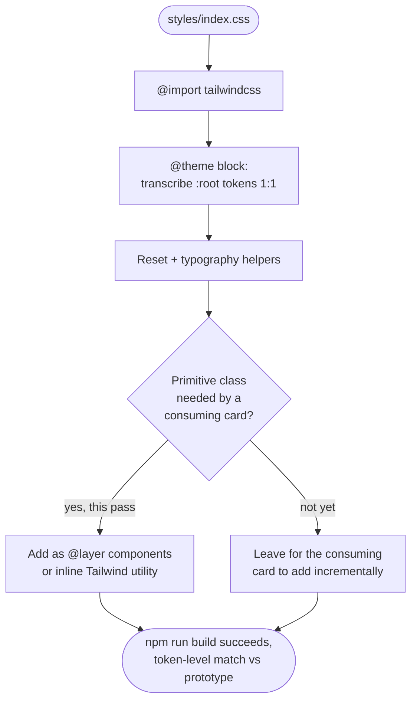
```mermaid
flowchart TD
  Start([styles/index.css]) --> ImportTw["@import tailwindcss"]
  ImportTw --> Theme["@theme block:\ntranscribe :root tokens 1:1"]
  Theme --> Reset["Reset + typography helpers"]
  Reset --> Primitives{"Primitive class\nneeded by a\nconsuming card?"}
  Primitives -->|yes, this pass| AddPrimitive["Add as @layer components\nor inline Tailwind utility"]
  Primitives -->|not yet| Skip["Leave for the consuming\ncard to add incrementally"]
  AddPrimitive --> Verify(["npm run build succeeds,\ntoken-level match vs prototype"])
  Skip --> Verify
```

- [ ] **Step 3: Edit the card in `01-foundation.md`**

Replace the Design System card's "Steps (pseudocode):" section (intro sentence, fenced ```css```
block, and the trailing "Wherever `frontend/`'s equivalent of `constants.ts`..." paragraph) with:

```markdown
**Flow:** [`diagrams/cards/foundation/design-system.mmd`](diagrams/cards/foundation/design-system.mmd)

**Steps (pseudocode):** [`pseudocode/foundation/design-system.ts`](pseudocode/foundation/design-system.ts)
```

- [ ] **Step 4: Verify the new .mmd renders**

Run:
```
npx --yes @mermaid-js/mermaid-cli -i docs/superpowers/plans/2026-08-10-ui-ux-overhaul-frontend/diagrams/cards/foundation/design-system.mmd -o /tmp/design-system.svg
```
Expected: `Generating single mermaid chart` with no error output.

- [ ] **Step 5: Verify links resolve**

Run:
```
ls docs/superpowers/plans/2026-08-10-ui-ux-overhaul-frontend/pseudocode/foundation/design-system.ts docs/superpowers/plans/2026-08-10-ui-ux-overhaul-frontend/diagrams/cards/foundation/design-system.mmd
```
Expected: both files listed.

---

### Task 3: Foundation — Shell & Routing

**Files:**
- Create: `docs/superpowers/plans/2026-08-10-ui-ux-overhaul-frontend/pseudocode/foundation/shell-and-routing.ts`
- Create: `docs/superpowers/plans/2026-08-10-ui-ux-overhaul-frontend/diagrams/cards/foundation/shell-and-routing.mmd`
- Modify: `docs/superpowers/plans/2026-08-10-ui-ux-overhaul-frontend/01-foundation.md` (Shell & Routing card)

- [ ] **Step 1: Write the pseudocode file**

```ts
// ---- layout/nav.ts ----
imports: LucideIcon type, {LayoutDashboard, Sparkles, CalendarDays, TrendingUp, Settings} from 'lucide-react'

type NavId: 'dashboard' | 'content' | 'calendar' | 'performance' | 'settings'
interface NavSection { section: string }
interface NavItem { id: NavId, label, icon: LucideIcon, title, sub, badge? }
type NavEntry: NavSection | NavItem

const NAV: NavEntry[]  // sections: Intelligence(Dashboard+badge), Create(Content Studio, Calendar),
                        // Measure(Performance), Account(Settings) — excludes prototype's content2

function navItems(): NavItem[]         // filters NAV down to NavItem entries
function navItemById(id): NavItem | undefined

// ---- components/shared/useOverlayStack.tsx ----
imports: createContext, useContext, useEffect, useState, ReactNode from 'react'

type OverlayKind: 'modal' | 'drawer' | 'sidebar'
interface OverlayStackValue { stack, isOpen(kind), push(kind), pop(kind), dismissTop(), scrimVisible }

function OverlayStackProvider({children}):
  state: stack: OverlayKind[] ← []
  on mount → add 'keydown' listener → on Escape: dismissTop()
  push(kind) → append if not already present
  pop(kind) → remove this kind specifically
  dismissTop() → remove only the last-pushed entry
  scrimVisible ← stack.length > 0
  render: children wrapped in context provider

function useOverlayStack(): OverlayStackValue   // useContext + null-check

// ---- components/shared/Modal.tsx ----
imports: X icon, useOverlayStack

props: { open, onClose, title?, children }
on open becomes true → push('modal'); on open becomes false or unmount → pop('modal')
if !open → render null
render: overlay markup with X close button

// ---- components/shared/Drawer.tsx ----
same push/pop-on-`open` pattern as Modal, but ALWAYS renders (visibility via data-open/
translate-x, not returning null, so CSS close transitions work)

// ---- components/shared/Toast.tsx ----
imports: CheckCircle2 icon

interface ToastEntry { id, message }
module-level counter: nextId

function ToastProvider({children}):
  state: toasts: ToastEntry[] ← []
  showToast(message) → append {id: nextId++, message}; after ~2.6s remove it again
  render: children + toast stack

function useToast(): { showToast }   // useContext + null-check

// ---- services/authStorage.ts ----
const STORAGE_KEY = 'ceview.auth'
function loadTokens(): AuthTokens | null   // JSON.parse(localStorage.getItem(KEY))
function saveTokens(tokens): void          // localStorage.setItem(KEY, ...)
function clearTokens(): void               // localStorage.removeItem(KEY)

// ---- services/auth.tsx ----
imports: apiClient, {clearTokens, loadTokens, saveTokens} from './authStorage', AuthUser type

interface AuthContextValue { user, isAuthenticated, login(email,pw), register(email,pw), logout() }

function AuthProvider({children}):
  state: user ← null, hydrated ← false
  on mount → if loadTokens() present → set placeholder user {id:'unknown', email:'', businessName:null}
             → hydrated ← true
  login(email,pw) → apiClient.auth.login → saveTokens → setUser(result.user)
  register(email,pw) → same shape as login, via apiClient.auth.register
  logout() → clearTokens() → setUser(null)
  if !hydrated → render null
  render: children wrapped in context provider

function useAuth(): AuthContextValue   // useContext + throws if outside AuthProvider

// ---- components/auth/AuthGate.tsx ----
imports: Navigate, Outlet from 'react-router-dom', useAuth

function AuthGate():
  if !isAuthenticated → redirect to /login
  else → render <Outlet/>

function RedirectIfAuthenticated({children}):
  if isAuthenticated → redirect to /dashboard
  else → render children (wraps LoginPage)

// ---- services/profileContext.tsx ----
imports: createContext/useContext/useState, Navigate/Outlet from 'react-router-dom', BusinessProfile type

const EMPTY_PROFILE: BusinessProfile   // default/empty shape until onboarding completes
interface ProfileContextValue { profile, setProfile }

function ProfileProvider({children}):
  state: profile ← EMPTY_PROFILE
  render: children wrapped in context provider

function useProfile(): ProfileContextValue   // useContext + null-check

function ProfileGate():
  pathname ← window.location.pathname (reads directly, not useLocation())
  if profile.uniquenessScore == null AND pathname !== '/onboarding' → redirect to /onboarding
  if profile.uniquenessScore != null AND pathname === '/onboarding' → redirect to /dashboard
  else → render <Outlet/>

// ---- layout/Sidebar.tsx ----
imports: NavLink, ChevronDown icon, NAV, useAuth

const SETTINGS_TABS: [{tab, label}] for profile/platforms/workspace

function Sidebar():
  { user, logout } ← useAuth()
  state: settingsOpen ← false
  render: NAV's sections/items; NavLink highlights current route; Settings expands inline to
          its 3 sub-tabs (components/settings/, see Card 9, Cards 22-23); footer shows user
          identity + sign-out action (calls logout())

// ---- layout/Topbar.tsx ----
imports: useLocation, Bell/Menu/Search icons, navItemById, NavId type

props: { onToggleSidebar? }
function navIdFromPath(pathname): NavId   // e.g. /settings/profile -> 'settings'

function Topbar({onToggleSidebar}):
  { pathname } ← useLocation()
  navItem ← navItemById(navIdFromPath(pathname))
  render: navItem's title/subtitle, burger button (calls onToggleSidebar), inert notification/search buttons

// ---- layout/AppShell.tsx ----
imports: Outlet, Sidebar, Topbar

function AppShell():
  render: <Sidebar/> + <Topbar/> + <main><Outlet/></main>   // scrollable, beneath topbar

// ---- layout/RoutePlaceholder.tsx ----
imports: navItemById, NavId type

props: { navId?, title?, sub? }
function RoutePlaceholder({navId, title, sub}):
  render: centered "not built yet" message; sources title/sub from navItemById(navId) if not passed explicitly

// ---- components/auth/LoginPage.tsx ----
imports: useState, useAuth

function LoginPage():
  { login, register } ← useAuth()
  state: mode ← 'signin'|'signup', email, password, error, submitting
  on submit → mode === 'signin' ? login(email,password) : register(email,password)
  render: split-pane — brand panel with stat tiles | Sign in/Create account tab switcher +
          email+password form; Google OAuth button rendered but disabled

// ---- App.tsx ----
imports: createBrowserRouter/Navigate/RouterProvider, AuthGate + RedirectIfAuthenticated,
         LoginPage, AppShell, RoutePlaceholder, ProfileProvider + ProfileGate,
         OverlayStackProvider, ToastProvider

function App():
  router ← createBrowserRouter([
    /login → RedirectIfAuthenticated(LoginPage)
    element: AuthGate → children:
      element: ProfileGate → children:
        /onboarding → RoutePlaceholder (no AppShell — wizard internals are a later card)
        element: AppShell → children:
          /dashboard, /content, /calendar, /performance → RoutePlaceholder (each)
          /settings → redirect to /settings/profile
          /settings/:tab → RoutePlaceholder
    * → redirect to /dashboard
  ])
  // Provider nesting: ProfileProvider > OverlayStackProvider > ToastProvider > RouterProvider.
  // AuthProvider is NOT here — it wraps App one level up, in index.tsx.
  render: <ProfileProvider><OverlayStackProvider><ToastProvider>
            <RouterProvider router={router}/>
          </ToastProvider></OverlayStackProvider></ProfileProvider>
```

- [ ] **Step 2: Write the flowchart file**

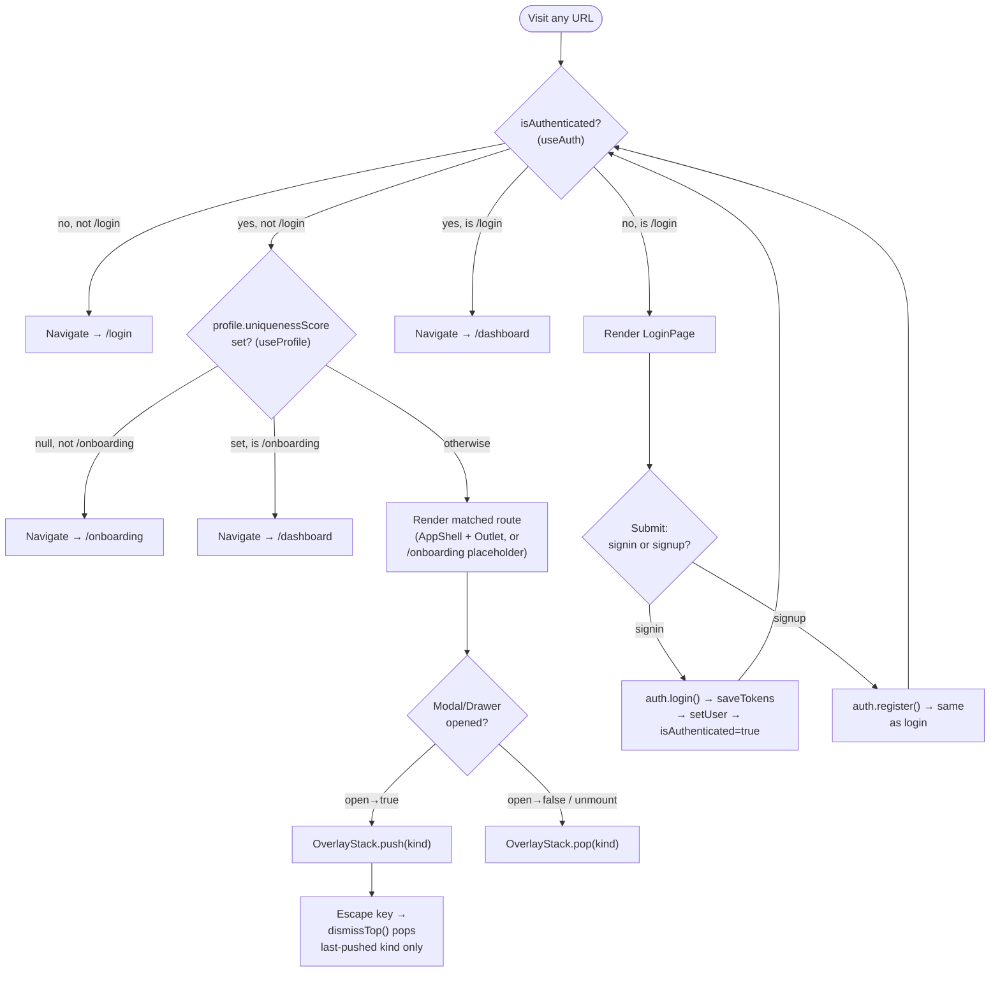
```mermaid
flowchart TD
  Visit(["Visit any URL"]) --> AuthCheck{"isAuthenticated?\n(useAuth)"}
  AuthCheck -->|no, not /login| RedirectLogin["Navigate → /login"]
  AuthCheck -->|no, is /login| ShowLogin["Render LoginPage"]
  AuthCheck -->|yes, is /login| RedirectDash1["Navigate → /dashboard"]
  AuthCheck -->|yes, not /login| ProfileCheck{"profile.uniquenessScore\nset? (useProfile)"}

  ProfileCheck -->|null, not /onboarding| RedirectOnboard["Navigate → /onboarding"]
  ProfileCheck -->|set, is /onboarding| RedirectDash2["Navigate → /dashboard"]
  ProfileCheck -->|otherwise| RenderRoute["Render matched route\n(AppShell + Outlet, or\n/onboarding placeholder)"]

  RenderRoute --> Overlay{"Modal/Drawer\nopened?"}
  Overlay -->|open→true| PushStack["OverlayStack.push(kind)"]
  Overlay -->|open→false / unmount| PopStack["OverlayStack.pop(kind)"]
  PushStack --> EscListen["Escape key →\ndismissTop() pops\nlast-pushed kind only"]

  ShowLogin --> SubmitAuth{"Submit:\nsignin or signup?"}
  SubmitAuth -->|signin| Login["auth.login() → saveTokens\n→ setUser → isAuthenticated=true"]
  SubmitAuth -->|signup| Register["auth.register() → same\nas login"]
  Login --> AuthCheck
  Register --> AuthCheck
```

- [ ] **Step 3: Edit the card in `01-foundation.md`**

Replace the Shell & Routing card's "Steps (pseudocode):" section (from its intro sentence through
the final closing ` ``` ` of the `App.tsx` fenced block) with:

```markdown
**Flow:** [`diagrams/cards/foundation/shell-and-routing.mmd`](diagrams/cards/foundation/shell-and-routing.mmd)

**Steps (pseudocode):** [`pseudocode/foundation/shell-and-routing.ts`](pseudocode/foundation/shell-and-routing.ts)
```

- [ ] **Step 4: Verify the new .mmd renders**

Run:
```
npx --yes @mermaid-js/mermaid-cli -i docs/superpowers/plans/2026-08-10-ui-ux-overhaul-frontend/diagrams/cards/foundation/shell-and-routing.mmd -o /tmp/shell-and-routing.svg
```
Expected: `Generating single mermaid chart` with no error output.

- [ ] **Step 5: Verify links resolve**

Run:
```
ls docs/superpowers/plans/2026-08-10-ui-ux-overhaul-frontend/pseudocode/foundation/shell-and-routing.ts docs/superpowers/plans/2026-08-10-ui-ux-overhaul-frontend/diagrams/cards/foundation/shell-and-routing.mmd
```
Expected: both files listed.

---

### Task 4: Foundation — Fixture Data Layer

**Files:**
- Create: `docs/superpowers/plans/2026-08-10-ui-ux-overhaul-frontend/pseudocode/foundation/fixture-data-layer.ts`
- Create: `docs/superpowers/plans/2026-08-10-ui-ux-overhaul-frontend/diagrams/cards/foundation/fixture-data-layer.mmd`
- Modify: `docs/superpowers/plans/2026-08-10-ui-ux-overhaul-frontend/01-foundation.md` (Fixture Data Layer card)

- [ ] **Step 1: Write the pseudocode file**

```ts
// ---- services/fixtures/markets.ts ---- (representative; notifications/content/omcs/campaign/
// posts/members follow the same "typed interface + exported MOCK_* constant" shape)
interface ChartDataPoint { week, history, forecast, seasonality, forex, gdp, spike: 0|1 }
function buildChartData(o): ChartDataPoint[]
interface Market { id, rank, name, city, ...+20 more fields incl. chartData }
const MOCK_MARKETS: Market[]           // korea, japan, usa
const CATEGORY_MARKET_SCORES: Record<string, Record<string, number>>
function marketsForCategory(category): Market[]   // re-ranks MOCK_MARKETS via CATEGORY_MARKET_SCORES

// ---- types.ts ----
interface AuthUser { id, email, businessName }
interface AuthTokens { accessToken, refreshToken? }
interface BusinessProfile { businessProfileId, businessName, categories, coreServices,
  description, uvp, imagePreview, uniquenessScore, slogan, industry, vibes, website, logo, socials }
type PlatformId: 'instagram' | 'tiktok' | 'facebook' | 'naver'
interface PlatformConnection { platform, connected, handle, connectedAt }
type PostStatus: 'draft' | 'scheduled' | 'published'
interface SocialPost { id, platform, status, caption, scheduledFor, publishedAt, marketId }
interface PostMetric { postId, impressions, engagements, clicks, engagementRate }
interface WorkspaceMember { id, name, email, role, invitedAt, status }
  // models a future real-backend shape — NOT what apiClient.workspace.members() returns today
  // (that's fixtures/members.ts's WorkspaceMemberFixture)

// ---- services/apiClient.ts ----
imports: loadTokens, all MOCK_*/helper exports from fixtures/*, WorkspaceMemberFixture type,
         PlatformConnection + PostMetric types from '../types'

const USE_FIXTURES ← import.meta.env.VITE_USE_FIXTURES === 'true'
const BASE_URL ← import.meta.env.VITE_API_BASE_URL ?? 'http://localhost:8080'

function delay(value, ms=250): Promise    // resolves value after ms
function request(path, init?): Promise
  attach Bearer token from loadTokens() if present
  throw on non-2xx; return undefined on 204; else parse JSON

const apiClient:
  markets.list() → USE_FIXTURES ? delay(MOCK_MARKETS) : request('/api/markets')
  markets.chartData(marketId) → USE_FIXTURES ? delay(market's chartData) : request(`/api/markets/${id}/chart`)
  markets.categoryScores() → USE_FIXTURES ? delay(CATEGORY_MARKET_SCORES) : request(...)
  markets.forCategory(category) → USE_FIXTURES ? delay(marketsForCategory(category)) : request(...)
  notifications.list() → USE_FIXTURES ? delay(MOCK_NOTIFICATIONS) : request('/api/notifications')
  content.list() → USE_FIXTURES ? delay(MOCK_CONTENT) : request('/api/content')
  omcs.rubric() → USE_FIXTURES ? delay(OMCS_RUBRIC_LABELS) : request(...)
  omcs.evaluate() → USE_FIXTURES ? delay(MOCK_OMCS) : request(..., POST)
  campaign.defaultInput/history/report() → USE_FIXTURES ? delay(fixture) : request(...)
  posts.list() → USE_FIXTURES ? delay(MOCK_POSTS) : request('/api/posts')
  posts.metrics(postId) → USE_FIXTURES ? delay(lookup in MOCK_POST_METRICS) : request(...)
  connections.list/connect/disconnect() → USE_FIXTURES ? delay(...) : request(...)
  workspace.members() → USE_FIXTURES ? delay(MOCK_MEMBERS) : request<WorkspaceMemberFixture[]>(...)
    // returns WorkspaceMemberFixture[], NOT types.ts's WorkspaceMember
  workspace.invite(email) → USE_FIXTURES ? delay({ok:true}) : request(..., POST)
  auth.login(email,pw) → always request(...) — no fixture branch
  auth.register(email,pw) → same shape as login
```

- [ ] **Step 2: Write the flowchart file**

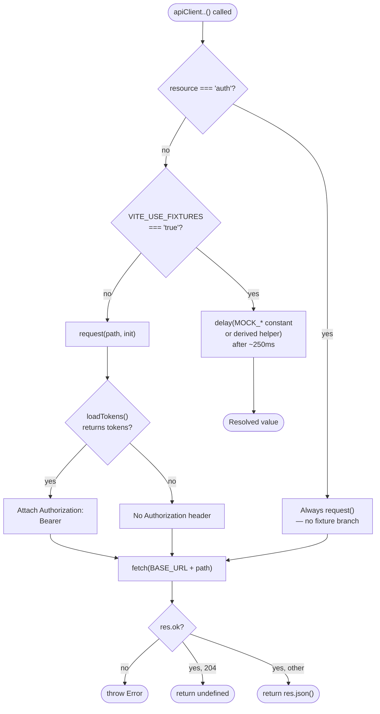
```mermaid
flowchart TD
  Call(["apiClient.<resource>.<method>() called"]) --> IsAuth{"resource === 'auth'?"}
  IsAuth -->|yes| AlwaysReal["Always request()\n— no fixture branch"]
  IsAuth -->|no| CheckFlag{"VITE_USE_FIXTURES\n=== 'true'?"}
  CheckFlag -->|yes| Fixture["delay(MOCK_* constant\nor derived helper)\nafter ~250ms"]
  CheckFlag -->|no| Real["request(path, init)"]
  Real --> Token{"loadTokens()\nreturns tokens?"}
  Token -->|yes| Bearer["Attach Authorization:\nBearer <token>"]
  Token -->|no| NoAuth["No Authorization header"]
  Bearer --> Fetch["fetch(BASE_URL + path)"]
  NoAuth --> Fetch
  Fetch --> Status{"res.ok?"}
  Status -->|no| Throw(["throw Error"])
  Status -->|yes, 204| Undef(["return undefined"])
  Status -->|yes, other| Json(["return res.json()"])
  Fixture --> Resolved(["Resolved value"])
  AlwaysReal --> Fetch
```

- [ ] **Step 3: Edit the card in `01-foundation.md`**

Replace the Fixture Data Layer card's "Steps (pseudocode):" section (intro sentence through the
closing ` ``` ` of the `services/apiClient.ts` fenced block) with:

```markdown
**Flow:** [`diagrams/cards/foundation/fixture-data-layer.mmd`](diagrams/cards/foundation/fixture-data-layer.mmd)

**Steps (pseudocode):** [`pseudocode/foundation/fixture-data-layer.ts`](pseudocode/foundation/fixture-data-layer.ts)
```

- [ ] **Step 4: Verify the new .mmd renders**

Run:
```
npx --yes @mermaid-js/mermaid-cli -i docs/superpowers/plans/2026-08-10-ui-ux-overhaul-frontend/diagrams/cards/foundation/fixture-data-layer.mmd -o /tmp/fixture-data-layer.svg
```
Expected: `Generating single mermaid chart` with no error output.

- [ ] **Step 5: Verify links resolve**

Run:
```
ls docs/superpowers/plans/2026-08-10-ui-ux-overhaul-frontend/pseudocode/foundation/fixture-data-layer.ts docs/superpowers/plans/2026-08-10-ui-ux-overhaul-frontend/diagrams/cards/foundation/fixture-data-layer.mmd
```
Expected: both files listed.

---

### Task 5: Module 1 — Wizard Shell & Step 1 Basic Info

**Files:**
- Create: `docs/superpowers/plans/2026-08-10-ui-ux-overhaul-frontend/pseudocode/module-1/wizard-shell-step-1.ts`
- Create: `docs/superpowers/plans/2026-08-10-ui-ux-overhaul-frontend/diagrams/cards/module-1/wizard-shell-step-1.mmd`
- Modify: `docs/superpowers/plans/2026-08-10-ui-ux-overhaul-frontend/02-module-1.md` (Wizard Shell & Step 1 card)

- [ ] **Step 1: Write the pseudocode file**

```ts
// ---- components/module-1/onboarding/obDraft.ts ----
imports: createContext/useContext/useState, ReactNode from 'react'

interface ObDraft { businessName, industry, slogan, vibes: string[] (Card 5),
  coreServices: string[] (Card 5), description (Card 6), uvp (Card 6),
  socials: Record<string,string> (Card 7), logo: string|null (Card 7, data URL), website (Card 7) }
const EMPTY_DRAFT: ObDraft   // all fields empty

interface ObDraftContextValue { draft, setDraft }
function ObDraftProvider({children}):
  state: draft ← EMPTY_DRAFT
  render: children wrapped in context provider

function useObDraft(): ObDraftContextValue   // useContext + null-check

function stepValid(step, draft): boolean
  // one branch per step index — Steps 2-5's branches land with Cards 5-8;
  // this card only implements the Step 1 branch
  case 0 (Step 1, this card): businessName.length > 1 AND industry set
  case 1 (Step 2, Card 5): false — placeholder until that card lands
  case 2 (Step 3, Card 6): false — placeholder
  case 3 (Step 4, Card 7): true — no gate
  case 4 (Step 5, Card 8): false — placeholder
  default: false

// ---- components/module-1/onboarding/OnboardingWizard.tsx ----
imports: useState, {ObDraftProvider, stepValid, useObDraft}, BasicInfoStep
// later cards import BrandIdentityStep, StructuredInputsStep, AssetsLinksStep, AnalysisStep

const STEPS: ['Basic Info','Brand Identity','Structured Inputs','Assets & Links','Analysis']

function OnboardingWizardInner():
  state: currentStep ← 0
  { draft } ← useObDraft()
  canContinue ← stepValid(currentStep, draft)
  render: side list of STEPS (each marked done/current/pending vs currentStep) +
          progress bar sized to (currentStep+1)/STEPS.length +
          active step's panel (only BasicInfoStep implemented; others show a placeholder) +
          footer: Back button (hidden on step 1), Continue button (disabled unless canContinue)
  on Back click → currentStep - 1
  on Continue click → currentStep + 1

function OnboardingWizard():
  render: <ObDraftProvider><OnboardingWizardInner/></ObDraftProvider>

// ---- components/module-1/onboarding/steps/BasicInfoStep.tsx ----
imports: useObDraft

const BUSINESS_CATEGORIES: [7 fixed categories]
const DEMO_BUSINESS: fixed demo values for every obDraft field

function BasicInfoStep():
  { draft, setDraft } ← useObDraft()
  on businessName input change → setDraft({...draft, businessName})
  on industry select change → setDraft({...draft, industry})
  on slogan input change → setDraft({...draft, slogan})
  on "Fill with demo business" click → setDraft({...draft, ...DEMO_BUSINESS})
  render: business name input (required), industry select (required, BUSINESS_CATEGORIES),
          slogan input (optional), demo-fill button
```

- [ ] **Step 2: Write the flowchart file**

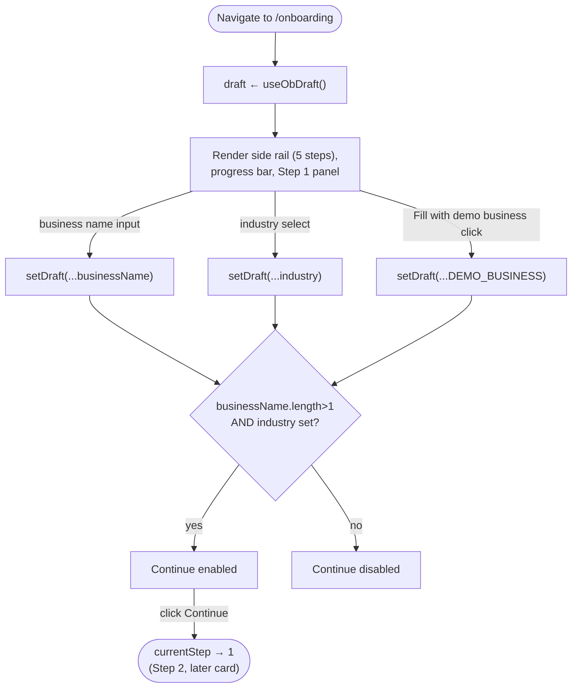
```mermaid
flowchart TD
  Mount(["Navigate to /onboarding"]) --> ReadDraft["draft ← useObDraft()"]
  ReadDraft --> Render["Render side rail (5 steps),\nprogress bar, Step 1 panel"]
  Render -->|business name input| UpdateName["setDraft(...businessName)"]
  Render -->|industry select| UpdateIndustry["setDraft(...industry)"]
  Render -->|"Fill with demo business" click| FillDemo["setDraft(...DEMO_BUSINESS)"]
  UpdateName --> Valid{"businessName.length>1\nAND industry set?"}
  UpdateIndustry --> Valid
  FillDemo --> Valid
  Valid -->|yes| ContinueEnabled["Continue enabled"]
  Valid -->|no| ContinueDisabled["Continue disabled"]
  ContinueEnabled -->|click Continue| NextStep(["currentStep → 1\n(Step 2, later card)"])
```

- [ ] **Step 3: Edit the card in `02-module-1.md`**

Replace the Wizard Shell & Step 1 card's "Steps (pseudocode):" section (from its heading through the
closing ` ``` ` of the `BasicInfoStep.tsx` fenced block) with:

```markdown
**Flow:** [`diagrams/cards/module-1/wizard-shell-step-1.mmd`](diagrams/cards/module-1/wizard-shell-step-1.mmd)

**Steps (pseudocode):** [`pseudocode/module-1/wizard-shell-step-1.ts`](pseudocode/module-1/wizard-shell-step-1.ts)
```

- [ ] **Step 4: Verify the new .mmd renders**

Run:
```
npx --yes @mermaid-js/mermaid-cli -i docs/superpowers/plans/2026-08-10-ui-ux-overhaul-frontend/diagrams/cards/module-1/wizard-shell-step-1.mmd -o /tmp/wizard-shell-step-1.svg
```
Expected: `Generating single mermaid chart` with no error output.

- [ ] **Step 5: Verify links resolve**

Run:
```
ls docs/superpowers/plans/2026-08-10-ui-ux-overhaul-frontend/pseudocode/module-1/wizard-shell-step-1.ts docs/superpowers/plans/2026-08-10-ui-ux-overhaul-frontend/diagrams/cards/module-1/wizard-shell-step-1.mmd
```
Expected: both files listed.

---

### Task 6: Module 1 — Step 2 Brand Identity

**Files:**
- Create: `docs/superpowers/plans/2026-08-10-ui-ux-overhaul-frontend/pseudocode/module-1/brand-identity-step-2.ts`
- Create: `docs/superpowers/plans/2026-08-10-ui-ux-overhaul-frontend/diagrams/cards/module-1/brand-identity-step-2.mmd`
- Modify: `docs/superpowers/plans/2026-08-10-ui-ux-overhaul-frontend/02-module-1.md` (Step 2 Brand Identity card)

- [ ] **Step 1: Write the pseudocode file**

```ts
// ---- components/module-1/onboarding/steps/BrandIdentityStep.tsx ----
imports: useRef, useState, useObDraft

const VIBES: [8 fixed vibe options]

function BrandIdentityStep():
  { draft, setDraft } ← useObDraft()
  state: tagInput ← '', inputRef

  toggleVibe(vibe):
    // multi-select, no minimum enforced by the chip itself — stepValid() enforces >=1
    vibes ← draft.vibes includes vibe ? remove it : append it
    setDraft({...draft, vibes})

  on tag input Enter key:
    value ← tagInput.trim()
    if empty or already in coreServices → skip
    else → setDraft({...draft, coreServices: [...coreServices, value]}); clear tagInput; refocus input

  removeService(service):
    setDraft({...draft, coreServices: coreServices without service})

  render: chip grid (8 VIBES, each toggle-pressed per draft.vibes) +
          tag input (Enter to add) +
          tag list (each with a ✕ remove button)

// ---- components/module-1/onboarding/obDraft.ts (extension) ----
stepValid case 1 (Step 2): draft.vibes.length >= 1 AND draft.coreServices.length >= 1
```

- [ ] **Step 2: Write the flowchart file**

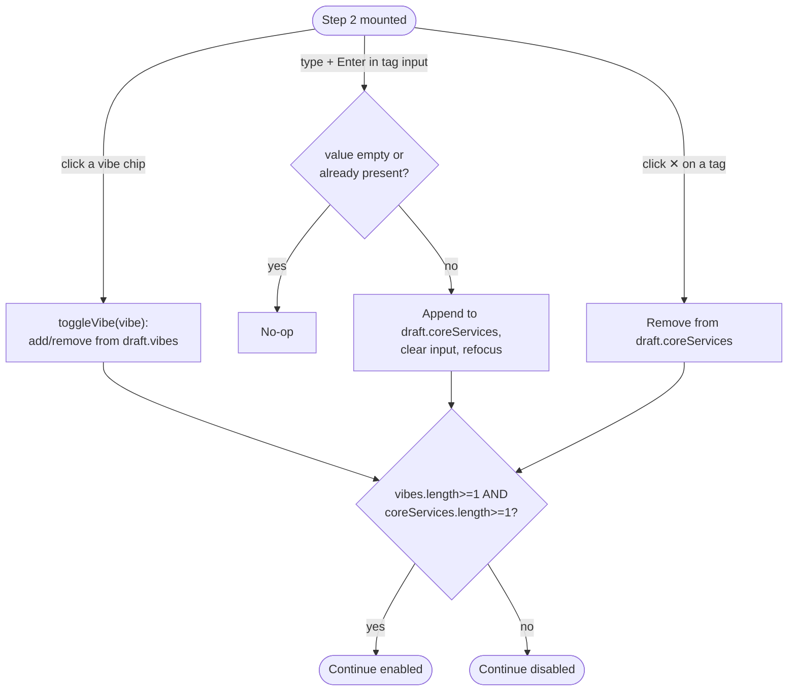
```mermaid
flowchart TD
  Render(["Step 2 mounted"]) -->|click a vibe chip| ToggleVibe["toggleVibe(vibe):\nadd/remove from draft.vibes"]
  Render -->|type + Enter in tag input| CheckTag{"value empty or\nalready present?"}
  CheckTag -->|yes| SkipTag["No-op"]
  CheckTag -->|no| AddTag["Append to draft.coreServices,\nclear input, refocus"]
  Render -->|click ✕ on a tag| RemoveTag["Remove from draft.coreServices"]
  ToggleVibe --> Gate{"vibes.length>=1 AND\ncoreServices.length>=1?"}
  AddTag --> Gate
  RemoveTag --> Gate
  Gate -->|yes| ContinueEnabled(["Continue enabled"])
  Gate -->|no| ContinueDisabled(["Continue disabled"])
```

- [ ] **Step 3: Edit the card in `02-module-1.md`**

Replace the Step 2 Brand Identity card's "Steps (pseudocode):" section (heading through the closing
` ``` ` of the fenced block and the trailing "Extend `obDraft.ts`'s..." sentence) with:

```markdown
**Flow:** [`diagrams/cards/module-1/brand-identity-step-2.mmd`](diagrams/cards/module-1/brand-identity-step-2.mmd)

**Steps (pseudocode):** [`pseudocode/module-1/brand-identity-step-2.ts`](pseudocode/module-1/brand-identity-step-2.ts)
```

- [ ] **Step 4: Verify the new .mmd renders**

Run:
```
npx --yes @mermaid-js/mermaid-cli -i docs/superpowers/plans/2026-08-10-ui-ux-overhaul-frontend/diagrams/cards/module-1/brand-identity-step-2.mmd -o /tmp/brand-identity-step-2.svg
```
Expected: `Generating single mermaid chart` with no error output.

- [ ] **Step 5: Verify links resolve**

Run:
```
ls docs/superpowers/plans/2026-08-10-ui-ux-overhaul-frontend/pseudocode/module-1/brand-identity-step-2.ts docs/superpowers/plans/2026-08-10-ui-ux-overhaul-frontend/diagrams/cards/module-1/brand-identity-step-2.mmd
```
Expected: both files listed.

---

### Task 7: Module 1 — Step 3 Structured Inputs

**Files:**
- Create: `docs/superpowers/plans/2026-08-10-ui-ux-overhaul-frontend/pseudocode/module-1/structured-inputs-step-3.ts`
- Create: `docs/superpowers/plans/2026-08-10-ui-ux-overhaul-frontend/diagrams/cards/module-1/structured-inputs-step-3.mmd`
- Modify: `docs/superpowers/plans/2026-08-10-ui-ux-overhaul-frontend/02-module-1.md` (Step 3 Structured Inputs card)

- [ ] **Step 1: Write the pseudocode file**

```ts
// ---- components/module-1/onboarding/steps/StructuredInputsStep.tsx ----
imports: useObDraft

const MIN_WORDS: { description: 50, uvp: 30 }

function wordCount(text): number   // 0 if blank, else trimmed whitespace-split length

function WordCountHint({field, count}):
  min ← MIN_WORDS[field]
  if count === 0 → neutral "Min N words" hint
  else if count < min → red "N / min words — X more needed" hint
  else → green "N words — threshold met" hint

function StructuredInputsStep():
  { draft, setDraft } ← useObDraft()
  on description textarea change → setDraft({...draft, description})
  on uvp textarea change → setDraft({...draft, uvp})
  render: description textarea + its WordCountHint, uvp textarea + its WordCountHint

// ---- components/module-1/onboarding/obDraft.ts (extension) ----
stepValid case 2 (Step 3): wordCount(draft.description) >= 50 AND wordCount(draft.uvp) >= 30
  // both fields independently meet their minimum
```

- [ ] **Step 2: Write the flowchart file**

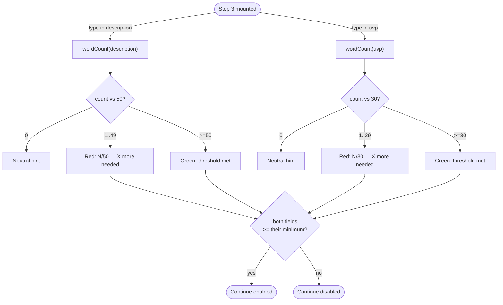
```mermaid
flowchart TD
  Render(["Step 3 mounted"]) -->|type in description| CountDesc["wordCount(description)"]
  Render -->|type in uvp| CountUvp["wordCount(uvp)"]
  CountDesc --> DescBand{"count vs 50?"}
  DescBand -->|0| DescNeutral["Neutral hint"]
  DescBand -->|"1..49"| DescRed["Red: N/50 — X more needed"]
  DescBand -->|">=50"| DescGreen["Green: threshold met"]
  CountUvp --> UvpBand{"count vs 30?"}
  UvpBand -->|0| UvpNeutral["Neutral hint"]
  UvpBand -->|"1..29"| UvpRed["Red: N/30 — X more needed"]
  UvpBand -->|">=30"| UvpGreen["Green: threshold met"]
  DescGreen --> Gate{"both fields\n>= their minimum?"}
  UvpGreen --> Gate
  DescRed --> Gate
  UvpRed --> Gate
  Gate -->|yes| ContinueEnabled(["Continue enabled"])
  Gate -->|no| ContinueDisabled(["Continue disabled"])
```

- [ ] **Step 3: Edit the card in `02-module-1.md`**

Replace the Step 3 Structured Inputs card's "Steps (pseudocode):" section (heading through the
closing ` ``` ` of the fenced block and the trailing "Extend `obDraft.ts`'s..." sentence) with:

```markdown
**Flow:** [`diagrams/cards/module-1/structured-inputs-step-3.mmd`](diagrams/cards/module-1/structured-inputs-step-3.mmd)

**Steps (pseudocode):** [`pseudocode/module-1/structured-inputs-step-3.ts`](pseudocode/module-1/structured-inputs-step-3.ts)
```

- [ ] **Step 4: Verify the new .mmd renders**

Run:
```
npx --yes @mermaid-js/mermaid-cli -i docs/superpowers/plans/2026-08-10-ui-ux-overhaul-frontend/diagrams/cards/module-1/structured-inputs-step-3.mmd -o /tmp/structured-inputs-step-3.svg
```
Expected: `Generating single mermaid chart` with no error output.

- [ ] **Step 5: Verify links resolve**

Run:
```
ls docs/superpowers/plans/2026-08-10-ui-ux-overhaul-frontend/pseudocode/module-1/structured-inputs-step-3.ts docs/superpowers/plans/2026-08-10-ui-ux-overhaul-frontend/diagrams/cards/module-1/structured-inputs-step-3.mmd
```
Expected: both files listed.

---

### Task 8: Module 1 — Step 4 Assets & Links

**Files:**
- Create: `docs/superpowers/plans/2026-08-10-ui-ux-overhaul-frontend/pseudocode/module-1/assets-links-step-4.ts`
- Create: `docs/superpowers/plans/2026-08-10-ui-ux-overhaul-frontend/diagrams/cards/module-1/assets-links-step-4.mmd`
- Modify: `docs/superpowers/plans/2026-08-10-ui-ux-overhaul-frontend/02-module-1.md` (Step 4 Assets & Links card)

- [ ] **Step 1: Write the pseudocode file**

```ts
// ---- components/module-1/onboarding/steps/AssetsLinksStep.tsx ----
imports: useState, useObDraft

const PLATFORM_META: [{platform, icon, brandColor, label}] for each known platform

function AssetsLinksStep():
  { draft, setDraft } ← useObDraft()
  state: dragOver ← false

  handleFile(file):
    read file via FileReader → onload: setDraft({...draft, logo: dataURL})

  render: one text input per PLATFORM_META entry, bound to draft.socials[platform] +
          logo dropzone (click opens file picker; drag-over highlights; drop/pick calls
          handleFile; shows draft.logo preview if set, else empty-state prompt) +
          website text input

  // no validity gate — Continue always enabled regardless of field contents

// ---- components/module-1/onboarding/obDraft.ts (no change) ----
stepValid case 3 (Step 4): stays `true` — no gate
```

- [ ] **Step 2: Write the flowchart file**

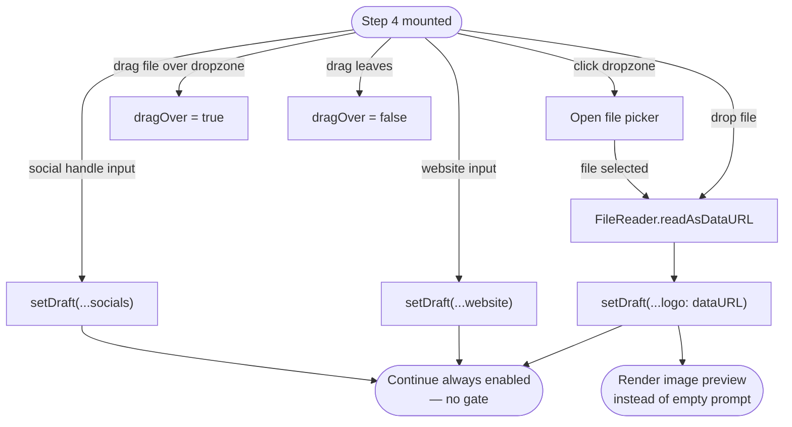
```mermaid
flowchart TD
  Render(["Step 4 mounted"]) -->|social handle input| UpdateSocials["setDraft(...socials)"]
  Render -->|click dropzone| OpenPicker["Open file picker"]
  Render -->|drag file over dropzone| Highlight["dragOver = true"]
  Render -->|drag leaves| Unhighlight["dragOver = false"]
  OpenPicker -->|file selected| HandleFile["FileReader.readAsDataURL"]
  Render -->|drop file| HandleFile
  HandleFile --> SetLogo["setDraft(...logo: dataURL)"]
  SetLogo --> ShowPreview(["Render image preview\ninstead of empty prompt"])
  Render -->|website input| UpdateWebsite["setDraft(...website)"]
  UpdateSocials --> AlwaysValid(["Continue always enabled\n— no gate"])
  UpdateWebsite --> AlwaysValid
  SetLogo --> AlwaysValid
```

- [ ] **Step 3: Edit the card in `02-module-1.md`**

Replace the Step 4 Assets & Links card's "Steps (pseudocode):" section (heading through the closing
` ``` ` of the fenced block and the trailing "`obDraft.ts`'s `stepValid`..." sentence) with:

```markdown
**Flow:** [`diagrams/cards/module-1/assets-links-step-4.mmd`](diagrams/cards/module-1/assets-links-step-4.mmd)

**Steps (pseudocode):** [`pseudocode/module-1/assets-links-step-4.ts`](pseudocode/module-1/assets-links-step-4.ts)
```

- [ ] **Step 4: Verify the new .mmd renders**

Run:
```
npx --yes @mermaid-js/mermaid-cli -i docs/superpowers/plans/2026-08-10-ui-ux-overhaul-frontend/diagrams/cards/module-1/assets-links-step-4.mmd -o /tmp/assets-links-step-4.svg
```
Expected: `Generating single mermaid chart` with no error output.

- [ ] **Step 5: Verify links resolve**

Run:
```
ls docs/superpowers/plans/2026-08-10-ui-ux-overhaul-frontend/pseudocode/module-1/assets-links-step-4.ts docs/superpowers/plans/2026-08-10-ui-ux-overhaul-frontend/diagrams/cards/module-1/assets-links-step-4.mmd
```
Expected: both files listed.

---

### Task 9: Module 1 — Step 5 Analysis

**Files:**
- Create: `docs/superpowers/plans/2026-08-10-ui-ux-overhaul-frontend/pseudocode/module-1/analysis-step-5.ts`
- Create: `docs/superpowers/plans/2026-08-10-ui-ux-overhaul-frontend/diagrams/cards/module-1/analysis-step-5.mmd`
- Modify: `docs/superpowers/plans/2026-08-10-ui-ux-overhaul-frontend/02-module-1.md` (Step 5 Analysis card)

- [ ] **Step 1: Write the pseudocode file**

```ts
// ---- components/module-1/onboarding/steps/AnalysisStep.tsx ----
imports: useEffect, useState, useNavigate, useObDraft, useProfile, useToast, apiClient,
         InferredCategoryBoard + InferredCategory type, OverallScoreCard, ActionableScoreCard,
         ComputeUniquenessButton

type Phase: 'idle' | 'analyzing' | 'categories' | 'computing' | 'scored'

function AnalysisStep():
  { draft } ← useObDraft(); { setProfile } ← useProfile(); { showToast } ← useToast()
  navigate ← useNavigate()
  state: phase ← 'idle', categories ← [], scores ← null

  on mount:
    phase ← 'analyzing'
    apiClient classify (combined description+UVP+core-services text)
      → on response: store categories (name/confidence/selected — top 2 pre-selected), phase ← 'categories'

  toggleCategory(name):
    if target is selected AND it's the only selected one → showToast(block message); no-op
    else → toggle its selected flag
    if scores already computed → phase reverts to 'categories' (stale score discarded)

  computeUniqueness():
    phase ← 'computing'
    apiClient uniqueness (current selection)
      → on response: store {overallScore, semanticsScore, categoryScore}, phase ← 'scored'

  finishWizard():
    setProfile({...draft, categories: selected names, uniquenessScore: scores.overallScore, ...})
    mark filled-in social handles as "connected"
    navigate('/dashboard')

  render:
    if phase === 'analyzing' → skeleton + embedding-pipeline banner
    if phase in [categories, computing, scored] → InferredCategoryBoard + ComputeUniquenessButton
    if phase === 'scored' → OverallScoreCard + 2x ActionableScoreCard +
      (overallScore >= 70 ? pass banner : warn banner with "Strengthen my UVP" link back to Step 3) +
      Finish button (calls finishWizard)
```

- [ ] **Step 2: Write the flowchart file**

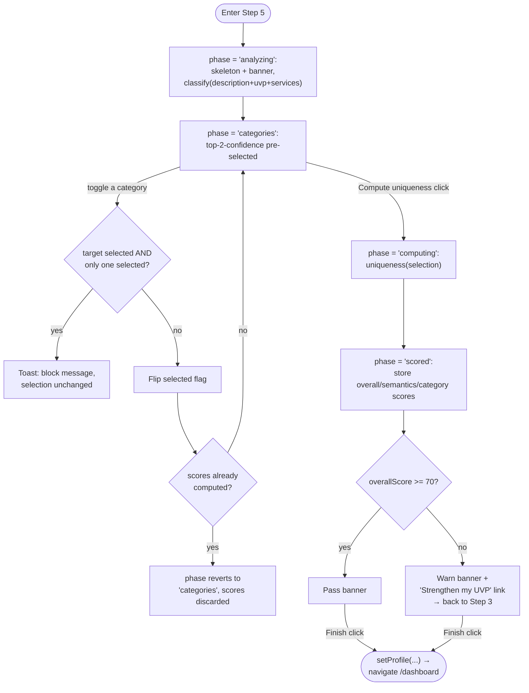
```mermaid
flowchart TD
  Enter(["Enter Step 5"]) --> Analyzing["phase = 'analyzing':\nskeleton + banner,\nclassify(description+uvp+services)"]
  Analyzing --> Categories["phase = 'categories':\ntop-2-confidence pre-selected"]
  Categories -->|toggle a category| CheckOnly{"target selected AND\nonly one selected?"}
  CheckOnly -->|yes| Block["Toast: block message,\nselection unchanged"]
  CheckOnly -->|no| Toggle["Flip selected flag"]
  Toggle --> StaleCheck{"scores already\ncomputed?"}
  StaleCheck -->|yes| Discard["phase reverts to\n'categories', scores discarded"]
  StaleCheck -->|no| Categories
  Categories -->|"Compute uniqueness" click| Computing["phase = 'computing':\nuniqueness(selection)"]
  Computing --> Scored["phase = 'scored':\nstore overall/semantics/category scores"]
  Scored --> ScoreBand{"overallScore >= 70?"}
  ScoreBand -->|yes| Pass["Pass banner"]
  ScoreBand -->|no| Warn["Warn banner +\n'Strengthen my UVP' link\n→ back to Step 3"]
  Pass -->|Finish click| Finish(["setProfile(...) →\nnavigate /dashboard"])
  Warn -->|Finish click| Finish
```

- [ ] **Step 3: Edit the card in `02-module-1.md`**

Replace the Step 5 Analysis card's "Steps (pseudocode):" section (heading through the closing
` ``` ` of the `AnalysisStep.tsx` fenced block) with:

```markdown
**Flow:** [`diagrams/cards/module-1/analysis-step-5.mmd`](diagrams/cards/module-1/analysis-step-5.mmd)

**Steps (pseudocode):** [`pseudocode/module-1/analysis-step-5.ts`](pseudocode/module-1/analysis-step-5.ts)
```

- [ ] **Step 4: Verify the new .mmd renders**

Run:
```
npx --yes @mermaid-js/mermaid-cli -i docs/superpowers/plans/2026-08-10-ui-ux-overhaul-frontend/diagrams/cards/module-1/analysis-step-5.mmd -o /tmp/analysis-step-5.svg
```
Expected: `Generating single mermaid chart` with no error output.

- [ ] **Step 5: Verify links resolve**

Run:
```
ls docs/superpowers/plans/2026-08-10-ui-ux-overhaul-frontend/pseudocode/module-1/analysis-step-5.ts docs/superpowers/plans/2026-08-10-ui-ux-overhaul-frontend/diagrams/cards/module-1/analysis-step-5.mmd
```
Expected: both files listed.

---

### Task 10: Module 1 — Settings: Business Profile

**Files:**
- Create: `docs/superpowers/plans/2026-08-10-ui-ux-overhaul-frontend/pseudocode/module-1/settings-business-profile.ts`
- Create: `docs/superpowers/plans/2026-08-10-ui-ux-overhaul-frontend/diagrams/cards/module-1/settings-business-profile.mmd`
- Modify: `docs/superpowers/plans/2026-08-10-ui-ux-overhaul-frontend/02-module-1.md` (Settings: Business Profile card)

- [ ] **Step 1: Write the pseudocode file**

```ts
// ---- components/settings/BusinessProfileSettings.tsx ----
imports: useState, useProfile, apiClient, BusinessProfile type

function BusinessProfileSettings():
  { profile, setProfile } ← useProfile()
  state: form ← profile (pre-filled)

  toggleCategory(name):
    selected ← form.categories includes name
    if selected AND form.categories.length === 1 → no-op (same >=1-selected rule as onboarding Step 5)
    else → toggle name in form.categories

  handleSave():
    // KNOWN GAP: Save does not recompute the uniqueness score after an edit, though the
    // Save-button copy implies it does — flag in code review, don't silently resolve
    apiClient.saveProfile(form)  // not yet a real apiClient method
    setProfile(form)  // re-syncs sidebar identity block without a page reload

  render: identity header (avatar, name, industry, score chips — read from `profile`, not `form`) +
          name/slogan inputs + categories toggle grid (calls toggleCategory) +
          core services read-only list + description/uvp textareas (no word-count gate here) +
          website input + Save button (calls handleSave)
```

- [ ] **Step 2: Write the flowchart file**

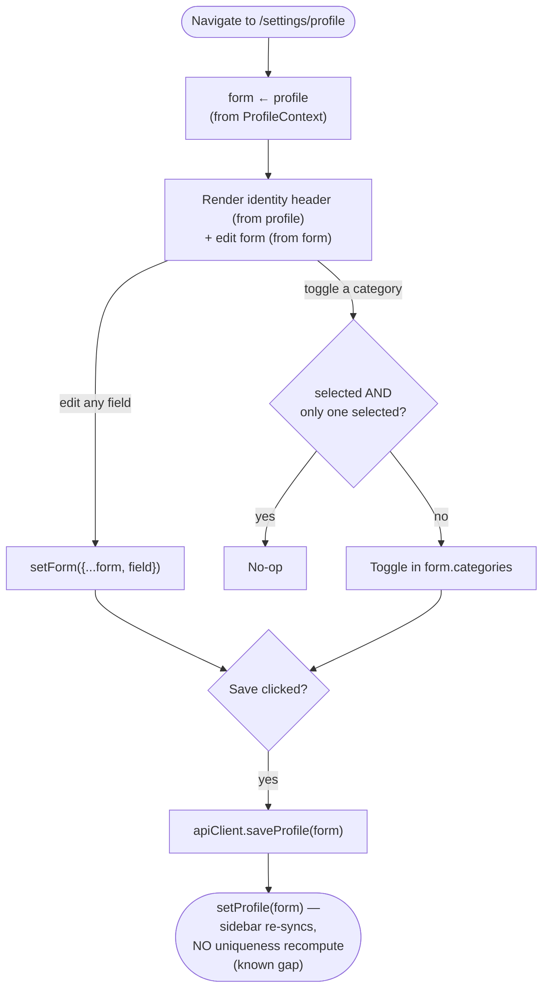
```mermaid
flowchart TD
  Mount(["Navigate to /settings/profile"]) --> Prefill["form ← profile\n(from ProfileContext)"]
  Prefill --> Render["Render identity header (from profile)\n+ edit form (from form)"]
  Render -->|edit any field| UpdateForm["setForm({...form, field})"]
  Render -->|toggle a category| CheckOnly{"selected AND\nonly one selected?"}
  CheckOnly -->|yes| Block["No-op"]
  CheckOnly -->|no| ToggleCat["Toggle in form.categories"]
  UpdateForm --> SaveClick
  ToggleCat --> SaveClick
  SaveClick{"Save clicked?"} -->|yes| Persist["apiClient.saveProfile(form)"]
  Persist --> Resync(["setProfile(form) —\nsidebar re-syncs,\nNO uniqueness recompute\n(known gap)"])
```

- [ ] **Step 3: Edit the card in `02-module-1.md`**

Replace the Settings: Business Profile card's "Steps (pseudocode):" section (heading through the
closing ` ``` ` of the `BusinessProfileSettings.tsx` fenced block) with:

```markdown
**Flow:** [`diagrams/cards/module-1/settings-business-profile.mmd`](diagrams/cards/module-1/settings-business-profile.mmd)

**Steps (pseudocode):** [`pseudocode/module-1/settings-business-profile.ts`](pseudocode/module-1/settings-business-profile.ts)
```

- [ ] **Step 4: Verify the new .mmd renders**

Run:
```
npx --yes @mermaid-js/mermaid-cli -i docs/superpowers/plans/2026-08-10-ui-ux-overhaul-frontend/diagrams/cards/module-1/settings-business-profile.mmd -o /tmp/settings-business-profile.svg
```
Expected: `Generating single mermaid chart` with no error output.

- [ ] **Step 5: Verify links resolve**

Run:
```
ls docs/superpowers/plans/2026-08-10-ui-ux-overhaul-frontend/pseudocode/module-1/settings-business-profile.ts docs/superpowers/plans/2026-08-10-ui-ux-overhaul-frontend/diagrams/cards/module-1/settings-business-profile.mmd
```
Expected: both files listed.

---

### Task 11: Module 2 — Dashboard: Alert Feed & Category Filtering

**Files:**
- Create: `docs/superpowers/plans/2026-08-10-ui-ux-overhaul-frontend/pseudocode/module-2/alert-feed-category-filtering.ts`
- Create: `docs/superpowers/plans/2026-08-10-ui-ux-overhaul-frontend/diagrams/cards/module-2/alert-feed-category-filtering.mmd`
- Modify: `docs/superpowers/plans/2026-08-10-ui-ux-overhaul-frontend/03-module-2.md` (Alert Feed & Category Filtering card)

- [ ] **Step 1: Write the pseudocode file**

```ts
// ---- components/module-2/2.1-dashboard/DashboardView.tsx ----
imports: useEffect, useState, apiClient, useProfile, DemandAlert type, AlertCard

function DashboardView():
  { profile } ← useProfile()
  state: notifications ← null (loading), selectedId ← null

  on mount → apiClient.notifications.list() → setNotifications

  visible ← notifications filtered to profile.categories.includes(n.category)
    // no undifferentiated "all alerts" view

  selectAlert(alert):
    mark that notification isRead = true (side effect of the click itself)
    setSelectedId(alert.id)  // consumed by Card 11's markets reveal

  render: visible.map → AlertCard (selected = matches selectedId, onClick = selectAlert)

// ---- components/module-2/2.1-dashboard/AlertCard.tsx ----
props: { alert, selected, onClick }
render: unread dot if !alert.isRead, date, title, message, chips (market/category/trend),
        surge chip if alertLevel === 'WARNING'
```

- [ ] **Step 2: Write the flowchart file**

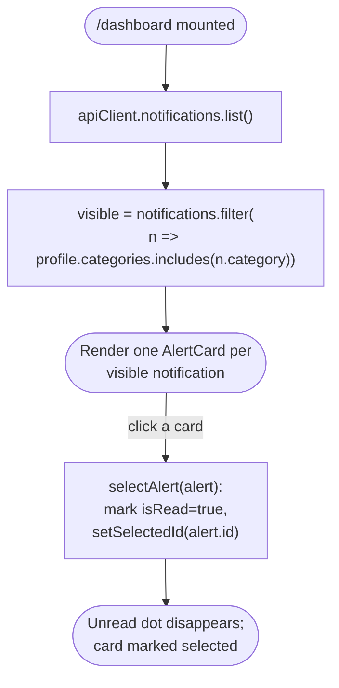
```mermaid
flowchart TD
  Mount(["/dashboard mounted"]) --> Load["apiClient.notifications.list()"]
  Load --> Filter["visible = notifications.filter(\nn => profile.categories.includes(n.category))"]
  Filter --> Render(["Render one AlertCard per\nvisible notification"])
  Render -->|click a card| Select["selectAlert(alert):\nmark isRead=true,\nsetSelectedId(alert.id)"]
  Select --> Rerender(["Unread dot disappears;\ncard marked selected"])
```

- [ ] **Step 3: Edit the card in `03-module-2.md`**

Replace the Alert Feed & Category Filtering card's "Steps (pseudocode):" section (heading through
the closing ` ``` ` of the `AlertCard.tsx` fenced block) with:

```markdown
**Flow:** [`diagrams/cards/module-2/alert-feed-category-filtering.mmd`](diagrams/cards/module-2/alert-feed-category-filtering.mmd)

**Steps (pseudocode):** [`pseudocode/module-2/alert-feed-category-filtering.ts`](pseudocode/module-2/alert-feed-category-filtering.ts)
```

- [ ] **Step 4: Verify the new .mmd renders**

Run:
```
npx --yes @mermaid-js/mermaid-cli -i docs/superpowers/plans/2026-08-10-ui-ux-overhaul-frontend/diagrams/cards/module-2/alert-feed-category-filtering.mmd -o /tmp/alert-feed-category-filtering.svg
```
Expected: `Generating single mermaid chart` with no error output.

- [ ] **Step 5: Verify links resolve**

Run:
```
ls docs/superpowers/plans/2026-08-10-ui-ux-overhaul-frontend/pseudocode/module-2/alert-feed-category-filtering.ts docs/superpowers/plans/2026-08-10-ui-ux-overhaul-frontend/diagrams/cards/module-2/alert-feed-category-filtering.mmd
```
Expected: both files listed.

---

### Task 12: Module 2 — Dashboard: Markets Reveal

**Files:**
- Create: `docs/superpowers/plans/2026-08-10-ui-ux-overhaul-frontend/pseudocode/module-2/markets-reveal.ts`
- Create: `docs/superpowers/plans/2026-08-10-ui-ux-overhaul-frontend/diagrams/cards/module-2/markets-reveal.mmd`
- Modify: `docs/superpowers/plans/2026-08-10-ui-ux-overhaul-frontend/03-module-2.md` (Markets Reveal card)

- [ ] **Step 1: Write the pseudocode file**

```ts
// ---- components/module-2/2.1-dashboard/DashboardView.tsx (additions) ----
imports: useNavigate, useSearchParams, marketsForCategory, RankCard, RankingFormulaCard

selectedAlert ← visible.find(n => n.id === selectedId) ?? null
  // a stale selection (e.g. from before categories changed) is only non-null if still in `visible`

rankedMarkets ← (selectedAlert AND mode in ['normal','ai-down'])
  ? marketsForCategory(selectedAlert.category) : null

selectAlert(alert):  // extends Card 10's version
  setSelectedId(id => id === alert.id ? null : alert.id)  // clicking same alert again deselects
  // ...mark-read side effect from Card 10

openMarket(marketId): navigate(`/dashboard?market=${marketId}`)  // opens Card 13's drawer

render: if rankedMarkets → two-column layout (feed | rankedMarkets.map(RankCard) + RankingFormulaCard)
        else → Card 10's single column

// ---- components/module-2/2.1-dashboard/RankCard.tsx ----
props: { market, onClick }
surgeActive ← market.chartData.some(p => p.spike === 1)
render: rank number, 0-100 market-potential bar, city+distance, direct/via-Manila + flight hours +
        frequency, surge chip if surgeActive

// ---- components/module-2/2.1-dashboard/RankingFormulaCard.tsx ----
render: static formula text "market_score = 0.40·demand₄w + 0.35·seasonality + 0.25·economic_viability"
```

- [ ] **Step 2: Write the flowchart file**

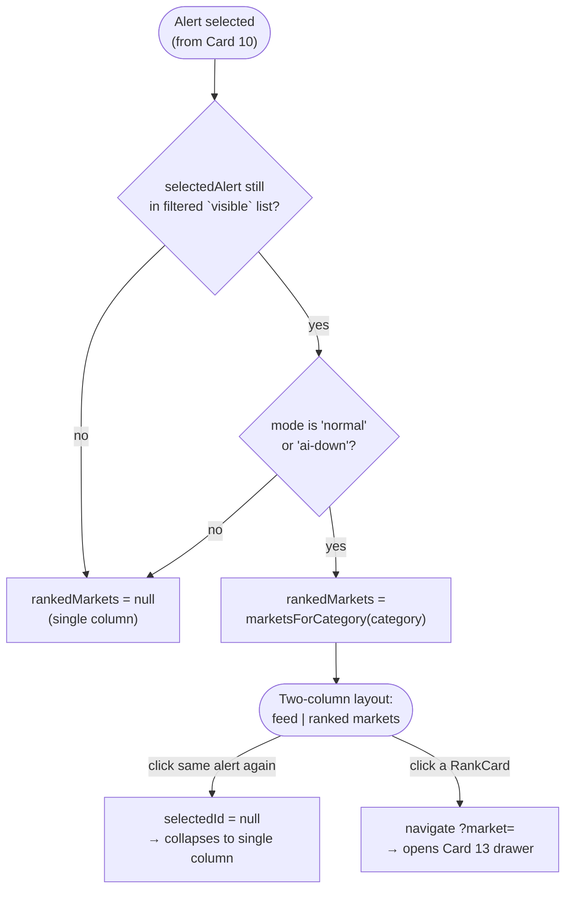
```mermaid
flowchart TD
  AlertSelected(["Alert selected\n(from Card 10)"]) --> StaleCheck{"selectedAlert still\nin filtered `visible` list?"}
  StaleCheck -->|no| NoReveal["rankedMarkets = null\n(single column)"]
  StaleCheck -->|yes| ModeCheck{"mode is 'normal'\nor 'ai-down'?"}
  ModeCheck -->|no| NoReveal
  ModeCheck -->|yes| Rank["rankedMarkets =\nmarketsForCategory(category)"]
  Rank --> TwoCol(["Two-column layout:\nfeed | ranked markets"])
  TwoCol -->|click same alert again| Deselect["selectedId = null\n→ collapses to single column"]
  TwoCol -->|click a RankCard| Open["navigate ?market=<id>\n→ opens Card 13 drawer"]
```

- [ ] **Step 3: Edit the card in `03-module-2.md`**

Replace the Markets Reveal card's "Steps (pseudocode):" section (intro sentence through the closing
` ``` ` of the `RankingFormulaCard.tsx` fenced block) with:

```markdown
**Flow:** [`diagrams/cards/module-2/markets-reveal.mmd`](diagrams/cards/module-2/markets-reveal.mmd)

**Steps (pseudocode):** [`pseudocode/module-2/markets-reveal.ts`](pseudocode/module-2/markets-reveal.ts)
```

- [ ] **Step 4: Verify the new .mmd renders**

Run:
```
npx --yes @mermaid-js/mermaid-cli -i docs/superpowers/plans/2026-08-10-ui-ux-overhaul-frontend/diagrams/cards/module-2/markets-reveal.mmd -o /tmp/markets-reveal.svg
```
Expected: `Generating single mermaid chart` with no error output.

- [ ] **Step 5: Verify links resolve**

Run:
```
ls docs/superpowers/plans/2026-08-10-ui-ux-overhaul-frontend/pseudocode/module-2/markets-reveal.ts docs/superpowers/plans/2026-08-10-ui-ux-overhaul-frontend/diagrams/cards/module-2/markets-reveal.mmd
```
Expected: both files listed.

---

### Task 13: Module 2 — Dashboard: States & Refresh Forecast

**Files:**
- Create: `docs/superpowers/plans/2026-08-10-ui-ux-overhaul-frontend/pseudocode/module-2/states-refresh-forecast.ts`
- Create: `docs/superpowers/plans/2026-08-10-ui-ux-overhaul-frontend/diagrams/cards/module-2/states-refresh-forecast.mmd`
- Modify: `docs/superpowers/plans/2026-08-10-ui-ux-overhaul-frontend/03-module-2.md` (States & Refresh Forecast card)

- [ ] **Step 1: Write the pseudocode file**

```ts
// ---- components/module-2/2.1-dashboard/DashboardView.tsx (additions) ----
imports: useToast, RefreshForecastButton

type Mode: 'loading' | 'empty' | 'normal' | 'ai-down'
state: mode ← 'loading'

on mount:
  apiClient.notifications.list()
    → success: setNotifications, mode ← (list empty ? 'empty' : 'normal')
    → failure: mode ← 'ai-down'  // alerts still render from cache

render (6 mutually exclusive branches):
  mode === 'loading' → 3 skeleton cards
  mode === 'empty' → "No notifications yet"
  mode === 'normal' AND visible.length === 0 → "No surge alerts for <categories> — widen coverage in Settings"
  mode === 'normal', visible non-empty → Card 10 feed / Card 11 reveal (per rankedMarkets)
  mode === 'ai-down' → amber "AI Forecast Service Unavailable" banner + same feed/reveal rendering

// ---- components/module-2/2.1-dashboard/RefreshForecastButton.tsx ----
props: { disabled? }
state: running ← false

handleRefresh():
  running ← true  // disables button, spinner label "Running pipeline…"
  apiClient.markets.list()  // re-run forecast, fixture-backed
  running ← false
  showToast(`Forecast refreshed — N markets re-ranked`)

render: button (disabled if disabled prop or running; label swaps to spinner text while running)
```

- [ ] **Step 2: Write the flowchart file**

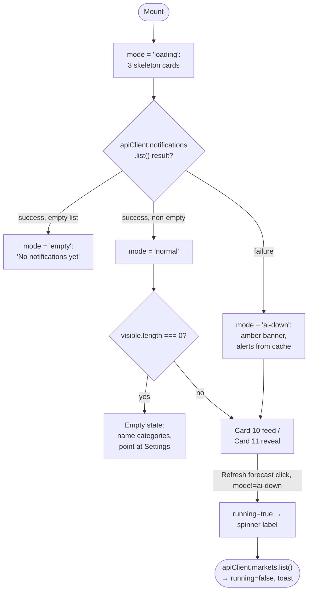
```mermaid
flowchart TD
  Mount(["Mount"]) --> Loading["mode = 'loading':\n3 skeleton cards"]
  Loading --> FetchResult{"apiClient.notifications\n.list() result?"}
  FetchResult -->|success, empty list| Empty["mode = 'empty':\n'No notifications yet'"]
  FetchResult -->|success, non-empty| Normal["mode = 'normal'"]
  FetchResult -->|failure| AiDown["mode = 'ai-down':\namber banner,\nalerts from cache"]
  Normal --> VisibleCheck{"visible.length === 0?"}
  VisibleCheck -->|yes| NoAlerts["Empty state:\nname categories,\npoint at Settings"]
  VisibleCheck -->|no| FeedOrReveal["Card 10 feed /\nCard 11 reveal"]
  AiDown --> FeedOrReveal
  FeedOrReveal -->|"Refresh forecast" click, mode!=ai-down| Refresh["running=true →\nspinner label"]
  Refresh --> Refreshed(["apiClient.markets.list()\n→ running=false, toast"])
```

- [ ] **Step 3: Edit the card in `03-module-2.md`**

Replace the States & Refresh Forecast card's "Steps (pseudocode):" section (intro sentence through
the closing ` ``` ` of the `RefreshForecastButton.tsx` fenced block) with:

```markdown
**Flow:** [`diagrams/cards/module-2/states-refresh-forecast.mmd`](diagrams/cards/module-2/states-refresh-forecast.mmd)

**Steps (pseudocode):** [`pseudocode/module-2/states-refresh-forecast.ts`](pseudocode/module-2/states-refresh-forecast.ts)
```

- [ ] **Step 4: Verify the new .mmd renders**

Run:
```
npx --yes @mermaid-js/mermaid-cli -i docs/superpowers/plans/2026-08-10-ui-ux-overhaul-frontend/diagrams/cards/module-2/states-refresh-forecast.mmd -o /tmp/states-refresh-forecast.svg
```
Expected: `Generating single mermaid chart` with no error output.

- [ ] **Step 5: Verify links resolve**

Run:
```
ls docs/superpowers/plans/2026-08-10-ui-ux-overhaul-frontend/pseudocode/module-2/states-refresh-forecast.ts docs/superpowers/plans/2026-08-10-ui-ux-overhaul-frontend/diagrams/cards/module-2/states-refresh-forecast.mmd
```
Expected: both files listed.

---

### Task 14: Module 2 — Market Radar Drawer: Shell, Directive & Demand Chart

**Files:**
- Create: `docs/superpowers/plans/2026-08-10-ui-ux-overhaul-frontend/pseudocode/module-2/market-radar-shell-directive-chart.ts`
- Create: `docs/superpowers/plans/2026-08-10-ui-ux-overhaul-frontend/diagrams/cards/module-2/market-radar-shell-directive-chart.mmd`
- Modify: `docs/superpowers/plans/2026-08-10-ui-ux-overhaul-frontend/03-module-2.md` (Market Radar Drawer: Shell, Directive & Demand Chart card)

- [ ] **Step 1: Write the pseudocode file**

```ts
// ---- components/module-2/2.2-market-radar/MarketRadarDrawer.tsx ----
imports: useEffect, useState, useNavigate, useSearchParams, Drawer, MOCK_MARKETS,
         DemandForecastChart, InsightsTabs (Card 14)

function MarketRadarDrawer():
  marketId ← searchParams.get('market')
  market ← MOCK_MARKETS.find(m => m.id === marketId) ?? null
  state: timeframe ← '4WK', activeTab ← 'economy' (Card 14 scope)

  on marketId change → reset timeframe to '4WK', activeTab to 'economy'

  close(): clear ?market= param  // Drawer's scrim/Esc/back also route here
  targetThisMarket(): close(); navigate('/content', {targetedMarketId, activeMarketId})

  if !market → render null
  render: Drawer(open=!!market, onClose=close) containing:
    header: rank badge, name, city→Cebu distance/flight-time, close button, "Target this market" CTA
    surge banner if market.spikeIndicator else neutral no-surge banner
    directive text
    DemandForecastChart(chartData, timeframe, onTimeframeChange)
    InsightsTabs(market, activeTab, onTabChange)

// ---- components/module-2/2.2-market-radar/DemandForecastChart.tsx ----
props: { chartData, timeframe, onTimeframeChange }
const ZONES: [Low, Moderate, High peak] each paired with pricing-action guidance

weeks ← timeframe === '4WK' ? 4 : 12
data ← chartData.slice(-weeks)
render: 4WK/12WK toggle buttons, Recharts LineChart(history + forecast lines), zone-key legend
```

- [ ] **Step 2: Write the flowchart file**

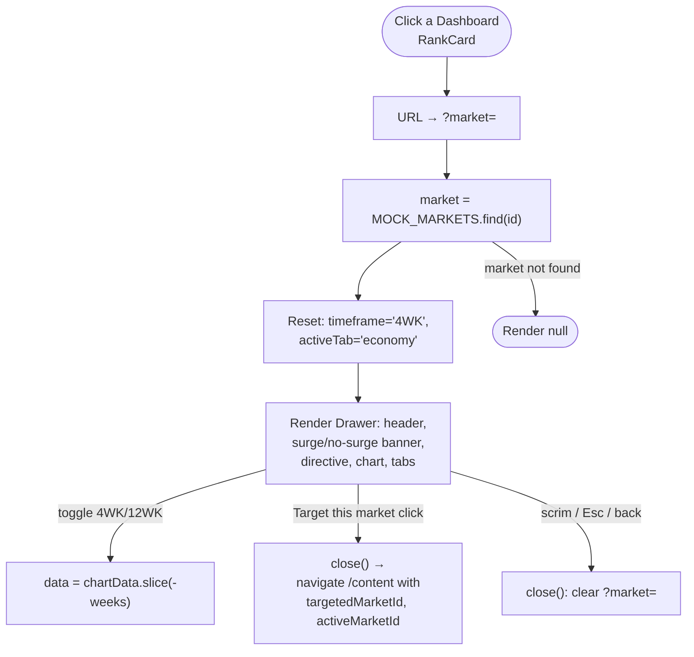
```mermaid
flowchart TD
  RankCardClick(["Click a Dashboard\nRankCard"]) --> SetUrl["URL → ?market=<id>"]
  SetUrl --> Lookup["market = MOCK_MARKETS.find(id)"]
  Lookup --> Reset["Reset: timeframe='4WK',\nactiveTab='economy'"]
  Reset --> Render["Render Drawer: header,\nsurge/no-surge banner,\ndirective, chart, tabs"]
  Render -->|toggle 4WK/12WK| Slice["data = chartData.slice(-weeks)"]
  Render -->|"Target this market" click| Target["close() →\nnavigate /content with\ntargetedMarketId, activeMarketId"]
  Render -->|scrim / Esc / back| Close["close(): clear ?market="]
  Lookup -->|market not found| Null(["Render null"])
```

- [ ] **Step 3: Edit the card in `03-module-2.md`**

Replace the Market Radar Drawer: Shell, Directive & Demand Chart card's "Steps (pseudocode):"
section (heading through the closing ` ``` ` of the `DemandForecastChart.tsx` fenced block) with:

```markdown
**Flow:** [`diagrams/cards/module-2/market-radar-shell-directive-chart.mmd`](diagrams/cards/module-2/market-radar-shell-directive-chart.mmd)

**Steps (pseudocode):** [`pseudocode/module-2/market-radar-shell-directive-chart.ts`](pseudocode/module-2/market-radar-shell-directive-chart.ts)
```

- [ ] **Step 4: Verify the new .mmd renders**

Run:
```
npx --yes @mermaid-js/mermaid-cli -i docs/superpowers/plans/2026-08-10-ui-ux-overhaul-frontend/diagrams/cards/module-2/market-radar-shell-directive-chart.mmd -o /tmp/market-radar-shell-directive-chart.svg
```
Expected: `Generating single mermaid chart` with no error output.

- [ ] **Step 5: Verify links resolve**

Run:
```
ls docs/superpowers/plans/2026-08-10-ui-ux-overhaul-frontend/pseudocode/module-2/market-radar-shell-directive-chart.ts docs/superpowers/plans/2026-08-10-ui-ux-overhaul-frontend/diagrams/cards/module-2/market-radar-shell-directive-chart.mmd
```
Expected: both files listed.

---

### Task 15: Module 2 — Market Radar Drawer: Economic & Seasonal Insights Tabs

**Files:**
- Create: `docs/superpowers/plans/2026-08-10-ui-ux-overhaul-frontend/pseudocode/module-2/market-radar-insights-tabs.ts`
- Create: `docs/superpowers/plans/2026-08-10-ui-ux-overhaul-frontend/diagrams/cards/module-2/market-radar-insights-tabs.mmd`
- Modify: `docs/superpowers/plans/2026-08-10-ui-ux-overhaul-frontend/03-module-2.md` (Market Radar Drawer: Economic & Seasonal Insights Tabs card)

- [ ] **Step 1: Write the pseudocode file**

```ts
// ---- components/module-2/2.2-market-radar/InsightsTabs.tsx ----
props: { market, activeTab, onTabChange }  // activeTab owned by Card 13's drawer, not local state
imports: PurchasingPowerTab, SeasonalPatternsTab

render: two-tab switcher ("Purchasing power"/"Seasonal patterns") +
        activeTab === 'economy' ? PurchasingPowerTab(market) : SeasonalPatternsTab(market) +
        route & carriers list (market.airlines) below both tabs, not tab-specific

// ---- components/module-2/2.2-market-radar/PurchasingPowerTab.tsx ----
props: { market }
render: KPI tiles (forex rate, GDP, avg flight price, accessibility score) +
        AI economic insight paragraph + 12-month forex trend chart + 5-year GDP trend chart

// ---- components/module-2/2.2-market-radar/SeasonalPatternsTab.tsx ----
props: { market }

function seasonalityBand(score): 'weak'|'emerging'|'likely'|'confirmed'  // threshold mapping

render: seasonality score + band + YoY ratio chip (N/A if market.yoyRatio is null, i.e. <59 weeks
        history) + 12-month peak calendar grid (highlights market.peakMonths) +
        AI seasonality insight paragraph + full 24-week chart (history + forecast)
```

- [ ] **Step 2: Write the flowchart file**

```mermaid
flowchart TD
  Render(["InsightsTabs mounted\n(activeTab from Card 13)"]) -->|click "Purchasing power"| ShowEcon["onTabChange('economy')"]
  Render -->|click "Seasonal patterns"| ShowSeason["onTabChange('seasonal')"]
  ShowEcon --> EconContent(["PurchasingPowerTab:\nKPIs, insight, forex+GDP charts"])
  ShowSeason --> SeasonBand{"market.yoyRatio\nis null?"}
  SeasonBand -->|yes, <59wk history| Na["YoY chip = 'N/A'"]
  SeasonBand -->|no| Ratio["YoY chip = ratio value"]
  Na --> SeasonContent(["SeasonalPatternsTab:\nscore+band, calendar,\ninsight, 24wk chart"])
  Ratio --> SeasonContent
  EconContent --> Shared(["Route & carriers list\n(not tab-specific, always shown)"])
  SeasonContent --> Shared
```

- [ ] **Step 3: Edit the card in `03-module-2.md`**

Replace the Market Radar Drawer: Economic & Seasonal Insights Tabs card's "Steps (pseudocode):"
section (heading through the closing ` ``` ` of the `SeasonalPatternsTab.tsx` fenced block) with:

```markdown
**Flow:** [`diagrams/cards/module-2/market-radar-insights-tabs.mmd`](diagrams/cards/module-2/market-radar-insights-tabs.mmd)

**Steps (pseudocode):** [`pseudocode/module-2/market-radar-insights-tabs.ts`](pseudocode/module-2/market-radar-insights-tabs.ts)
```

- [ ] **Step 4: Verify the new .mmd renders**

Run:
```
npx --yes @mermaid-js/mermaid-cli -i docs/superpowers/plans/2026-08-10-ui-ux-overhaul-frontend/diagrams/cards/module-2/market-radar-insights-tabs.mmd -o /tmp/market-radar-insights-tabs.svg
```
Expected: `Generating single mermaid chart` with no error output.

- [ ] **Step 5: Verify links resolve**

Run:
```
ls docs/superpowers/plans/2026-08-10-ui-ux-overhaul-frontend/pseudocode/module-2/market-radar-insights-tabs.ts docs/superpowers/plans/2026-08-10-ui-ux-overhaul-frontend/diagrams/cards/module-2/market-radar-insights-tabs.mmd
```
Expected: both files listed.

---

### Task 16: Module 3 — Content Studio: AI Copywriting Matrix (incl. Naver)

**Files:**
- Create: `docs/superpowers/plans/2026-08-10-ui-ux-overhaul-frontend/pseudocode/module-3/ai-copywriting-matrix.ts`
- Create: `docs/superpowers/plans/2026-08-10-ui-ux-overhaul-frontend/diagrams/cards/module-3/ai-copywriting-matrix.mmd`
- Modify: `docs/superpowers/plans/2026-08-10-ui-ux-overhaul-frontend/04-module-3.md` (AI Copywriting Matrix card)

- [ ] **Step 1: Write the pseudocode file**

```ts
// ---- components/module-3/3.1-content-studio/AIContentMatrixPanel.tsx ----
imports: useState, apiClient, PlatformId type, CaptionOptionCard

const CHAR_LIMITS: Record<PlatformId, number>  // instagram/tiktok 2200, facebook 63206, naver 100000

function AIContentMatrixPanel():
  state: platform ← 'instagram', content ← apiClient.content.list() result,
         editedText ← {}, approved ← {instagram:null, tiktok:null, facebook:null, naver:null}

  approveOption(optionIndex, text):
    // only one option per platform approved at a time; approving never touches another platform
    approved[platform] ← optionIndex
    copy text into shared composer's `staged` field (Card 17 reads it)
    clear any existing audit result, reset agreement checkbox (Card 18 depends on this)

  options ← content.captions[platform].options  // Naver: 2, others: 3

  render: platform tab bar (gold dot if approved[p] != null) +
          Naver info banner if platform === 'naver' +
          options.map → CaptionOptionCard(text, charLimit, metadata (null for Naver), approved,
                                            onChange, onApprove)

// ---- components/module-3/3.1-content-studio/CaptionOptionCard.tsx ----
props: { text, charLimit, metadata, approved, onChange, onApprove }
state: showWhy ← false
overLimit ← text.length > charLimit
render: editable textarea + char counter (error state if overLimit) +
        "Why this caption" disclosure toggle (only if metadata non-null, revealing 5 dimensions) +
        Approve button
```

- [ ] **Step 2: Write the flowchart file**

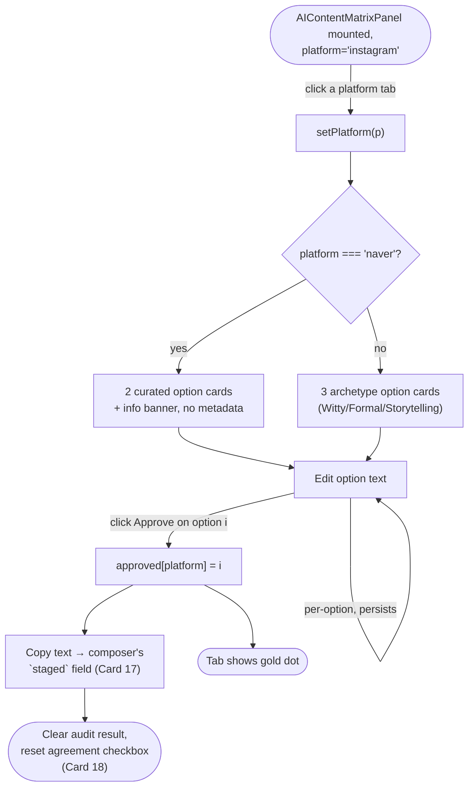
```mermaid
flowchart TD
  Render(["AIContentMatrixPanel mounted,\nplatform='instagram'"]) -->|click a platform tab| SwitchTab["setPlatform(p)"]
  SwitchTab --> IsNaver{"platform === 'naver'?"}
  IsNaver -->|yes| NaverCards["2 curated option cards\n+ info banner, no metadata"]
  IsNaver -->|no| ArchetypeCards["3 archetype option cards\n(Witty/Formal/Storytelling)"]
  NaverCards --> Edit
  ArchetypeCards --> Edit
  Edit["Edit option text"] -->|per-option, persists| Edit
  Edit -->|click Approve on option i| ApproveOpt["approved[platform] = i"]
  ApproveOpt --> Stage["Copy text → composer's\n`staged` field (Card 17)"]
  Stage --> ClearAudit(["Clear audit result,\nreset agreement checkbox\n(Card 18)"])
  ApproveOpt --> GoldDot(["Tab shows gold dot"])
```

- [ ] **Step 3: Edit the card in `04-module-3.md`**

Replace the AI Copywriting Matrix card's "Steps (pseudocode):" section (heading through the closing
` ``` ` of the `CaptionOptionCard.tsx` fenced block) with:

```markdown
**Flow:** [`diagrams/cards/module-3/ai-copywriting-matrix.mmd`](diagrams/cards/module-3/ai-copywriting-matrix.mmd)

**Steps (pseudocode):** [`pseudocode/module-3/ai-copywriting-matrix.ts`](pseudocode/module-3/ai-copywriting-matrix.ts)
```

- [ ] **Step 4: Verify the new .mmd renders**

Run:
```
npx --yes @mermaid-js/mermaid-cli -i docs/superpowers/plans/2026-08-10-ui-ux-overhaul-frontend/diagrams/cards/module-3/ai-copywriting-matrix.mmd -o /tmp/ai-copywriting-matrix.svg
```
Expected: `Generating single mermaid chart` with no error output.

- [ ] **Step 5: Verify links resolve**

Run:
```
ls docs/superpowers/plans/2026-08-10-ui-ux-overhaul-frontend/pseudocode/module-3/ai-copywriting-matrix.ts docs/superpowers/plans/2026-08-10-ui-ux-overhaul-frontend/diagrams/cards/module-3/ai-copywriting-matrix.mmd
```
Expected: both files listed.

---

### Task 17: Module 3 — Content Studio: Visual Direction Board

**Files:**
- Create: `docs/superpowers/plans/2026-08-10-ui-ux-overhaul-frontend/pseudocode/module-3/visual-direction-board.ts`
- Create: `docs/superpowers/plans/2026-08-10-ui-ux-overhaul-frontend/diagrams/cards/module-3/visual-direction-board.mmd`
- Modify: `docs/superpowers/plans/2026-08-10-ui-ux-overhaul-frontend/04-module-3.md` (Visual Direction Board card)

- [ ] **Step 1: Write the pseudocode file**

```ts
// ---- components/module-3/3.1-content-studio/VisualDirectionBoard.tsx ----
props: { platform, content }  // platform read from Card 15's shared state, not local

guide ← content.captions[platform].guide  // re-renders whenever `platform` changes; no own tab control
render: numbered list of guide's shot-composition instructions
```

- [ ] **Step 2: Write the flowchart file**

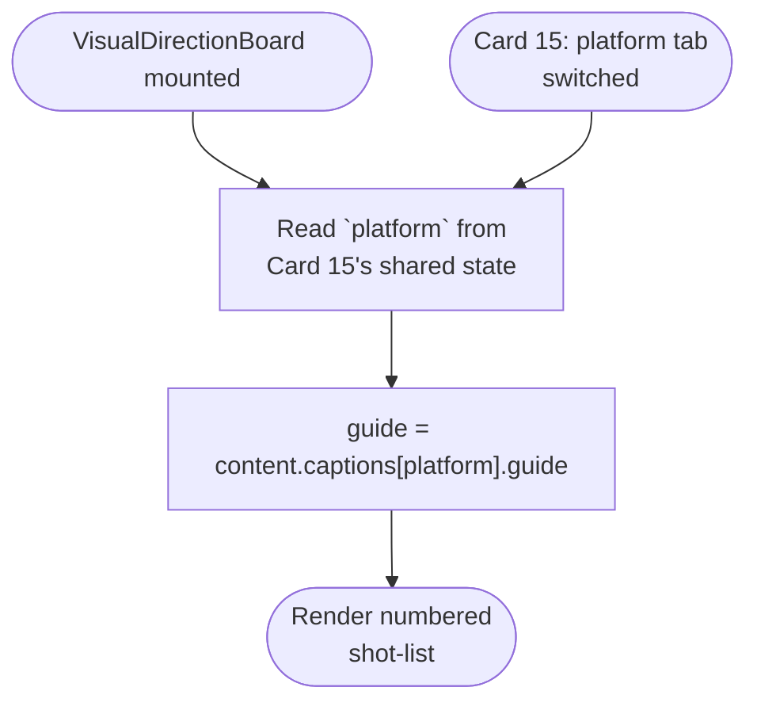
```mermaid
flowchart TD
  Mount(["VisualDirectionBoard mounted"]) --> ReadPlatform["Read `platform` from\nCard 15's shared state"]
  ReadPlatform --> Guide["guide = content.captions[platform].guide"]
  Guide --> Render(["Render numbered\nshot-list"])
  PlatformChange(["Card 15: platform tab\nswitched"]) --> ReadPlatform
```

- [ ] **Step 3: Edit the card in `04-module-3.md`**

Replace the Visual Direction Board card's "Steps (pseudocode):" section (heading through the
closing ` ``` ` of the fenced block) with:

```markdown
**Flow:** [`diagrams/cards/module-3/visual-direction-board.mmd`](diagrams/cards/module-3/visual-direction-board.mmd)

**Steps (pseudocode):** [`pseudocode/module-3/visual-direction-board.ts`](pseudocode/module-3/visual-direction-board.ts)
```

- [ ] **Step 4: Verify the new .mmd renders**

Run:
```
npx --yes @mermaid-js/mermaid-cli -i docs/superpowers/plans/2026-08-10-ui-ux-overhaul-frontend/diagrams/cards/module-3/visual-direction-board.mmd -o /tmp/visual-direction-board.svg
```
Expected: `Generating single mermaid chart` with no error output.

- [ ] **Step 5: Verify links resolve**

Run:
```
ls docs/superpowers/plans/2026-08-10-ui-ux-overhaul-frontend/pseudocode/module-3/visual-direction-board.ts docs/superpowers/plans/2026-08-10-ui-ux-overhaul-frontend/diagrams/cards/module-3/visual-direction-board.mmd
```
Expected: both files listed.

---

### Task 18: Module 3 — Content Studio: Publish Composer (connection-gated)

**Files:**
- Create: `docs/superpowers/plans/2026-08-10-ui-ux-overhaul-frontend/pseudocode/module-3/publish-composer.ts`
- Create: `docs/superpowers/plans/2026-08-10-ui-ux-overhaul-frontend/diagrams/cards/module-3/publish-composer.mmd`
- Modify: `docs/superpowers/plans/2026-08-10-ui-ux-overhaul-frontend/04-module-3.md` (Publish Composer card)

- [ ] **Step 1: Write the pseudocode file**

```ts
// ---- components/module-3/3.1-content-studio/PublishComposer.tsx ----
imports: useState, PlatformId + PlatformConnection types, OmcsAuditResult type

props: { staged, onStagedChange, connections }  // connections from Card 22, gates platform picker

type BlockReason: 'caption'|'media'|'platform'|'agreement'|'audit-running'|'audit-missing'|'audit-failed'|null

function PublishComposer({staged, onStagedChange, connections}):
  state: pubmat ← null, publishPlatforms ← [], switches ← {visibility:true, comments:true, paid:false},
         agreed ← false, omcs ← null, auditRunning ← false

  resetAudit(): omcs ← null, agreed ← false
    // pubmat change, platform toggle, or staged-text edit all invalidate a stale audit

  setPubmatFile(file): pubmat ← file; resetAudit()

  togglePlatform(id):
    if connection for id not connected → no-op  // deviation from v1 — not freely selectable
    else → toggle id in publishPlatforms; resetAudit()

  toggleAgreement():
    agreed ← !agreed
    if agreed AND staged AND pubmat → auditRunning ← true  // triggers Card 18
    // unchecking does NOT undo a completed audit

  blockReason ← priority-ordered first unmet gate:
    1. !staged → 'caption'
    2. !pubmat → 'media'
    3. publishPlatforms.length===0 → 'platform'
    4. !agreed → 'agreement'
    5. auditRunning → 'audit-running'
    6. !omcs → 'audit-missing'
    7. omcs.status !== 'Pass' → 'audit-failed'
    else → null

  render: staged textarea + char count + pubmat dropzone + platform picker (disabled if not
          connected, shows Connect affordance) + 3 config switches (no gate) + agreement checkbox +
          Publish button (disabled unless blockReason===null; tooltip = BLOCK_REASON_TEXT[blockReason])
```

- [ ] **Step 2: Write the flowchart file**

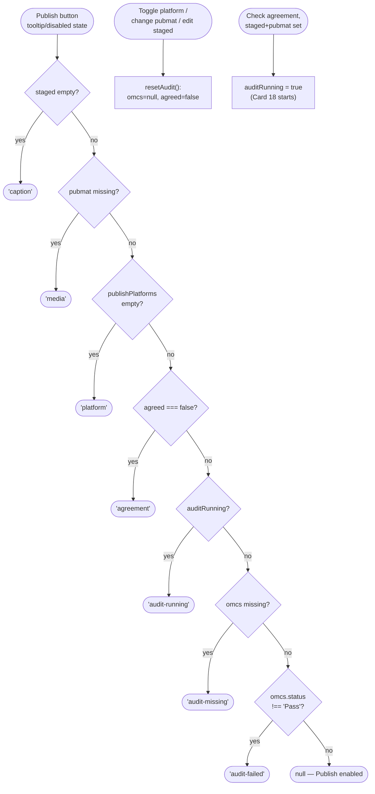
```mermaid
flowchart TD
  Check(["Publish button\ntooltip/disabled state"]) --> C1{"staged empty?"}
  C1 -->|yes| R1(["'caption'"])
  C1 -->|no| C2{"pubmat missing?"}
  C2 -->|yes| R2(["'media'"])
  C2 -->|no| C3{"publishPlatforms\nempty?"}
  C3 -->|yes| R3(["'platform'"])
  C3 -->|no| C4{"agreed === false?"}
  C4 -->|yes| R4(["'agreement'"])
  C4 -->|no| C5{"auditRunning?"}
  C5 -->|yes| R5(["'audit-running'"])
  C5 -->|no| C6{"omcs missing?"}
  C6 -->|yes| R6(["'audit-missing'"])
  C6 -->|no| C7{"omcs.status\n!== 'Pass'?"}
  C7 -->|yes| R7(["'audit-failed'"])
  C7 -->|no| R8(["null — Publish enabled"])

  Toggle(["Toggle platform /\nchange pubmat / edit staged"]) --> ResetAudit["resetAudit():\nomcs=null, agreed=false"]
  AgreeCheck(["Check agreement,\nstaged+pubmat set"]) --> Trigger["auditRunning = true\n(Card 18 starts)"]
```

- [ ] **Step 3: Edit the card in `04-module-3.md`**

Replace the Publish Composer card's "Steps (pseudocode):" section (heading through the closing
` ``` ` of the `BLOCK_REASON_TEXT` fenced block) with:

```markdown
**Flow:** [`diagrams/cards/module-3/publish-composer.mmd`](diagrams/cards/module-3/publish-composer.mmd)

**Steps (pseudocode):** [`pseudocode/module-3/publish-composer.ts`](pseudocode/module-3/publish-composer.ts)
```

- [ ] **Step 4: Verify the new .mmd renders**

Run:
```
npx --yes @mermaid-js/mermaid-cli -i docs/superpowers/plans/2026-08-10-ui-ux-overhaul-frontend/diagrams/cards/module-3/publish-composer.mmd -o /tmp/publish-composer.svg
```
Expected: `Generating single mermaid chart` with no error output.

- [ ] **Step 5: Verify links resolve**

Run:
```
ls docs/superpowers/plans/2026-08-10-ui-ux-overhaul-frontend/pseudocode/module-3/publish-composer.ts docs/superpowers/plans/2026-08-10-ui-ux-overhaul-frontend/diagrams/cards/module-3/publish-composer.mmd
```
Expected: both files listed.

---

### Task 19: Module 3 — Content Studio: Compliance Audit Panel

**Files:**
- Create: `docs/superpowers/plans/2026-08-10-ui-ux-overhaul-frontend/pseudocode/module-3/compliance-audit-panel.ts`
- Create: `docs/superpowers/plans/2026-08-10-ui-ux-overhaul-frontend/diagrams/cards/module-3/compliance-audit-panel.mmd`
- Modify: `docs/superpowers/plans/2026-08-10-ui-ux-overhaul-frontend/04-module-3.md` (Compliance Audit Panel card)

- [ ] **Step 1: Write the pseudocode file**

```ts
// ---- components/module-3/3.1-content-studio/CompliancePanel.tsx ----
imports: useEffect, useState, apiClient, OMCS_RUBRIC_LABELS + OmcsAuditResult type, OmcsGauge

const AUDIT_STEPS: [6 fixed step labels]
props: { auditRunning, onAuditComplete }  // auditRunning set by Card 17 on agreement-check

function CompliancePanel({auditRunning, onAuditComplete}):
  state: step ← 0, result ← null

  on auditRunning becomes true:
    step ← 0, result ← null
    advance step every ~420ms
    on last step complete → apiClient.omcs.evaluate() → setResult, onAuditComplete(result)

  handleRerun(): step ← 0, result ← null  // re-triggers via parent-owned auditRunning flip

  render:
    if !auditRunning AND !result → empty "not run yet" placeholder (prereqs listed)
    if auditRunning AND !result → 6-step checklist (done/in-progress/inert per step index)
    if result:
      passed ← result.status === 'Pass'  // pass at score >= 70
      OmcsGauge(score, colored by band: green>=80, gold>=60, red below) +
      pass/fail chip + 3 weighted sub-score bars (0.35/0.45/0.20) + formula text +
      7-row rubric table (OMCS_RUBRIC_LABELS) + feedback banner + consistency explanation +
      Re-run button (calls handleRerun)
```

- [ ] **Step 2: Write the flowchart file**

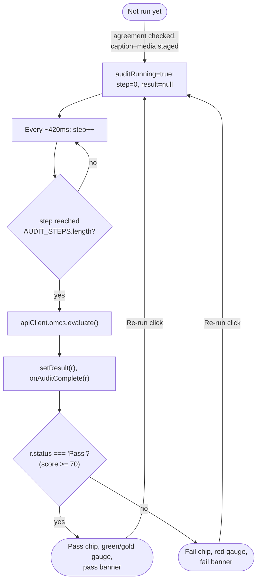
```mermaid
flowchart TD
  Idle(["Not run yet"]) -->|agreement checked,\ncaption+media staged| Start["auditRunning=true:\nstep=0, result=null"]
  Start --> Tick["Every ~420ms: step++"]
  Tick --> LastStep{"step reached\nAUDIT_STEPS.length?"}
  LastStep -->|no| Tick
  LastStep -->|yes| Evaluate["apiClient.omcs.evaluate()"]
  Evaluate --> Result["setResult(r), onAuditComplete(r)"]
  Result --> Band{"r.status === 'Pass'?\n(score >= 70)"}
  Band -->|yes| Pass(["Pass chip, green/gold gauge,\npass banner"])
  Band -->|no| Fail(["Fail chip, red gauge,\nfail banner"])
  Pass -->|"Re-run" click| Start
  Fail -->|"Re-run" click| Start
```

- [ ] **Step 3: Edit the card in `04-module-3.md`**

Replace the Compliance Audit Panel card's "Steps (pseudocode):" section (heading through the
closing ` ``` ` of the `CompliancePanel.tsx` fenced block) with:

```markdown
**Flow:** [`diagrams/cards/module-3/compliance-audit-panel.mmd`](diagrams/cards/module-3/compliance-audit-panel.mmd)

**Steps (pseudocode):** [`pseudocode/module-3/compliance-audit-panel.ts`](pseudocode/module-3/compliance-audit-panel.ts)
```

- [ ] **Step 4: Verify the new .mmd renders**

Run:
```
npx --yes @mermaid-js/mermaid-cli -i docs/superpowers/plans/2026-08-10-ui-ux-overhaul-frontend/diagrams/cards/module-3/compliance-audit-panel.mmd -o /tmp/compliance-audit-panel.svg
```
Expected: `Generating single mermaid chart` with no error output.

- [ ] **Step 5: Verify links resolve**

Run:
```
ls docs/superpowers/plans/2026-08-10-ui-ux-overhaul-frontend/pseudocode/module-3/compliance-audit-panel.ts docs/superpowers/plans/2026-08-10-ui-ux-overhaul-frontend/diagrams/cards/module-3/compliance-audit-panel.mmd
```
Expected: both files listed.

---

### Task 20: Module 3 — Content Studio: Content Board & Publish Action

**Files:**
- Create: `docs/superpowers/plans/2026-08-10-ui-ux-overhaul-frontend/pseudocode/module-3/content-board-publish-action.ts`
- Create: `docs/superpowers/plans/2026-08-10-ui-ux-overhaul-frontend/diagrams/cards/module-3/content-board-publish-action.mmd`
- Modify: `docs/superpowers/plans/2026-08-10-ui-ux-overhaul-frontend/04-module-3.md` (Content Board & Publish Action card)

- [ ] **Step 1: Write the pseudocode file**

```ts
// ---- services/postStore.ts ---- (same createContext/useState pattern as profileContext.tsx —
// no new state-management dependency)
imports: createContext/useContext/useState, apiClient, PublishedPost type

interface PostStoreValue { posts, load(), publish(platforms, caption) }

function PostStoreProvider({children}):
  state: posts ← []
  load(): posts ← apiClient.posts.list() result  // seeds from fixture
  publish(platforms, caption):
    newPosts ← one per platform: {id, date:today, platform, caption, status:'published',
                                    reach:0, likes:0, comments:0, shares:0, engagementRate:0, series:[]}
    posts ← [...posts, ...newPosts]  // Calendar (Card 20), Performance (Card 27) both read this
  render: children wrapped in context provider

function usePostStore(): PostStoreValue  // useContext + null-check

// ---- components/module-3/3.1-content-studio/ContentBoard.tsx ----
imports: useState, usePostStore, useToast

type Filter: 'all' | 'draft' | 'published'
props: { publishPlatforms, staged, publishEnabled, onPublished }  // from Card 17's composer

function ContentBoard({publishPlatforms, staged, publishEnabled, onPublished}):
  { posts, publish } ← usePostStore()
  state: filter ← 'all'

  handlePublish():
    if !publishEnabled → no-op
    publish(publishPlatforms, staged)  // one post per selected platform, status 'published'
    onPublished()  // clears composer transient state; approved captions (Card 15) stay intact
    showToast(`Published to N platform(s)`)

  visible ← posts filtered by filter tab
  render: All/Draft/Published tabs + visible.map → card (platform dot, status chip, date, caption
          excerpt, reach/likes footer if published)
```

- [ ] **Step 2: Write the flowchart file**

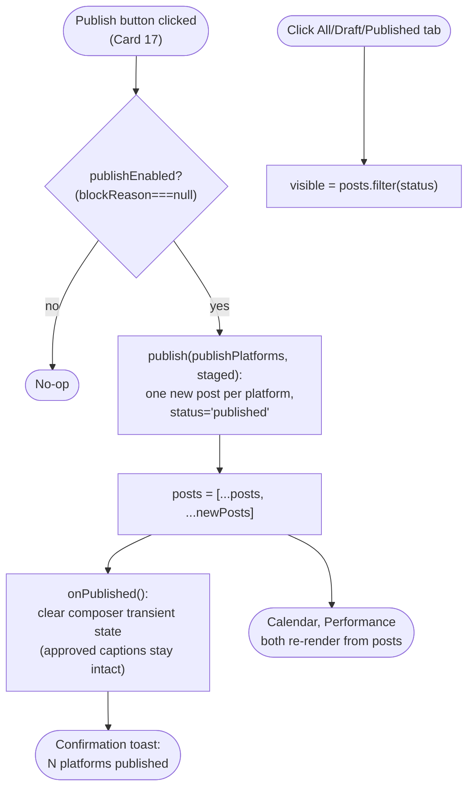
```mermaid
flowchart TD
  Click(["Publish button clicked\n(Card 17)"]) --> Enabled{"publishEnabled?\n(blockReason===null)"}
  Enabled -->|no| NoOp(["No-op"])
  Enabled -->|yes| Publish["publish(publishPlatforms, staged):\none new post per platform,\nstatus='published'"]
  Publish --> Append["posts = [...posts, ...newPosts]"]
  Append --> Reset["onPublished():\nclear composer transient state\n(approved captions stay intact)"]
  Reset --> Toast(["Confirmation toast:\nN platforms published"])
  Append --> Readers(["Calendar, Performance\nboth re-render from posts"])

  FilterClick(["Click All/Draft/Published tab"]) --> Filter["visible = posts.filter(status)"]
```

- [ ] **Step 3: Edit the card in `04-module-3.md`**

Replace the Content Board & Publish Action card's "Steps (pseudocode):" section (heading through
the closing ` ``` ` of the `ContentBoard.tsx` fenced block) with:

```markdown
**Flow:** [`diagrams/cards/module-3/content-board-publish-action.mmd`](diagrams/cards/module-3/content-board-publish-action.mmd)

**Steps (pseudocode):** [`pseudocode/module-3/content-board-publish-action.ts`](pseudocode/module-3/content-board-publish-action.ts)
```

- [ ] **Step 4: Verify the new .mmd renders**

Run:
```
npx --yes @mermaid-js/mermaid-cli -i docs/superpowers/plans/2026-08-10-ui-ux-overhaul-frontend/diagrams/cards/module-3/content-board-publish-action.mmd -o /tmp/content-board-publish-action.svg
```
Expected: `Generating single mermaid chart` with no error output.

- [ ] **Step 5: Verify links resolve**

Run:
```
ls docs/superpowers/plans/2026-08-10-ui-ux-overhaul-frontend/pseudocode/module-3/content-board-publish-action.ts docs/superpowers/plans/2026-08-10-ui-ux-overhaul-frontend/diagrams/cards/module-3/content-board-publish-action.mmd
```
Expected: both files listed.

---

### Task 21: Module 3 — Calendar: Month Grid & Navigation

**Files:**
- Create: `docs/superpowers/plans/2026-08-10-ui-ux-overhaul-frontend/pseudocode/module-3/calendar-month-grid-navigation.ts`
- Create: `docs/superpowers/plans/2026-08-10-ui-ux-overhaul-frontend/diagrams/cards/module-3/calendar-month-grid-navigation.mmd`
- Modify: `docs/superpowers/plans/2026-08-10-ui-ux-overhaul-frontend/04-module-3.md` (Calendar: Month Grid & Navigation card)

- [ ] **Step 1: Write the pseudocode file**

```ts
// ---- components/module-3/calendar/CalendarView.tsx ----
imports: useState, usePostStore, CalendarCell

interface GridCell { date, inMonth, isToday }

function buildGrid(year, month): GridCell[]
  // leading cells: prev month's trailing days (greyed, inert, not clickable)
  // one cell per day of target month
  // trailing cells: next month's leading days (greyed, inert), padding to a multiple of 7
  // cell matching today's real date → isToday: true

function CalendarView():
  { posts } ← usePostStore()
  state: year ← current year, month ← current month
  grid ← buildGrid(year, month)

  shiftMonth(delta): month += delta; wraps Dec→Jan and Jan→Dec, adjusting year

  counts ← per-status counts (published/scheduled/draft) across the WHOLE post store, not just
           the visible month

  render: header (prev/next buttons, year-month label, counts) +
          7-col grid: grid.map → CalendarCell(cell, posts matching cell.date if inMonth)

// ---- components/module-3/calendar/CalendarCell.tsx ----
props: { cell, posts }
shown ← posts.slice(0,3)  // up to 3 platform-colored chips (border-left colored by platform)
overflow ← posts.length - shown.length
render: date, shown chips, "+N more" indicator if overflow > 0 (instead of a 4th chip)
```

- [ ] **Step 2: Write the flowchart file**

```mermaid
flowchart TD
  Mount(["/calendar mounted"]) --> Build["buildGrid(year, month):\nleading + month days + trailing"]
  Build --> Render["Render 7-col grid,\ntoday ringed"]
  Render -->|"Prev" click| ShiftPrev["shiftMonth(-1):\nwraps Jan→Dec"]
  Render -->|"Next" click| ShiftNext["shiftMonth(1):\nwraps Dec→Jan"]
  ShiftPrev --> Build
  ShiftNext --> Build
  Render -->|per cell| CellPosts{"cell.inMonth?"}
  CellPosts -->|no| Greyed(["Greyed, inert cell"])
  CellPosts -->|yes| Lookup["posts.filter(date===cell.date)"]
  Lookup --> ChipCount{"posts.length > 3?"}
  ChipCount -->|yes| Overflow(["3 chips + '+N more'"])
  ChipCount -->|no| AllChips(["All posts as chips"])
  PostPublished(["Post published\n(Content Studio)"]) --> Lookup
```

- [ ] **Step 3: Edit the card in `04-module-3.md`**

Replace the Calendar: Month Grid & Navigation card's "Steps (pseudocode):" section (heading through
the closing ` ``` ` of the `CalendarCell.tsx` fenced block) with:

```markdown
**Flow:** [`diagrams/cards/module-3/calendar-month-grid-navigation.mmd`](diagrams/cards/module-3/calendar-month-grid-navigation.mmd)

**Steps (pseudocode):** [`pseudocode/module-3/calendar-month-grid-navigation.ts`](pseudocode/module-3/calendar-month-grid-navigation.ts)
```

- [ ] **Step 4: Verify the new .mmd renders**

Run:
```
npx --yes @mermaid-js/mermaid-cli -i docs/superpowers/plans/2026-08-10-ui-ux-overhaul-frontend/diagrams/cards/module-3/calendar-month-grid-navigation.mmd -o /tmp/calendar-month-grid-navigation.svg
```
Expected: `Generating single mermaid chart` with no error output.

- [ ] **Step 5: Verify links resolve**

Run:
```
ls docs/superpowers/plans/2026-08-10-ui-ux-overhaul-frontend/pseudocode/module-3/calendar-month-grid-navigation.ts docs/superpowers/plans/2026-08-10-ui-ux-overhaul-frontend/diagrams/cards/module-3/calendar-month-grid-navigation.mmd
```
Expected: both files listed.

---

### Task 22: Module 3 — Calendar: List View & Day-Click Modal

**Files:**
- Create: `docs/superpowers/plans/2026-08-10-ui-ux-overhaul-frontend/pseudocode/module-3/calendar-list-view-day-click-modal.ts`
- Create: `docs/superpowers/plans/2026-08-10-ui-ux-overhaul-frontend/diagrams/cards/module-3/calendar-list-view-day-click-modal.mmd`
- Modify: `docs/superpowers/plans/2026-08-10-ui-ux-overhaul-frontend/04-module-3.md` (Calendar: List View & Day-Click Modal card)

- [ ] **Step 1: Write the pseudocode file**

```ts
// ---- components/module-3/calendar/CalendarView.tsx (additions) ----
imports: useState, CalendarListView, DayPostsModal

state additions: view ← 'month'|'list', modalDate ← null

handleDayClick(cell, dayPosts):
  if dayPosts.length === 0 → no-op
  else → modalDate ← cell.date  // opens DayPostsModal

render additions: Month/List segmented toggle in header +
                   view==='month' ? grid (cell onClick → handleDayClick) : CalendarListView(posts) +
                   modalDate ? DayPostsModal(date, posts matching date, onClose) : nothing

// ---- components/module-3/calendar/CalendarListView.tsx ----
props: { posts }
sorted ← posts sorted by date descending (most recent first)
render: one row per post — platform dot, date, single-line caption excerpt, status chip

// ---- components/module-3/calendar/DayPostsModal.tsx ----
props: { date, posts, onClose }
render: Modal(open=true, title=date) listing every post that day; published posts show
        reach/likes/engagement inline alongside caption
```

- [ ] **Step 2: Write the flowchart file**

```mermaid
flowchart TD
  Toggle(["Month/List toggle"]) -->|Month| MonthView(["Render grid"])
  Toggle -->|List| ListView(["Render CalendarListView:\nposts sorted by date desc"])
  MonthView -->|click a day cell| DayClick{"dayPosts.length === 0?"}
  DayClick -->|yes| NoOp(["No-op"])
  DayClick -->|no| OpenModal["modalDate = cell.date"]
  OpenModal --> Modal(["DayPostsModal:\nlist posts for that day,\nreach/likes if published"])
  Modal -->|close| CloseModal["modalDate = null"]
```

- [ ] **Step 3: Edit the card in `04-module-3.md`**

Replace the Calendar: List View & Day-Click Modal card's "Steps (pseudocode):" section (heading
through the closing ` ``` ` of the `DayPostsModal.tsx` fenced block) with:

```markdown
**Flow:** [`diagrams/cards/module-3/calendar-list-view-day-click-modal.mmd`](diagrams/cards/module-3/calendar-list-view-day-click-modal.mmd)

**Steps (pseudocode):** [`pseudocode/module-3/calendar-list-view-day-click-modal.ts`](pseudocode/module-3/calendar-list-view-day-click-modal.ts)
```

- [ ] **Step 4: Verify the new .mmd renders**

Run:
```
npx --yes @mermaid-js/mermaid-cli -i docs/superpowers/plans/2026-08-10-ui-ux-overhaul-frontend/diagrams/cards/module-3/calendar-list-view-day-click-modal.mmd -o /tmp/calendar-list-view-day-click-modal.svg
```
Expected: `Generating single mermaid chart` with no error output.

- [ ] **Step 5: Verify links resolve**

Run:
```
ls docs/superpowers/plans/2026-08-10-ui-ux-overhaul-frontend/pseudocode/module-3/calendar-list-view-day-click-modal.ts docs/superpowers/plans/2026-08-10-ui-ux-overhaul-frontend/diagrams/cards/module-3/calendar-list-view-day-click-modal.mmd
```
Expected: both files listed.

---

### Task 23: Module 3 — Settings: Platforms

**Files:**
- Create: `docs/superpowers/plans/2026-08-10-ui-ux-overhaul-frontend/pseudocode/module-3/settings-platforms.ts`
- Create: `docs/superpowers/plans/2026-08-10-ui-ux-overhaul-frontend/diagrams/cards/module-3/settings-platforms.mmd`
- Modify: `docs/superpowers/plans/2026-08-10-ui-ux-overhaul-frontend/04-module-3.md` (Settings: Platforms card)

- [ ] **Step 1: Write the pseudocode file**

```ts
// ---- components/settings/PlatformsSettings.tsx ----
imports: useEffect, useState, apiClient, useToast, PlatformConnection + PlatformId types,
         ConnectPlatformModal

props: { onDisconnect }  // Card 17's composer prunes this platform from its selection

function PlatformsSettings({onDisconnect}):
  state: connections ← [], connectingPlatform ← null
  on mount → apiClient.connections.list() → setConnections

  handleDisconnect(platform):
    apiClient.connections.disconnect(platform)  // immediate, no confirmation modal
    mark that connection disconnected
    showToast(`${platform} disconnected`)
    onDisconnect(platform)  // NEW rule: prune from Content Studio's in-progress selection

  handleConnected(platform):
    mark that connection connected
    connectingPlatform ← null
    showToast(`${platform} connected`)

  render: one row per connection (Verified+Disconnect if connected, else Connect button) +
          ConnectPlatformModal if connectingPlatform set

// ---- components/settings/ConnectPlatformModal.tsx ----
props: { platform, onGranted, onClose }
state: phase ← 'redirecting'|'scope-grant'
on mount → after ~800ms → phase ← 'scope-grant'
render: Modal — phase==='redirecting' ? "Redirecting to <platform>…" :
        (permissions list + "Grant scope" button, calls onGranted)
```

- [ ] **Step 2: Write the flowchart file**

```mermaid
flowchart TD
  Mount(["/settings/platforms mounted"]) --> Load["apiClient.connections.list()"]
  Load --> Render(["Render one row per platform"])
  Render -->|click Connect| OpenModal["connectingPlatform = platform"]
  OpenModal --> Redirecting["Modal: 'Redirecting to <platform>…'"]
  Redirecting -->|~800ms| ScopeGrant["Modal: permissions list\n+ 'Grant scope' button"]
  ScopeGrant -->|click Grant scope| Connect["Mark connected,\nclose modal, toast"]
  Render -->|click Disconnect| Disconnect["Immediate — no confirm modal:\nmark disconnected, toast"]
  Disconnect --> Prune(["onDisconnect(platform):\nprune from Content Studio's\nin-progress selection (Card 17)"])
  Connect --> Unlock(["Content Studio picker\nunlocked, no reload"])
```

- [ ] **Step 3: Edit the card in `04-module-3.md`**

Replace the Settings: Platforms card's "Steps (pseudocode):" section (heading through the closing
` ``` ` of the `ConnectPlatformModal.tsx` fenced block) with:

```markdown
**Flow:** [`diagrams/cards/module-3/settings-platforms.mmd`](diagrams/cards/module-3/settings-platforms.mmd)

**Steps (pseudocode):** [`pseudocode/module-3/settings-platforms.ts`](pseudocode/module-3/settings-platforms.ts)
```

- [ ] **Step 4: Verify the new .mmd renders**

Run:
```
npx --yes @mermaid-js/mermaid-cli -i docs/superpowers/plans/2026-08-10-ui-ux-overhaul-frontend/diagrams/cards/module-3/settings-platforms.mmd -o /tmp/settings-platforms.svg
```
Expected: `Generating single mermaid chart` with no error output.

- [ ] **Step 5: Verify links resolve**

Run:
```
ls docs/superpowers/plans/2026-08-10-ui-ux-overhaul-frontend/pseudocode/module-3/settings-platforms.ts docs/superpowers/plans/2026-08-10-ui-ux-overhaul-frontend/diagrams/cards/module-3/settings-platforms.mmd
```
Expected: both files listed.

---

### Task 24: Module 3 — Settings: Workspace

**Files:**
- Create: `docs/superpowers/plans/2026-08-10-ui-ux-overhaul-frontend/pseudocode/module-3/settings-workspace.ts`
- Create: `docs/superpowers/plans/2026-08-10-ui-ux-overhaul-frontend/diagrams/cards/module-3/settings-workspace.mmd`
- Modify: `docs/superpowers/plans/2026-08-10-ui-ux-overhaul-frontend/04-module-3.md` (Settings: Workspace card)

- [ ] **Step 1: Write the pseudocode file**

```ts
// ---- components/settings/WorkspaceSettings.tsx ----
imports: useEffect, useState, apiClient, useToast, WorkspaceMemberFixture type

function deriveDisplayName(email): string  // local part split on ._- , title-cased
function deriveInitials(name): string       // first letter of first 2 words, uppercased

function WorkspaceSettings():
  state: members ← [], email ← '', role ← 'Editor' (never Owner)
  on mount → apiClient.workspace.members() → setMembers

  handleInvite():
    name ← deriveDisplayName(email)
    optimisticMember ← {name, email, role, initials: deriveInitials(name)}
    members ← [...members, optimisticMember]  // appended optimistically, before network confirmation
    apiClient.workspace.invite(email)
    showToast(`Invited ${email}`)
    email ← ''
    // KNOWN GAP: no invite acceptance/expiry/revocation modeled — flagged, not silently resolved

  render: member list (avatar/initials, name, email, role chip) + invite form (email + role select) +
          Invite button (calls handleInvite)
```

- [ ] **Step 2: Write the flowchart file**

```mermaid
flowchart TD
  Mount(["/settings/workspace mounted"]) --> Load["apiClient.workspace.members()"]
  Load --> Render(["Render member list\n+ invite form"])
  Render -->|fill email + role,\nclick Invite| Derive["name = deriveDisplayName(email)\ninitials = deriveInitials(name)"]
  Derive --> Optimistic["Append pending member row\nBEFORE network confirmation"]
  Optimistic --> Confirm["apiClient.workspace.invite(email)"]
  Confirm --> Toast(["Confirmation toast,\nclear email field"])
  Toast --> Gap(["No path to 'active' or\nrevoked status — known gap"])
```

- [ ] **Step 3: Edit the card in `04-module-3.md`**

Replace the Settings: Workspace card's "Steps (pseudocode):" section (heading through the closing
` ``` ` of the `WorkspaceSettings.tsx` fenced block) with:

```markdown
**Flow:** [`diagrams/cards/module-3/settings-workspace.mmd`](diagrams/cards/module-3/settings-workspace.mmd)

**Steps (pseudocode):** [`pseudocode/module-3/settings-workspace.ts`](pseudocode/module-3/settings-workspace.ts)
```

- [ ] **Step 4: Verify the new .mmd renders**

Run:
```
npx --yes @mermaid-js/mermaid-cli -i docs/superpowers/plans/2026-08-10-ui-ux-overhaul-frontend/diagrams/cards/module-3/settings-workspace.mmd -o /tmp/settings-workspace.svg
```
Expected: `Generating single mermaid chart` with no error output.

- [ ] **Step 5: Verify links resolve**

Run:
```
ls docs/superpowers/plans/2026-08-10-ui-ux-overhaul-frontend/pseudocode/module-3/settings-workspace.ts docs/superpowers/plans/2026-08-10-ui-ux-overhaul-frontend/diagrams/cards/module-3/settings-workspace.mmd
```
Expected: both files listed.

---

### Task 25: Module 4 — Performance: Ingestion Form Entry State

**Files:**
- Create: `docs/superpowers/plans/2026-08-10-ui-ux-overhaul-frontend/pseudocode/module-4/ingestion-form-entry-state.ts`
- Create: `docs/superpowers/plans/2026-08-10-ui-ux-overhaul-frontend/diagrams/cards/module-4/ingestion-form-entry-state.mmd`
- Modify: `docs/superpowers/plans/2026-08-10-ui-ux-overhaul-frontend/05-module-4.md` (Ingestion Form Entry State card)

- [ ] **Step 1: Write the pseudocode file**

```ts
// ---- components/module-4/4.1-campaign-analytics/CampaignAnalyticsView.tsx ----
imports: useState, apiClient, CampaignInput type, IngestionForm

function CampaignAnalyticsView():
  state: campaign ← null (local/session, not persisted)
  handleNewSubmission(): campaign ← null  // "New submission" ghost button, rendered by Card 25
  if !campaign → render IngestionForm(onSubmit=setCampaign)
  else → render Card 25's full view (mounts once campaign is set)

// ---- components/module-4/4.1-campaign-analytics/IngestionForm.tsx ----
const FIELDS: 7 entries — impressions, clicks, adSpend, revenue, conversions, bookings,
                          newCustomers (each with a label + inline hint)

function IngestionForm({onSubmit}):
  state: values ← {}, error ← null, submitting ← false

  handleSubmit():
    parsed ← Number() each field
    if any field is not finite or < 0 → error ← "All fields must be non-negative numbers."; stop
    else:
      error ← null; submitting ← true  // "Computing analytics…" spinner label
      (short simulated delay)
      submitting ← false
      onSubmit(parsed)

  render: error banner if set + 7 numeric fields (label + hint) + Submit button
```

- [ ] **Step 2: Write the flowchart file**

```mermaid
flowchart TD
  Mount(["/performance mounted,\nno campaign yet"]) --> ShowForm(["Render IngestionForm"])
  ShowForm -->|Submit clicked| Validate{"Every field a\nnon-negative number?"}
  Validate -->|no| ErrorBanner["Show error banner,\ndo not proceed"]
  Validate -->|yes| Spinner["submitting=true:\n'Computing analytics…'"]
  Spinner --> Delay["Short simulated delay"]
  Delay --> Transition["onSubmit(parsed) →\ncampaign set → full view (Card 25)"]
  FullView(["Full view: 'New submission'\nghost button clicked"]) --> Reset["campaign = null →\nback to entry state"]
```

- [ ] **Step 3: Edit the card in `05-module-4.md`**

Replace the Ingestion Form Entry State card's "Steps (pseudocode):" section (heading through the
closing ` ``` ` of the `IngestionForm.tsx` fenced block) with:

```markdown
**Flow:** [`diagrams/cards/module-4/ingestion-form-entry-state.mmd`](diagrams/cards/module-4/ingestion-form-entry-state.mmd)

**Steps (pseudocode):** [`pseudocode/module-4/ingestion-form-entry-state.ts`](pseudocode/module-4/ingestion-form-entry-state.ts)
```

- [ ] **Step 4: Verify the new .mmd renders**

Run:
```
npx --yes @mermaid-js/mermaid-cli -i docs/superpowers/plans/2026-08-10-ui-ux-overhaul-frontend/diagrams/cards/module-4/ingestion-form-entry-state.mmd -o /tmp/ingestion-form-entry-state.svg
```
Expected: `Generating single mermaid chart` with no error output.

- [ ] **Step 5: Verify links resolve**

Run:
```
ls docs/superpowers/plans/2026-08-10-ui-ux-overhaul-frontend/pseudocode/module-4/ingestion-form-entry-state.ts docs/superpowers/plans/2026-08-10-ui-ux-overhaul-frontend/diagrams/cards/module-4/ingestion-form-entry-state.mmd
```
Expected: both files listed.

---

### Task 26: Module 4 — Performance: KPI Cards, PES Gauge & Funnel

**Files:**
- Create: `docs/superpowers/plans/2026-08-10-ui-ux-overhaul-frontend/pseudocode/module-4/kpi-cards-pes-gauge-funnel.ts`
- Create: `docs/superpowers/plans/2026-08-10-ui-ux-overhaul-frontend/diagrams/cards/module-4/kpi-cards-pes-gauge-funnel.mmd`
- Modify: `docs/superpowers/plans/2026-08-10-ui-ux-overhaul-frontend/05-module-4.md` (KPI Cards, PES Gauge & Funnel card)

- [ ] **Step 1: Write the pseudocode file**

```ts
// ---- components/module-4/4.1-campaign-analytics/computeMetrics.ts ----
interface Metrics { ctr, cpc, convRate, roas, cac }

function computeMetrics(input): { metrics, flagged }
  // each metric guards against a zero denominator by recording its name in `flagged` instead of dividing by zero
  ctr ← impressions===0 ? (flag 'CTR', 0) : clicks/impressions*100
  cpc ← clicks===0 ? (flag 'CPC', 0) : adSpend/clicks
  convRate ← clicks===0 ? (flag 'Conversion rate', 0) : bookings/clicks*100
  roas ← adSpend===0 ? (flag 'ROAS', 0) : revenue/adSpend
  cac ← newCustomers===0 ? (flag 'CAC', 0) : adSpend/newCustomers

function computePes(metrics): { score, label }
  // normalize ROAS/convRate/CAC/CTR/CPC against fixed Cebu-MSME bounds; CAC and CPC inverted
  // (lower raw value → higher normalized score); weights: ROAS 35%, convRate 30%, CAC 15%, CTR 15%, CPC 5%
  score ← weighted sum of normalized values, in [0,1]
  label ← score>=0.8 Excellent : score>=0.6 Good : score>=0.4 Fair : Poor

// ---- components/module-4/4.1-campaign-analytics/KpiCard.tsx ----
props: { label, value, inverseGood? }  // CPC/CAC: lower is better
render: label, formatted value, trend arrow (direction accounts for inverseGood)

// ---- components/module-4/4.1-campaign-analytics/FlaggedMetricBanner.tsx ----
props: { flagged }
if flagged.length===0 → render nothing
else → banner naming every flagged metric, noting weight was redistributed in PES

// ---- components/module-4/4.1-campaign-analytics/PesGauge.tsx ----
props: { score, label }
render: radial gauge (score+label) + contribution-breakdown bar per weighted metric +
        weighted-sum formula shown verbatim

// ---- components/module-4/4.1-campaign-analytics/CustomerJourneyFunnel.tsx ----
props: { input }
stages: Impressions → Clicks → Conversions → Bookings
for each stage after the first: dropOff ← prev.value>0 ? (prev-curr)/prev*100 : null (render nothing if null)
render: 4 stages, each (after the first) showing its drop-off percentage
```

- [ ] **Step 2: Write the flowchart file**

```mermaid
flowchart TD
  Submit(["Campaign input submitted"]) --> Compute["computeMetrics(input)"]
  Compute --> CtrCheck{"impressions === 0?"}
  CtrCheck -->|yes| FlagCtr["flag 'CTR', ctr=0"]
  CtrCheck -->|no| CalcCtr["ctr = clicks/impressions*100"]
  Compute --> CpcCheck{"clicks === 0?"}
  CpcCheck -->|yes| FlagCpc["flag 'CPC', 'Conversion rate';\ncpc=0, convRate=0"]
  CpcCheck -->|no| CalcCpc["cpc, convRate computed"]
  Compute --> RoasCheck{"adSpend === 0?"}
  RoasCheck -->|yes| FlagRoas["flag 'ROAS', roas=0"]
  RoasCheck -->|no| CalcRoas["roas = revenue/adSpend"]
  Compute --> CacCheck{"newCustomers === 0?"}
  CacCheck -->|yes| FlagCac["flag 'CAC', cac=0"]
  CacCheck -->|no| CalcCac["cac = adSpend/newCustomers"]

  FlagCtr --> Banner{"flagged.length > 0?"}
  CalcCtr --> Banner
  Banner -->|yes| ShowBanner(["FlaggedMetricBanner:\nnames every flagged metric"])
  Banner -->|no| NoBanner(["No banner"])

  Banner --> Pes["computePes(metrics):\nnormalize + weight + sum → [0,1]"]
  Pes --> Label{"score band?"}
  Label -->|>=0.8| Excellent(["Excellent"])
  Label -->|>=0.6| Good(["Good"])
  Label -->|>=0.4| Fair(["Fair"])
  Label -->|else| Poor(["Poor"])
```

- [ ] **Step 3: Edit the card in `05-module-4.md`**

Replace the KPI Cards, PES Gauge & Funnel card's "Steps (pseudocode):" section (heading through the
closing ` ``` ` of the `CustomerJourneyFunnel.tsx` fenced block) with:

```markdown
**Flow:** [`diagrams/cards/module-4/kpi-cards-pes-gauge-funnel.mmd`](diagrams/cards/module-4/kpi-cards-pes-gauge-funnel.mmd)

**Steps (pseudocode):** [`pseudocode/module-4/kpi-cards-pes-gauge-funnel.ts`](pseudocode/module-4/kpi-cards-pes-gauge-funnel.ts)
```

- [ ] **Step 4: Verify the new .mmd renders**

Run:
```
npx --yes @mermaid-js/mermaid-cli -i docs/superpowers/plans/2026-08-10-ui-ux-overhaul-frontend/diagrams/cards/module-4/kpi-cards-pes-gauge-funnel.mmd -o /tmp/kpi-cards-pes-gauge-funnel.svg
```
Expected: `Generating single mermaid chart` with no error output.

- [ ] **Step 5: Verify links resolve**

Run:
```
ls docs/superpowers/plans/2026-08-10-ui-ux-overhaul-frontend/pseudocode/module-4/kpi-cards-pes-gauge-funnel.ts docs/superpowers/plans/2026-08-10-ui-ux-overhaul-frontend/diagrams/cards/module-4/kpi-cards-pes-gauge-funnel.mmd
```
Expected: both files listed.

---

### Task 27: Module 4 — Performance: Trend Charts & AI Action Plan

**Files:**
- Create: `docs/superpowers/plans/2026-08-10-ui-ux-overhaul-frontend/pseudocode/module-4/trend-charts-ai-action-plan.ts`
- Create: `docs/superpowers/plans/2026-08-10-ui-ux-overhaul-frontend/diagrams/cards/module-4/trend-charts-ai-action-plan.mmd`
- Modify: `docs/superpowers/plans/2026-08-10-ui-ux-overhaul-frontend/05-module-4.md` (Trend Charts & AI Action Plan card)

- [ ] **Step 1: Write the pseudocode file**

```ts
// ---- components/module-4/4.1-campaign-analytics/CampaignAnalyticsView.tsx (additions) ----
state: weeks ← 4|8 (shared toggle across all 3 trend charts)
history ← apiClient.campaign.history() result (MOCK_HISTORY)
report ← apiClient.campaign.report() result (MOCK_REPORT)
window ← history.slice(-weeks)

// ---- components/module-4/4.1-campaign-analytics/PesTrendChart.tsx ----
props: { window }
render: PES-over-time line + dashed horizontal reference lines at 0.40/0.60/0.80

// ---- components/module-4/4.1-campaign-analytics/EfficiencyTrendChart.tsx ----
props: { window }
render: ROAS, CTR, conversion rate plotted together over `window`

// ---- CostTrendChart.tsx ----
// identical shape to EfficiencyTrendChart, plots CPC and CAC together instead

// ---- components/module-4/4.1-campaign-analytics/AiActionPlan.tsx ----
props: { report }
render: executive summary text +
        report.funnelDiagnostics.map (rendered AS-GIVEN — already ranked Weakest→Moderate→Alright
        by business impact, NOT re-sorted by raw drop-off percentage) →
          diagnostic stage/rank/insight paired with report.recommendations[i]
          (title, action text, urgency chip: Most Urgent/Urgent/Not Very Urgent)
```

- [ ] **Step 2: Write the flowchart file**

```mermaid
flowchart TD
  Mount(["Full view mounted,\nweeks=4"]) --> Slice["window = history.slice(-weeks)"]
  Slice --> Charts(["PesTrendChart, EfficiencyTrendChart,\nCostTrendChart all render `window`"])
  Charts -->|toggle 4↔8 weeks| Slice
  Mount --> ReportLoad["report = apiClient.campaign.report()"]
  ReportLoad --> Diagnostics["funnelDiagnostics.map\n(render AS-GIVEN order)"]
  Diagnostics --> Pair["Pair diagnostic[i] with\nrecommendations[i]"]
  Pair --> Render(["Stage, rank, insight +\ntitle, action, urgency chip"])
```

- [ ] **Step 3: Edit the card in `05-module-4.md`**

Replace the Trend Charts & AI Action Plan card's "Steps (pseudocode):" section (heading through the
closing ` ``` ` of the `AiActionPlan.tsx` fenced block) with:

```markdown
**Flow:** [`diagrams/cards/module-4/trend-charts-ai-action-plan.mmd`](diagrams/cards/module-4/trend-charts-ai-action-plan.mmd)

**Steps (pseudocode):** [`pseudocode/module-4/trend-charts-ai-action-plan.ts`](pseudocode/module-4/trend-charts-ai-action-plan.ts)
```

- [ ] **Step 4: Verify the new .mmd renders**

Run:
```
npx --yes @mermaid-js/mermaid-cli -i docs/superpowers/plans/2026-08-10-ui-ux-overhaul-frontend/diagrams/cards/module-4/trend-charts-ai-action-plan.mmd -o /tmp/trend-charts-ai-action-plan.svg
```
Expected: `Generating single mermaid chart` with no error output.

- [ ] **Step 5: Verify links resolve**

Run:
```
ls docs/superpowers/plans/2026-08-10-ui-ux-overhaul-frontend/pseudocode/module-4/trend-charts-ai-action-plan.ts docs/superpowers/plans/2026-08-10-ui-ux-overhaul-frontend/diagrams/cards/module-4/trend-charts-ai-action-plan.mmd
```
Expected: both files listed.

---

### Task 28: Module 4 — Performance: Previously Published & Post Analytics Modal

**Files:**
- Create: `docs/superpowers/plans/2026-08-10-ui-ux-overhaul-frontend/pseudocode/module-4/previously-published-post-analytics-modal.ts`
- Create: `docs/superpowers/plans/2026-08-10-ui-ux-overhaul-frontend/diagrams/cards/module-4/previously-published-post-analytics-modal.mmd`
- Modify: `docs/superpowers/plans/2026-08-10-ui-ux-overhaul-frontend/05-module-4.md` (Previously Published & Post Analytics Modal card)

- [ ] **Step 1: Write the pseudocode file**

```ts
// ---- components/module-4/4.1-campaign-analytics/PreviouslyPublished.tsx ----
imports: useState, usePostStore, PlatformId type, PostAnalyticsModal

type Filter: 'all' | PlatformId

function PreviouslyPublished():
  { posts } ← usePostStore()
  state: filter ← 'all', openPostId ← null

  published ← posts filtered to status==='published' AND (filter==='all' OR platform matches)
    // drafts/scheduled posts never appear here and are not clickable

  render: filter tabs (All/TikTok/Instagram/Facebook) + published.map → row (onClick → setOpenPostId) +
          PostAnalyticsModal if openPostId set

// ---- components/module-4/4.1-campaign-analytics/PostAnalyticsModal.tsx ----
props: { postId, onClose }
post ← posts.find(id === postId)
truncatedCaption ← caption.length > 110 ? first 110 chars + '…' : caption

render: Modal — header (platform, date, truncatedCaption) + stat grid (reach, likes, comments,
        shares, engagement rate, platform) +
        (post.reach > 0 ? 7-day reach-accumulation area chart from post.series : "No data yet" empty state)
```

- [ ] **Step 2: Write the flowchart file**

```mermaid
flowchart TD
  Render(["PreviouslyPublished mounted"]) -->|filter tab click| Filter["published = posts.filter(\nstatus='published' AND platform match)"]
  Filter -->|click a published row| Open["openPostId = post.id"]
  Open --> Modal["PostAnalyticsModal: header,\nstat grid"]
  Modal --> ReachCheck{"post.reach > 0?"}
  ReachCheck -->|yes| Chart(["7-day reach-accumulation\narea chart from post.series"])
  ReachCheck -->|no| Empty(["'No data yet' empty state"])
  DraftClick(["Click a draft/scheduled post\n(Calendar or Content Board)"]) --> NoModal(["Modal never offered"])
```

- [ ] **Step 3: Edit the card in `05-module-4.md`**

Replace the Previously Published & Post Analytics Modal card's "Steps (pseudocode):" section
(heading through the closing ` ``` ` of the `PostAnalyticsModal.tsx` fenced block) with:

```markdown
**Flow:** [`diagrams/cards/module-4/previously-published-post-analytics-modal.mmd`](diagrams/cards/module-4/previously-published-post-analytics-modal.mmd)

**Steps (pseudocode):** [`pseudocode/module-4/previously-published-post-analytics-modal.ts`](pseudocode/module-4/previously-published-post-analytics-modal.ts)
```

- [ ] **Step 4: Verify the new .mmd renders**

Run:
```
npx --yes @mermaid-js/mermaid-cli -i docs/superpowers/plans/2026-08-10-ui-ux-overhaul-frontend/diagrams/cards/module-4/previously-published-post-analytics-modal.mmd -o /tmp/previously-published-post-analytics-modal.svg
```
Expected: `Generating single mermaid chart` with no error output.

- [ ] **Step 5: Verify links resolve**

Run:
```
ls docs/superpowers/plans/2026-08-10-ui-ux-overhaul-frontend/pseudocode/module-4/previously-published-post-analytics-modal.ts docs/superpowers/plans/2026-08-10-ui-ux-overhaul-frontend/diagrams/cards/module-4/previously-published-post-analytics-modal.mmd
```
Expected: both files listed.

---

## Final Verification (after all 29 tasks)

- [ ] **All .mmd files render:** `for f in $(find docs/superpowers/plans/2026-08-10-ui-ux-overhaul-frontend/diagrams/cards -name "*.mmd"); do npx --yes @mermaid-js/mermaid-cli -i "$f" -o /tmp/check.svg || echo "FAILED: $f"; done` — expected: no "FAILED" lines.
- [ ] **No leftover inline code blocks in card markdown:** `grep -rn '```tsx\|```ts' docs/superpowers/plans/2026-08-10-ui-ux-overhaul-frontend/0{1,2,3,4,5}-*.md` — expected: no matches (all moved to `pseudocode/`).
- [ ] **Every card has both a Flow and Steps link:** `grep -c '\*\*Flow:\*\*' docs/superpowers/plans/2026-08-10-ui-ux-overhaul-frontend/0{1,2,3,4,5}-*.md` summed across files equals 28.
- [ ] **File count matches:** `find docs/superpowers/plans/2026-08-10-ui-ux-overhaul-frontend/pseudocode -name "*.ts" | wc -l` → 28; `find docs/superpowers/plans/2026-08-10-ui-ux-overhaul-frontend/diagrams/cards -name "*.mmd" | wc -l` → 28.
