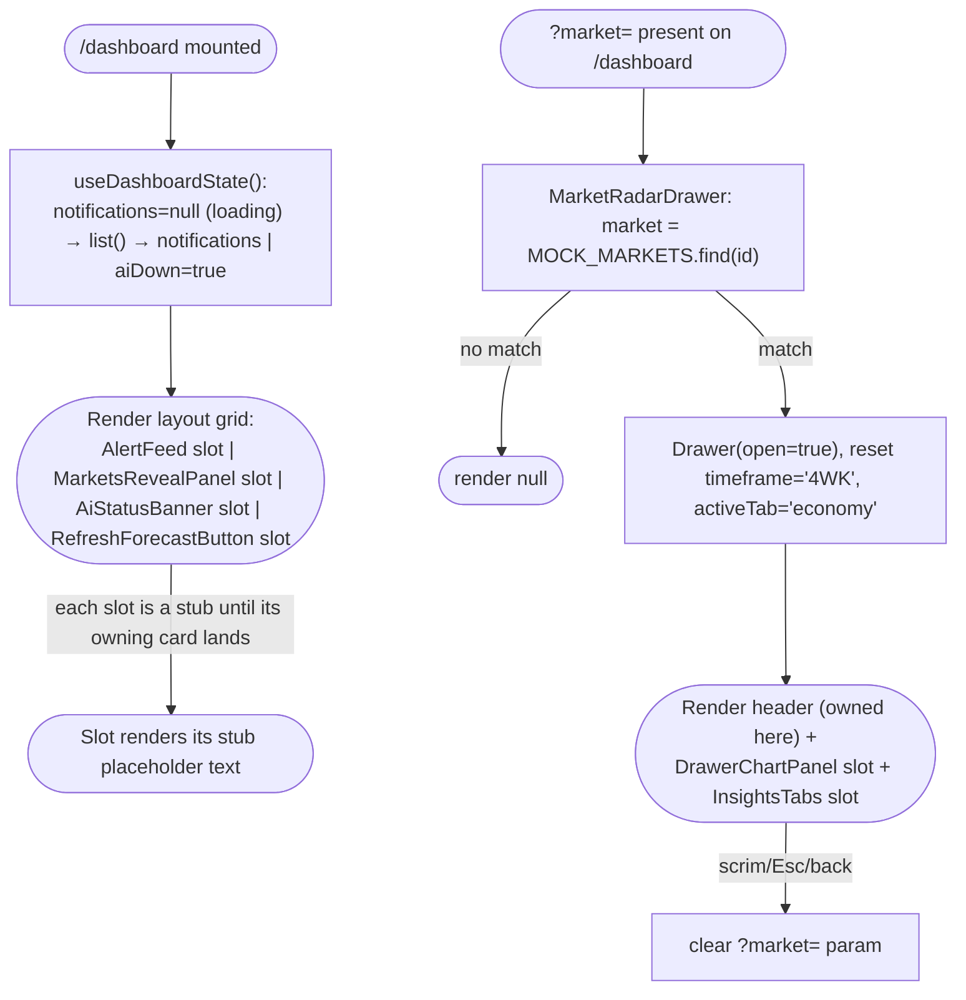
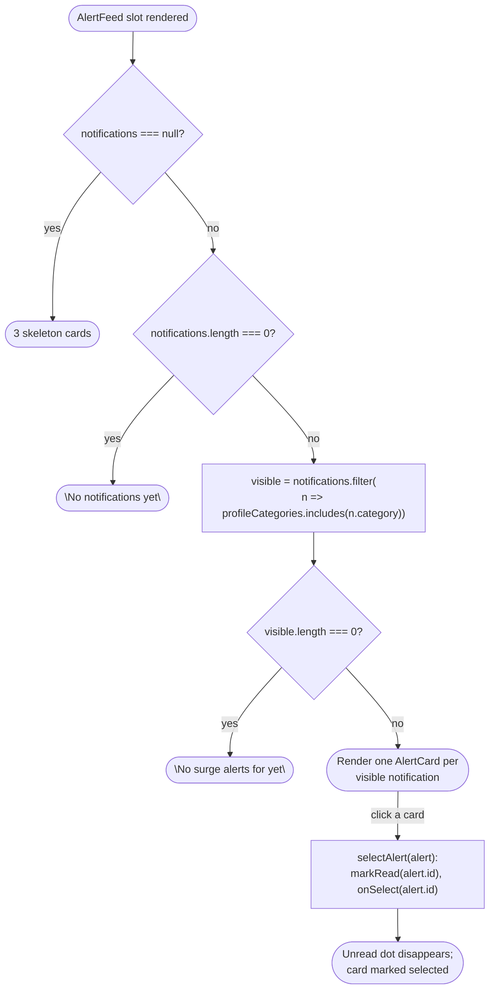
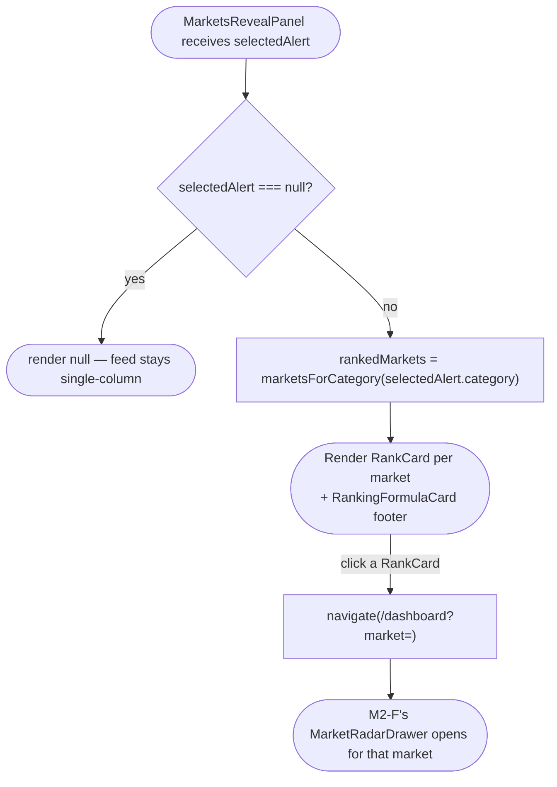
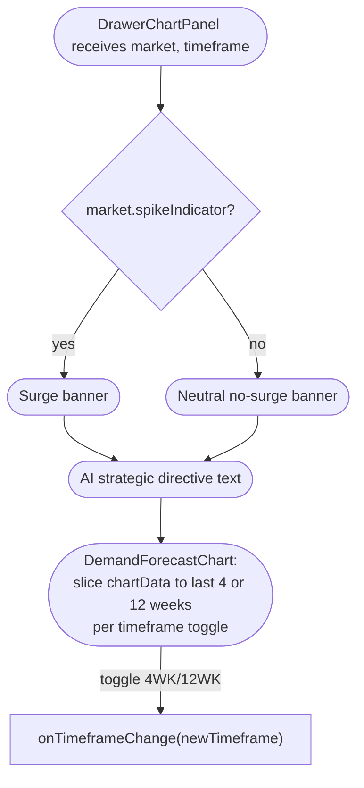
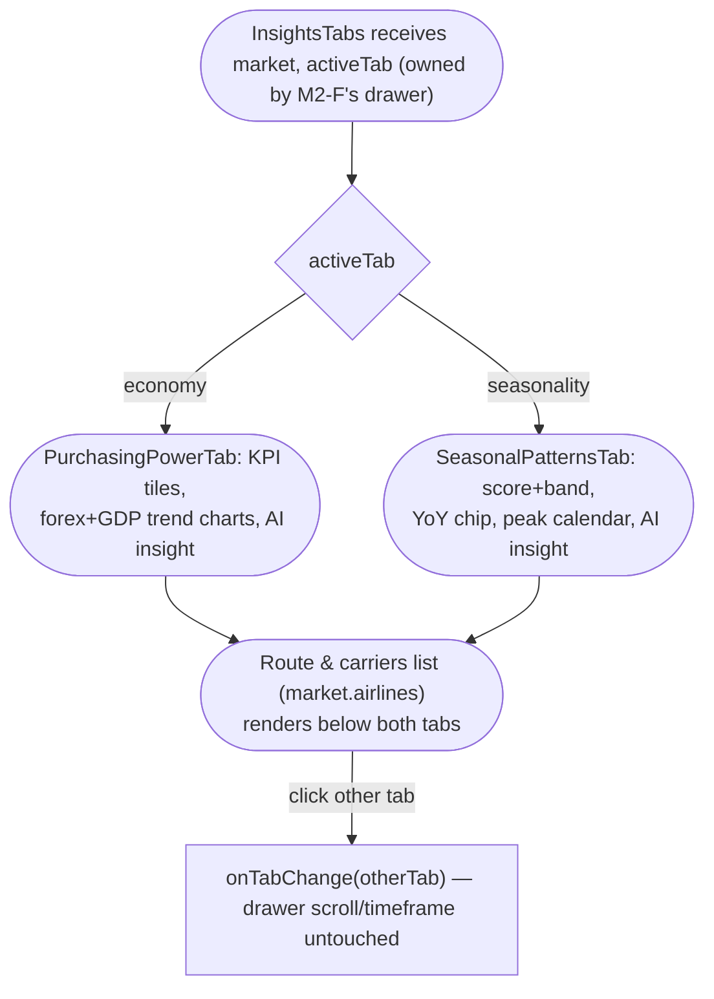
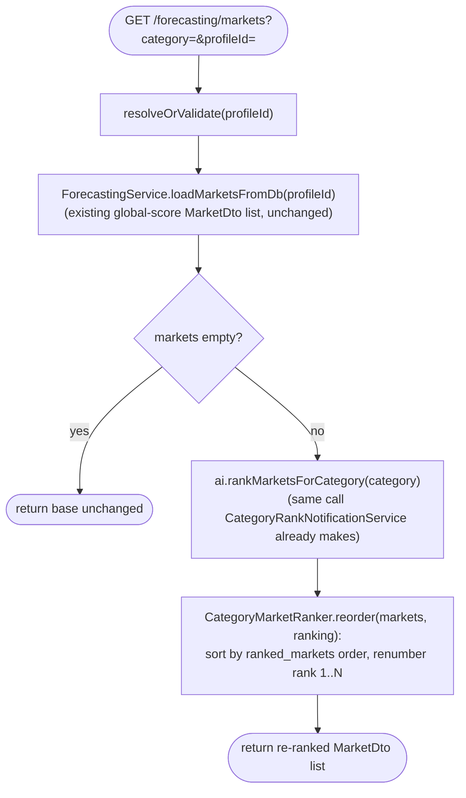
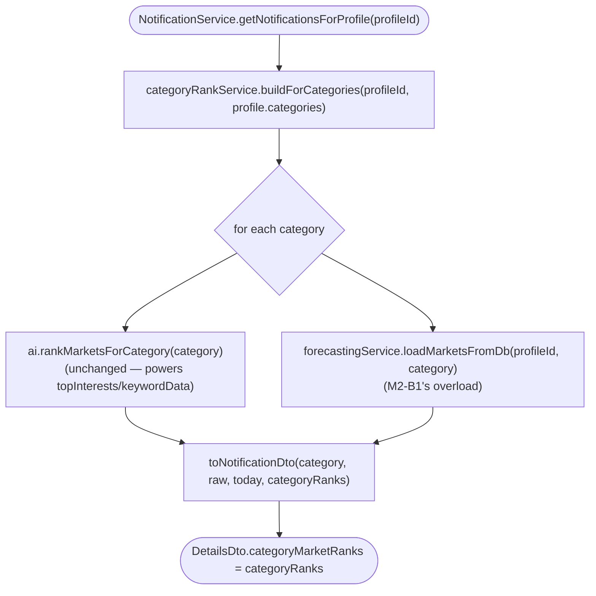

# Module 2 Parallel Task-Card Revamp Implementation Plan

> **For agentic workers:** REQUIRED SUB-SKILL: Use superpowers:subagent-driven-development (recommended) or superpowers:executing-plans to implement this plan task-by-task. Steps use checkbox (`- [ ]`) syntax for tracking.

**Goal:** Rewrite Module 2's task-card plan so a single foundation card is the only blocker between
Foundation and eight fully-parallel Module 2 cards (five frontend, three... two backend), and encode
the pattern that made this possible as a binding, repo-wide rule.

**Architecture:** No source code changes. This plan edits/creates planning documents only: `00-index.md`
(module-scoped ID scheme + new binding rule), a full rewrite of `03-module-2.md` (8 cards: `M2-F`
foundation + `M2-1`..`M2-5` frontend + `M2-B1`/`M2-B2` backend), and their `diagrams/cards/module-2/*.mmd`
+ `pseudocode/module-2/*.ts` companions, reusing/renaming the 5 existing ones and adding 3 new ones.

**Tech Stack:** Markdown + Mermaid `flowchart TD` + typed-outline `.ts` pseudocode — matches every other
card file in `docs/superpowers/plans/2026-08-10-ui-ux-overhaul-frontend/`.

**Per this repo's `.claude/CLAUDE.md`:** never run `git commit`/`git push`. Every task below ends at
"stage the files" — commits are the user's to run.

---

### Task 1: Add the module-scoped ID convention to `00-index.md`

**Files:**
- Modify: `docs/superpowers/plans/2026-08-10-ui-ux-overhaul-frontend/00-index.md`

- [ ] **Step 1: Add the binding foundation-card rule to the "Card template" section**

In `00-index.md`, immediately after the existing "Field guide" bullet list (after the "Diagrams" bullet,
before the "## Decisions this plan assumes" heading), insert:

```markdown
**Card IDs:** `M<module#>-F[<k>]` for a module's foundation card(s), `M<module#>-<k>` for regular
cards, `M<module#>-B<k>` for a module's backend track (when its work spans a frontend/backend split).
Foundation cards keep the `Foundation — <Module>` / `Foundation — <Name>` naming already used above;
`M<n>-F` is the id column shorthand for cross-referencing, not a rename of that convention.

**Binding rule — one prerequisite per module:** every module file must open with one or more
`Foundation — <Module>` card(s) that every other card in that module depends on directly, and — aside
from a module's own independent track roots (e.g. a backend track parallel to the frontend track) —
that is the *only* thing sibling cards may depend on within the module. Sibling cards must never list
the same file under "Project files to add/implement"; if two features would naturally share a file,
the foundation card owns that file (creating typed stubs/slots for the pieces sibling cards will fill
in) and each sibling card fully owns replacing its one assigned stub. This keeps every card after the
foundation buildable in full parallel — see `03-module-2.md` for a worked example.
```

- [ ] **Step 2: Replace the dependency-graph table with module-scoped IDs**

Replace the entire "## Dependency graph" section's intro paragraph and table with:

```markdown
## Dependency graph

Foundation cards have no dependencies and block every screen card. Within a module, cards depend only
on their module's foundation card(s) unless cross-module-linked below (Content Studio's Publish
Composer needs Settings — Platforms; Calendar and Performance's published list need Content Studio's
publish action). Module 2 uses the new module-scoped ID scheme end to end (see `03-module-2.md`);
Modules 1/3/4 below keep their legacy local numbers for now — retrofitting them is future work, not
done in this pass.

| ID | Card | File | Depends on |
|---|---|---|---|
| — | Project Scaffold | [`01-foundation.md`](01-foundation.md) | — |
| — | Design System | [`01-foundation.md`](01-foundation.md) | Project Scaffold |
| — | Shell & Routing | [`01-foundation.md`](01-foundation.md) | Design System |
| — | Fixture Data Layer | [`01-foundation.md`](01-foundation.md) | Project Scaffold |
| 4 | Onboarding — Wizard Shell & Step 1 Basic Info | [`02-module-1.md`](02-module-1.md) | Shell & Routing |
| 5 | Onboarding — Step 2 Brand Identity | [`02-module-1.md`](02-module-1.md) | Card 4 |
| 6 | Onboarding — Step 3 Structured Inputs | [`02-module-1.md`](02-module-1.md) | Card 4 |
| 7 | Onboarding — Step 4 Assets & Links | [`02-module-1.md`](02-module-1.md) | Card 4 |
| 8 | Onboarding — Step 5 Analysis | [`02-module-1.md`](02-module-1.md) | Cards 5, 6, Fixture Data Layer |
| 9 | Settings — Business Profile | [`02-module-1.md`](02-module-1.md) | Shell & Routing, Fixture Data Layer |
| M2-F | Foundation — Dashboard & Radar Shell | [`03-module-2.md`](03-module-2.md) | Shell & Routing, Fixture Data Layer |
| M2-1 | Dashboard — Alert Feed & Category Filtering | [`03-module-2.md`](03-module-2.md) | M2-F |
| M2-2 | Dashboard — Markets Reveal | [`03-module-2.md`](03-module-2.md) | M2-F |
| M2-3 | Dashboard — AI Status Banner & Refresh Forecast | [`03-module-2.md`](03-module-2.md) | M2-F |
| M2-4 | Market Radar Drawer — Directive & Demand Chart | [`03-module-2.md`](03-module-2.md) | M2-F |
| M2-5 | Market Radar Drawer — Economic & Seasonal Insights Tabs | [`03-module-2.md`](03-module-2.md) | M2-F |
| M2-B1 | Category-Scoped Market Ranking — Query & Endpoint | [`03-module-2.md`](03-module-2.md) | — |
| M2-B2 | Category-Scoped Market Ranking — Alert-Time Rank Embed | [`03-module-2.md`](03-module-2.md) | M2-B1 |
| 15 | Content Studio — AI Copywriting Matrix (incl. Naver) | [`04-module-3.md`](04-module-3.md) | Shell & Routing, Fixture Data Layer |
| 16 | Content Studio — Visual Direction Board | [`04-module-3.md`](04-module-3.md) | Card 15 |
| 17 | Content Studio — Publish Composer (connection-gated) | [`04-module-3.md`](04-module-3.md) | Card 15, Settings — Platforms |
| 18 | Content Studio — Compliance Audit Panel | [`04-module-3.md`](04-module-3.md) | Card 17 |
| 19 | Content Studio — Content Board & Publish Action | [`04-module-3.md`](04-module-3.md) | Cards 17, 18 |
| 20 | Calendar — Month Grid & Navigation | [`04-module-3.md`](04-module-3.md) | Card 19 (shared post store) |
| 21 | Calendar — List View & Day-Click Modal | [`04-module-3.md`](04-module-3.md) | Card 20 |
| 22 | Settings — Platforms | [`04-module-3.md`](04-module-3.md) | Shell & Routing, Fixture Data Layer |
| 23 | Settings — Workspace | [`04-module-3.md`](04-module-3.md) | Shell & Routing, Fixture Data Layer |
| 24 | Performance — Ingestion Form Entry State | [`05-module-4.md`](05-module-4.md) | Shell & Routing |
| 25 | Performance — KPI Cards, PES Gauge & Funnel | [`05-module-4.md`](05-module-4.md) | Card 24 |
| 26 | Performance — Trend Charts & AI Action Plan | [`05-module-4.md`](05-module-4.md) | Card 25 |
| 27 | Performance — Previously Published & Post Analytics Modal | [`05-module-4.md`](05-module-4.md) | Card 25, Content Studio Card 19 |
```

- [ ] **Step 3: Update the Playwright spec ↔ card map row for Module 2**

Replace the `dashboard.spec.ts` and `market-radar-drawer.spec.ts` rows in the "## Playwright spec ↔ card
map" table with:

```markdown
| `e2e/tests/dashboard.spec.ts` | M2-F, M2-1, M2-2, M2-3 |
| `e2e/tests/market-radar-drawer.spec.ts` | M2-F, M2-4, M2-5 |
```

- [ ] **Step 4: Verify no leftover reference to the old Module 2 numbering**

Run: `grep -n "Card 1[0-4]" docs/superpowers/plans/2026-08-10-ui-ux-overhaul-frontend/00-index.md`
Expected: no output (all Module 2 rows now use `M2-*` ids).

- [ ] **Step 5: Stage the file**

```bash
git add docs/superpowers/plans/2026-08-10-ui-ux-overhaul-frontend/00-index.md
```

---

### Task 2: Write the M2-F foundation card's diagram and pseudocode

**Files:**
- Create: `docs/superpowers/plans/2026-08-10-ui-ux-overhaul-frontend/diagrams/cards/module-2/foundation-dashboard-radar-shell.mmd`
- Create: `docs/superpowers/plans/2026-08-10-ui-ux-overhaul-frontend/pseudocode/module-2/foundation-dashboard-radar-shell.ts`

- [ ] **Step 1: Write the flow diagram**



- [ ] **Step 2: Write the pseudocode**

```typescript
// ---- components/module-2/2.1-dashboard/dashboardTypes.ts ----
export interface AlertFeedSlotProps {
  notifications: Notification[] | null   // null = loading
  profileCategories: string[]
  selectedId: string | null
  onSelect(id: string): void
}
export interface MarketsRevealSlotProps { selectedAlert: Notification | null }
export interface AiStatusBannerSlotProps { visible: boolean }
export interface RefreshForecastSlotProps { disabled?: boolean }

// ---- components/module-2/2.1-dashboard/DashboardView.tsx ----
imports: useEffect, useState, apiClient, useProfile, dashboardTypes,
         AlertFeed, MarketsRevealPanel, AiStatusBanner, RefreshForecastButton

function useDashboardState():
  state: notifications ← null (loading), aiDown ← false, selectedId ← null
  on mount → apiClient.notifications.list()
    → success: setNotifications(list)
    → failure: aiDown ← true   // alerts, if any cached ones exist client-side, still render
  select(id): setSelectedId(id => id === id ? null : id)   // clicking same alert again deselects
  returns { notifications, aiDown, selectedId, select }

function DashboardView():
  { profile } ← useProfile()
  { notifications, aiDown, selectedId, select } ← useDashboardState()
  visible ← notifications?.filter(n => profile.categories.includes(n.category)) ?? []
  selectedAlert ← visible.find(n => n.id === selectedId) ?? null

  render: layout grid —
    <AiStatusBanner visible={aiDown}/>
    two-column when selectedAlert is non-null, else single-column:
      <AlertFeed notifications={notifications} profileCategories={profile.categories}
                 selectedId={selectedId} onSelect={select}/>
      <MarketsRevealPanel selectedAlert={selectedAlert}/>
    <RefreshForecastButton/>

// ---- components/module-2/2.1-dashboard/AlertFeed.tsx (stub) ----
// ---- components/module-2/2.1-dashboard/MarketsRevealPanel.tsx (stub) ----
// ---- components/module-2/2.1-dashboard/AiStatusBanner.tsx (stub) ----
// ---- components/module-2/2.1-dashboard/RefreshForecastButton.tsx (stub) ----
each: typed against its Slot interface in dashboardTypes.ts; renders the same
"Not implemented yet — see CARD M2-<n>" placeholder style DashboardView.tsx uses today.
Ownership of each stub transfers whole to the sibling card named in dashboardTypes.ts's comment above it.

// ---- components/module-2/2.2-market-radar/radarTypes.ts ----
export type InsightsTab = 'economy' | 'seasonality'
export interface DrawerChartSlotProps {
  market: Market
  timeframe: '4WK' | '12WK'
  onTimeframeChange(t: '4WK' | '12WK'): void
}
export interface DrawerInsightsSlotProps {
  market: Market
  activeTab: InsightsTab
  onTabChange(t: InsightsTab): void
}

// ---- components/module-2/2.2-market-radar/MarketRadarDrawer.tsx ----
imports: useSearchParams, useNavigate, Drawer, MOCK_MARKETS, radarTypes, DrawerChartPanel, InsightsTabs

function MarketRadarDrawer():
  marketId ← searchParams.get('market')
  market ← MOCK_MARKETS.find(m => m.id === marketId) ?? null
  state: timeframe ← '4WK', activeTab ← 'economy'
  on marketId change → reset timeframe to '4WK', activeTab to 'economy'
  close(): clear ?market= param  // Drawer's scrim/Esc/back also route here
  targetThisMarket(): close(); navigate('/content', {targetedMarketId: market.id, activeMarketId: market.id})
  if !market → render null
  render: Drawer(open=!!market, onClose=close) containing:
    header (owned here): rank badge, name, city→Cebu distance/flight-time, close, "Target this market" CTA
    <DrawerChartPanel market={market} timeframe={timeframe} onTimeframeChange={setTimeframe}/>
    <InsightsTabs market={market} activeTab={activeTab} onTabChange={setActiveTab}/>

// ---- components/module-2/2.2-market-radar/DrawerChartPanel.tsx (stub) ----
// ---- components/module-2/2.2-market-radar/InsightsTabs.tsx (stub) ----
each: typed against its Slot interface in radarTypes.ts; same placeholder style.
Ownership transfers whole to the sibling card named in radarTypes.ts's comment above it.
```

- [ ] **Step 3: Stage the files**

```bash
git add docs/superpowers/plans/2026-08-10-ui-ux-overhaul-frontend/diagrams/cards/module-2/foundation-dashboard-radar-shell.mmd \
        docs/superpowers/plans/2026-08-10-ui-ux-overhaul-frontend/pseudocode/module-2/foundation-dashboard-radar-shell.ts
```

---

### Task 3: Re-scope M2-1's existing diagram/pseudocode to the AlertFeed slot

**Files:**
- Modify: `docs/superpowers/plans/2026-08-10-ui-ux-overhaul-frontend/pseudocode/module-2/alert-feed-category-filtering.ts`
- Modify: `docs/superpowers/plans/2026-08-10-ui-ux-overhaul-frontend/diagrams/cards/module-2/alert-feed-category-filtering.mmd`

- [ ] **Step 1: Overwrite the pseudocode file**

```typescript
// ---- components/module-2/2.1-dashboard/AlertFeed.tsx ----
// Replaces the M2-F stub. Implements AlertFeedSlotProps from dashboardTypes.ts.
// Owns all 3 of the feed's own states: loading, empty (no notifications ever),
// and zero-matching (categories set but none match) — the ai-down banner is M2-3's
// AiStatusBanner, a sibling slot, not this file.
props: { notifications, profileCategories, selectedId, onSelect }
imports: AlertCard

visible ← notifications?.filter(n => profileCategories.includes(n.category)) ?? []

selectAlert(alert):
  apiClient.notifications.markRead(alert.id)   // mark-read side effect of the click itself
  onSelect(alert.id)

render:
  notifications === null → 3 skeleton cards
  notifications !== null AND notifications.length === 0 → "No notifications yet"
  visible.length === 0 (notifications exist, none match profile categories) →
    "No surge alerts for <profileCategories.join(', ')> yet — widen coverage in Settings"
  else → visible.map → AlertCard (selected = matches selectedId, onClick = () => selectAlert(alert))

// ---- components/module-2/2.1-dashboard/AlertCard.tsx ----
props: { alert, selected, onClick }
render: unread dot if !alert.isRead, date, title, message, chips (market/category/trend),
        surge chip if alertLevel === 'WARNING'
```

- [ ] **Step 2: Overwrite the diagram file**



- [ ] **Step 3: Stage the files**

```bash
git add docs/superpowers/plans/2026-08-10-ui-ux-overhaul-frontend/pseudocode/module-2/alert-feed-category-filtering.ts \
        docs/superpowers/plans/2026-08-10-ui-ux-overhaul-frontend/diagrams/cards/module-2/alert-feed-category-filtering.mmd
```

---

### Task 4: Re-scope M2-2's existing diagram/pseudocode to the MarketsRevealPanel slot

**Files:**
- Modify: `docs/superpowers/plans/2026-08-10-ui-ux-overhaul-frontend/pseudocode/module-2/markets-reveal.ts`
- Modify: `docs/superpowers/plans/2026-08-10-ui-ux-overhaul-frontend/diagrams/cards/module-2/markets-reveal.mmd`

- [ ] **Step 1: Overwrite the pseudocode file**

```typescript
// ---- components/module-2/2.1-dashboard/MarketsRevealPanel.tsx ----
// Replaces the M2-F stub. Implements MarketsRevealSlotProps from dashboardTypes.ts.
props: { selectedAlert }
imports: useNavigate, marketsForCategory, RankCard, RankingFormulaCard

rankedMarkets ← selectedAlert ? marketsForCategory(selectedAlert.category) : null
  // marketsForCategory is the Foundation — Fixture Data Layer fixture stand-in for the real
  // GET /forecasting/markets?category= endpoint (backend track M2-B1/M2-B2) — swap-in is a
  // separate, later, non-blocking integration task, not part of this card

openMarket(marketId): navigate(`/dashboard?market=${marketId}`)  // opens M2-F's drawer shell

if !rankedMarkets → render null   // DashboardView's grid (M2-F) collapses to single-column automatically
render: rankedMarkets.map(m => <RankCard market={m} onClick={() => openMarket(m.id)}/>) + <RankingFormulaCard/>

// ---- components/module-2/2.1-dashboard/RankCard.tsx ----
props: { market, onClick }
surgeActive ← market.chartData.some(p => p.spike === 1)
render: rank number, 0-100 market-potential bar, city+distance, direct/via-Manila + flight hours +
        frequency, surge chip if surgeActive

// ---- components/module-2/2.1-dashboard/RankingFormulaCard.tsx ----
render: static formula text "market_score = 0.40·demand₄w + 0.35·seasonality + 0.25·economic_viability"
```

- [ ] **Step 2: Overwrite the diagram file**



- [ ] **Step 3: Stage the files**

```bash
git add docs/superpowers/plans/2026-08-10-ui-ux-overhaul-frontend/pseudocode/module-2/markets-reveal.ts \
        docs/superpowers/plans/2026-08-10-ui-ux-overhaul-frontend/diagrams/cards/module-2/markets-reveal.mmd
```

---

### Task 5: Re-scope M2-3's existing diagram/pseudocode to AiStatusBanner + RefreshForecastButton

**Files:**
- Modify: `docs/superpowers/plans/2026-08-10-ui-ux-overhaul-frontend/pseudocode/module-2/states-refresh-forecast.ts`
- Modify: `docs/superpowers/plans/2026-08-10-ui-ux-overhaul-frontend/diagrams/cards/module-2/states-refresh-forecast.mmd`

- [ ] **Step 1: Overwrite the pseudocode file**

```typescript
// ---- components/module-2/2.1-dashboard/AiStatusBanner.tsx ----
// Replaces the M2-F stub. Implements AiStatusBannerSlotProps from dashboardTypes.ts.
// The 2 states this card owns (of the dashboard's 6 total): the other 4 — loading, empty,
// zero-matching, and the alert-feed-with-cards state — belong to M2-1's AlertFeed.tsx.
props: { visible }
render: visible ? amber "AI Forecast Service Unavailable — alerts shown are from cache; refresh
        will not produce new predictions" banner : null

// ---- components/module-2/2.1-dashboard/RefreshForecastButton.tsx ----
// Replaces the M2-F stub. Implements RefreshForecastSlotProps from dashboardTypes.ts.
props: { disabled? }
state: running ← false

handleRefresh():
  running ← true  // disables button, spinner label "Running pipeline…"
  apiClient.markets.list()  // re-run forecast, fixture-backed
  running ← false
  showToast(`Forecast refreshed — N markets re-ranked`)

render: button (disabled if disabled prop or running; label swaps to spinner text while running)
```

- [ ] **Step 2: Overwrite the diagram file**

```mermaid
flowchart TD
  Banner(["AiStatusBanner receives visible"]) --> BCheck{"visible?"}
  BCheck -->|yes| BShow(["Amber \"AI Forecast Service Unavailable\" banner"])
  BCheck -->|no| BHide(["render null"])

  Btn(["RefreshForecastButton clicked"]) --> Run["running=true, disable + spinner label"]
  Run --> Call["apiClient.markets.list()"]
  Call --> Done["running=false, showToast('Forecast refreshed — N markets re-ranked')"]
```

- [ ] **Step 3: Stage the files**

```bash
git add docs/superpowers/plans/2026-08-10-ui-ux-overhaul-frontend/pseudocode/module-2/states-refresh-forecast.ts \
        docs/superpowers/plans/2026-08-10-ui-ux-overhaul-frontend/diagrams/cards/module-2/states-refresh-forecast.mmd
```

---

### Task 6: Rename and re-scope M2-4's diagram/pseudocode to the DrawerChartPanel slot

**Files:**
- Create (rename target): `docs/superpowers/plans/2026-08-10-ui-ux-overhaul-frontend/pseudocode/module-2/market-radar-directive-demand-chart.ts`
- Create (rename target): `docs/superpowers/plans/2026-08-10-ui-ux-overhaul-frontend/diagrams/cards/module-2/market-radar-directive-demand-chart.mmd`
- Delete: `docs/superpowers/plans/2026-08-10-ui-ux-overhaul-frontend/pseudocode/module-2/market-radar-shell-directive-chart.ts`
- Delete: `docs/superpowers/plans/2026-08-10-ui-ux-overhaul-frontend/diagrams/cards/module-2/market-radar-shell-directive-chart.mmd`

The old filename included "shell," which now belongs to M2-F — renaming avoids a stale name pointing at
a card that no longer owns the shell.

- [ ] **Step 1: Write the new pseudocode file**

```typescript
// ---- components/module-2/2.2-market-radar/DrawerChartPanel.tsx ----
// Replaces the M2-F stub. Implements DrawerChartSlotProps from radarTypes.ts.
props: { market, timeframe, onTimeframeChange }
imports: DemandForecastChart

render: surge banner if market.spikeIndicator else neutral no-surge banner,
        AI strategic directive text (market.directive),
        <DemandForecastChart chartData={market.chartData} timeframe={timeframe}
                              onTimeframeChange={onTimeframeChange}/>

// ---- components/module-2/2.2-market-radar/DemandForecastChart.tsx ----
props: { chartData, timeframe, onTimeframeChange }
const ZONES: [Low, Moderate, High peak] each paired with pricing-action guidance

weeks ← timeframe === '4WK' ? 4 : 12
data ← chartData.slice(-weeks)
render: 4WK/12WK toggle buttons, Recharts LineChart(history + forecast lines), zone-key legend
```

- [ ] **Step 2: Write the new diagram file**



- [ ] **Step 3: Delete the old-named files**

```bash
rm docs/superpowers/plans/2026-08-10-ui-ux-overhaul-frontend/pseudocode/module-2/market-radar-shell-directive-chart.ts \
   docs/superpowers/plans/2026-08-10-ui-ux-overhaul-frontend/diagrams/cards/module-2/market-radar-shell-directive-chart.mmd
```

- [ ] **Step 4: Stage the changes**

```bash
git add docs/superpowers/plans/2026-08-10-ui-ux-overhaul-frontend/pseudocode/module-2/market-radar-directive-demand-chart.ts \
        docs/superpowers/plans/2026-08-10-ui-ux-overhaul-frontend/diagrams/cards/module-2/market-radar-directive-demand-chart.mmd \
        docs/superpowers/plans/2026-08-10-ui-ux-overhaul-frontend/pseudocode/module-2/market-radar-shell-directive-chart.ts \
        docs/superpowers/plans/2026-08-10-ui-ux-overhaul-frontend/diagrams/cards/module-2/market-radar-shell-directive-chart.mmd
```

---

### Task 7: Re-scope M2-5's existing diagram/pseudocode to the InsightsTabs slot (sibling, not child, of M2-4)

**Files:**
- Modify: `docs/superpowers/plans/2026-08-10-ui-ux-overhaul-frontend/pseudocode/module-2/market-radar-insights-tabs.ts`
- Modify: `docs/superpowers/plans/2026-08-10-ui-ux-overhaul-frontend/diagrams/cards/module-2/market-radar-insights-tabs.mmd`

- [ ] **Step 1: Overwrite the pseudocode file**

```typescript
// ---- components/module-2/2.2-market-radar/InsightsTabs.tsx ----
// Replaces the M2-F stub. Implements DrawerInsightsSlotProps from radarTypes.ts.
// activeTab/onTabChange are owned by MarketRadarDrawer (M2-F), not local state — this is what
// makes this card a true sibling of M2-4 instead of depending on it.
props: { market, activeTab, onTabChange }
imports: PurchasingPowerTab, SeasonalPatternsTab

render: two-tab switcher ("Purchasing power"/"Seasonal patterns", onClick calls onTabChange) +
        activeTab === 'economy' ? PurchasingPowerTab(market) : SeasonalPatternsTab(market) +
        route & carriers list (market.airlines) below both tabs, not tab-specific

// ---- components/module-2/2.2-market-radar/PurchasingPowerTab.tsx ----
props: { market }
render: KPI tiles (forex rate, GDP, avg flight price, accessibility score) +
        AI economic insight paragraph + 12-month forex trend chart + 5-year GDP trend chart

// ---- components/module-2/2.2-market-radar/SeasonalPatternsTab.tsx ----
props: { market }

function seasonalityBand(score): 'weak'|'emerging'|'likely'|'confirmed'  // threshold mapping

render: seasonality score + band + YoY ratio chip (N/A if market.yoyRatio is null, i.e. <59 weeks
        history) + 12-month peak calendar grid (highlights market.peakMonths) +
        AI seasonality insight paragraph + full 24-week chart (history + forecast)
```

- [ ] **Step 2: Overwrite the diagram file**



- [ ] **Step 3: Stage the files**

```bash
git add docs/superpowers/plans/2026-08-10-ui-ux-overhaul-frontend/pseudocode/module-2/market-radar-insights-tabs.ts \
        docs/superpowers/plans/2026-08-10-ui-ux-overhaul-frontend/diagrams/cards/module-2/market-radar-insights-tabs.mmd
```

---

### Task 8: Write M2-B1's diagram and pseudocode (category-scoped ranking — query & endpoint)

Grounded in the real code (not `category-scoped-ranking.md`'s premise, which assumes `DemandAlert`
already carries a category — it doesn't; see Task 9's note). `CategoryRankNotificationService` already
calls `AIInferenceGatewayService.rankMarketsForCategory(category)` per profile category for keyword-trend
notifications — M2-B1 reuses that same call to re-rank the Dashboard's existing `MarketDto` list.

**Files:**
- Create: `docs/superpowers/plans/2026-08-10-ui-ux-overhaul-frontend/diagrams/cards/module-2/category-scoped-ranking-query.mmd`
- Create: `docs/superpowers/plans/2026-08-10-ui-ux-overhaul-frontend/pseudocode/module-2/category-scoped-ranking-query.ts`

- [ ] **Step 1: Write the diagram file**



- [ ] **Step 2: Write the pseudocode file**

```typescript
// ---- backend/spring-boot/src/main/java/com/ceview/module2/ForecastingController.java (modify markets()) ----
@GetMapping("/markets")
markets(@RequestParam(required = false) UUID profileId, @RequestParam(required = false) String category):
  resolvedProfileId ← currentBusinessProfile.resolveOrValidate(profileId)
  result ← (category != null && !category.isBlank())
    ? forecastingService.loadMarketsFromDb(resolvedProfileId, category)
    : forecastingService.loadMarketsFromDb(resolvedProfileId)   // existing path, unchanged
  return 200 result
  // same try/catch → 503 {"code": "MOD22_MARKETS_FAILED", ...} wrapper as today

// ---- backend/spring-boot/src/main/java/com/ceview/module2/submodule22/ForecastingService.java (new overload) ----
loadMarketsFromDb(UUID profileId, String category) -> MarketsResponse:
  base ← loadMarketsFromDb(profileId)   // existing method, fully unchanged
  if base.markets().isEmpty() → return base
  ranking ← ai.rankMarketsForCategory(category)   // AIInferenceGatewayService, already used by
                                                   // CategoryRankNotificationService.buildForCategories()
  reordered ← CategoryMarketRanker.reorder(base.markets(), ranking)
  return new MarketsResponse(reordered)

// ---- backend/spring-boot/src/main/java/com/ceview/module2/submodule22/CategoryMarketRanker.java (new) ----
class CategoryMarketRanker:
  static reorder(markets: List<MarketDto>, ranking: Map<String, Object>) -> List<MarketDto>:
    rankedRaw ← ranking.getOrDefault("ranked_markets", List.of())   // [{market: "korea", total_volume: ...}, ...]
    orderedMarketIds ← rankedRaw.map(entry -> entry.get("market"))  // e.g. ["korea", "japan", "usa"], already ordered
    sorted ← markets.sortedBy(m -> {
      idx ← orderedMarketIds.indexOf(m.market())
      return idx == -1 ? Integer.MAX_VALUE : idx   // markets missing from the category ranking sort last
    })
    return sorted.mapIndexed((i, m) -> m.withRank(i + 1))   // MarketDto is a record; withRank rebuilds with new rank
```

- [ ] **Step 3: Stage the files**

```bash
git add docs/superpowers/plans/2026-08-10-ui-ux-overhaul-frontend/diagrams/cards/module-2/category-scoped-ranking-query.mmd \
        docs/superpowers/plans/2026-08-10-ui-ux-overhaul-frontend/pseudocode/module-2/category-scoped-ranking-query.ts
```

---

### Task 9: Write M2-B2's diagram and pseudocode (category-scoped ranking — alert-time rank embed)

**Files:**
- Create: `docs/superpowers/plans/2026-08-10-ui-ux-overhaul-frontend/diagrams/cards/module-2/category-scoped-ranking-alert-embed.mmd`
- Create: `docs/superpowers/plans/2026-08-10-ui-ux-overhaul-frontend/pseudocode/module-2/category-scoped-ranking-alert-embed.ts`

- [ ] **Step 1: Write the diagram file**



- [ ] **Step 2: Write the pseudocode file**

```typescript
// NOTE ON docs/module-2/backend/category-scoped-ranking.md's "Option 2": that doc assumes
// DemandAlert already carries one category per row (from a 21-job category×market grid). In the
// actual codebase, DemandAlert has no category column — persistDemandAlert() in ForecastingService
// generates alerts per (profile, market) only, unconditioned on category. The per-category signal
// that *does* exist is the keyword-trend NotificationDto CategoryRankNotificationService already
// builds once per profile category. M2-B2 embeds categoryMarketRanks there instead — same outcome
// (Dashboard gets category-scoped ranks without a second round-trip), no new DB column needed.
// Whoever next touches category-scoped-ranking.md should update its "Option 2" section to match.

// ---- backend/spring-boot/src/main/java/com/ceview/module2/submodule22/NotificationService.java (modify) ----
getNotificationsForProfile(profileId):
  profileCategories ← profileRepo.findById(profileId).map(categoriesList).orElse(List.of())
  keywordNotifications ← categoryRankService.buildForCategories(profileId, profileCategories)   // profileId now passed through
  // ...rest unchanged (demand-alert merge, etc.)

// ---- backend/spring-boot/src/main/java/com/ceview/module2/submodule22/CategoryRankNotificationService.java (modify) ----
buildForCategories(profileId: UUID, categories: List<String>) -> List<NotificationDto>:
  for category in categories:
    raw ← ai.rankMarketsForCategory(category)
    if raw is empty → continue (unchanged skip behavior)
    categoryRanks ← forecastingService.loadMarketsFromDb(profileId, category).markets()   // M2-B1's overload
    result.add(toNotificationDto(category, raw, today, categoryRanks))
  return result

toNotificationDto(category, raw, today, categoryRanks: List<MarketDto>):
  // ...unchanged topMarketKey/topKeyword/topInterests/keywordData/insights mapping...
  details ← new DetailsDto(
    0, 0.0, topInterests, List.of(), insights, keywordData,
    /* contentStrategy */ null,
    /* categoryMarketRanks */ categoryRanks)   // new field

// ---- backend/spring-boot/src/main/java/com/ceview/module2/dto/NotificationDtos.java (modify DetailsDto) ----
record DetailsDto(
  int projectedArrivals, double growthRate,
  List<TopInterestDto> topInterests, List<String> tags,
  StrategicInsightsDto insights, List<KeywordTrendDto> keywordData,
  String contentStrategy,
  List<MarketDto> categoryMarketRanks   // new, nullable — only keyword-trend notifications populate it;
)                                        // demand-surge notifications (toNotificationDto in
                                         // NotificationService) pass null, unaffected by this card
```

- [ ] **Step 3: Stage the files**

```bash
git add docs/superpowers/plans/2026-08-10-ui-ux-overhaul-frontend/diagrams/cards/module-2/category-scoped-ranking-alert-embed.mmd \
        docs/superpowers/plans/2026-08-10-ui-ux-overhaul-frontend/pseudocode/module-2/category-scoped-ranking-alert-embed.ts
```

---

### Task 10: Rewrite `03-module-2.md` with all 8 cards

**Files:**
- Modify (full rewrite): `docs/superpowers/plans/2026-08-10-ui-ux-overhaul-frontend/03-module-2.md`

- [ ] **Step 1: Overwrite the file**

```markdown
# Module 2 — Market Radar & Notifications

Frontend-track paths (M2-F, M2-1..M2-5) are relative to `frontend/` (see `00-index.md`'s "Target
directory" note). Backend-track paths (M2-B1, M2-B2) are relative to the repo root. Any DoD item below
referencing a Playwright spec passing is deferred until `frontend/` is wired into `e2e/` — see
`00-index.md`'s Testing Strategy; treat it as a manual verification step for now.

Screen docs: [`docs/module-2/screens/dashboard.md`](../../../module-2/screens/dashboard.md),
[`market-radar-drawer.md`](../../../module-2/screens/market-radar-drawer.md). Spec files:
`e2e/tests/dashboard.spec.ts` (M2-F, M2-1, M2-2, M2-3), `e2e/tests/market-radar-drawer.spec.ts`
(M2-F, M2-4, M2-5).

**Component diagram:** [`diagrams/module-2.mmd`](diagrams/module-2.mmd)

**Parallelism:** M2-F is the only card every other frontend card in this file depends on — M2-1
through M2-5 can all be built simultaneously once M2-F merges, since each owns disjoint files. M2-B1
is the backend track's own root (no dependency on anything in this file); M2-B2 depends only on M2-B1.
Neither backend card blocks nor is blocked by any frontend card.

---

### CARD — Foundation: Dashboard & Radar Shell

**Depends on:** Foundation — Shell & Routing, Foundation — Fixture Data Layer
**Summary:** The page shells, state hooks, and typed slot contracts for both the Dashboard and the
Market Radar drawer, so every other Module 2 frontend card can be built in parallel against a stable
interface instead of all editing the same files.
**Prototype reference:** screen-dashboard / `renderDashboard()` — `ui-ux-prototype.html:2359–2417`;
`renderRadar()` (shell only) — `ui-ux-prototype.html:2521–2793`

**Project files to add/implement:**
- `components/module-2/2.1-dashboard/DashboardView.tsx` — layout grid, `useDashboardState()` hook,
  category-filter context wiring; composes 4 named slot components by fixed import path
- `components/module-2/2.1-dashboard/dashboardTypes.ts` — the 4 slot prop contracts
  (`AlertFeedSlotProps`, `MarketsRevealSlotProps`, `AiStatusBannerSlotProps`, `RefreshForecastSlotProps`)
- `components/module-2/2.1-dashboard/AlertFeed.tsx`, `MarketsRevealPanel.tsx`, `AiStatusBanner.tsx`,
  `RefreshForecastButton.tsx` — **stub placeholders only**; ownership of each transfers whole to one
  sibling card below
- `components/module-2/2.2-market-radar/MarketRadarDrawer.tsx` — drawer shell: `?market=` URL mount,
  scrim/Esc/back-button close, header, owns `activeInsightsTab`/`timeframe` state, composes 2 body
  slot components by fixed import path
- `components/module-2/2.2-market-radar/radarTypes.ts` — the 2 body slot prop contracts
  (`DrawerChartSlotProps`, `DrawerInsightsSlotProps`)
- `components/module-2/2.2-market-radar/DrawerChartPanel.tsx`, `InsightsTabs.tsx` — stub placeholders;
  ownership transfers whole to sibling cards below

**Related files:**
- `services/apiClient.ts` (Foundation — Fixture Data Layer) — `notifications.list()`, `markets.list()`
- `services/profileContext.tsx` (Foundation — Shell & Routing) — `profile.categories`
- `components/shared/Drawer.tsx` (Foundation — Shell & Routing) — the overlay primitive the radar
  drawer is built on

**Flow:** [`diagrams/cards/module-2/foundation-dashboard-radar-shell.mmd`](diagrams/cards/module-2/foundation-dashboard-radar-shell.mmd)

**Steps (pseudocode):** [`pseudocode/module-2/foundation-dashboard-radar-shell.ts`](pseudocode/module-2/foundation-dashboard-radar-shell.ts)

**Milestone (finished state):** `/dashboard` renders the shell with all 4 slot placeholders visible;
navigating to `/dashboard?market=<id>` opens the drawer shell with its 2 slot placeholders and closes
correctly via scrim/Esc/browser back — before any sibling card fills in real content.

**Definition of Done:**
- [ ] `DashboardView.test.tsx` covers `useDashboardState()`'s loading/success/failure transitions
- [ ] `MarketRadarDrawer.test.tsx` covers URL-driven open/close and the timeframe/tab state reset on
      market change
- [ ] `dashboard.spec.ts` / `market-radar-drawer.spec.ts` shell coverage — deferred, not wired for
      `frontend/` yet (see `00-index.md`'s Testing Strategy)
- [ ] Code review approved

**Verification:**
```
cd frontend && npm run test:unit -- DashboardView MarketRadarDrawer
```

---

### CARD — Dashboard: Alert Feed & Category Filtering

**Depends on:** Foundation — Dashboard & Radar Shell
**Summary:** A notification feed filtered to the operator's own business categories, owning all of
the feed's own states (loading/empty/zero-match/populated) — not a flat unfiltered list.
**Prototype reference:** screen-dashboard / `renderDashboard()` — `ui-ux-prototype.html:2359–2417`

**Project files to add/implement:**
- `components/module-2/2.1-dashboard/AlertFeed.tsx` — replaces the Foundation stub; page head + alert
  feed, all 4 feed-owned states
- `components/module-2/2.1-dashboard/AlertCard.tsx` — one alert row

**Related files:**
- `components/module-2/2.1-dashboard/dashboardTypes.ts` (Foundation — Dashboard & Radar Shell) —
  `AlertFeedSlotProps`, the contract this card implements
- `services/apiClient.ts` (Foundation — Fixture Data Layer) — `notifications.markRead()`, backed by
  `services/fixtures/notifications.ts`'s `MOCK_NOTIFICATIONS`

**Flow:** [`diagrams/cards/module-2/alert-feed-category-filtering.mmd`](diagrams/cards/module-2/alert-feed-category-filtering.mmd)

**Steps (pseudocode):** [`pseudocode/module-2/alert-feed-category-filtering.ts`](pseudocode/module-2/alert-feed-category-filtering.ts)

**Milestone (finished state):** `/dashboard` renders only alerts matching the fixture profile's
categories; clicking one marks it read (unread dot disappears) and does not yet reveal markets
(Markets Reveal card).

**Definition of Done:**
- [ ] `AlertFeed.test.tsx` covers the category-filter predicate and all 4 feed states against a mixed
      fixture set
- [ ] `dashboard.spec.ts` → "Alert Feed & Category Filtering" — deferred, not wired for `frontend/`
      yet (see `00-index.md`'s Testing Strategy)
- [ ] Code review approved

**Verification:**
```
cd frontend && npm run test:unit -- AlertFeed
```

---

### CARD — Dashboard: Markets Reveal

**Depends on:** Foundation — Dashboard & Radar Shell
**Summary:** Selecting an alert reveals a market ranking computed for that alert's specific category
— the master/detail behavior that is the largest change from `HomeView`.
**Prototype reference:** screen-dashboard / `renderDashboard()` (markets section) —
`ui-ux-prototype.html:2419–2466`

**Project files to add/implement:**
- `components/module-2/2.1-dashboard/MarketsRevealPanel.tsx` — replaces the Foundation stub; the
  two-column reveal content
- `components/module-2/2.1-dashboard/RankCard.tsx` — one ranked-market row in the reveal column
- `components/module-2/2.1-dashboard/RankingFormulaCard.tsx` — the static formula-explainer footer
  card

**Related files:**
- `components/module-2/2.1-dashboard/dashboardTypes.ts` (Foundation — Dashboard & Radar Shell) —
  `MarketsRevealSlotProps`, the contract this card implements
- `services/fixtures/markets.ts` (Foundation — Fixture Data Layer) — `marketsForCategory()`, the
  re-ranking function this card calls
- [`docs/module-2/backend/category-scoped-ranking.md`](../../../module-2/backend/category-scoped-ranking.md),
  [Category-Scoped Market Ranking — Query & Endpoint](#card--category-scoped-market-ranking-query--endpoint)
  — the real backend this fixture stands in for; swapping to it is a later, non-blocking integration
  task, not part of this card

**Flow:** [`diagrams/cards/module-2/markets-reveal.mmd`](diagrams/cards/module-2/markets-reveal.mmd)

**Steps (pseudocode):** [`pseudocode/module-2/markets-reveal.ts`](pseudocode/module-2/markets-reveal.ts)

**Milestone (finished state):** Selecting two alerts of different categories produces visibly
different market rankings in the reveal column.

**Definition of Done:**
- [ ] `MarketsRevealPanel.test.tsx`: re-ranking differs correctly across ≥2 fixture categories
- [ ] `dashboard.spec.ts` → "Markets Reveal" — deferred, not wired for `frontend/` yet (see
      `00-index.md`'s Testing Strategy)
- [ ] Code review approved

**Verification:**
```
cd frontend && npm run test:unit -- MarketsRevealPanel
```

---

### CARD — Dashboard: AI Status Banner & Refresh Forecast

**Depends on:** Foundation — Dashboard & Radar Shell
**Summary:** The AI-down degradation banner and the Refresh Forecast action — the 2 of the dashboard's
6 states not owned by the Alert Feed card.
**Prototype reference:** screen-dashboard / `renderDashboard()` (ai-down branch) + `refreshForecast()`
— `ui-ux-prototype.html:2385–2398`, `:2468–2516`

**Project files to add/implement:**
- `components/module-2/2.1-dashboard/AiStatusBanner.tsx` — replaces the Foundation stub; amber
  degradation banner
- `components/module-2/2.1-dashboard/RefreshForecastButton.tsx` — replaces the Foundation stub; the
  refresh action + its own loading state

**Related files:**
- `components/module-2/2.1-dashboard/dashboardTypes.ts` (Foundation — Dashboard & Radar Shell) —
  `AiStatusBannerSlotProps`, `RefreshForecastSlotProps`, the contracts this card implements

**Flow:** [`diagrams/cards/module-2/states-refresh-forecast.mmd`](diagrams/cards/module-2/states-refresh-forecast.mmd)

**Steps (pseudocode):** [`pseudocode/module-2/states-refresh-forecast.ts`](pseudocode/module-2/states-refresh-forecast.ts)

**Milestone (finished state):** With the fixture's AI-down flag toggled on, the amber banner appears
independent of alert content; "Refresh forecast" disables + shows a spinner label during the call and
toasts on completion.

**Definition of Done:**
- [ ] `AiStatusBanner.test.tsx` / `RefreshForecastButton.test.tsx`: one assertion per state
- [ ] `dashboard.spec.ts` → "AI Status Banner & Refresh Forecast" — deferred, not wired for
      `frontend/` yet (see `00-index.md`'s Testing Strategy)
- [ ] Code review approved

**Verification:**
```
cd frontend && npm run test:unit -- AiStatusBanner RefreshForecastButton
```

---

### CARD — Market Radar Drawer: Directive & Demand Chart

**Depends on:** Foundation — Dashboard & Radar Shell
**Summary:** The surge banner, AI directive, and demand chart body content — one of two independent
slot-fillers inside the drawer shell.
**Prototype reference:** `renderRadar()` (directive + chart) — `ui-ux-prototype.html:2521–2793`
(narrow to the directive/chart portion; tabs are the sibling Insights Tabs card)

**Project files to add/implement:**
- `components/module-2/2.2-market-radar/DrawerChartPanel.tsx` — replaces the Foundation stub; surge
  banner, directive text, chart mount
- `components/module-2/2.2-market-radar/DemandForecastChart.tsx` — the Recharts-based demand chart
  with a 4WK/12WK toggle

**Related files:**
- `components/module-2/2.2-market-radar/radarTypes.ts` (Foundation — Dashboard & Radar Shell) —
  `DrawerChartSlotProps`, the contract this card implements
- `services/fixtures/markets.ts` (Foundation — Fixture Data Layer) — `MOCK_MARKETS`'s per-market
  `chartData`, `directive`, `spikeIndicator` fields this card renders

**Flow:** [`diagrams/cards/module-2/market-radar-directive-demand-chart.mmd`](diagrams/cards/module-2/market-radar-directive-demand-chart.mmd)

**Steps (pseudocode):** [`pseudocode/module-2/market-radar-directive-demand-chart.ts`](pseudocode/module-2/market-radar-directive-demand-chart.ts)

**Milestone (finished state):** Opening the drawer for a market shows its directive and chart; the
4WK/12WK toggle re-slices the chart data without affecting the (sibling) Insights Tabs card.

**Definition of Done:**
- [ ] `DrawerChartPanel.test.tsx` covers the 4WK/12WK toggle and the surge/no-surge banner branch
- [ ] `market-radar-drawer.spec.ts` → "Directive & Demand Chart" — deferred, not wired for
      `frontend/` yet (see `00-index.md`'s Testing Strategy)
- [ ] Code review approved

**Verification:**
```
cd frontend && npm run test:unit -- DrawerChartPanel
```

---

### CARD — Market Radar Drawer: Economic & Seasonal Insights Tabs

**Depends on:** Foundation — Dashboard & Radar Shell
**Summary:** The two-tab insights card inside the drawer — the other of two independent slot-fillers;
a true sibling of the Directive & Demand Chart card since the shell owns the active-tab state.
**Prototype reference:** `renderRadar()` (insights tabs) — `ui-ux-prototype.html:2532–2793`

**Project files to add/implement:**
- `components/module-2/2.2-market-radar/InsightsTabs.tsx` — replaces the Foundation stub; the two-tab
  container
- `components/module-2/2.2-market-radar/PurchasingPowerTab.tsx` — "Purchasing power" tab content
- `components/module-2/2.2-market-radar/SeasonalPatternsTab.tsx` — "Seasonal patterns" tab content

**Related files:**
- `components/module-2/2.2-market-radar/radarTypes.ts` (Foundation — Dashboard & Radar Shell) —
  `DrawerInsightsSlotProps`, the contract this card implements; `activeTab`/`onTabChange` are owned by
  the shell, not this card or its sibling
- `services/fixtures/markets.ts` (Foundation — Fixture Data Layer) — per-market forex/GDP/
  seasonality/airline fields both tabs render

**Flow:** [`diagrams/cards/module-2/market-radar-insights-tabs.mmd`](diagrams/cards/module-2/market-radar-insights-tabs.mmd)

**Steps (pseudocode):** [`pseudocode/module-2/market-radar-insights-tabs.ts`](pseudocode/module-2/market-radar-insights-tabs.ts)

**Milestone (finished state):** Switching tabs swaps content without losing the drawer's scroll
position or the (sibling-owned) open chart timeframe.

**Definition of Done:**
- [ ] `InsightsTabs.test.tsx`: tab switch renders the correct panel
- [ ] `market-radar-drawer.spec.ts` → "Economic & Seasonal Insights Tabs" — deferred, not wired for
      `frontend/` yet (see `00-index.md`'s Testing Strategy)
- [ ] Code review approved

**Verification:**
```
cd frontend && npm run test:unit -- InsightsTabs
```

---

### CARD — Category-Scoped Market Ranking: Query & Endpoint

**Depends on:** —
**Summary:** `GET /forecasting/markets` accepts a `category` query param and re-ranks the existing
per-market results using the same category-preference signal `CategoryRankNotificationService` already
uses for notifications, instead of the flat global `market_score` order. Root of Module 2's backend
track — independent of every frontend card above.
**Prototype reference:** none — pure backend; implements
[`docs/module-2/backend/category-scoped-ranking.md`](../../../module-2/backend/category-scoped-ranking.md)'s
recommended option 1.

**Project files to add/implement:**
- `backend/spring-boot/src/main/java/com/ceview/module2/submodule22/CategoryMarketRanker.java` —
  reorders + renumbers an existing `MarketDto` list per a category's ranking

**Related files:**
- `backend/spring-boot/src/main/java/com/ceview/module2/ForecastingController.java` — `markets()`
  gains the `category` query param
- `backend/spring-boot/src/main/java/com/ceview/module2/submodule22/ForecastingService.java` — new
  `loadMarketsFromDb(profileId, category)` overload
- `backend/spring-boot/src/main/java/com/ceview/module2/submodule22/CategoryRankNotificationService.java`
  — existing `ai.rankMarketsForCategory(category)` call this card reuses (read-only reference)

**Flow:** [`diagrams/cards/module-2/category-scoped-ranking-query.mmd`](diagrams/cards/module-2/category-scoped-ranking-query.mmd)

**Steps (pseudocode):** [`pseudocode/module-2/category-scoped-ranking-query.ts`](pseudocode/module-2/category-scoped-ranking-query.ts)

**Milestone (finished state):** `GET /forecasting/markets?category=Culinary%20%26%20Gastronomy&profileId=<seeded>`
returns the 3 markets in a different order than `GET /forecasting/markets?profileId=<seeded>` (no
category) for at least one seeded profile/category pair.

**Definition of Done:**
- [ ] `ForecastingServiceTest` extended: `loadMarketsFromDb(profileId, category)` changes rank order
      for ≥2 categories against the same profile
- [ ] `ForecastingControllerTest` extended: `category` query param round-trips to the service overload
- [ ] Code review approved

**Verification:**
```
cd backend/spring-boot && ./mvnw test -Dtest=ForecastingControllerTest,ForecastingServiceTest
```

---

### CARD — Category-Scoped Market Ranking: Alert-Time Rank Embed

**Depends on:** Category-Scoped Market Ranking — Query & Endpoint
**Summary:** Embeds `categoryMarketRanks` on each keyword-trend notification at generation time, so the
Dashboard's Markets Reveal doesn't need a second round-trip once it swaps off the fixture. Corrects
`category-scoped-ranking.md`'s "Option 2" premise — see the pseudocode's note.
**Prototype reference:** none — pure backend.

**Project files to add/implement:**
- none new — this card only extends existing files

**Related files:**
- `backend/spring-boot/src/main/java/com/ceview/module2/dto/NotificationDtos.java` — `DetailsDto`
  gains `categoryMarketRanks: List<MarketDto>`
- `backend/spring-boot/src/main/java/com/ceview/module2/submodule22/CategoryRankNotificationService.java`
  — `buildForCategories()` gains a `profileId` param and calls Query & Endpoint's service overload
- `backend/spring-boot/src/main/java/com/ceview/module2/submodule22/NotificationService.java` —
  threads `profileId` through to `buildForCategories()`

**Flow:** [`diagrams/cards/module-2/category-scoped-ranking-alert-embed.mmd`](diagrams/cards/module-2/category-scoped-ranking-alert-embed.mmd)

**Steps (pseudocode):** [`pseudocode/module-2/category-scoped-ranking-alert-embed.ts`](pseudocode/module-2/category-scoped-ranking-alert-embed.ts)

**Milestone (finished state):** A keyword-trend notification's JSON response includes a non-empty
`categoryMarketRanks` array whose order matches `GET /forecasting/markets?category=<that category>`
for the same profile.

**Definition of Done:**
- [ ] `CategoryRankNotificationServiceTest` extended: `categoryMarketRanks` present and correctly
      ordered for a seeded profile+category
- [ ] `NotificationServiceTest` extended: `profileId` reaches `buildForCategories()` unchanged
- [ ] Code review approved

**Verification:**
```
cd backend/spring-boot && ./mvnw test -Dtest=NotificationServiceTest,CategoryRankNotificationServiceTest
```
```

- [ ] **Step 2: Verify internal consistency**

Run: `grep -n "^\*\*Depends on:\*\*\|^### CARD" docs/superpowers/plans/2026-08-10-ui-ux-overhaul-frontend/03-module-2.md`
Expected: 8 `### CARD` lines; every `Depends on` line names either `—`, `Foundation — Shell & Routing,
Foundation — Fixture Data Layer` (M2-F only), `Foundation — Dashboard & Radar Shell` (M2-1..M2-5), or
`Category-Scoped Market Ranking — Query & Endpoint` (M2-B2 only) — confirming no sibling card depends
on another sibling.

Run: `grep -c "DashboardView.tsx\|MarketRadarDrawer.tsx" docs/superpowers/plans/2026-08-10-ui-ux-overhaul-frontend/03-module-2.md`
Expected: both filenames appear only under the Foundation card's "Project files to add/implement" —
confirm by re-reading the grep output's surrounding card headers manually; no sibling card should list
either file under its own "Project files to add/implement".

- [ ] **Step 3: Stage the file**

```bash
git add docs/superpowers/plans/2026-08-10-ui-ux-overhaul-frontend/03-module-2.md
```

---

### Task 11: Cross-link the correction into `category-scoped-ranking.md`

**Files:**
- Modify: `docs/module-2/backend/category-scoped-ranking.md`

- [ ] **Step 1: Append an implementation-status note**

Add this section right before the file's final `## Fixture stand-in` section:

```markdown
## Implementation status

Implemented by [M2-B1](../../superpowers/plans/2026-08-10-ui-ux-overhaul-frontend/03-module-2.md#card--category-scoped-market-ranking-query--endpoint)
and [M2-B2](../../superpowers/plans/2026-08-10-ui-ux-overhaul-frontend/03-module-2.md#card--category-scoped-market-ranking-alert-time-rank-embed)
as option 1 above (parameterized endpoint), re-ranking the existing per-market results via
`CategoryRankNotificationService`'s existing `rankMarketsForCategory()` call rather than a new
`(category, market)` scoring table. **Correction to "Option 2" above:** `DemandAlert` has no
`category` column in the actual schema — alerts are generated per `(profile, market)` only, not per
`(category, market)`; there is no 21-job category×market grid feeding `DemandAlert` (that grid,
`TrendFetchSchedulerService`'s, feeds `TrendFetchJob`/keyword-trend notifications instead). M2-B2
embeds `categoryMarketRanks` on the keyword-trend `NotificationDto` — which already is generated once
per profile category — achieving the same round-trip savings without a schema change.
```

- [ ] **Step 2: Stage the file**

```bash
git add docs/module-2/backend/category-scoped-ranking.md
```

---

## Self-Review

**Spec coverage:** every spec requirement has a task — numbering scheme + binding rule (Task 1),
M2-F (Task 2), M2-1..M2-5 (Tasks 3–7), M2-B1/M2-B2 (Tasks 8–9), the full `03-module-2.md` rewrite
(Task 10), and the `category-scoped-ranking.md` correction discovered while grounding the backend
cards in the real code (Task 11, a necessary consequence of Task 8/9's research, not scope creep — it
keeps the two docs from contradicting each other).

**Placeholder scan:** no TBD/TODO; every pseudocode block shows real function/type names traced from
the actual source files (`ForecastingService`, `CategoryRankNotificationService`, `NotificationDto`,
`MarketDto`, `dashboardTypes.ts`/`radarTypes.ts` slot interfaces) rather than invented ones.

**Type consistency:** `AlertFeedSlotProps`/`MarketsRevealSlotProps`/`AiStatusBannerSlotProps`/
`RefreshForecastSlotProps` (Task 2) match exactly what Tasks 3–5 implement against; `DrawerChartSlotProps`/
`DrawerInsightsSlotProps` (Task 2) match Tasks 6–7; `CategoryMarketRanker.reorder()`'s signature (Task 8)
matches its call site in `ForecastingService.loadMarketsFromDb(profileId, category)`; `DetailsDto`'s new
`categoryMarketRanks` field (Task 9) matches its producer in `toNotificationDto()`.
