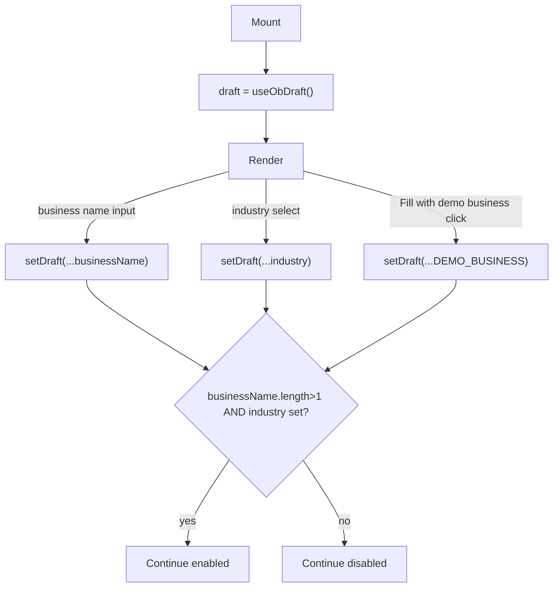

# Split card pseudocode and flowcharts into independent per-card files

## Context

`docs/superpowers/plans/2026-08-10-ui-ux-overhaul-frontend/` (`00-index.md` … `05-module-4.md`)
was recently reworked so every card's "Steps (pseudocode)" section holds grounded, runnable-looking
TypeScript (real imports, full component bodies) instead of the original language-agnostic prose,
and each module file gained a Mermaid component-dependency diagram (`diagrams/*.mmd`).

Two problems surfaced with that result:

1. The pseudocode reads as copy-pasteable implementation code, not pseudocode — a developer could
   lift a card's block directly into a file, which defeats the point of pseudocode as a design aid
   rather than a spec to transcribe verbatim.
2. The module-level diagrams show component *dependencies* (what imports/renders/reads what) but
   nothing shows a single card's own *control-flow* (states, branches, gates) — the two Q&A rounds
   that shaped this spec confirmed a per-card flowchart is wanted for exactly that gap, distinct
   from the existing module diagrams.

This spec covers pulling both pieces out of the card markdown into independent files, and changing
the pseudocode's register from runnable TypeScript to a typed outline.

## Scope

All 28 cards across `01-foundation.md` … `05-module-4.md`, plus a template update to `00-index.md`.
Two new file trees, mirrored by module, one pseudocode file and one flowchart file per card:

```
docs/superpowers/plans/2026-08-10-ui-ux-overhaul-frontend/
  pseudocode/
    foundation/{project-scaffold, design-system, shell-and-routing, fixture-data-layer}.ts
    module-1/{wizard-shell-step-1, brand-identity-step-2, structured-inputs-step-3,
              assets-links-step-4, analysis-step-5, settings-business-profile}.ts
    module-2/{alert-feed-category-filtering, markets-reveal, states-refresh-forecast,
              market-radar-shell-directive-chart, market-radar-insights-tabs}.ts
    module-3/{ai-copywriting-matrix, visual-direction-board, publish-composer,
              compliance-audit-panel, content-board-publish-action,
              calendar-month-grid-navigation, calendar-list-view-day-click-modal,
              settings-platforms, settings-workspace}.ts
    module-4/{ingestion-form-entry-state, kpi-cards-pes-gauge-funnel,
              trend-charts-ai-action-plan, previously-published-post-analytics-modal}.ts
  diagrams/
    foundation.mmd, module-1.mmd, module-2.mmd, module-3.mmd, module-4.mmd   (existing — untouched)
    cards/
      foundation/... module-1/... module-2/... module-3/... module-4/...    (new — mirrors pseudocode/'s slugs)
```

28 pseudocode files + 28 flowchart files = 56 new files, plus edits to all 6 existing plan `.md`
files.

## Card markdown change

Each card's **Steps (pseudocode)** section shrinks from a fenced code block to a single link line;
a new **Flow** section (placed between **Related files** and **Steps (pseudocode)**) is added,
also a single link line:

```
**Related files:**
- ...

**Flow:** [`diagrams/cards/foundation/project-scaffold.mmd`](diagrams/cards/foundation/project-scaffold.mmd)

**Steps (pseudocode):** [`pseudocode/foundation/project-scaffold.ts`](pseudocode/foundation/project-scaffold.ts)

**Milestone (finished state):** ...
```

No other card section changes (Depends on, Summary, Prototype reference, Project files, Milestone,
Definition of Done, Verification all stay as they are today).

## `pseudocode/<module>/<slug>.ts` contents

Typed-outline pseudocode: real import paths and type names for grounding (so it stays traceable to
actual exported names in `frontend/`), but no runnable bodies — event handlers collapse to `on X →
Y` bullets, functions are signatures without implementations, JSX collapses to a one-line `render:`
description. If a card's work spans multiple real project files (e.g. Card 4 touches `obDraft.ts`,
`OnboardingWizard.tsx`, and `BasicInfoStep.tsx`), one pseudocode file holds one `// ---- <path>
----` section per real file, in the order a developer would build them.

Representative example (`pseudocode/module-1/wizard-shell-step-1.ts`, one section of it):

```ts
// ---- components/module-1/onboarding/steps/BasicInfoStep.tsx ----
imports: useObDraft from '../obDraft'

const BUSINESS_CATEGORIES = [...7 fixed categories]

function BasicInfoStep():
  draft, setDraft ← useObDraft()

  on businessName input change → setDraft({ ...draft, businessName })
  on industry select change → setDraft({ ...draft, industry })
  on "Fill with demo business" click → setDraft({ ...draft, ...DEMO_BUSINESS })

  render: name input, industry select, slogan input, demo-fill button
```

Cards that are config/CSS rather than component logic (Project Scaffold, Design System) keep the
same typed-outline register but describe config values/CSS rules instead of component state —
consistent with how the current version of those two cards already handles the non-component case.

## `diagrams/cards/<module>/<slug>.mmd` contents

One `flowchart TD` per card, depicting that card's own control-flow: states, decision branches
(diamonds), gates, and terminal actions — not file-level import/render structure (that's the
existing module `.mmd`'s job). For cards spanning several real files, the flowchart focuses on the
card's key decision points across those files rather than one node per file.

Representative example (`diagrams/cards/module-1/wizard-shell-step-1.mmd`, the Step 1 portion):



## Template update (`00-index.md`)

The card template's example block gets the new **Flow** line added and **Steps (pseudocode)**
changed to the link-only pattern. The field guide's existing "Diagrams" entry (module-level `.mmd`)
is joined by a new entry explaining the per-card `Flow`/pseudocode file split: module `.mmd` =
dependencies, card `.mmd` = one card's own logic, card `.ts` = typed-outline pseudocode for that
same card, none of the three duplicating another's content.

## Out of scope

- The 5 module-level `.mmd` files are untouched.
- The `WorkspaceMember`/`WorkspaceMemberFixture` source fix from the prior round is untouched.
- No change to Depends on / Summary / Prototype reference / Project files / Related files /
  Milestone / Definition of Done / Verification sections of any card.

## Verification

- Every new `.mmd` renders without syntax errors (`npx @mermaid-js/mermaid-cli`), same check used
  for the module-level diagrams.
- Every card markdown file's **Flow** and **Steps (pseudocode)** links resolve to an existing file
  (no broken relative links).
- Spot-check 2-3 pseudocode files against their card's current (about-to-be-replaced) TypeScript
  version to confirm no behavioral detail was silently dropped in the compression to typed-outline
  form — every branch/gate/side-effect called out in the old version should still be traceable in
  the new one (either in the pseudocode's bullets or the flowchart's decision nodes).
